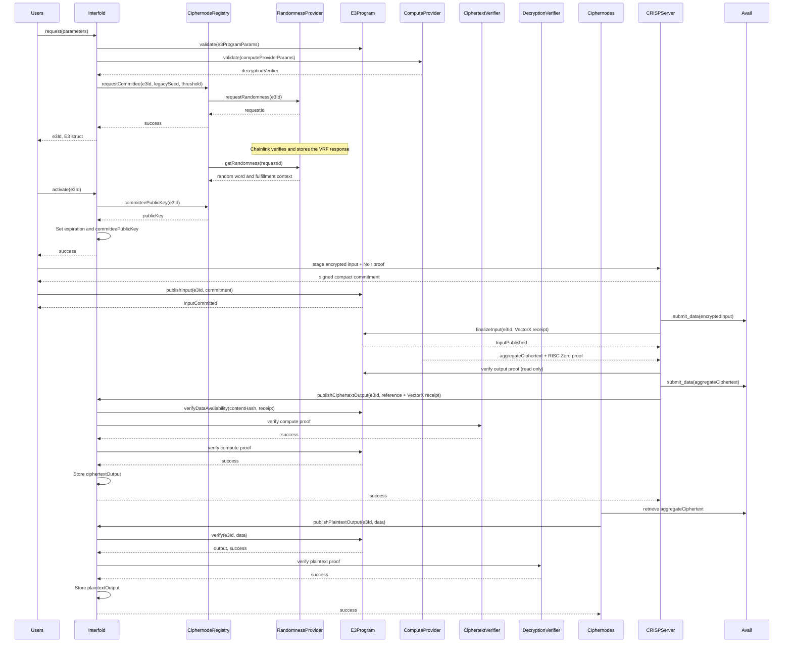

<div align="center">
  <picture>
    
  </picture>

[![Docs][docs-badge]][docs] [![Github Actions][gha-badge]][gha] [![Hardhat][hardhat-badge]][hardhat]
[![License: LGPL v3][license-badge]][license]

</div>

# The Interfold

> **Note:** The Interfold was previously known as **Interfold**.  
> Many repositories, packages, and CLI tools still use the `interfold` name while the project
> transitions.

This is the monorepo for **The Interfold**, an open-source protocol for confidential coordination.

The Interfold leverages a combination of Fully Homomorphic Encryption (FHE), Zero-Knowledge Proofs
(ZKPs), and Multi-Party Computation (MPC) to enable Encrypted Execution Environments (E3), with
integrity and privacy guarantees rooted in cryptography and economics, rather than hardware and
attestations.

## Documentation

Full documentation is available at: https://docs.theinterfold.com

## Quick Start

Follow instructions in the [quick start][quick-start] section of the documentation.

See the [CRISP example][crisp] for a fully functioning example application.

## Getting Help

Join the community [Telegram group][telegram].

## Contributing

See [CONTRIBUTING.md][contributing].

## Development

This section covers the essential commands for setting up and working with the Interfold codebase
locally.

```bash
# Install dependencies
pnpm i

# Build the project
pnpm build

# Clean build artifacts
pnpm clean
```

### Testing

**⚠️ Important:** Always run tests through pnpm scripts, not directly via `cargo test` or other
build tools. The pnpm scripts ensure necessary setup steps are executed (e.g., building required
binaries, setting up test environments) that may be skipped when running tests directly.

#### Test Scripts

The monorepo provides several test scripts for different components:

- **`pnpm test`** - Runs all tests across the entire monorepo:
  - EVM/Smart contract tests (`evm:test`)
  - Rust crate tests (`rust:test`)
  - SDK tests (`sdk:test`)
  - Noir circuit tests (`noir:test`)

- **`pnpm rust:test`** - Runs all Rust crate tests in the `crates/` directory. This script runs
  tests for all crates in the workspace, not just ciphernode-related crates.

- **`pnpm evm:test`** - Runs tests for the EVM smart contracts in `packages/interfold-contracts`.

- **`pnpm sdk:test`** - Runs tests for the TypeScript SDK in `packages/interfold-sdk`.

- **`pnpm noir:test`** - Runs tests for Noir circuits in the `circuits/` directory using
  `nargo test`. Requires the [Noir toolchain](https://noir-lang.org/docs/installation) (`nargo`) and
  [Barretenberg](https://github.com/AztecProtocol/aztec-packages/tree/master/barretenberg) (`bb`) to
  be installed and on your `PATH`.

- **`pnpm test:integration`** - Runs integration tests from `tests/integration/`. These tests may
  require prebuilt binaries and can be run with `--no-prebuild` if binaries are already available.
  Pre-built circuit artifacts for the configured BFV preset must be present in the `circuits/`
  artifacts directory.

#### Running Individual Test Suites

```bash
# Run only Rust crate tests
pnpm rust:test

# Run only EVM/smart contract tests
pnpm evm:test

# Run only SDK tests
pnpm sdk:test

# Run only Noir circuit tests
pnpm noir:test

# Run only integration tests
pnpm test:integration

# Run integration tests without prebuild step (if binaries already exist)
pnpm test:integration --no-prebuild
```

### Contributors

<!-- readme: contributors -start -->
<table>
	<tbody>
		<tr>
			<td align="center">
				<a href="https://github.com/ryardley">
					
					<br />
					<sub><b>гλ</b></sub>
				</a>
			</td>
			<td align="center">
				<a href="https://github.com/hmzakhalid">
					
					<br />
					<sub><b>Hamza Khalid</b></sub>
				</a>
			</td>
			<td align="center">
				<a href="https://github.com/ctrlc03">
					
					<br />
					<sub><b>ctrlc03</b></sub>
				</a>
			</td>
			<td align="center">
				<a href="https://github.com/auryn-macmillan">
					
					<br />
					<sub><b>Auryn Macmillan</b></sub>
				</a>
			</td>
			<td align="center">
				<a href="https://github.com/cedoor">
					
					<br />
					<sub><b>Cedoor</b></sub>
				</a>
			</td>
			<td align="center">
				<a href="https://github.com/0xjei">
					
					<br />
					<sub><b>Giacomo</b></sub>
				</a>
			</td>
		</tr>
		<tr>
			<td align="center">
				<a href="https://github.com/samepant">
					
					<br />
					<sub><b>samepant</b></sub>
				</a>
			</td>
			<td align="center">
				<a href="https://github.com/cristovaoth">
					
					<br />
					<sub><b>Cristóvão</b></sub>
				</a>
			</td>
			<td align="center">
				<a href="https://github.com/nginnever">
					
					<br />
					<sub><b>Nathan Ginnever</b></sub>
				</a>
			</td>
			<td align="center">
				<a href="https://github.com/Toby1009">
					
					<br />
					<sub><b>Malingshu</b></sub>
				</a>
			</td>
			<td align="center">
				<a href="https://github.com/eccogrinder">
					
					<br />
					<sub><b>marv</b></sub>
				</a>
			</td>
			<td align="center">
				<a href="https://github.com/0xkeygen">
					
					<br />
					<sub><b>Bryant</b></sub>
				</a>
			</td>
		</tr>
		<tr>
			<td align="center">
				<a href="https://github.com/zahrajavar">
					
					<br />
					<sub><b>Zara</b></sub>
				</a>
			</td>
			<td align="center">
				<a href="https://github.com/ozgurarmanc">
					
					<br />
					<sub><b>Armanc</b></sub>
				</a>
			</td>
			<td align="center">
				<a href="https://github.com/Subhasish-Behera">
					
					<br />
					<sub><b>SUBHASISH BEHERA</b></sub>
				</a>
			</td>
			<td align="center">
				<a href="https://github.com/jfschwarz">
					
					<br />
					<sub><b>Jan-Felix</b></sub>
				</a>
			</td>
			<td align="center">
				<a href="https://github.com/callumweb3">
					
					<br />
					<sub><b>callumweb3</b></sub>
				</a>
			</td>
			<td align="center">
				<a href="https://github.com/CryptAm">
					
					<br />
					<sub><b>cryptam</b></sub>
				</a>
			</td>
		</tr>
	</tbody>
</table>
<!-- readme: contributors -end -->

## Minimum Rust version

This workspace's minimum supported rustc version is 1.91.1.

## Architecture

The Interfold employs a modular architecture involving numerous actors and participants. The
sequence diagram below offers a high-level overview of the protocol, but necessarily omits most
detail.



## 🚀 Release Process

### Quick Release

```bash
# On a release branch: update versions, commit, and push the branch.
pnpm bump:versions 1.0.0

# Open a pull request. Wait for CI, then merge it.

# On an updated and clean main branch: create the release tag.
git checkout main
git pull --ff-only
pnpm release:tag 1.0.0
```

`bump:versions` never creates a release tag. `release:tag` accepts only the exact `origin/main`
commit and starts the release workflow.

### Release Order

1. Create a release branch from current `main`.
2. Run `pnpm bump:versions X.Y.Z`.
3. Open a pull request and wait for all required CI jobs.
4. Merge the release pull request.
5. Update local `main` with `git pull --ff-only`.
6. Run `pnpm release:tag X.Y.Z`.
7. Wait for the Release workflow.

For a pre-release, use a semantic pre-release version:

```bash
pnpm bump:versions 1.0.0-beta.1
pnpm release:tag 1.0.0-beta.1
```

### What the Release Workflow Requires

The tag workflow does not repeat the repository CI that qualified the merged `main` commit.
Publication cannot start until these release checks succeed:

- The tag points to a commit in `origin/main`.
- Linux and Apple Silicon binaries build.
- The `circuit-artifacts` branch contains the complete source-matched release matrix.

After qualification, the workflow publishes versioned container images and npm packages. A stable
release also builds the DAppNode package. It then promotes the `latest` container aliases and the
`stable` Git tag. The GitHub release is the final step. Rust workspace crates are not published to
crates.io because the workspace uses unreleased git dependencies.

## 🏷️ Version Strategy

### Version Format

The Interfold follows [Semantic Versioning](https://semver.org/):

- **Stable**: `v1.0.0` - Production ready
- **Pre-release**: `v1.0.0-beta.1` - Testing/preview versions
  - `-alpha.X` - Early development, may have breaking changes
  - `-beta.X` - Feature complete, testing for bugs
  - `-rc.X` - Release candidate, final testing

### Which Version Should I Use?

#### For Production (Mainnet)

Use stable versions only:

```bash
interfoldup install              # Latest stable
interfoldup install v1.0.0       # Specific stable version
```

#### For Testing (Testnet)

You can use pre-release versions:

```bash
interfoldup install --pre-release # Latest pre-release
interfoldup install v1.0.0-beta.1 # Specific pre-release
```

#### For Development

Build from source:

```bash
git clone https://github.com/gnosisguild/interfold.git
cd interfold
cargo build --release
```

## 🌿 Branch and Tag Strategy

### Current Setup

- **`main`** - Latest code. All releases are tagged from here. Using feature flags for experimental
  features, we ensure that code is always stable.
- **`v*.*.*`** - Version tags for releases
- **`stable`** - Always points to the latest stable release

### Installation Sources

```bash
# Latest stable release (recommended for production)
curl -fsSL https://raw.githubusercontent.com/gnosisguild/interfold/stable/install | bash

# Latest development version (may be unstable)
curl -fsSL https://raw.githubusercontent.com/gnosisguild/interfold/main/install | bash
```

## 📋 Release Checklist

For maintainers doing a release:

- [ ] Ensure all tests pass on `main`
- [ ] Review commits since last release for proper conventional format
- [ ] Decide version number (major/minor/patch)
- [ ] Create a release branch and run `pnpm bump:versions X.Y.Z`
- [ ] Merge the release pull request only after CI passes
- [ ] Update local `main` and run `pnpm release:tag X.Y.Z`
- [ ] Confirm the Release workflow passes before deployment
- [ ] Verify packages on [npm](https://www.npmjs.com/org/interfold)
- [ ] Check GitHub release page for binaries and changelog
- [ ] Announce release (Discord/Twitter/etc)

## 🔧 Script Options

The `bump:versions` script supports several options:

```bash
# Prepare, commit, and push the release branch
pnpm bump:versions 1.0.0

# Prepare and commit without pushing the branch
pnpm bump:versions --no-push 1.0.0

# Skip git operations entirely
pnpm bump:versions --skip-git 1.0.0

# Dry run - see what would happen
pnpm bump:versions --dry-run 1.0.0

# Show help
pnpm bump:versions --help

# Tag the merged release from an updated main branch
pnpm release:tag 1.0.0
```

## 🔄 Rollback Procedure

If a release has issues:

1. **Mark as deprecated on npm**:

   ```bash
   npm deprecate @interfold/sdk@1.0.0 "Critical bug, use 1.0.1"
   ```

2. **Fix and release a patch**:
   ```bash
   pnpm bump:versions 1.0.1
   ```

## 📊 Version History

Check our [Releases page](https://github.com/gnosisguild/interfold/releases) for full version
history and changelogs.

## Security and Liability

This repo is provided WITHOUT ANY WARRANTY; without even the implied warranty of MERCHANTABILITY or
FITNESS FOR A PARTICULAR PURPOSE.

## License

This repo created under the [LGPL-3.0+ license](LICENSE.md).

[gha]: https://github.com/gnosisguild/interfold/actions
[gha-badge]: https://github.com/gnosisguild/interfold/actions/workflows/ci.yml/badge.svg
[hardhat]: https://hardhat.org/
[hardhat-badge]: https://img.shields.io/badge/Built%20with-Hardhat-FFDB1C.svg
[license]: https://opensource.org/license/lgpl-3-0
[license-badge]: https://img.shields.io/badge/License-LGPLv3.0-blue.svg
[docs]: https://docs.theinterfold.com
[docs-badge]: https://img.shields.io/badge/Documentation-blue.svg
[quick-start]: https://docs.theinterfold.com/quick-start
[crisp]: https://docs.theinterfold.com/CRISP/introduction
[telegram]: https://t.me/+raYAZgrwgOw2ODJh
[contributing]: CONTRIBUTING.md
