# Interfold Rust Workspace Architecture

This document describes the implementation in `crates/`. It is intentionally code-facing: names in
the diagrams are crate, module, actor, message, or durable repository names that can be searched in
the workspace. Read it alongside the prescriptive [`ARCHITECTURE.md`](ARCHITECTURE.md) contribution
guide and [`RULES.md`](RULES.md). The actor-by-actor refactor findings are summarized in
[`ACTOR_AUDIT.md`](ACTOR_AUDIT.md).

## Dependency layers

All 45 workspace packages are shown below. Arrows point from a dependent crate to a direct
dependency; the diagram keeps representative production edges rather than reproducing every Cargo
edge, while the groups record each crate's current primary responsibility. Test-only edges are kept
in the validation group. Several protocol crates still import concrete infrastructure types; that
boundary debt is recorded in the audit rather than hidden by an aspirational diagram.

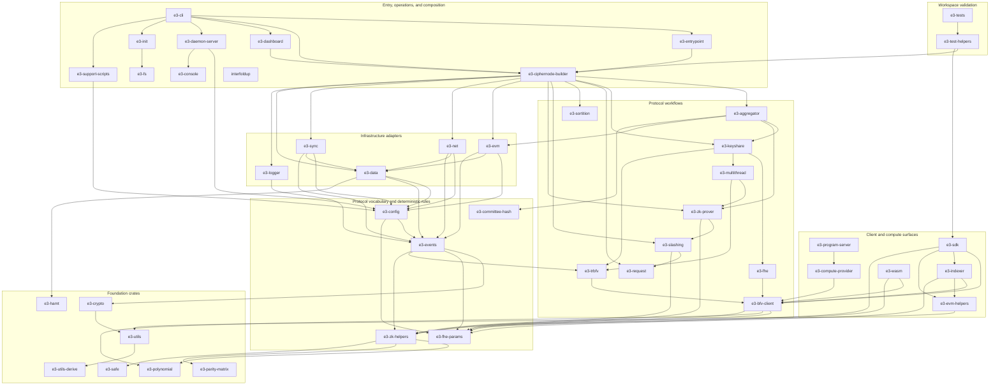

The most important current boundary debt is that `e3-events` contains both neutral event transport
and rich protocol payloads that depend on cryptographic/FHE types. Protocol workflow crates also
depend directly on Actix and concrete repositories. These are real constraints in the current code
and are not papered over with empty port traits.

The resulting workflow/actor/effect separation is module-level rather than a clean crate boundary.
On disk, those roles are grouped by protocol capability; the labels in this diagram describe
responsibilities, not top-level source directories:

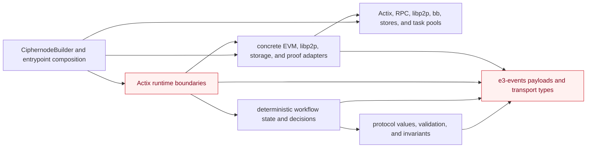

Pure decision modules have no actor runtime (for example lifecycle transitions, sync planning,
network buffer decisions, document validation, accusation voting, proof dispatch/verification, and
aggregation state machines). Adapters are concrete and are wired centrally by `CiphernodeBuilder`.
Arrows in this diagram point from a consumer to what it uses: domain code does not depend on the
composition root, while actors still depend directly on concrete adapters in several crates.

## Ciphernode construction and startup

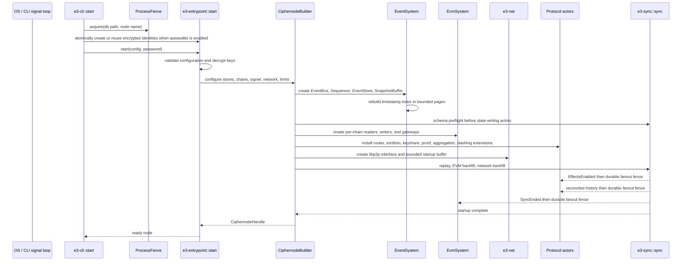

Startup has a configured outer deadline. The EVM and network startup buffers expose readiness
failures; a bound overflow fails startup instead of silently discarding protocol observations.
Effects remain disabled until durable replay and both historical sources have been merged in HLC
timestamp order. Schema preflight treats only an empty key/value store or exactly the complete
encrypted Ethereum/libp2p identity pair as fresh. A partial identity, any additional unversioned
key, any event log without a marker, upgrades, and downgrades fail closed. This narrow exception is
required because autowallet atomically creates the two bootstrap identities before the builder can
stamp the schema; it does not let protocol state bypass compatibility checks. The DAppNode v0.2.3
package is the explicit bridge for the previously shipped v0.1.8 state: its entrypoint atomically
moves `/data/.enclave` to `/data/.interfold`, and the v0.2.3 release stamps schema version 1 before
a later fail-closed binary is installed. If both namespace roots exist, the bridge refuses to choose
between them.

## Actor and message topology

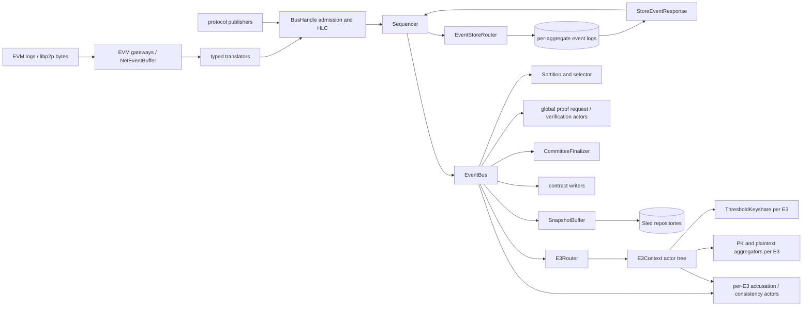

Actors own scheduling, mailbox ordering, subscriptions, and lifecycle. Deterministic decisions are
physically co-located with their capabilities, including `request/src/lifecycle/workflow.rs`,
`sync/src/sync/workflow.rs`, `net/src/event_buffer/workflow.rs`,
`slashing/src/accusation_voting/workflow.rs`,
`zk-prover/src/{proof_request,share_verification}/workflow.rs`, and the typed aggregation workflows.
Compatibility views such as `domain.rs` and `workflow.rs` preserve established Rust module paths
while that migration settles; they contain declarations, not business logic. Several `BusHandle`,
`Sequencer`, `EventStoreRouter`, and snapshot edges still contain Actix `do_send`, so the pipeline
is not end-to-end backpressured. That debt is called out explicitly below. ZK proof actors are
composition-scoped EventBus subscribers. Threshold keyshare and public-key/plaintext aggregation
actors are request-scoped recipients created by `E3Router` extensions and reached through
`E3Context`; they are not direct EventBus subscribers. Per-E3 accusation and consistency actors are
context-owned but also install direct subscriptions for the proof and slash events they consume.

### Capability refactor map

Every production actor was inventoried during the architecture refactor. Thinness is judged by
ownership, not raw line count; roughly 300 production lines is a review trigger. The actor-bearing
crates now use one filesystem rule: capability directories contain predictable role files such as
`actor.rs`, `handlers.rs`, `state.rs`, `workflow.rs`, `effects.rs`, and adjacent tests. A role
becomes a subdirectory only when it has several independent concerns, and those files receive
semantic operation names rather than circuit-stage labels. No `src/actors/`, `src/domain/`,
`src/workflow/`, `src/adapters/`, or `src/runtime/` layer directory remains in these crates.

| Crate           | Capability directories                                                                                                     | Boundary after refactor                                                                                                                                    |
| --------------- | -------------------------------------------------------------------------------------------------------------------------- | ---------------------------------------------------------------------------------------------------------------------------------------------------------- |
| `e3-aggregator` | `committee_finalization`, `public_key_aggregation`, `plaintext_aggregation`                                                | Request-local actor shells own timing and routing; workflows own aggregation decisions and semantic effect files own proof/publication work.               |
| `e3-keyshare`   | `threshold_keyshare`                                                                                                       | One request-local mailbox coordinates DKG; collectors, state, pure key/share calculations, handlers, and effect operations are co-located by capability.   |
| `e3-zk-prover`  | `proof_request`, `proof_verification`, `share_verification`, `node_proof_aggregation`, `commitment_links`                  | Proof mailboxes dispatch work; workflows and commitment-link modules own pure decisions, while semantic effect files own circuit requests and publication. |
| `e3-slashing`   | `accusation_voting`, `commitment_consistency`                                                                              | Actors own timers and message routing; workflow files own admission, verification, voting, quorum, and commitment decisions.                               |
| `e3-sortition`  | `sortition`, `ciphernode_selection`                                                                                        | Actors own chain/request routing and cache lifecycle; selection backends, ticket rules, and registry decisions sit beside them.                            |
| `e3-net`        | `event_buffer`, `event_conversion`, `event_translation`, `network_sync`, `document_publishing`                             | Mailboxes own transport ordering and lifecycle; workflow/model files own decisions and effects own DHT, gossip, and history I/O.                           |
| `e3-evm`        | `chain_gateway`, `chain_reader`, `event_decoding`, registry/interfold/slashing read and write capabilities, `log_fetching` | Per-chain mailboxes own concurrency; provider recovery, log fetching, transaction preflight, and submission live with the chain capability they serve.     |
| `e3-request`    | `routing`, `lifecycle`                                                                                                     | Context routing and lifecycle mailboxes call deterministic workflows; snapshot/context construction is co-located with routing.                            |
| `e3-sync`       | `sync`                                                                                                                     | No Actix actor: an acknowledged startup/replay service contains its state, plan, preflight, history collection, and tests in one capability.               |

The remaining large non-actor files are not automatically actor violations. Generated contract
bindings and cohesive circuit/FHE algorithms are reviewed by their own complexity and test
boundaries. Composition roots such as `CiphernodeBuilder`, and infrastructure coordinators such as
`NetInterface`, remain separate follow-up targets; splitting them mechanically would not make
protocol actors thinner.

## Event ingestion, persistence, replay, and synchronization

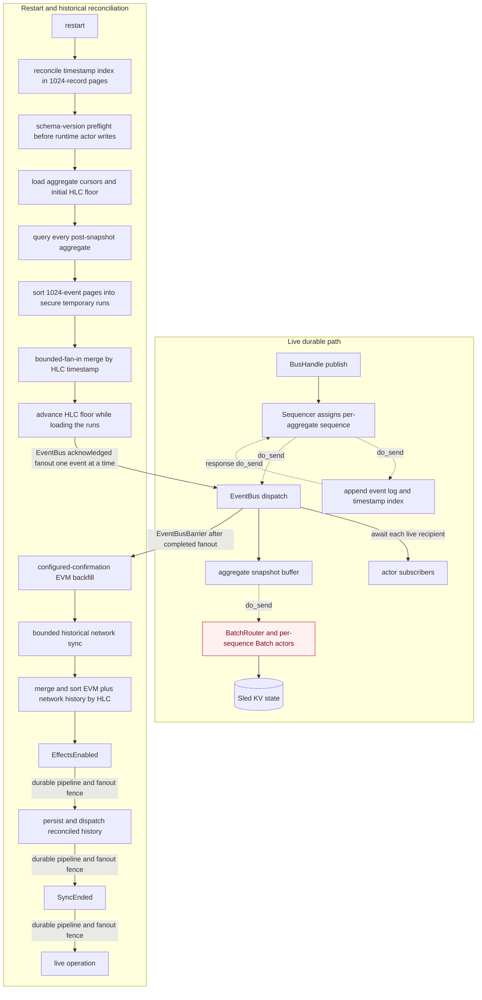

The append-only event log is the durable source of truth. The timestamp index and snapshots are
derived state. Before `commitlog` opens, startup validates the active segment's physical frames
against its index. A CRC/length-invalid suffix after the last indexed record is an uncommitted crash
tail and is truncated; complete CRC-valid, decodable frames whose index writes were lost are
re-indexed. Indexed decode/CRC failures and any offset/index mismatch remain fatal. EventStore
construction then performs a full integrity scan and reconciles missing timestamp-index rows from
the log in strict 1,024-record pages. Timestamp admission deduplicates by stable event ID plus
payload, so the same logical event may return through historical network sync with a different
transport source without colliding. A different payload at an already-indexed HLC timestamp remains
an integrity failure. Post-snapshot events are queried per aggregate in 1,024-event pages and sorted
into secure temporary runs. Runs are compacted with bounded fan-in and merged globally by persisted
HLC timestamp, so memory and open-file use do not scale with the entire backlog. Before fanout, the
HLC floor advances to the maximum replay timestamp, which covers a snapshot cursor stalled behind
newer log records. Replay then waits for concurrent acceptance by all current EventBus subscribers.
An unavailable subscriber or a subscriber blocked beyond the bounded acceptance timeout aborts
recovery. An `EventBusBarrier` therefore completes only after the last replay fanout has completed.
A persisted `Shutdown` event from the previous process is classified as infrastructure and is not
replayed into newly constructed actors.

The EventBus mailbox remains bounded at `MAILBOX_LIMIT_LARGE` (2,560 messages). The replay producer
no longer attempts to enqueue the entire backlog into that mailbox in one burst, and EventBus
subscriber fanout no longer bypasses downstream mailbox limits. EventStore query responses also
await recipient capacity, preventing a full aggregation mailbox from dropping one aggregate response
and hanging startup. Recovery publishes `EffectsEnabled`, canonical history, and `SyncEnded` as
three separately fenced phases. Runtime log-read failures are returned in the correlated query
response and flow through the existing error paths; a remote sync query therefore cannot panic the
EventStore actor. The fail-stop behavior below applies to durable append/index-write failures. An
event-log or timestamp-index write error panics the affected EventStore before live dispatch. This
preserves durable-before-dispatch safety, but under the default unwind profile an Actix actor panic
is contained at its spawned task boundary: it can kill the store actor and stall the sequencer
without terminating the process. Process-level health supervision would need to detect the stalled
pipeline, but the current runtime does not provide that guarantee. A restart, when it occurs, treats
the event log as authoritative and reconciles missing derived index rows.

Those replay guarantees bound local replay memory and file-descriptor use, but they do not make the
whole persistence path synchronously acknowledged. Live publication and the sequencer/store response
path still contain `do_send` edges. Snapshot replay also forwards with `do_send`, and `BatchRouter`
can retain one child `Batch` actor per open aggregate/sequence until its timelock fires. A
sufficiently large set of simultaneously open snapshot batches can therefore create actors in
proportion to that active set.

## Networking-to-domain flow

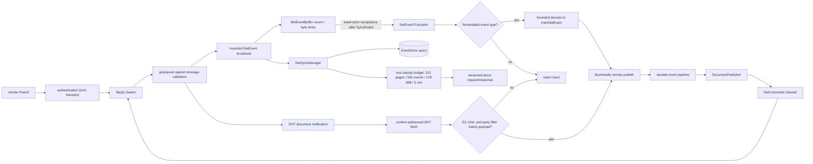

The network interface owns the QUIC swarm, signed gossipsub topic, Kademlia store, and transport
channels. Gossipsub and direct-request/DHT decoding have explicit byte limits. Translation actors
accept only the protocol event allowlist before publishing remote events, and their
broadcast-to-actor ingress loops await mailbox acceptance and stop when the destination actor
closes. Startup buffering is bounded by both event count and estimated bytes and fails readiness on
overflow or broadcast lag; after `SyncEnded`, broadcast lag is warned and skipped without stopping
the ingress loop. Historical direct sync requires advancing cursors and enforces one cumulative
page, event, byte, and time budget across all aggregate fetches and recovery retries in a startup
attempt.

The gossiped `DocumentMeta` is independent of the DHT content hash, so
`EventConversionService::validate_received` decodes the fetched payload and binds the metadata E3
identifier, `TrBFV` kind, and party-filter shape to that payload before a `DocumentReceived` event
is persisted. Transport and gossipsub identities authenticate the sending peer; they do not by
themselves prove that a peer is an authorized member of a particular E3 committee. Topic/chain
isolation, wire negotiation beyond the current `0.0.1` identifiers, durable peer reputation, and
end-to-end application authorization remain separate protocol-hardening work.

## E3 lifecycle

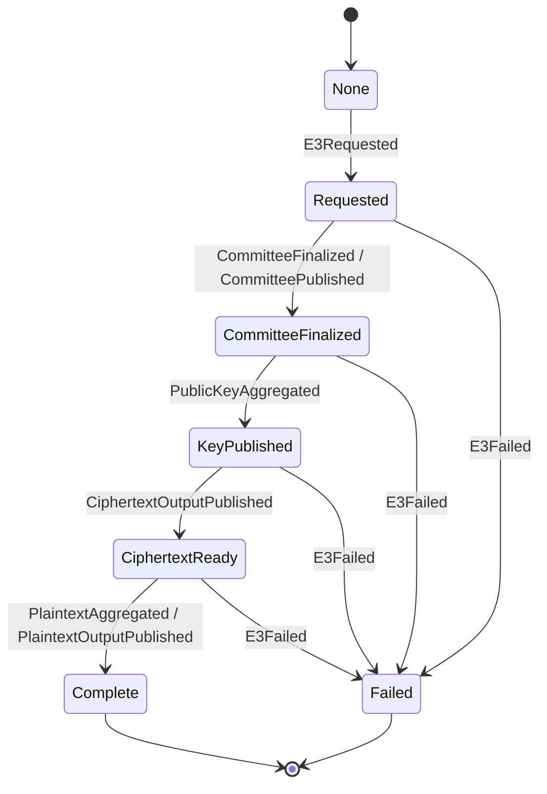

`E3LifecycleService` enforces monotonic progress and freezes terminal states. `E3Router` creates and
tears down per-request actor contexts. Duplicate and late terminal observations are classified
before forwarding; side effects are enabled only after recovery. The diagram shows the normal
progression: the lifecycle observer also accepts a forward jump to a later stage, while reporting a
lower-stage observation as a regression without changing its tracked stage.

## Committee, DKG, aggregation, and decryption

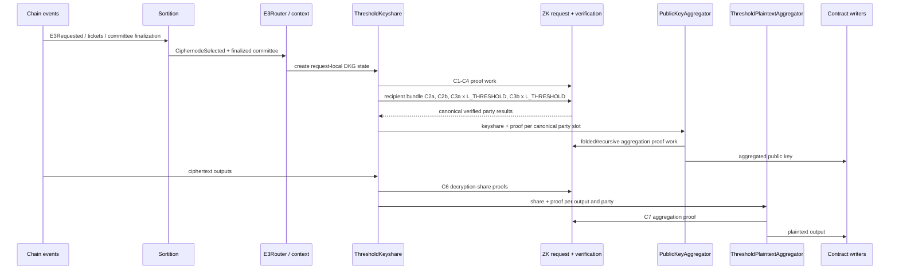

Committee order is the on-chain `topNodes` order; a party ID is an index into that ordered
committee. The Rust proof boundary validates canonical committee dimensions, unique party slots,
signer-to-slot binding, phase-specific proof multiplicity, and one share/proof per ciphertext
output. Circuit semantics are deliberately outside this refactor's modification scope.

Each recipient-scoped threshold-share bundle has one C2a secret-key share-computation proof, one C2b
smudging-noise share-computation proof, then every C3a proof, then every C3b proof. C3 multiplicity
follows rows of the threshold-parameter Shamir secret, not the number of CRT moduli in the DKG
encryption parameters:

| Parameter pair | `L_THRESHOLD` | Recipient bundle                   |
| -------------- | ------------: | ---------------------------------- |
| Insecure 512   |             2 | C2a x 1, C2b x 1, C3a x 2, C3b x 2 |
| Secure 8192    |             3 | C2a x 1, C2b x 1, C3a x 3, C3b x 3 |

`ThresholdKeyshare` dispatches verification with the DKG/share-encryption preset. The shape
validator therefore normalizes a DKG preset to its threshold counterpart before reading
`num_moduli`; a threshold preset remains unchanged. This matches proof generation, which creates one
C3 request for each threshold Shamir row even though the row is encrypted and proven with the paired
DKG BFV parameters. The invariant is independent of committee size for one recipient; full sender
fanout has `(N - 1) * L_THRESHOLD` C3a proofs and the same number of C3b proofs because the sender
does not encrypt its own slot.

The current TrBFV implementation creates exactly one smudging-noise share set (`Z = 1`). The general
C3b multiplicity would be `Z * L_THRESHOLD` per recipient. Supporting multiple ESI/smudging-noise
sets requires coordinated producer, validator, NodeFold, wire, and circuit work; the current
validator must not silently infer that extension.

## Failure, accusation, slashing, expulsion, and timeout

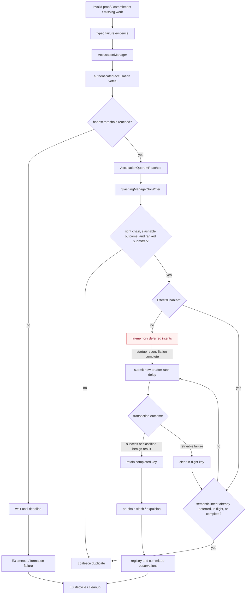

Vote quorum uses the honest threshold rather than the total committee size. Cryptographic
verification failures must be structurally attributable to a canonical party before they become
slashing evidence. Replayed `AccusationQuorumReached` events are held until `EffectsEnabled`, then
coalesced by the contract's semantic replay domain across deferred, in-flight, and completed
submissions. Retryable submission failures release their key; successful or known-benign terminal
results retain it.

The gate is deliberately described as in-memory: there is no durable external-effect outbox or
persisted transaction intent. A crash after snapshot advancement but before receipt classification
can therefore lose the local redrive state, and a crash after submission can require on-chain
reconciliation to distinguish landed from missing work. Closing that gap requires a durable
intent/result state machine and contract preflight, not another process-local set.

## Program-server trust boundary

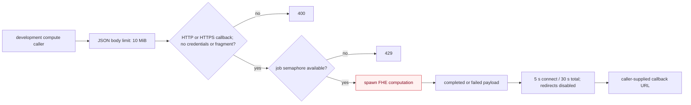

`E3ProgramServerBuilder::build` fails only when the concurrency limit is zero. The default limit is
one job. The development/test endpoint does not authenticate callers or allowlist callback
destinations. The callback URL comes from the request body and may target any HTTP(S) origin; URL
credentials, fragments, and non-HTTP schemes are rejected, and localhost rewriting changes only the
exact host. The webhook client has bounded connection/total time and does not follow redirects. Logs
record result sizes and response status rather than response bodies.

The CRISP and default-template coordination callers do not log compute payloads. This server is
development tooling rather than an authenticated production compute boundary and must not be exposed
across trust boundaries.

Accepted jobs are ordinary detached Tokio tasks. The semaphore bounds concurrent work, but those
tasks are not registered with an application shutdown token or join set, and there is no durable job
queue. A server stop can therefore cancel work or callback delivery without a recoverable job
record. The current health endpoint also reports process availability, not dependency readiness or
job-drain state.

## Durable and in-memory ownership

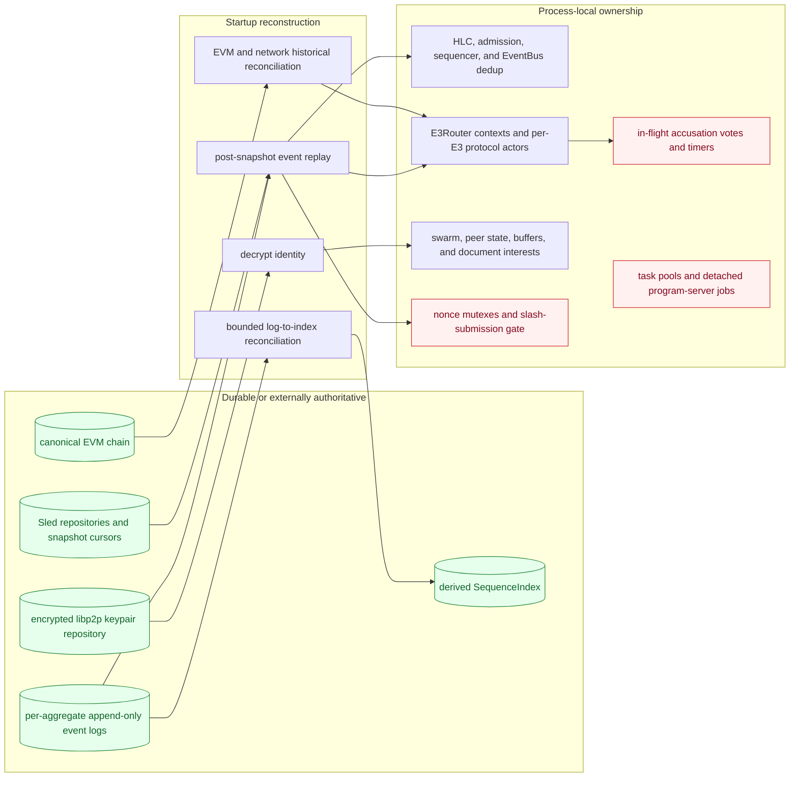

| State                                    | Authoritative owner                                                                  | Reconstructed from                                                                                                          |
| ---------------------------------------- | ------------------------------------------------------------------------------------ | --------------------------------------------------------------------------------------------------------------------------- |
| Protocol event history                   | Per-aggregate append-only event logs                                                 | Direct log scan                                                                                                             |
| Aggregate snapshots and repositories     | Sled-backed `Repositories`                                                           | Event replay after snapshot cursors                                                                                         |
| Timestamp index                          | `SequenceIndex`                                                                      | Reconciled from event log on startup                                                                                        |
| Chain sync cursor                        | Aggregate snapshot metadata                                                          | Configured-confirmation EVM backfill                                                                                        |
| Network document history                 | Event log plus network repository                                                    | Historical net sync                                                                                                         |
| E3 actor contexts                        | `E3Router` in memory                                                                 | Durable replay and canonical chain observations                                                                             |
| Request-local DKG/aggregation state      | Per-E3 actors plus repositories                                                      | Snapshots, replay, and `EffectsEnabled` redrive                                                                             |
| C0/share proof-verification context      | Finalized-committee and ciphernode-selector repositories plus global verifier memory | Canonical slots and E3 preset/threshold metadata load before ZK actor startup, then lifecycle events maintain or clear them |
| HLC, EventBus dedup, and admission state | Event pipeline actors in memory                                                      | Maximum snapshot/replay HLC; a fresh bounded dedup window is populated by replay and live events                            |
| Network peer/buffer/interest state       | libp2p and network actors in memory                                                  | Fresh peer dialing; document interest returns only when selection observations are replayed or redriven                     |
| Slash-submission replay gate             | `SlashingManagerSolWriter` process memory                                            | Rebuilt from replay; not a durable outbox                                                                                   |
| Pending transaction nonce allocation     | Per-chain writer mutex in memory                                                     | Provider pending nonce on restart                                                                                           |
| In-flight accusation votes and timers    | Per-E3 accusation actor memory                                                       | No complete durable reconstruction; only events inside the replay window may be observed again                              |
| libp2p identity                          | Encrypted keypair repository                                                         | Decrypt at startup                                                                                                          |
| Program-server job permits/tasks         | Tokio semaphore and detached tasks                                                   | Not reconstructed after process exit                                                                                        |

No actor-local mutable cache is treated as durable merely because the actor survives for the process
lifetime.

## Shutdown, restart, resync, and cancellation

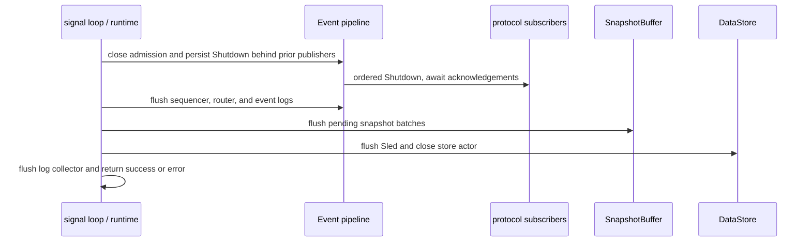

The whole barrier is time-bounded. Failure to drain or flush is returned to the CLI and produces a
non-zero exit. On restart, the process fence prevents two local writers from sharing one database.
Schema preflight rejects unsupported upgrades or downgrades. `interfold node validate` provides
offline integrity and loose-end diagnostics without mutation by default.
`interfold node validate --repair` is narrowly allowed to perform the same safe uncommitted-tail
recovery used at normal startup; it never removes an indexed record.

The implemented restart and operator-controlled recovery boundary is:

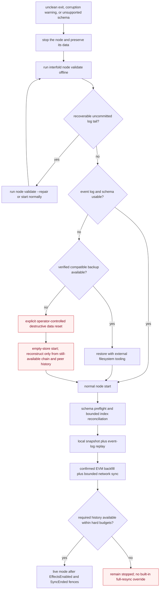

There is no rollback of indexed event records, backup/restore command, or dedicated full-resync
command in the Rust crates. The only automatic repair truncates bytes after the last index boundary
and restores complete CRC-valid/decodable frames whose index entries were lost; committed corruption
still fails closed. Backup restore is an offline filesystem operation. A destructive reset removes
the local event log—the node's source of truth—and can reconstruct only observations still available
from configured EVM ranges and peers. One historical network startup attempt, including all
aggregates and retries, is capped at 512 pages, 50,000 events, 128 MiB, and five minutes, with no
operator override in the current implementation. Exceeding a budget or discovering unavailable
history is therefore a startup blocker, not a signal to silently skip data. Unsupported schema state
likewise requires a compatible binary, a verified backup, or an explicit reset; no automatic
migration is implemented.

The multi-process SWARM supervisor has a separate child-process lifecycle:

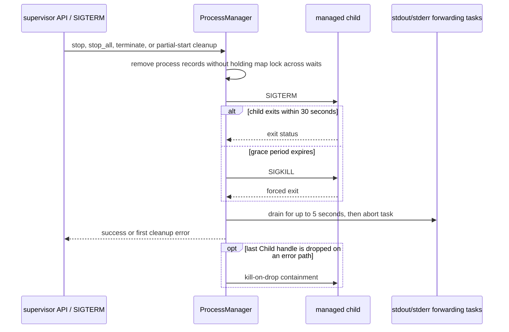

An exited child is reported as `Exited { code }`, not `Started`, and can be started again. A failure
partway through `start_all` terminates children that already started. Supervisor termination exits
non-zero if child cleanup fails. Spawned handles use `kill_on_drop`, so removing a process record
before a failed termination step cannot orphan the managed child. This is process supervision only:
it does not persist a desired-state/restart policy, and unexpected child exit is observed through
status rather than automatically restarted.

## Error and cancellation propagation

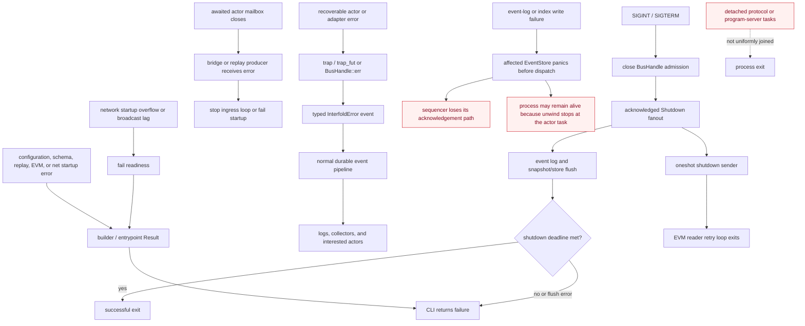

Startup barriers propagate errors to the caller and fail closed where continuing would drop
historical or live input. Awaited network bridges stop when their destination actor closes.
Recoverable handler failures are generally converted into durable `InterfoldError` events by the
existing `trap` helpers; a logged error is not itself a supervision restart. EventStore write
failures preserve safety by panicking before dispatch, but the default unwind build does not turn a
spawned Actix actor panic into a guaranteed process exit. The store actor can die while the process
remains present and the sequencer stalls; current code has no supervisor that converts that
condition into a deterministic restart. Shutdown closes event admission, waits for admitted
publishers, persists and fans out `Shutdown`, flushes the durable pipeline, then drains snapshot
batches and the backing store under one deadline. Any failed shutdown stage reaches the CLI and
causes an unsuccessful exit.

Cancellation ownership is not uniform across the workspace. EVM reader loops have an explicit
oneshot shutdown signal, the EventBus shutdown event stops many actors, and the outer deadline
prevents an indefinite drain. Detached tasks without a join handle or cancellation token remain a
residual: process exit is their final cancellation boundary, so they cannot all prove completion or
persist recovery intent.

## Subsystem contracts

| Subsystem                          | Responsibility and I/O                                                                               | Owned state and dependencies                                                                                                                   | Invariant and failure behavior                                                                                                                                                                                                                                                                                                                                         | Extension boundary / must not own                                                                                         |
| ---------------------------------- | ---------------------------------------------------------------------------------------------------- | ---------------------------------------------------------------------------------------------------------------------------------------------- | ---------------------------------------------------------------------------------------------------------------------------------------------------------------------------------------------------------------------------------------------------------------------------------------------------------------------------------------------------------------------- | ------------------------------------------------------------------------------------------------------------------------- |
| `e3-events`                        | Admit, timestamp, persist, deduplicate, and fan out typed events.                                    | HLC factory, subscriber registry, sequencer, event stores, and snapshot bridge; depends on Actix and protocol payload types.                   | Event log append precedes live dispatch; startup index reads are paged; query responses and shutdown/replay/recovery-phase barriers are acknowledged. Storage or mailbox failures reach a caller where the path is awaited, but live append/response `do_send` edges remain.                                                                                           | Event/subscription APIs; must not own request-specific protocol policy.                                                   |
| `e3-data`                          | Serve typed repository reads/writes and append-only event-log/index records.                         | Sled/in-memory stores, log handles, batch writes, and flush failure state.                                                                     | Acknowledged sync/batch writes flush before success; decode corruption and recorded write failures fail closed.                                                                                                                                                                                                                                                        | Repository/store factories; must not decide committees, proofs, or lifecycle transitions.                                 |
| `e3-sync`                          | Reconstruct actor state and reconcile EVM/network history before live mode.                          | Startup plan, disk-backed local replay runs, and bounded reconciled-history vectors; depends on repositories, EventBus, EVM, and net adapters. | Schema is checked before state-writing actors; HLC includes post-snapshot history; replay is global-HLC ordered with acknowledged subscriber acceptance; Effects/history/SyncEnded phases are downstream-acknowledged; history gaps or bounded-net-sync failure abort startup.                                                                                         | Historical collectors/planners; must not submit live transactions.                                                        |
| `e3-net`                           | Translate bounded libp2p traffic and serve gossip, DHT, and historical sync.                         | Swarm, Kademlia records, peer/transport status, channels, startup buffer, and document interests.                                              | Signed gossip is type-allowlisted; decodes, startup backlog, and sync fetches are bounded; metadata must match DHT payload. Errors fail readiness or stop the affected ingress loop.                                                                                                                                                                                   | `NetInterface` and pure translation services; must not own E3 transitions or infer committee authority from PeerId alone. |
| `e3-evm`                           | Read chain history under the configured confirmation policy and submit typed contract transactions.  | Per-chain gateways, provider handles, chain buffers, nonce mutexes, and slash replay gate.                                                     | Malformed logs and reverted receipts fail. A well-formed `E3Requested` with an unsupported committee/preset enum is marked processed and skipped so an older node stays live without participating. Nonce allocation is serialized in-process; no durable transaction outbox or full reorg rollback exists.                                                            | Provider/contract helpers; must not own off-chain proof policy.                                                           |
| `e3-request`                       | Route E3-scoped events and enforce lifecycle progress.                                               | `E3Router`, lifecycle state, typed `(E3, recipient)` buffers, and request actor contexts; depends on event and protocol actor APIs.            | Legal progress is monotonic; buffered history precedes the recipient-creating event; terminal teardown purges absent-role buffers. Active buffer size and child `do_send` remain residual risks.                                                                                                                                                                       | Domain lifecycle/routing functions; must not implement storage, network framing, or contract decoding.                    |
| `e3-sortition`                     | Track registry/tickets and derive canonical selection/committee observations.                        | Node registry, ticket state, selector backend, and chain-derived committee state.                                                              | On-chain ordering is authoritative; terminal cleanup releases local participation state and removes durable finalized-committee and pending-expulsion records.                                                                                                                                                                                                         | Sortition backend; must not construct cryptographic proofs.                                                               |
| `e3-keyshare`                      | Coordinate request-local DKG, shares, and decryption work.                                           | Threshold keyshare actor state and repositories; depends on FHE/ZK services and the event bus.                                                 | Party IDs index the canonical committee; each recipient gets C2a/C2b singletons and C3a/C3b per threshold Shamir row. Resumable determined outputs redrive only after `EffectsEnabled`. Fatal collector timeouts commit `Failed` before `E3Failed`, freeze its payload, and redrive that failure after hydration.                                                      | Cryptographic backend/task pool; must not own transport frames or ABI decoding.                                           |
| `e3-zk-prover`                     | Build and verify typed proof jobs/statements.                                                        | Backend job state, circuit registry, verification outcomes, and durable-seeded in-memory committee/preset caches.                              | Statement shapes, canonical committee dimensions, signer/slot binding, and proof multiplicity are checked before acceptance; DKG presets normalize to their threshold counterpart when deriving C3 row counts. Finalized slots plus C0 preset/threshold context load before replay so snapshot cursors cannot erase signer authority or artifact selection on restart. | ZK backend and registry; must not add committee policy absent from the proof statement.                                   |
| `e3-aggregator`                    | Aggregate canonical verified public-key/plaintext shares.                                            | Explicit per-E3 aggregation state machines and repositories.                                                                                   | One signer-bound share/proof occupies each canonical party slot and output multiplicity is exact; invalid or duplicate contributions are rejected.                                                                                                                                                                                                                     | Pure aggregation states and proof backend; must not own EVM transaction policy.                                           |
| `e3-slashing`                      | Attribute proof failures, collect authenticated votes, and emit quorum outcomes.                     | Accusation/evidence/vote state; depends on committee data, verification, and events.                                                           | Honest threshold decides quorum and only structurally attributable failures become evidence.                                                                                                                                                                                                                                                                           | Voting/evidence domain modules; must not generate proofs or assign ambiguous blame.                                       |
| `e3-program-server`                | Serve bounded development compute requests and deliver results to caller-supplied HTTP(S) callbacks. | Runner closure, callback client, and job semaphore.                                                                                            | Zero job capacity fails build; overload returns 429; callbacks reject unsafe URL forms and use bounded delivery timeouts. The test endpoint does not authenticate callers, does not allowlist callback targets, and must not be exposed as a production service. Detached tasks are not recoverable.                                                                   | Runner callback; must not become durable protocol state or be treated as a production trust boundary.                     |
| `e3-ciphernode-builder`            | Construct concrete stores, adapters, actor extensions, and startup barriers.                         | Composition handles and validated configuration, not protocol state.                                                                           | Required components and startup readiness must succeed before returning a handle.                                                                                                                                                                                                                                                                                      | Concrete factories/extensions; must not accumulate protocol policy or durable business state.                             |
| `e3-entrypoint` / SWARM supervisor | Load/decrypt node configuration and manage child processes.                                          | Process map, kill-on-drop child handles, and output-forwarding tasks.                                                                          | Partial startup is cleaned up; status distinguishes exited children; stop is SIGTERM-first and time-bounded; a dropped final handle cannot orphan its child.                                                                                                                                                                                                           | Command composition; must not silently restart failed protocol work or own node domain state.                             |

Extension points should be narrow concrete boundaries with an active consumer: repository factories,
network interfaces, ZK backends, sortition backends, clocks, and task pools. New one-method traits
are not introduced solely to create layers.
