# Interfold Rust Workspace Architecture

This document describes the implementation in `crates/`. It is intentionally code-facing: names in
the diagrams are crate, module, actor, message, or durable repository names that can be searched in
the workspace. Read it alongside the prescriptive [`ARCHITECTURE.md`](ARCHITECTURE.md) contribution
guide and [`RULES.md`](RULES.md). The actor-by-actor refactor findings are summarized in
[`ACTOR_AUDIT.md`](ACTOR_AUDIT.md).

## Dependency layers

All 45 workspace packages are shown below. Arrows point from a dependent crate to a direct
dependency; the diagram keeps representative production edges rather than reproducing every Cargo
edge, while the groups record each crate's current primary responsibility. Test-only edges are kept
in the validation group. Several protocol crates still import concrete infrastructure types; that
boundary debt is recorded in the audit rather than hidden by an aspirational diagram.

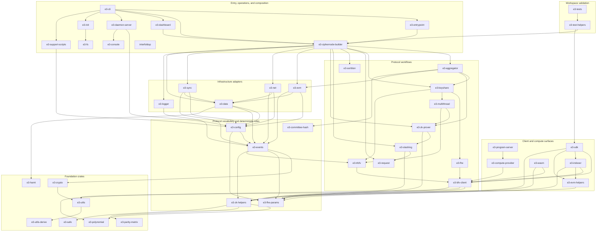

The most important current boundary debt is that `e3-events` contains both neutral event transport
and rich protocol payloads that depend on cryptographic/FHE types. Protocol workflow crates also
depend directly on Actix and concrete repositories. These are real constraints in the current code
and are not papered over with empty port traits.

The resulting workflow/actor/effect separation is module-level rather than a clean crate boundary.
On disk, those roles are grouped by protocol capability; the labels in this diagram describe
responsibilities, not top-level source directories:

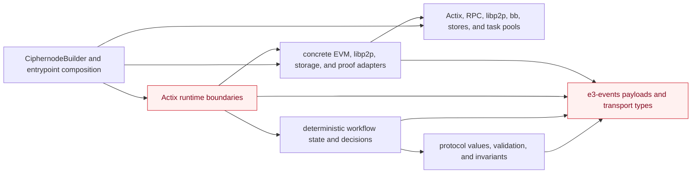

Pure decision modules have no actor runtime (for example lifecycle transitions, sync planning,
network buffer decisions, document validation, accusation voting, proof dispatch/verification, and
aggregation state machines). Adapters are concrete and are wired centrally by `CiphernodeBuilder`.
Arrows in this diagram point from a consumer to what it uses: domain code does not depend on the
composition root, while actors still depend directly on concrete adapters in several crates.

## Ciphernode construction and startup

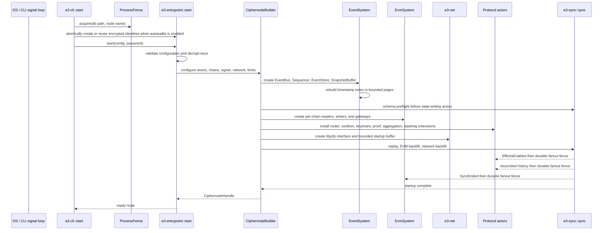

Startup has a configured outer deadline. The EVM and network startup buffers expose readiness
failures; a bound overflow fails startup instead of silently discarding protocol observations.
Effects remain disabled until durable replay and both historical sources have been merged in HLC
timestamp order. Schema preflight treats only an empty key/value store or exactly the complete
encrypted Ethereum/libp2p identity pair as fresh. A partial identity, any additional unversioned
key, any event log without a marker, upgrades, and downgrades fail closed. This narrow exception is
required because autowallet atomically creates the two bootstrap identities before the builder can
stamp the schema; it does not let protocol state bypass compatibility checks. The DAppNode v0.2.3
package is the explicit bridge for the previously shipped v0.1.8 state: its entrypoint atomically
moves `/data/.enclave` to `/data/.interfold`, and the v0.2.3 release stamps schema version 1 before
a later fail-closed binary is installed. If both namespace roots exist, the bridge refuses to choose
between them.

## Actor and message topology

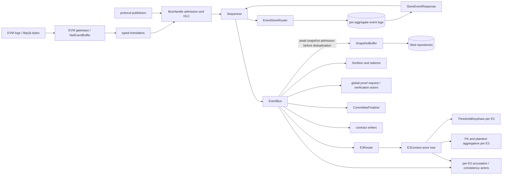

Actors own scheduling, mailbox ordering, subscriptions, and lifecycle. Deterministic decisions are
physically co-located with their capabilities, including `request/src/lifecycle/workflow.rs`,
`sync/src/sync/workflow.rs`, `net/src/event_buffer/workflow.rs`,
`slashing/src/accusation_voting/workflow.rs`,
`zk-prover/src/{proof_request,share_verification}/workflow.rs`, and the typed aggregation workflows.
Compatibility views such as `domain.rs` and `workflow.rs` preserve established Rust module paths
while that migration settles; they contain declarations, not business logic. Several `BusHandle`,
`Sequencer`, `EventStoreRouter`, and snapshot edges still contain Actix `do_send`, so the pipeline
is not end-to-end backpressured. That debt is called out explicitly below. ZK proof actors are
composition-scoped EventBus subscribers. Threshold keyshare and public-key/plaintext aggregation
actors are request-scoped recipients created by `E3Router` extensions and reached through
`E3Context`; they are not direct EventBus subscribers. Per-E3 accusation and consistency actors are
context-owned but also install direct subscriptions for the proof and slash events they consume.

### Capability refactor map

Every production actor was inventoried during the architecture refactor. Thinness is judged by
ownership, not raw line count; roughly 300 production lines is a review trigger. The actor-bearing
crates now use one filesystem rule: capability directories contain predictable role files such as
`actor.rs`, `handlers.rs`, `state.rs`, `workflow.rs`, `effects.rs`, and adjacent tests. A role
becomes a subdirectory only when it has several independent concerns, and those files receive
semantic operation names rather than circuit-stage labels. No `src/actors/`, `src/domain/`,
`src/workflow/`, `src/adapters/`, or `src/runtime/` layer directory remains in these crates.

| Crate           | Capability directories                                                                                                     | Boundary after refactor                                                                                                                                    |
| --------------- | -------------------------------------------------------------------------------------------------------------------------- | ---------------------------------------------------------------------------------------------------------------------------------------------------------- |
| `e3-aggregator` | `committee_finalization`, `public_key_aggregation`, `plaintext_aggregation`                                                | Request-local actor shells own timing and routing; workflows own aggregation decisions and semantic effect files own proof/publication work.               |
| `e3-keyshare`   | `threshold_keyshare`                                                                                                       | One request-local mailbox coordinates DKG; collectors, state, pure key/share calculations, handlers, and effect operations are co-located by capability.   |
| `e3-zk-prover`  | `proof_request`, `proof_verification`, `share_verification`, `node_proof_aggregation`, `commitment_links`                  | Proof mailboxes dispatch work; workflows and commitment-link modules own pure decisions, while semantic effect files own circuit requests and publication. |
| `e3-slashing`   | `accusation_voting`, `commitment_consistency`                                                                              | Actors own timers and message routing; workflow files own admission, verification, voting, quorum, and commitment decisions.                               |
| `e3-sortition`  | `sortition`, `ciphernode_selection`                                                                                        | Actors own chain/request routing and cache lifecycle; selection backends, ticket rules, and registry decisions sit beside them.                            |
| `e3-net`        | `event_buffer`, `event_conversion`, `event_translation`, `network_sync`, `document_publishing`                             | Mailboxes own transport ordering and lifecycle; workflow/model files own decisions and effects own DHT, gossip, and history I/O.                           |
| `e3-evm`        | `chain_gateway`, `chain_reader`, `event_decoding`, registry/interfold/slashing read and write capabilities, `log_fetching` | Per-chain mailboxes own concurrency; provider recovery, log fetching, transaction preflight, and submission live with the chain capability they serve.     |
| `e3-request`    | `routing`, `lifecycle`                                                                                                     | Context routing and lifecycle mailboxes call deterministic workflows; snapshot/context construction is co-located with routing.                            |
| `e3-sync`       | `sync`                                                                                                                     | No Actix actor: an acknowledged startup/replay service contains its state, plan, preflight, history collection, and tests in one capability.               |

The remaining large non-actor files are not automatically actor violations. Generated contract
bindings and cohesive circuit/FHE algorithms are reviewed by their own complexity and test
boundaries. Composition roots such as `CiphernodeBuilder`, and infrastructure coordinators such as
`NetInterface`, remain separate follow-up targets; splitting them mechanically would not make
protocol actors thinner.

## Event ingestion, persistence, replay, and synchronization

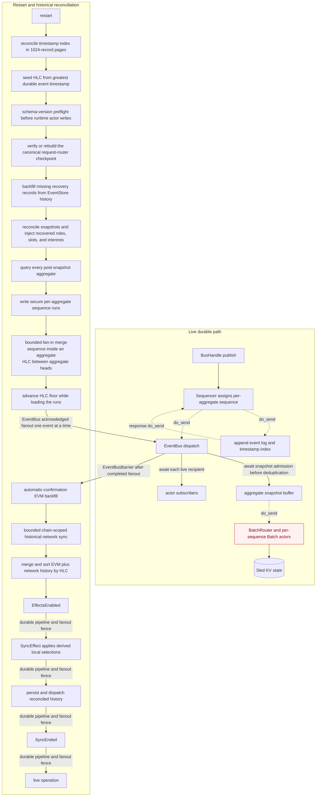

The append-only event log is the durable source of truth. The timestamp index and snapshots are
derived state. Before `commitlog` opens, startup validates the active segment's physical frames
against its index. A CRC/length-invalid suffix after the last indexed record is an uncommitted crash
tail and is truncated; complete CRC-valid, decodable frames whose index writes were lost are
re-indexed. Indexed decode/CRC failures and any offset/index mismatch remain fatal. EventStore
construction then performs a full integrity scan and reconciles missing timestamp-index rows from
the log in pages bounded by both record count and decoded bytes. Event-log flush synchronizes the
active segment, index, and directory before dispatch. Large local events use content-addressed blob
files. Startup verifies every committed reference, then removes only blob files that no committed
record references. Timestamp admission deduplicates by stable event ID plus payload, so the same
logical event may return through historical network sync with a different transport source without
colliding. A different payload at an already-indexed HLC timestamp remains an integrity failure.
After append, the sequencer sends the durable event to the EventBus. The EventBus waits for the
snapshot buffer to accept the sequence before it applies domain deduplication or sends the event to
domain subscribers. This boundary also covers startup replay and events received through source or
forked buses. EventBus deduplication uses a separate delivery identity: EVM occurrences include
their chain, block, and deterministic log timestamp/index, while local and network facts retain
their stable event ID. Equal EVM state facts from distinct log occurrences therefore both update
projections, but a re-delivery of the same occurrence remains idempotent. The snapshot router closes
every older open sequence when it observes a newer sequence; it does not require an exact
predecessor. The Sled and in-memory stores atomically reject a contextual batch whose sequence is
below the persisted aggregate cursor. These boundaries prevent a late batch from replacing newer
state while leaving a newer cursor in place. Historical peer-sync cursors contain only chain-bound
aggregates allowed by the active network policy; local aggregate 0 is never requested from peers or
added to recovery retries. Post-snapshot events are queried per aggregate in pages bounded by 1,024
events and 256 MiB of decoded data, then written to secure sequence runs. A single valid event can
exceed the page budget so replay always makes progress; the 512 MiB per-event limit remains the hard
bound. Runs are compacted with bounded fan-in, preserve durable order inside each aggregate, and use
persisted HLC timestamps to choose between aggregate heads. Memory and open-file use therefore do
not scale with the entire backlog. Before fanout, the HLC floor advances to the maximum replay
timestamp, which covers a snapshot cursor stalled behind newer log records. Replay then waits for
concurrent acceptance by all current EventBus subscribers. An unavailable subscriber or a subscriber
blocked beyond the bounded acceptance timeout aborts recovery. An `EventBusBarrier` therefore
completes only after the last replay fanout has completed. Process-infrastructure events from the
previous boot are classified separately and are not replayed into newly constructed actors. These
include shutdown, sync phase, network-readiness, and historical sync control events. The current
boot publishes fresh phase events after its prerequisites pass. This rule is required even when peer
history is empty: empty historical-network completions have the same payload-derived event ID on
every boot. Replaying the old completion would otherwise fill the EventBus dedup entry and drop the
fresh completion that startup is waiting for. The builder also arms the current `NetReady` listener
before it starts the network transport, so the immediate no-peer readiness signal cannot pass before
sync begins to wait.

The request router stores its active-context index, completed set, and covered per-aggregate cursors
in one recovery checkpoint at `//router/recovery_checkpoint`. Per-E3 context repositories remain
below their context namespaces; the checkpoint must not acquire a second router prefix. Contextual
writes from different aggregates can reach durable storage out of HLC or sequence order, so live
updates and rebuild projection both retain the highest sequence observed for each aggregate. Startup
compares every checkpoint cursor with its aggregate snapshot cursor. If any cursor differs, startup
rebuilds only the router admission projection from EventStore history through the exact snapshot
cursor for each aggregate and persists the repaired checkpoint before it constructs protocol actors.
It does not replay those prefixes into actors that already hydrate from snapshots. The normal replay
preflight still fails closed if the repaired checkpoint does not match the aggregate snapshot cut. A
node upgraded from a version without the checkpoint uses the same rebuild path. If an active router
checkpoint references a missing E3 context snapshot, startup also fails explicitly instead of
admitting later peer events against incomplete state.

Before actors attach, the builder reconciles the ciphernode-selector and finalized-committee
snapshots. It fills a missing copy from the other repository, removes E3s that the lifecycle
projection marks terminal, and rejects contradictory committees or missing request metadata.
Recovered aggregator roles, party IDs, proof-verifier context, and DHT interests are injected from
that state. Startup does not create durable synthetic role or selection events. The derived local
selection is held by the request router until `SyncEffect`.

Sortition, committee finalization, and per-chain slash submission use versioned recovery records.
Sortition retains seeds, typed requests, and early expulsion or exclusion inputs. The finalizer
retains request context and generated tickets so it can re-arm the deadline with the correct chain
provider. The slash writer stores semantic intents before policy or transaction work and keeps
temporary failures retryable. When these additive records are absent from an older database, startup
projects the required state from bounded EventStore history before the owning actors start. Existing
versioned records remain authoritative.

The EventBus mailbox remains bounded at `MAILBOX_LIMIT_LARGE` (2,560 messages). The replay producer
no longer attempts to enqueue the entire backlog into that mailbox in one burst, and EventBus
subscriber fanout no longer bypasses downstream mailbox limits. EventStore query responses also
await recipient capacity, preventing a full aggregation mailbox from dropping one aggregate response
and hanging startup. Recovery publishes `EffectsEnabled`, `SyncEffect`, canonical history, and
`SyncEnded` as four separately fenced phases. `SyncEffect` applies local selections derived from
reconciled durable committee state inside existing E3 contexts. It does not append another
`CiphernodeSelected` event. Runtime log-read failures are returned in the correlated query response
and flow through the existing error paths; a remote sync query therefore cannot panic the EventStore
actor. The fail-stop behavior below applies to durable append/index-write failures. An event-log or
timestamp-index write error panics the affected EventStore before live dispatch. This preserves
durable-before-dispatch safety, but under the default unwind profile an Actix actor panic is
contained at its spawned task boundary: it can kill the store actor and stall the sequencer without
terminating the process. Process-level health supervision would need to detect the stalled pipeline,
but the current runtime does not provide that guarantee. A restart, when it occurs, treats the event
log as authoritative and reconciles missing derived index rows.

Those replay guarantees bound local replay memory and file-descriptor use, but they do not make the
whole persistence path synchronously acknowledged. Live publication and the sequencer/store response
path still contain `do_send` edges. Snapshot replay also forwards with `do_send`, and `BatchRouter`
can retain one child `Batch` actor per open aggregate/sequence until its timelock fires. A
sufficiently large set of simultaneously open snapshot batches can therefore create actors in
proportion to that active set.

## Networking-to-domain flow

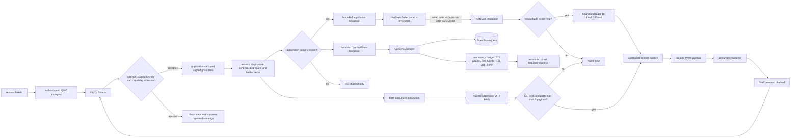

The network interface owns the QUIC swarm, signed gossipsub topic, Kademlia store, and transport
channels. A stable 32-byte network ID scopes Identify, gossipsub, Kademlia, and historical-sync
protocol names. Each built-in ID is the hardcoded SHA-256 digest of a documented, domain-separated
label. The label makes the ID reproducible, but the released ID remains immutable. A connection does
not enter network status, Kademlia, gossip, or direct sync until Identify reports the exact network
and required capabilities. Connection counts, Kademlia records, record size, record lifetime,
provider records, and per-peer insertions are bounded. Production network policies require an
explicit deployment set; only the local test policy can be unrestricted. Identify retains all staged
connections for a peer, permanently rejects incompatible peers, and applies a short retryable
cooldown after an Identify timeout. Gossipsub uses strict signatures and application validation
before forwarding. Gossip envelopes bind the network, Interfold deployment, chain aggregate, event
ID, schema version, and payload hash. Gossipsub and direct-request/DHT decoding have explicit byte
limits. Translation actors accept only the protocol event allowlist before publishing remote events,
and their broadcast-to-actor ingress loops await mailbox acceptance and stop when the destination
actor closes. Each publish attempt has a result timeout. No-peer failures use a longer retry window
than other transient failures. The network producer sends all events to the raw channel. It also
sends gossip payloads and publish or DHT results to a separate application channel. The startup
buffer subscribes only to the application channel. Historical-sync and connection-control bursts
cannot lag the application receiver or consume its actor mailbox. The application buffer is bounded
by both event count and estimated bytes and fails readiness on overflow or broadcast lag; after
`SyncEnded`, broadcast lag is warned and skipped without stopping the ingress loop. Historical
direct sync requires advancing cursors and enforces one cumulative page, event, byte, and time
budget across all aggregate fetches and recovery retries in a startup attempt. Bootstrap dialing
makes three bounded startup attempts and then retries unavailable peers every 60 seconds in the
background. Kademlia peers are evicted after three consecutive dial failures and quarantined from
discovery-based routing-table reinsertion for up to 30 minutes. An admitted connection clears the
cooldown early. A peer-ID mismatch quarantines the stale identity immediately. Peer health and
quarantine state are process-local and are rebuilt after restart. A peer ID supplied in explicit
configuration is pinned and cannot rebind to the identity obtained during a failed dial. A
discovered address without an explicit identity can adopt the authenticated remote peer ID. An
admitted QUIC connection is not sufficient evidence that gossip is ready. Network status reports how
many admitted peers advertise the protocol topic. If a connected peer does not advertise the topic
within 30 seconds, the node closes all connections to that peer. The configured peer dialer then
creates a fresh connection and repeats the gossip subscription exchange. This repairs a missed
subscription exchange after overlapping rolling-restart connections.

`PlaintextAggregated` is excluded from gossip and historical peer sync. It remains a local durable
publication intent, and canonical chain observations report completion. The request router rejects a
network event for an E3 that has no chain-admitted or hydrated context, so peer traffic cannot
create a durable request context. Once admitted, committee and proof validation—not the libp2p
identity alone—decides whether the artifact is usable.

The gossiped `DocumentMeta` is independent of the DHT content hash, so
`EventConversionService::validate_received` decodes the fetched payload and binds the metadata E3
identifier, `TrBFV` kind, and party-filter shape to that payload before a `DocumentReceived` event
is persisted. Transport and gossipsub identities authenticate the sending peer; they do not by
themselves prove that a peer is an authorized member of a particular E3 committee. Committee
authorization and durable peer reputation remain separate protocol-hardening work. Repeated DKG
coordination and document notifications use a fresh transport delivery ID. The embedded event or
document identity stays stable, so transport redelivery does not create a new protocol fact.
Document publication recovery derives a missing publication request from the durable local key or
share artifact. A crash after the artifact commit but before the derived request commit therefore
does not lose the DHT publication on restart.

## E3 lifecycle

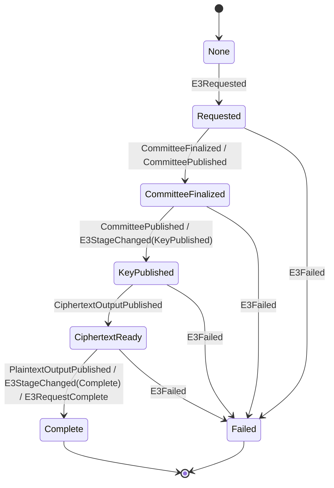

`E3LifecycleService` enforces monotonic progress and freezes terminal states. `E3Router` creates and
tears down per-request actor contexts. Duplicate and late terminal observations are classified
before forwarding; side effects are enabled only after recovery. The diagram shows the normal
progression: the lifecycle observer also accepts a forward jump to a later stage, while reporting a
lower-stage observation as a regression without changing its tracked stage.

## Committee, DKG, aggregation, and decryption

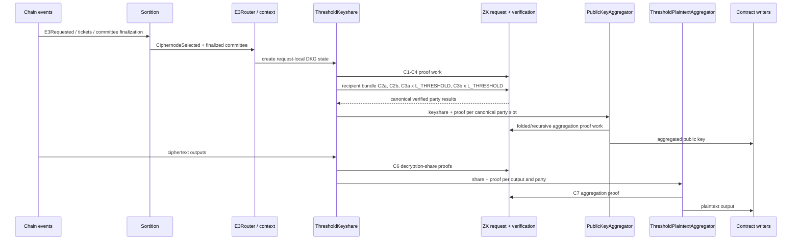

Committee order is the on-chain `topNodes` order; a party ID is an index into that ordered
committee. The Rust proof boundary validates canonical committee dimensions, unique party slots,
signer-to-slot binding, phase-specific proof multiplicity, and one share/proof per ciphertext
output. Circuit semantics are deliberately outside this refactor's modification scope.

Plaintext aggregation starts C6 verification at `T+1` distinct shares from the accepted `H`-member
DKG roster. It does not wait for every roster member. Late shares stay in a durable backup queue. If
a proof or raw-share commitment fails, the actor excludes that party and verifies a replacement
batch, or waits while `T+1` valid parties remain possible. Local verification results are bound to
the dispatch event ID and retained through replay; they cannot authorize a different batch.
`plaintext_aggregation/validation.rs` owns the raw-share commitment check, shared by admission and
post-verification checks. Live execution and recovery use the same threshold-decryption dispatch.

After C2/C3 verification, each member publishes a signed readiness report. The active aggregator
selects the first canonical `H` dealers that are mutually complete and announces that roster. The
existing readiness-gated aggregator failover promotes the next eligible party if this announcement
stalls. The active party ID is part of `AggregatorChanged` and is persisted by threshold-keyshare,
so only that party's signed roster is accepted. The first accepted roster is immutable; delayed
conflicts are ignored. Roster selection and public-key aggregation use separate failover phases and
budgets. Dealer hashes bind stable public proof statements instead of randomized proof bytes, and a
replacement proof plan invalidates the previous plan's response correlations.

Each recipient-scoped threshold-share bundle has one C2a secret-key share-computation proof, one C2b
smudging-noise share-computation proof, then every C3a proof, then every C3b proof. C3 multiplicity
follows rows of the threshold-parameter Shamir secret, not the number of CRT moduli in the DKG
encryption parameters:

| Parameter pair | `L_THRESHOLD` | Recipient bundle                   |
| -------------- | ------------: | ---------------------------------- |
| Insecure 512   |             2 | C2a x 1, C2b x 1, C3a x 2, C3b x 2 |
| Secure 8192    |             3 | C2a x 1, C2b x 1, C3a x 3, C3b x 3 |

`ThresholdKeyshare` dispatches verification with the DKG/share-encryption preset. The shape
validator therefore normalizes a DKG preset to its threshold counterpart before reading
`num_moduli`; a threshold preset remains unchanged. This matches proof generation, which creates one
C3 request for each threshold Shamir row even though the row is encrypted and proven with the paired
DKG BFV parameters. The invariant is independent of committee size for one recipient; full sender
fanout has `(N - 1) * L_THRESHOLD` C3a proofs and the same number of C3b proofs because the sender
does not encrypt its own slot. If a party's C0 key is absent, the sender uses its own C0 key to fill
that party's C3 proof slot. The placeholder ciphertext is not delivered to the absent party. This
keeps the N-wide circuit witness intact; it does not resolve roster agreement or collector timeouts.

The current TrBFV implementation creates exactly one smudging-noise share set (`Z = 1`). The general
C3b multiplicity would be `Z * L_THRESHOLD` per recipient. Supporting multiple ESI/smudging-noise
sets requires coordinated producer, validator, NodeFold, wire, and circuit work; the current
validator must not silently infer that extension.

## Compute scheduler and worker recovery

The production node defaults to two concurrent compute jobs and two reserved logical CPUs. Startup
limits that request by the available logical CPUs and the detected host or cgroup memory limit. The
memory calculation reserves 4 GiB for the node and host. It budgets 13 GiB for each prover job. The
122 GiB E3-977 incident killed one `bb` process at approximately 10.9 GiB resident memory, so its
actual demand was at least 10.9 GiB. The 13 GiB admission budget adds provisional headroom. Startup
fails before joining protocol work when the detected limit cannot cover the node reserve and one
prover budget.

`TaskPool` applies one semaphore to ZK and TrBFV work. Each ZK request also belongs to a node-scoped
E3 task group. A terminal E3 cancels queued work in that group. The cancellation does not affect a
different node that shares the process during tests or embedding.

A `ProofGenerationFailed` result or a ZK task-pool failure retries the exact request. The first ZK
retry adds Barretenberg `--slow_low_memory`. The scheduler also retries local worker and task-pool
failures for `GenPkShareAndSkSss`, `GenEsiSss`, `CalculateDecryptionKey`, and
`CalculateDecryptionShare`. Delays increase from 5 seconds to 15 seconds, 60 seconds, and five
minutes. Five minutes is the maximum delay. Retries continue until success or task-group
cancellation. A terminal event also interrupts an active retry delay. A node-scoped limiter emits at
most one retry warning per minute. Other attempts use DEBUG logs.

The prover removes each attempt directory after success or failure. Before a new process reuses a
deterministic attempt path, it also removes files left by a hard process kill. It limits process
output in an error report to 4 KiB for each stream. A verifier process failure returns an
infrastructure error. A valid verifier process that rejects a proof returns `false`. This
distinction prevents local memory or process failures from accusing a peer.

The node-proof recovery projection retains each durable threshold proof by its canonical sequence.
After a restart, `ProofRequestActor` signs and republishes a complete recovered share bundle, or
dispatches only the missing sequences from a partial bundle. It does not recompute completed C1-C3
proofs merely because their `ComputeResponse` events are older than the current snapshot cursor.

Proof consumers retain their inputs and correlation IDs after a local worker error. EventStore
replay and `ComputeEffectGate` can reissue the work after restart. A live randomized TrBFV request
can retry only before it publishes a successful response. Failed attempts are not durable protocol
contributions. After a successful response becomes durable, restart must reuse it exactly and must
not run the randomized computation again.

During replay, `ComputeEffectGate` also indexes successful durable `ComputeResponse` events by the
semantic request that produced them. If a hydrated actor regenerates the same request with a new
correlation ID, the gate republishes the durable response under that ID instead of running the work
again. It does not cache replayed `ComputeRequestError` events. An old OOM or process failure must
therefore retry, while completed C1-C4 proof work and randomized TrBFV output are reused exactly.

## Replay-safe EVM result publication

`InterfoldSolWriter` and `CiphernodeRegistrySolWriter` subscribe before EventStore replay. Locally
produced `PlaintextAggregated` and `PublicKeyAggregated` events form durable publication intents.
Their process-local gates are rebuilt from replay, coalesce by E3, and release work only after
`EffectsEnabled`. Live admission requires the active aggregator role. Replay can retain a local
intent while the persisted role is restored, but the writer starts a submission only while the node
is the active aggregator. Contract-state preflights provide cross-restart idempotency. Terminal
outcomes remove the intent; retryable failures retain it and retry after 30 seconds.

Only locally sourced result events cross these EVM write boundaries. A remote result cannot make a
node submit a transaction. `E3RequestComplete` does not discard an unfinished publication intent,
and only a canonical EVM `E3StageChanged(Complete)` makes the request router publish that cleanup
signal.

## Indexer catch-up and the applied-block cursor

`e3-indexer` can replay the logs it missed while it was not running. The machinery is **opt-in**: an
indexer that never calls `configure_backfill` writes no cursor, replays nothing, and starts its
subscription at the head, exactly as before the feature existed. That distinction is a safety
property, not a convenience — the event handlers are not pure (`E3Requested` submits `setMerkleRoot`
on chain and re-initialises the stored round), so replay must never be acquired by merely upgrading
the crate.

`INDEXER_CURSOR_KEY` (`_indexer:cursor`) is a **best-effort watermark over RAW log application**,
not a proof that every event below it was processed. Be precise about what it does and does not
assert, because the read APIs built on it present its range as authoritative:

- **It speaks for raw handlers only.** Typed handlers are spawned concurrently on the live path and
  their errors are logged and dropped, so the cursor says nothing about them. Anything that needs a
  typed handler to have run must check its own state, never the cursor.
- **It only advances once the catch-up has completed** for the current connection, and only while
  the listener is healthy. A cursor that moved while a gap beneath it was still unreplayed would
  seal that gap permanently, so a raw-handler failure clears the health flag synchronously and
  aborts the subscription.
- **It only advances monotonically**, via `fetch_max`. Block handlers are spawned rather than
  awaited, so headers can be applied out of order and a blind write could move the cursor backwards.
  Note what this does NOT give you on its own: `fetch_max` orders the in-memory claim, not the
  `store.insert` calls that follow it.
- **It is capped by what the listener reports it has finished.** A header says the CHAIN reached a
  block, never that its logs were applied — those arrive on a separate subscription. The listener
  publishes a `LiveProgress` (the block whose raw handlers are running, and a health flag cleared on
  failure) and the block handler claims no higher than `applied_ceiling`. The `blockheight - 1`
  hedge is kept, but it is only a hedge: without the ceiling, a raw handler that was merely SLOW let
  headers march the cursor past a log still being written, and the restart then skipped it.
- **A backfill window advances it only after every handler in that window succeeded**, sequentially
  and in block order. `catch_up` propagates handler errors for exactly this reason, so a consumer's
  raw handler must return `Err` on a failed write rather than logging and continuing.

The catch-up runs **twice per connection**, and both passes are load-bearing:

1. **Before subscribing.** Re-reads the head after each window and loops until it converges, so a
   backfill from a deployment block that runs for hours still ends level with the chain. Kept off
   the socket because holding a subscription open through a multi-hour replay is its own problem.
2. **After subscribing**, gated on `LiveProgress::wait_subscribed`. Pass 1 can only ever converge on
   a head read taken while nothing was subscribed, and the subscription comes up a moment later — so
   blocks mined in between were in NEITHER path, and the header stream then advanced the cursor
   straight past them. Silent, permanent, once per reconnect, and reported as covered. Replaying
   from inside the subscription's lifetime is what makes the overlap real: that range now arrives
   via the subscription, via this replay, or both.

`caught_up` is set by pass 2, never pass 1, so the cursor cannot advance while the handoff range is
still outstanding.

The cost is duplicate delivery, which is the design's standing assumption rather than a new hazard —
handlers must tolerate seeing an event twice, and the CRISP log store's `append` is idempotent on
`(block_number, log_index)` for exactly this reason. Note the asymmetry that makes this affordable:
duplicates are absorbed by an idempotent write, whereas a gap is unrecoverable once the cursor
passes it.

A backfill that keeps failing does not wedge the process: after several attempts the indexer
subscribes anyway with the cursor left where it was, so live indexing resumes and the unreplayed
range is retried later rather than being claimed as applied.

Handlers registered on the block listener must capture only what they need — never the
`Arc<IndexerContext>` itself. The context owns the block listener, so a handler holding the context
forms a reference cycle and the indexer is never dropped.

Consumers that build a queryable log index on top of the cursor (the CRISP server does) must also
treat coverage records as claims that can go stale: the store has no delete, so a record outlives
the configuration that created it and has to be re-checked against the live configuration at read
time.

## Failure, accusation, slashing, expulsion, and timeout

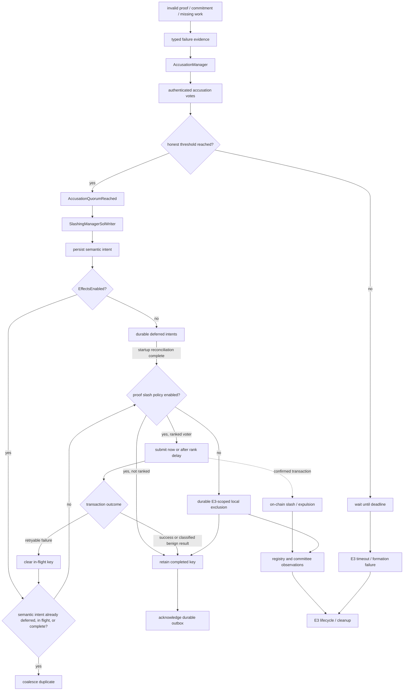

Vote quorum uses the honest threshold rather than the total committee size. Each affirmative vote
signs a shared issue time and deadline. The contract limits that window to the request-time policy
and rejects submissions after the E3's objective reporting deadline. A live zero-second registry
window pauses new attestation slashes. Cryptographic verification failures must be structurally
attributable to a canonical party before they become slashing evidence. Replayed
`AccusationQuorumReached` events are written to a versioned per-chain recovery outbox and held until
`EffectsEnabled`, then coalesced by the contract's semantic replay domain across deferred,
in-flight, and completed submissions. Retryable submission failures release the process-local
in-flight key but retain the outbox intent. Confirmed or known-benign terminal results resolve it.

Every node reads the proof-type policy after a fault quorum. A disabled policy produces a durable,
E3-scoped `CommitteeMemberExcluded` fact instead of a transaction that must revert. This fact is not
an on-chain expulsion: it changes only the current E3's collectors and aggregator selection. The
canonical N-member roster remains unchanged for proof binding, rewards, and registry state.

The slash writer has two state layers. Its deferred, in-flight, and completed admission sets are
process-local. Its semantic intent outbox is durable and is written before policy reads or
submission. A matching canonical exclusion or slash execution acknowledges the outbox, and startup
backfills a missing outbox from EventStore history. A crash after transaction broadcast can still
require on-chain reconciliation to distinguish landed from missing work; contract replay protection
makes a repeated proposal safe.

## Program-server trust boundary

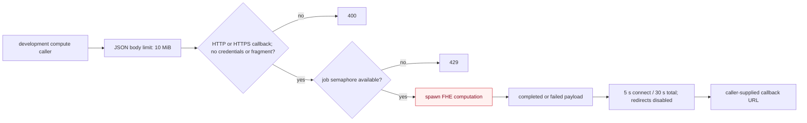

`E3ProgramServerBuilder::build` fails only when the concurrency limit is zero. The default limit is
one job. The development/test endpoint does not authenticate callers or allowlist callback
destinations. The callback URL comes from the request body and may target any HTTP(S) origin; URL
credentials, fragments, and non-HTTP schemes are rejected, and localhost rewriting changes only the
exact host. The webhook client has bounded connection/total time and does not follow redirects. Logs
record result sizes and response status rather than response bodies.

The CRISP and default-template coordination callers do not log compute payloads. This server is
development tooling rather than an authenticated production compute boundary and must not be exposed
across trust boundaries.

Accepted jobs are ordinary detached Tokio tasks. The semaphore bounds concurrent work, but those
tasks are not registered with an application shutdown token or join set, and there is no durable job
queue. A server stop can therefore cancel work or callback delivery without a recoverable job
record. The current health endpoint also reports process availability, not dependency readiness or
job-drain state.

## Durable and in-memory ownership

| State                                    | Authoritative owner                                                                  | Reconstructed from                                                                                                                               |
| ---------------------------------------- | ------------------------------------------------------------------------------------ | ------------------------------------------------------------------------------------------------------------------------------------------------ |
| Protocol event history                   | Per-aggregate append-only event logs                                                 | Direct log scan                                                                                                                                  |
| Aggregate snapshots and repositories     | Sled-backed `Repositories`                                                           | Event replay after snapshot cursors                                                                                                              |
| Timestamp index                          | `SequenceIndex`                                                                      | Reconciled from event log on startup                                                                                                             |
| Chain sync cursor                        | Aggregate snapshot metadata                                                          | Automatic-confirmation EVM backfill                                                                                                              |
| Network document history                 | Event log plus network repository                                                    | Historical net sync                                                                                                                              |
| E3 actor contexts                        | `E3Router` in memory                                                                 | Durable replay and canonical chain observations                                                                                                  |
| Request-local DKG/aggregation state      | Per-E3 actors plus versioned state and recovery repositories                         | Snapshots restore protocol phases and restart inputs; `EffectsEnabled` recreates collectors and jobs with new process-local correlation IDs      |
| Active-aggregator failover state         | Versioned sortition repository                                                       | Readiness-gated phase, assigned party, absolute deadline, and phase-local unresponsive parties; re-armed after `EffectsEnabled`                  |
| Delayed sortition inputs                 | Versioned sortition recovery repository                                              | Seed, typed request, and early expulsions or exclusions; missing recovery state is projected from EventStore history                             |
| Committee-finalization timer             | Versioned committee-finalizer recovery repository                                    | Request context and ticket restore the absolute-deadline schedule with the E3's chain provider after `EffectsEnabled`                            |
| C0/share proof-verification context      | Finalized-committee and ciphernode-selector repositories plus global verifier memory | Canonical slots and E3 preset/threshold metadata load before ZK actor startup, then lifecycle events maintain or clear them                      |
| HLC, EventBus dedup, and admission state | Event pipeline actors in memory                                                      | Maximum snapshot/replay HLC; a fresh bounded dedup window is populated by replay and live events                                                 |
| Network peer and buffer state            | libp2p and network actors in memory                                                  | Fresh peer dialing and buffering                                                                                                                 |
| Network document interests               | Ciphernode-selector committee snapshot                                               | Local selected E3 IDs are injected before network startup; no synthetic selection event is appended                                              |
| Slash-submission intent                  | Versioned per-chain writer outbox plus process-local admission gate                  | Stored before effects; temporary failures retry; confirmed receipt, canonical exclusion, or matching slash execution resolves the intent         |
| Registry transaction replay gates        | Interfold and registry writer process memory                                         | Rebuilt from durable ticket, committee-finalization, public-key, and plaintext intents; idempotent contract checks reconcile landed transactions |
| Pending transaction nonce allocation     | Per-chain writer mutex in memory                                                     | Provider pending nonce on restart                                                                                                                |
| Accusation actor and committee inputs    | Finalized-committee snapshot plus per-E3 actor memory                                | Active actor is recreated during context hydration                                                                                               |
| In-flight accusation votes and timers    | Per-E3 accusation actor memory                                                       | Not reconstructed; peers must resend valid messages before the signed deadline                                                                   |
| libp2p identity                          | Encrypted keypair repository                                                         | Decrypt at startup                                                                                                                               |
| Program-server job permits/tasks         | Tokio semaphore and detached tasks                                                   | Not reconstructed after process exit                                                                                                             |

No actor-local mutable cache is treated as durable merely because the actor survives for the process
lifetime.

## Shutdown, restart, resync, and cancellation

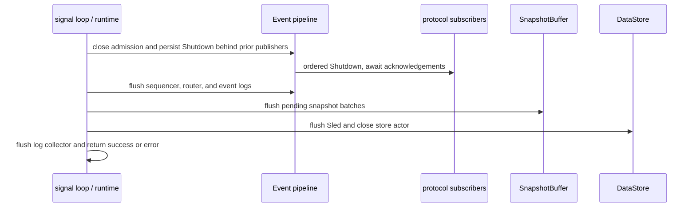

The whole barrier is time-bounded. Failure to drain or flush is returned to the CLI and produces a
non-zero exit. On restart, the process fence prevents two local writers from sharing one database.
Schema preflight rejects unsupported upgrades or downgrades. `interfold node validate` provides
offline integrity and loose-end diagnostics without mutation by default.
`interfold node validate --repair` can recover a safe uncommitted tail. It can also reconcile
derived registered-node projections from an intact EventStore prefix. It never removes an indexed
event or node identity.

The implemented restart and operator-controlled recovery boundary is:

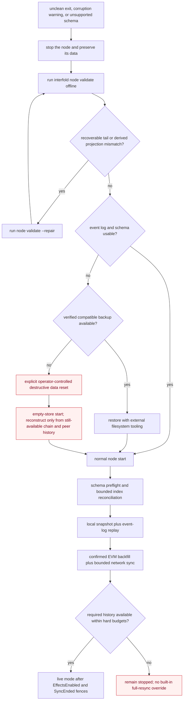

There is no rollback of indexed event records, backup/restore command, or dedicated full-resync
command in the Rust crates. Tail repair truncates bytes after the last index boundary. It also
restores complete CRC-valid and decodable frames whose index entries were lost. Projection repair
rebuilds registered-node membership and missing member history from intact events through each
snapshot cursor. Committed corruption still fails closed. Backup restore is an offline filesystem
operation. A destructive reset removes the local event log—the node's source of truth—and can
reconstruct only observations still available from configured EVM ranges and peers. One historical
network startup attempt, including all aggregates and retries, is capped at 512 pages, 50,000
events, 128 MiB, and five minutes, with no operator override in the current implementation.
Exceeding a budget or discovering unavailable history is therefore a startup blocker, not a signal
to silently skip data. Unsupported schema state likewise requires a compatible binary, a verified
backup, or an explicit reset; no automatic migration is implemented.

The multi-process SWARM supervisor has a separate child-process lifecycle:

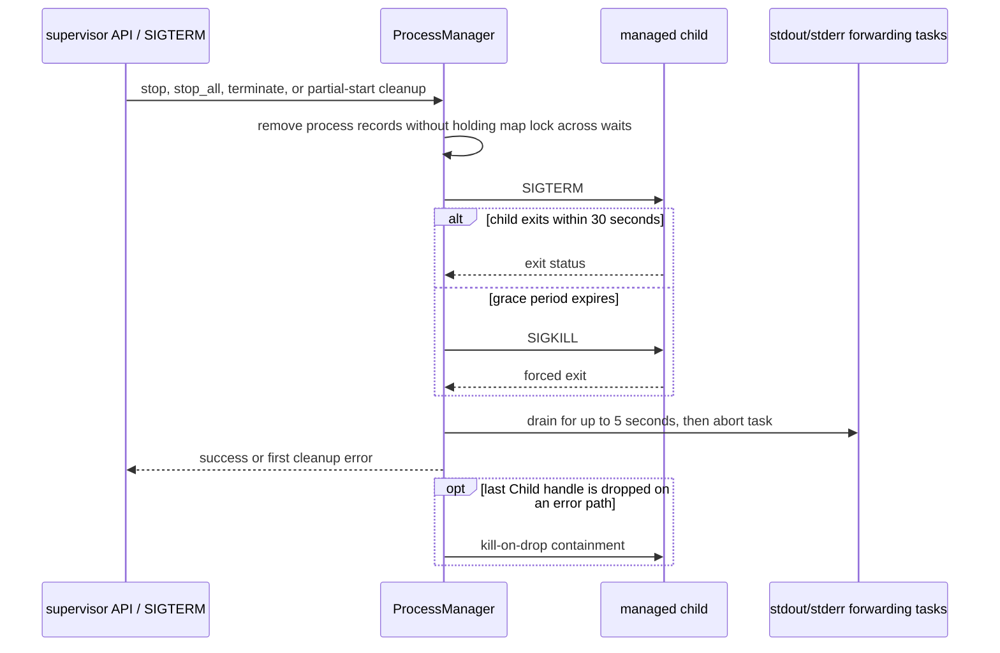

An exited child is reported as `Exited { code }`, not `Started`, and can be started again. A failure
partway through `start_all` terminates children that already started. Supervisor termination exits
non-zero if child cleanup fails. Spawned handles use `kill_on_drop`, so removing a process record
before a failed termination step cannot orphan the managed child. This is process supervision only:
it does not persist a desired-state/restart policy, and unexpected child exit is observed through
status rather than automatically restarted.

## Error and cancellation propagation

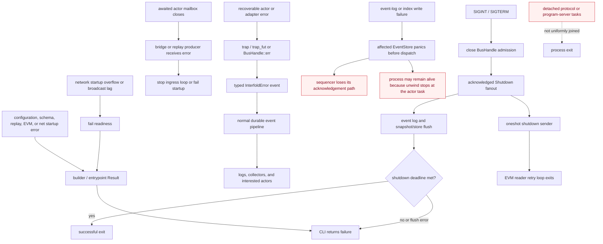

Startup barriers propagate errors to the caller and fail closed where continuing would drop
historical or live input. Awaited network bridges stop when their destination actor closes.
Recoverable handler failures are generally converted into durable `InterfoldError` events by the
existing `trap` helpers; a logged error is not itself a supervision restart. EventStore write
failures preserve safety by panicking before dispatch, but the default unwind build does not turn a
spawned Actix actor panic into a guaranteed process exit. The store actor can die while the process
remains present and the sequencer stalls; current code has no supervisor that converts that
condition into a deterministic restart. Shutdown closes event admission, waits for admitted
publishers, persists and fans out `Shutdown`, flushes the durable pipeline, then drains snapshot
batches and the backing store under one deadline. Any failed shutdown stage reaches the CLI and
causes an unsuccessful exit.

Cancellation ownership is not uniform across the workspace. EVM reader loops have an explicit
oneshot shutdown signal, the EventBus shutdown event stops many actors, and the outer deadline
prevents an indefinite drain. Detached tasks without a join handle or cancellation token remain a
residual: process exit is their final cancellation boundary, so they cannot all prove completion or
persist recovery intent.

## Randomness-provider event boundary

The `e3-evm` randomness-provider reader watches the current provider and every provider recorded in
the Registry's provider-set history. It translates only a Registry-accepted fulfillment into the
durable `CommitteeRequested` event. It reads the Registry at the fulfillment block. If an RPC cannot
serve that historical block, it uses retained current state only when the Registry reports the seed
as ready. The complete Registry verification has a 15-second timeout. A timeout or unverifiable
result rejects the log so restart replay can retry the event instead of blocking the shared reader.
The Registry call confirms the request-time provider, request ID, response deadline, and derived
seed before Rust starts sortition. Provider rotation requires all committees to be released. The
standard resume tool requires an explicit coordinated-restart acknowledgement before it creates an
unpause transaction, because running nodes add provider addresses only at startup. This release
starts Registry readers only on Ethereum mainnet, Sepolia, and local development chains.

The sortition runtime ranks N-plus-buffer distinct request-time owners and retains their operators
as backups. Before ranking, it applies the admission policy and position starts at
`requestBlock - 1`. `AdmissionUpdated` carries the contract timestamp. Its separate versioned v2
repository preserves old node payloads. Startup rebuilds missing chain projections from typed events
in aggregate zero and legacy raw logs in each chain aggregate. Replay decodes raw admission logs
after the snapshot cursor too. The decoder checks the EVM source and ABI, not old catalog labels.
Disabled, unpaused policies return the existing view immediately. Enabled policies filter locally,
without per-request RPC reads. A pause also requires activity before the pause and does not change
previous request views. The matching contract check remains authoritative.

Local capacity gates each node's submission. Finalization ranks visit each owner's best operator
before its backups. The contract selects at most one operator per owner for capped requests;
canonical party IDs still come from the finalized address order. The existing EVM decoder wraps
`BondOwnerSet` as the appended `BondOwnerSetAt` event, with the original block time in seconds. The
separate v2 owner repository never imports ingestion-time v1 checkpoints. Startup backfills missing
chain projections through aggregate zero's snapshot cursor without changing existing node or
recovery payloads. Legacy owner events still decode but cannot establish chain-time history. Missing
history permits all eligible submissions instead of excluding owners. The
`sortition_owner_history_fallback` warning includes the E3, chain, snapshot time, missing-owner
count, and eligible-operator count. It does not add an RPC call or fail the round. Existing ticket
intents keep their ticket numbers and finalization ranks on restart, including nodes with
aggregation disabled. Startup reads prefix intents from the durable event log; replay marks suffix
intents as processed before effects resume. A separate `restart_input_cursors/v1` repository records
the checked prefix for each unfinished E3, including scans with no local ticket. Later restarts scan
only newly snapshotted records. The cursor advances only after recovered repositories are durable.
New E3s start from zero; terminal or finalized E3 checkpoints are removed.

## Subsystem contracts

| Subsystem                          | Responsibility and I/O                                                                               | Owned state and dependencies                                                                                                                                       | Invariant and failure behavior                                                                                                                                                                                                                                                                                                                                                                                                                                                                                                                                                                                                                                                                                                                                                                                                                                                                                                                                                                                                                                                                                      | Extension boundary / must not own                                                                                         |
| ---------------------------------- | ---------------------------------------------------------------------------------------------------- | ------------------------------------------------------------------------------------------------------------------------------------------------------------------ | ------------------------------------------------------------------------------------------------------------------------------------------------------------------------------------------------------------------------------------------------------------------------------------------------------------------------------------------------------------------------------------------------------------------------------------------------------------------------------------------------------------------------------------------------------------------------------------------------------------------------------------------------------------------------------------------------------------------------------------------------------------------------------------------------------------------------------------------------------------------------------------------------------------------------------------------------------------------------------------------------------------------------------------------------------------------------------------------------------------------- | ------------------------------------------------------------------------------------------------------------------------- |
| `e3-events`                        | Admit, timestamp, persist, deduplicate, and fan out typed events.                                    | HLC factory, subscriber registry, sequencer, event stores, and snapshot bridge; depends on Actix and protocol payload types.                                       | Event log append precedes live dispatch. Every durable sequence reaches the snapshot bridge before domain deduplication, including during startup replay. EVM delivery identity includes the block and deterministic log timestamp/index, so equal facts from distinct log occurrences remain distinct. Startup index reads are paged; query responses and shutdown/replay/recovery-phase barriers are acknowledged. Storage or mailbox failures reach a caller where the path is awaited, but live append/response `do_send` edges remain.                                                                                                                                                                                                                                                                                                                                                                                                                                                                                                                                                                         | Event/subscription APIs; must not own request-specific protocol policy.                                                   |
| `e3-data`                          | Serve typed repository reads/writes and append-only event-log/index records.                         | Sled/in-memory stores, log handles, batch writes, and flush failure state.                                                                                         | Acknowledged sync/batch writes flush before success; decode corruption and recorded write failures fail closed. Contextual snapshot batches are revision-consistent and storage rejects a batch older than the persisted aggregate cursor.                                                                                                                                                                                                                                                                                                                                                                                                                                                                                                                                                                                                                                                                                                                                                                                                                                                                          | Repository/store factories; must not decide committees, proofs, or lifecycle transitions.                                 |
| `e3-sync`                          | Reconstruct actor state and reconcile EVM/network history before live mode.                          | Startup plan, disk-backed local replay runs, and bounded reconciled-history vectors; depends on repositories, EventBus, EVM, and net adapters.                     | Schema is checked before state-writing actors; HLC includes post-snapshot history; replay preserves per-aggregate sequence and orders ready aggregate heads by HLC with acknowledged subscriber acceptance; `EffectsEnabled`, `SyncEffect`, history, and `SyncEnded` are separately acknowledged; history gaps or bounded-net-sync failure abort startup.                                                                                                                                                                                                                                                                                                                                                                                                                                                                                                                                                                                                                                                                                                                                                           | Historical collectors/planners; must not submit live transactions.                                                        |
| `e3-net`                           | Translate bounded libp2p traffic and serve gossip, DHT, and historical sync.                         | Swarm, Kademlia records, peer/transport and gossip-subscription status, channels, startup buffer, and document interests.                                          | Stable network IDs scope every protocol surface; Identify gates peer admission; signed gossip is application-validated and type-allowlisted; envelopes, decodes, startup backlog, DHT storage, and sync fetches are bounded; deployment and document metadata must match their payloads. A connected peer that does not advertise the protocol topic within the grace period is disconnected so the configured peer dialer can repeat the subscription exchange. Errors fail readiness or stop the affected ingress loop.                                                                                                                                                                                                                                                                                                                                                                                                                                                                                                                                                                                           | `NetInterface` and pure translation services; must not own E3 transitions or infer committee authority from PeerId alone. |
| `e3-evm`                           | Read chain history under the automatic confirmation policy and submit typed contract transactions.   | Per-chain gateways, provider handles, chain buffers, nonce mutexes, canonical deadline watches, durable per-chain slash outboxes, and result-publication gates.    | Malformed logs and reverted receipts fail. Chain ingestion waits one block by default, including when the configured URL is a local RPC proxy; a single-process development chain must explicitly select zero confirmations. Log timestamps avoid a second provider lookup when available, and fallback block lookups retry transient lag. The `eth_getLogs` block window starts at 10,000 and halves when a provider rejects the range, so a provider range cap is discovered instead of configured; the event stream (`stream_from_evm`) keeps the narrowed width for its session across the historical sync and backfills, while each `fetch_logs_adapting` call starts again at 10,000. A rejected chunk is reissued from the same start block. A rejected range does not consume the retry budget, and a rejection at the one-block floor fails. Local result events rebuild idempotent publication intents before effects. Slash intents persist before policy or submission and transient failures retry. Nonce allocation is serialized in-process; there is no full transaction journal or reorg rollback. | Provider/contract helpers; must not own off-chain proof policy.                                                           |
| `e3-request`                       | Route E3-scoped events and enforce lifecycle progress.                                               | `E3Router`, canonical recovery checkpoint, lifecycle state, typed `(E3, recipient)` buffers, and request actor contexts; depends on event and protocol actor APIs. | Legal progress is monotonic; cursors never move backwards; peer events cannot create unknown contexts; derived selections resume only at `SyncEffect`; local aggregation is not terminal; canonical EVM completion drives teardown; buffered history precedes the recipient-creating event. Active buffer size and child `do_send` remain residual risks.                                                                                                                                                                                                                                                                                                                                                                                                                                                                                                                                                                                                                                                                                                                                                           | Domain lifecycle/routing functions; must not implement storage, network framing, or contract decoding.                    |
| `e3-sortition`                     | Track registry/tickets and derive canonical selection/committee observations.                        | Node registry, ticket state, persisted capacity reservations, chain-derived committee state, versioned delayed-input recovery, and aggregator-failover deadlines.  | On-chain ordering is authoritative. Request, seed, and early membership changes survive restart. A selected node reserves local capacity before ticket dispatch. Committee finalization reconciles that reservation with the canonical N-node committee. Terminal cleanup releases participation and failover state. The lowest eligible party is active. A phase deadline starts only after durable aggregation readiness, survives restart, and promotes standbys in order. Canonical progress clears phase-local skips.                                                                                                                                                                                                                                                                                                                                                                                                                                                                                                                                                                                          | Sortition backend; must not construct cryptographic proofs.                                                               |
| `e3-keyshare`                      | Coordinate request-local DKG, shares, and decryption work.                                           | Threshold keyshare actor state and repositories; depends on FHE/ZK services and the event bus.                                                                     | Party IDs index the canonical committee; each recipient gets C2a/C2b singletons and C3a/C3b per threshold Shamir row. Resumable determined outputs redrive only after `EffectsEnabled`. Fatal collector timeouts commit `Failed` before `E3Failed`, freeze its payload, and redrive that failure after hydration.                                                                                                                                                                                                                                                                                                                                                                                                                                                                                                                                                                                                                                                                                                                                                                                                   | Cryptographic backend/task pool; must not own transport frames or ABI decoding.                                           |
| `e3-zk-prover`                     | Build and verify typed proof jobs/statements.                                                        | Backend job state, circuit registry, verification outcomes, durable node-fold inputs and outputs, and seeded committee/preset caches.                              | Statement shapes, canonical committee dimensions, signer/slot binding, and proof multiplicity are checked before acceptance; DKG presets normalize to their threshold counterpart when deriving C3 row counts. Finalized slots and C0 context load before replay. The node-fold collector persists each inner proof and fold metadata, then resumes incomplete work after restart.                                                                                                                                                                                                                                                                                                                                                                                                                                                                                                                                                                                                                                                                                                                                  | ZK backend and registry; must not add committee policy absent from the proof statement.                                   |
| `e3-aggregator`                    | Aggregate canonical verified public-key/plaintext shares and schedule committee finalization.        | Explicit per-E3 aggregation states plus a versioned finalizer request/ticket repository shared across chains.                                                      | One signer-bound share/proof occupies each canonical party slot and output multiplicity is exact. Every standby persists valid inputs; only the active party launches aggregation effects. Promotion resumes the persisted phase. Finalization timers re-arm after effects with the E3's chain provider and retry temporary timestamp failures. Invalid or duplicate contributions are rejected.                                                                                                                                                                                                                                                                                                                                                                                                                                                                                                                                                                                                                                                                                                                    | Pure aggregation states and proof backend; must not own EVM transaction policy.                                           |
| `e3-slashing`                      | Attribute proof failures, collect authenticated votes, and emit quorum outcomes.                     | Recreated per-E3 accusation/checker actors and process-local evidence/vote state; depends on durable committee data, verification, and events.                     | Honest threshold decides quorum and only structurally attributable failures become evidence. Active actors recover from committee snapshots, but partial vote tallies and timers do not survive a process exit.                                                                                                                                                                                                                                                                                                                                                                                                                                                                                                                                                                                                                                                                                                                                                                                                                                                                                                     | Voting/evidence domain modules; must not generate proofs or assign ambiguous blame.                                       |
| `e3-program-server`                | Serve bounded development compute requests and deliver results to caller-supplied HTTP(S) callbacks. | Runner closure, callback client, and job semaphore.                                                                                                                | Zero job capacity fails build; overload returns 429; callbacks reject unsafe URL forms and use bounded delivery timeouts. The test endpoint does not authenticate callers, does not allowlist callback targets, and must not be exposed as a production service. Detached tasks are not recoverable.                                                                                                                                                                                                                                                                                                                                                                                                                                                                                                                                                                                                                                                                                                                                                                                                                | Runner callback; must not become durable protocol state or be treated as a production trust boundary.                     |
| `e3-ciphernode-builder`            | Construct stores, adapters, actor extensions, migration projections, and startup barriers.           | Composition handles, reconciled startup snapshots, and validated configuration; durable state remains in repositories and logs.                                    | Schema and recovery preflight run before state-writing actors. Contradictory committee snapshots, missing active metadata, or an unsupported recovery version fail startup. Required components and startup readiness must succeed before returning a handle.                                                                                                                                                                                                                                                                                                                                                                                                                                                                                                                                                                                                                                                                                                                                                                                                                                                       | Concrete factories/extensions; must not accumulate live protocol policy or durable business state.                        |
| `e3-entrypoint` / SWARM supervisor | Load/decrypt node configuration and manage child processes.                                          | Process map, kill-on-drop child handles, and output-forwarding tasks.                                                                                              | Partial startup is cleaned up; status distinguishes exited children; stop is SIGTERM-first and time-bounded; a dropped final handle cannot orphan its child.                                                                                                                                                                                                                                                                                                                                                                                                                                                                                                                                                                                                                                                                                                                                                                                                                                                                                                                                                        | Command composition; must not silently restart failed protocol work or own node domain state.                             |

Extension points should be narrow concrete boundaries with an active consumer: repository factories,
network interfaces, ZK backends, sortition backends, clocks, and task pools. New one-method traits
are not introduced solely to create layers.
