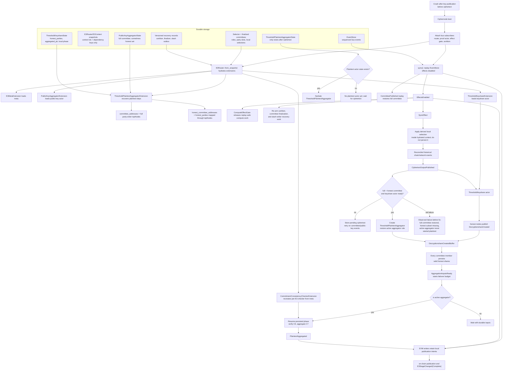

# Part 6: Deactivation, Deregistration & Completion

## Overview

An operator can voluntarily leave the network by deactivating (withdrawing collateral) and
deregistering (removing from the Merkle tree). The exit is time-locked, and pending exits remain
slashable until claimed.

Collateral withdrawals are bond-owner actions: `removeTicketBalanceFor(operator)` and
`unbondCiphernodeFor(operator)`. Deregistration is callable by either the owner or the operator key,
which gives the running node an emergency kill switch. Anyone can settle a matured ticket-only exit
to the bond owner. A claim that includes ciphernode bond collateral remains restricted to the bond
owner.

---

## Voluntary Deactivation

### Via Ticket Withdrawal

```text
Bond owner submits removeTicketBalanceFor(operator, 50)
│
└─ BondingRegistry.removeTicketBalanceFor(operator, 50)
    │
    │  ┌─── ON-CHAIN (BondingRegistry.sol) ─────────────────────┐
    │  │                                                         │
    │  │  removeTicketBalanceFor(operator, 50):                  │
    │  │    1. require(msg.sender == bondOwnerOf(operator))      │
    │  │    2. require(amount != 0, registered, sufficient tFOLD)│
    │  │    3. ticketToken.burnTickets(operator, amount)         │
    │  │       → tFOLD destroyed, underlying becomes claimable      │
    │  │    4. _exits.queueTicketsForExit(                       │
    │  │         operator, exitDelay, amount                      │
    │  │       )                                                  │
    │  │       → Locked in ExitQueue until now + exitDelay        │
    │  │    5. _updateOperatorStatus(operator)                   │
    │  │       → Active iff registered &&                         │
    │  │         ciphernodeBond >= _minCiphernodeBond() &&              │
    │  │         (ticketBalance / ticketPrice) >= minTicketBalance│
    │  │         active = false, numActiveOperators--             │
    │  │         Emit OperatorActivationChanged(op, false)        │
    │  │    6. Emit TicketBalanceUpdated(op, -amount, newBal,     │
    │  │       "WITHDRAW")                                         │
    │  │  }                                                      │
    │  └─────────────────────────────────────────────────────────┘
```

### Via Ciphernode Bond Withdrawal

```text
Bond owner submits unbondCiphernodeFor(operator, 20000)
│
└─ BondingRegistry.unbondCiphernodeFor(operator, 20000)
    │
    │  ┌─── ON-CHAIN ───────────────────────────────────────────┐
    │  │                                                         │
    │  │  unbondCiphernodeFor(operator, 20000):                     │
    │  │    1. require(msg.sender == bondOwnerOf(operator))      │
    │  │    2. require(amount != 0, sufficient bonded FOLD)      │
    │  │    3. operators[op].ciphernodeBond -= 20000                │
    │  │    4. _exits.queueCiphernodeBondsForExit(op, exitDelay, 20000)│
    │  │       → Pending FOLD remains in totalBonded(bondOwner)  │
    │  │         token-level locked-floor accounting             │
    │  │    5. _updateOperatorStatus(operator)                   │
    │  │       → If ciphernodeBond <                                │
    │  │         (requiredCiphernodeBond * ciphernodeBondActiveBps / 10000)│
    │  │         (default: 80% of required bond):                │
    │  │         active = false, numActiveOperators--             │
    │  │    6. Emit CiphernodeBondUpdated(op, -amount, newBond,      │
    │  │       "UNBOND")                                          │
    │  │  }                                                      │
    │  └─────────────────────────────────────────────────────────┘
```

### Combined Deactivation

```text
Bond owner submits both owner-authorized calls
│
├─ Calls removeTicketBalanceFor(operator, 50) first
└─ Then calls unbondCiphernodeFor(operator, 20000)
  → Tickets are queued in ExitQueueLib
  → FOLD is queued in ExitQueueLib pending ciphernode bond exits and remains counted in totalBonded()
```

---

## Full Deregistration

```text
Bond owner or operator submits deregisterOperatorFor(operator)
│
└─ BondingRegistry.deregisterOperatorFor(operator)
    │
    │  ┌─── ON-CHAIN (BondingRegistry.sol) ─────────────────────┐
    │  │                                                         │
    │  │  deregisterOperatorFor(operator) {                       │
    │  │    1. require(msg.sender == operator OR bondOwner)      │
    │  │    2. require(operators[operator].registered)           │
    │  │    3. require(!exitInProgress(operator))                │
    │  │       → Cannot deregister if an exit is already pending │
    │  │                                                         │
    │  │    4. operators[operator].registered = false            │
    │  │    5. operators[operator].exitRequested = true          │
    │  │    6. operators[operator].exitUnlocksAt =               │
    │  │         block.timestamp + exitDelay                      │
    │  │                                                         │
    │  │    7. Burn ALL tickets:                                 │
    │  │       fullTicketBalance = ticketToken.balanceOf(op)     │
    │  │       ticketToken.burnTickets(op, fullTicketBalance)    │
    │  │                                                         │
    │  │    8. Queue ALL collateral for exit:                    │
    │  │       ciphernodeBondAmount = operators[op].ciphernodeBond│
    │  │       operators[op].ciphernodeBond = 0                  │
    │  │       // One combined call; queueing tickets twice would │
    │  │       // double the queued balance.                      │
    │  │       _exits.queueAssetsForExit(                        │
    │  │         op, exitDelay,                                  │
    │  │         fullTicketBalance,    // tickets                │
    │  │         ciphernodeBondAmount  // ciphernode bond        │
    │  │       )                                                 │
    │  │                                                         │
    │  │    9. Remove from Merkle tree:                          │
    │  │       registry.removeCiphernode(operator)               │
    │  │       │                                                  │
    │  │       │  ┌─ CiphernodeRegistryOwnable ──────────────┐  │
    │  │       │  │  removeCiphernode(node):                  │  │
    │  │       │  │    index = ciphernodeTreeIndex[node]      │  │
    │  │       │  │    ciphernodes._update(0, index)          │  │
    │  │       │  │    → Leaf zeroed in Lazy IMT              │  │
    │  │       │  │    → Index added to the reusable free list│  │
    │  │       │  │    numCiphernodes--                       │  │
    │  │       │  │    Emit CiphernodeRemoved(node)           │  │
    │  │       │  └──────────────────────────────────────────┘  │
    │  │                                                         │
    │  │   10. _updateOperatorStatus(operator)                   │
    │  │       → active = false (registered is now false)        │
    │  │       → numActiveOperators--                            │
    │  │       → Emit OperatorActivationChanged(op, false)       │
    │  │                                                         │
    │  │   11. Emit CiphernodeDeregistrationRequested(op)        │
    │  │  }                                                      │
    │  └─────────────────────────────────────────────────────────┘
│
└─ After exitDelay seconds:
   ├─ anyone may settle tickets with claimExitsFor(operator, maxTicket, 0)
   └─ the bond owner may also claim ciphernode bonds
```

The ticket collateral asset and FOLD are both paid to the bond owner. The queue and slash target
remain keyed by the operator until the claim completes.

The next registration uses a free tree index before it appends a leaf. Historical E3 roots remain
unchanged because each request stores its root value before later tree updates.

Deregistration remains an emergency stop for future selection, even when the operator belongs to a
finalized committee. Its assets move into the exit queue and remain slashable there. After the exit
delay, `claimExitsFor` still reverts with `OperatorInActiveCommittee` while any selected committee
is nonterminal. Anyone can call `releaseCommittee` on the request-time registry after the E3 becomes
`Complete` or `Failed`; the next claim can then pay the matured assets. This permissionless ticket
path also lets governance clear old ticket liabilities before a registry generation change.

## E3 Completion (Happy Path)

When an E3 completes successfully:

```text
publishPlaintextOutput() succeeds
│
├─ ON-CHAIN:
│   ├─ stage = Complete
│   ├─ _distributeRewards(e3Id)
│   │   ├─ (activeNodes, _) = ciphernodeRegistry.getActiveCommitteeNodes(e3Id)
│   │   ├─ payment = request-time service fee escrow
│   │   │   → the flat randomness fee was credited to treasury at request time
│   │   ├─ protocolAmount = payment * snapshotted protocolShareBps / 10_000
│   │   ├─ cnAmount = payment - protocolAmount
│   │   ├─ perNode = cnAmount / activeNodes.length
│   │   ├─ dust → last member
│   │   ├─ if activeNodes.length == 0: refund payment to requester
│   │   ├─ if payment == 0: only slashed-funds distribution runs
│   │   ├─ if protocolAmount > 0:
│   │   │   _pendingTreasury[snapshottedTreasury][token] += protocolAmount
│   │   ├─ _creditRewards(e3Id, nodes, amounts, token)
│   │   │   → Credits the recipient frozen at committee finalization
│   │   │   → If expulsion is unresolved, move only the accused share to
│   │   │     E3RefundManager and keep peer rewards claimable
│   │   │   → Clear outcome releases the held share; expulsion reallocates it
│   │   ├─ e3RefundManager.distributeSlashedFundsOnSuccess(e3Id, paymentToken)
│   │   │   → If any escrowed slashed funds exist for this E3:
│   │   │     settle each proposal by its recorded target, token, and amount
│   │   │     read the currently active committee from the request-time registry
│   │   │     split by successSlashedNodeBps (default 50%)
│   │   │     exclude the proposal target from its own penalty proceeds
│   │   │     hold only shares covered by unresolved expulsions
│   │   │     credit all other shares to frozen recipients
│   │   │     remainder sent to protocol treasury
│   │   │   → If no escrowed funds: no-op
│   │   └─ Emit RewardsDistributed(e3Id)
│   └─ Emit PlaintextOutputPublished(e3Id, plaintext, proof), E3StageChanged(Complete)
│
└─ RUST-SIDE (cleanup via E3RequestComplete):
    │
    ├─ E3Router detects EVM-sourced E3StageChanged(Complete):
    │   └─ Publishes E3RequestComplete { e3_id }
    │       → Single cleanup signal for all per-E3 actors
    │       → PlaintextAggregated alone cannot complete or tear down the request
    │
    ├─ Sortition: decrements activeJobs for each committee member
    │   → Node becomes available for future E3s
    │   → Removes e3_id from node_state.e3_committees map
    │   → Removes the durable finalized-committee and pending-expulsion records
    │
    ├─ CiphernodeSelector: removes e3_id from e3_cache, committee, expelled set,
    │  and persisted aggregator designation for the E3
    │
    ├─ Per-E3 actors receive Die / shutdown on completion:
    │   ├─ ThresholdKeyshare: state = Completed, actor stops
    │   ├─ PublicKeyAggregator: actor stops
    │   ├─ ThresholdPlaintextAggregator: actor stops
    │   ├─ KeyshareCreatedFilterBuffer: no new E3 events after context teardown
    │   └─ DecryptionshareCreatedBuffer: no new E3 events after context teardown
    │
    └─ E3Router: removes E3Context for this e3_id
        → All per-E3 state fully cleaned up
```

---

## Rust-Side: Node Shutdown

```text
interfold start → running node
│
├─ Ctrl+C / SIGINT / SIGTERM
│
└─ graceful_shutdown():
    ├─ Persists Shutdown and waits for acknowledged EventBus fanout
    ├─ Flushes the sequencer and event-store pipeline
    ├─ Drains open snapshot batches in event order, flushes the backing store, and closes it
    ├─ Enforces a 30-second deadline and exits unsuccessfully on failure
    └─ Flushes the optional operational JSON log collector

On restart:
├─ Event-log open:
│   → validates physical frames against the commitlog index
│   → truncates only a CRC/length-invalid suffix after the final indexed record
│   → restores complete CRC-valid, decodable frames whose tail index write was lost
│   → rejects indexed corruption, decode failure, gaps, and offset mismatches
├─ Builder recovery before actors start:
│   1. Check the storage schema and reconcile the request-router admission checkpoint
│      → The checkpoint is stored at the canonical root key, not below a router-local namespace
│      → Each aggregate cursor keeps the highest sequence observed, even when contextual snapshot
│        writes arrive out of HLC or sequence order
│      → If the checkpoint trails the snapshot cut, only the missing EventStore suffix is applied
│        to the existing admission state
│      → A checkpoint that covers the snapshot cut is never moved backward
│      → Missing context snapshots or cursor disagreement fail startup before actors attach
│   2. Backfill missing versioned recovery records from the EventStore
│      → Sortition inputs, committee-finalizer inputs/tickets, and slash intents are reconstructed
│      → Existing versioned records are not replaced
│   3. Reconcile and hydrate persisted per-E3 state
│      → Extensions must preserve hydrated recipients; replayed committee events
│        must not replace a restored per-E3 actor with a fresh instance
│      → CiphernodeSelector and finalized-committee snapshots must agree; one missing side is
│        restored, terminal E3s are pruned, and contradictory snapshots fail startup
│      → ShareVerificationActor loads canonical party slots from the durable
│        finalized-committees repository before replay. A snapshotted
│        CommitteeFinalized event is not guaranteed to appear in the replay window.
│      → ProofVerificationActor loads the same slots, plus BFV preset/threshold
│        metadata from durable CiphernodeSelector state. Snapshotted
│        CiphernodeSelected events are likewise not guaranteed to replay.
│      → Recovered aggregator roles, selected party IDs, and DHT document interests are injected
│        directly from snapshots. Startup does not append synthetic recovery events.
├─ Sync module replays:
│   → Arm the current NetReady listener before the network transport can publish readiness
│   4. Replay EventStore events since the snapshot cut (effects still disabled)
│      → Read each aggregate in 1,024-event pages and preserve its durable sequence
│      → Perform a bounded-fan-in merge; HLC chooses between aggregate heads
│      → Each concurrent EventBus fanout is acknowledged before the next event;
│        an unavailable or blocked listener aborts recovery after a bounded wait
│      → Process infrastructure events are skipped. A durable empty-network completion from an
│        earlier boot cannot occupy the EventBus dedup entry for the current completion.
│      → Structured progress is emitted every 10,000 EventBus-handled events
│   5. Fetch historical EVM events from the last known block
│   6. Historical libp2p sync requests only chain-bound aggregates allowed by the
│      active network policy; local aggregate 0 never enters peer fetch or recovery
│      → Failed eligible aggregates retry after reconnects and on bounded intervals
│        even without a new connection event
│      → An empty eligible set still returns a fresh completion and startup continues
│   7. Sort merged EVM and network events by HLC timestamp
│      → A logical event returned by a peer with its source changed from Local to Net is
│        idempotent when timestamp, stable event ID, and payload match the stored record;
│        a different payload at the same timestamp still fails closed as a collision
│      → ComputeEffectGate has already subscribed and buffers ComputeRequest
│        effects, deduplicating semantic retries while replay is in progress
│   8. Enable effects (writers may submit only after this point)
│      → Gate cancels work for terminal E3s and releases only the newest
│        pending request for each in-flight semantic compute operation
│      → Durable sortition, committee-finalizer, and slash-writer work is re-armed
│   9. SyncEffect restores each derived local selection inside its hydrated E3 context
│      → No new CiphernodeSelected event is persisted
│      → All EffectsEnabled-gated consumers are attached before DKG can resume
│  10. Publish reconciled canonical history by HLC timestamp
│  11. SyncEnded → live operations begin
└─ Node resumes from where it left off
```

The shutdown barrier proves that the persisted `Shutdown` event reached its current subscribers, the
event pipeline flushed, open snapshot batches drained, and the backing store flushed within the
deadline. Detached work that is not owned by those barriers can still be cancelled by process exit;
operators must continue to follow the production shutdown precautions.

The three long-lived libp2p `NetEvent` broadcast consumers (`NetEventTranslator`,
`DocumentPublisher`, and `NetSyncManager`) treat Tokio's `Lagged(n)` receive result as a recoverable
overload signal: they emit a bounded structured warning containing only the static consumer name and
skipped-event count, then continue from the oldest retained event. Only channel closure ends a
receive task. A lag can still drop the reported `n` events, but a single burst no longer permanently
disables gossip translation, document notifications, or historical-sync/readiness handling.
`NetEventBuffer` applies the same continue policy only after `SyncEnded`; lag during its startup
buffering window remains a fail-closed readiness error because those skipped events cannot yet be
reconciled safely. The network producer sends all events to the raw channel. It sends only gossip
payloads and publish or DHT results to a separate application channel. `NetEventBuffer` subscribes
to the application channel. Historical-sync and connection-control bursts remain on the raw channel
and cannot lag or consume the application startup buffer.

EventStore replay uses a disk-backed external merge: per-aggregate pages are sorted into secure
temporary runs, then compacted and merged with bounded file-descriptor fan-in. Replay waits for
concurrent EventBus listener acceptance for each event. A listener that is unavailable or cannot
accept within the timeout fails recovery instead of being silently skipped. Snapshot routing still
contains asynchronous edges, so this does not claim that every downstream actor is synchronously
durable at each replay step.

`interfold node validate` detects a recoverable uncommitted event-log tail without changing it. With
the node stopped, `interfold node validate --repair` applies the same boundary-checked tail recovery
as startup and refuses to remove indexed records. Runtime EventStore query failures are returned to
the correlated caller rather than panicking the actor; committed corruption remains a
startup/integrity failure.

For DAppNode installations, package v0.2.3 is the mandatory bridge from the shipped v0.1.8 state. It
atomically moves the legacy `.enclave` custom-config root to `.interfold`, preserves the encrypted
operator/libp2p identity, and lets the v0.2.3 binary stamp schema version 1 before later binaries
enforce the marker. An ambiguous volume containing both roots fails closed.

### Restart + Persist State Diagram



Post-completion EVM receipts (`RewardsDistributed`, `RewardCredited`, `RewardClaimed`, and related
settlement observations) remain in EventStore for auditing and operator projections. The router does
not deliver them to a completed per-E3 context because they report settlement; they do not resume
protocol execution.

Builder startup reads `CiphernodeSelectorState` instead of publishing new durable recovery events.
It reconciles that snapshot with the finalized-committee repository, prunes entries that the
lifecycle repository marks terminal, and fails if two persisted committee copies disagree. It then
seeds active aggregator roles, selected party IDs, proof-verifier caches, and DHT document interests
directly. The request router derives local `CiphernodeSelected` values from the same snapshot and
applies them only when `SyncEffect` arrives. This happens after `EffectsEnabled` and before
canonical history. The derived value reaches the hydrated E3 extensions and recipients without
entering the EventBus or EventStore as another logical selection event.

For crashes after key publication but before ciphertext publication, the recovered active aggregator
may not have a `ThresholdPlaintextAggregator` actor yet. The plaintext extension starts with the
recovered role in the live E3 context, then seeds the later `DecryptionshareCreatedBuffer` from it.
Committee and honest-committee addresses are recovered from completed public-key aggregation state,
in-flight public-key aggregation state, or the persisted `ThresholdKeyshareState.honest_parties` set
during async context hydration. Replayed `CommitteePublished` can also restore the full committee
address dependency, but cannot infer the H-sized honest subset when `N > H`; that subset must come
from `PublicKeyAggregated`, `PublicKeyAggregatorState::GeneratingC5Proof`, or threshold-keyshare
state. The synchronous `on_event` path must not read actor-backed repositories directly, because
blocking the router while waiting for the store can freeze live gossip and make peers time out. If
`CiphertextOutputPublished` arrives before those committee dependencies are ready, the extension
records the ciphertext in the E3 context and retries plaintext actor creation when
`PublicKeyAggregated` or `CommitteePublished` supplies the missing facts; the router's existing
recipient buffer then drains any ciphertext/decryption-share events into the newly-created plaintext
path.

`ShareVerificationActor` gates C1/C6 proof verification behind `CommitmentConsistencyCheckRequested`
/ `CommitmentConsistencyCheckComplete`. The per-E3 `CommitmentConsistencyChecker` is therefore
restart-critical even though it has no durable state of its own: after context hydration,
`CommitmentConsistencyCheckerExtension` recreates it from the recovered `E3Meta` so restarted active
aggregators can complete C6 verification. Without this recipient, the restarted node can collect
honest decryption shares and then wait forever for a consistency-check response that no actor is
subscribed to publish.

The global `ShareVerificationActor` also requires the finalized committee's ordered party-slot map
for signer ownership checks. It is seeded from `Repositories::finalized_committees` during builder
startup, before EventStore replay. Relying only on a `CommitteeFinalized` subscription is incorrect:
once that event is included in a snapshot, replay starts after it and a restarted aggregator would
reject every honest C6 signer as having no canonical slot.

The global `ProofVerificationActor` has the same party-slot requirement for C0 and additionally
needs the request's BFV preset and threshold-derived committee size to choose circuit artifacts and
recompute the advertised public-key commitment. Builder startup seeds those caches from the durable
finalized-committee repository and `CiphernodeSelectorState.e3_cache` before replay. Live
`CommitteeFinalized` / `CiphernodeSelected` events remain authoritative refreshes, while
`E3RequestComplete` removes both caches.

Threshold keyshare, public-key aggregation, and plaintext aggregation also store versioned recovery
records with their protocol snapshots. These records retain collector inputs, pending proof jobs,
verified proof bundles, terminal publication intents, and causal event contexts. Public-key and
plaintext standbys persist the same validated inputs as the active aggregator. After replay,
`EffectsEnabled` publishes readiness for resumable phases and recreates proof or compute jobs only
on the active party, with new process-local correlation IDs. It re-publishes determined outputs
idempotently. Startup fails closed if an active phase requires a recovery record that is missing or
has an unsupported schema version.

Sortition and committee finalization have separate versioned recovery records. Sortition stores the
seed, typed request, and any expulsion or exclusion that arrived before its prerequisites. The
committee finalizer stores the request with its event context and the generated ticket, then re-arms
the absolute-deadline timer after `EffectsEnabled`. Timestamp RPC failures retry after a bounded
delay. Each enabled chain has its own timestamp provider. When an older store has no such records,
startup builds only the missing records from the bounded EventStore prefix before these actors
attach.

The slashing writer uses a versioned per-chain recovery outbox. It stores a slashable
`AccusationQuorumReached` intent before policy reads or transaction submission. It releases pending
intents after `EffectsEnabled`, coalesces the contract's semantic replay key, retries temporary
failures, and clears an intent after a confirmed submission or a matching canonical exclusion or
slash execution. A disabled policy first publishes the durable E3-scoped exclusion; a failure to
publish that exclusion leaves the intent retryable.

The registry writer rebuilds ticket, committee-finalization, and public-key submission gates from
durable local events. It does not submit during replay. After `EffectsEnabled`, it retries temporary
RPC or contract-ordering failures, treats already-landed transactions as success, and stops retrying
a ticket after a permanent eligibility or deadline result. It also stops a public-key submission
after an RPC request-size rejection or a permanent payload or contract error. The Interfold writer
applies the same pattern to plaintext publication.

The request router uses one checkpoint at `//router/recovery_checkpoint` for its active contexts,
completed set, and all aggregate cursors. Per-E3 context snapshots remain below their own router
namespace; the checkpoint is not nested below a second `//router` prefix. Because snapshot batches
for different aggregates can finish in a different order, startup compares that cursor vector with
the aggregate snapshot vector. If the checkpoint trails that vector, startup keeps its active and
completed E3 state and projects only the missing EventStore suffix. It does not replay that suffix
into hydrated protocol actors. A checkpoint that already covers the snapshot vector is not moved
backward. Replay preserves durable sequence inside each aggregate and uses HLC order between
aggregate heads. The final snapshot drain writes open cross-aggregate batches in their original
event order, so an older batch cannot overwrite the newest checkpoint during shutdown.

Ethereum lifecycle events remain the canonical terminal input. A same-version restart restores the
durable checkpoint, replays its missing EventStore suffix, and then ingests missing historical EVM
events through normal chain synchronization. Startup does not run a separate per-context Ethereum
repair query. The production cutover starts nodes with empty protocol databases, so it does not
carry the inconsistent projections written by intermediate Sepolia binaries.

---

## Rust-Side: E3 Lifecycle Coordinator (durable stage tracking)

The node is choreographed — each subsystem reacts to bus events independently — so there is no
single component that _drives_ the protocol. The `E3LifecycleCoordinator` (in `e3-request`) is an
**additive persisted-stage observer** that gives the live node one projection of "what stage is each
E3 at?". It never emits protocol events and never drives subsystems; it records stage and supports
restart-resume and shutdown awareness subject to the asynchronous persistence caveats above.

```text
E3LifecycleCoordinator::attach(bus, store)   (wired in ciphernode_builder.build())
│
├─ Loads persisted stage map from Repository(StoreKeys::e3_lifecycle())
│   → on restart, every successfully persisted in-flight stage is rehydrated
│
├─ Subscribes to lifecycle-bearing events:
│     E3Requested              → Requested
│     CommitteeFinalized       → CommitteeFinalized
│     CommitteePublished       → KeyPublished
│     CiphertextOutputPublished→ CiphertextReady
│     PlaintextOutputPublished → Complete
│     E3RequestComplete        → Complete
│     E3Failed                 → Failed (terminal)
│     E3StageChanged           → new_stage (authoritative)
│
├─ Pure E3LifecycleService.observe(event) → LifecycleDecision:
│     • Advance is MONOTONIC (forward-only by stage rank)
│     • Out-of-order earlier-stage events are logged (Regressed) and ignored
│     • Once Complete/Failed, the stage is frozen (Terminal)
│   On Advanced/Terminal, updates memory and enqueues a snapshot write
│
└─ On Shutdown event:
      logs the set of still-active (non-terminal) E3s and their stages,
      enqueues a final snapshot write, then stops without awaiting durability.
```

The coordinator is safe by construction during EventStore replay: observing a replayed lifecycle
event simply re-derives the same monotonic stage, so the restored map is identical whether built
live or from replay.

The node-operator dashboard uses the same replay property. It pages every configured EventStore
aggregate and incrementally derives E3 stages, committees, tickets, failures, and rewards. The
projection is disposable and is rebuilt on restart; EventStore remains the only durable protocol
history.

---

## Exit Queue Timing

```text
Time ──────────────────────────────────────────────────────►

│ deregister[For]()│                    │ claimExits[For]()│
│ or deactivate    │   EXIT DELAY       │                  │
│                  │  (configured)      │                  │
│ Assets queued    │                    │ Assets claimable │
│ tFOLD burned     │  Cannot cancel     │ asset returned   │
│ FOLD locked      │  Can be slashed!   │ FOLD returned to │
│                  │                    │ bond owner       │
│                  │                    │                  │

IMPORTANT: Even during the exit delay, slashing can still
reach into the exit queue and take locked assets. There is
no safe harbor for misbehaving operators.

If the operator belongs to a nonterminal committee, the
assets remain in this slashable queue after the delay. They
cannot be paid out until every committee obligation ends.
```

### Exit Queue Internals (audit hardening)

- **Per-asset head indices.** `ExitQueueState` tracks `queueHeadIndexTicket` and
  `queueHeadIndexCiphernodeBond` separately so claiming/slashing one asset class cannot strand the
  other. Previously a single shared head meant `claimAssets({TICKET})` could advance past tranches
  whose ciphernode bond leg was still locked and silently forfeit them (audit C-03).
- **`continue`, not `break`, on locked tranches.** Both `previewClaimableAmounts` and
  `_takeAssetsFromQueue` skip locked tranches instead of stopping, so a later-but-sooner-unlocking
  tranche (created after governance lowered `exitDelay`) is still reachable (audit M-08).
- **Tranche cap.** `queueAssetsForExit` reverts with `TooManyTranches` if more than
  `MAX_ACTIVE_TRANCHES (= 64)` live (post-head) tranches would exist for the operator. This bounds
  the unbounded loop in `previewClaimableAmounts` / `_takeAssetsFromQueue` so an attacker cannot
  grief the operator with an ever-growing queue (audit H-21a).
- **Exact ciphernode bond transfers.** `claimExits` and `withdrawSlashedFunds` measure the
  recipient's balance increase and the registry's balance decrease around
  `ciphernodeBondToken.safeTransfer`. If either amount differs from the recorded amount, the
  transaction reverts and restores the liability accounting.
- **Frozen-deadline floor.** Each committee request raises the registry's latest deadline watermark.
  `exitDelayFloor()` combines its remaining duration with the current submission window. Exit-delay
  reductions become available after the older request windows expire.

---

## Ban & Unban

```text
SLASHING → operator banned:
  banned[operator] = true
    → SlashingManager records its manager-scoped ban in BondingRegistry
    → BondingRegistry refreshes registered operator status
    → active = false and numActiveOperators decreases
    → Cannot submit tickets for new committee selection
    → Bond owner cannot call registerOperatorFor(operator) (reverts with CiphernodeBanned)
  → Permanent until governance intervenes

GOVERNANCE lifts ban:
    SlashingManager.unbanNode(operator, keccak256("reason"))
  → banned[operator] = false
  → SlashingManager clears its manager-scoped ban in BondingRegistry
  → BondingRegistry refreshes registered operator status
  → Operator can re-register
```

---

## Cluster 6 Audit Addendum (deregistration & bans)

- **Collateral exit is blocked while a slash is open** (H-05, AUD H-03, Zenith #44).
  `SlashingManager` opens and closes proposal-scoped locks in `BondingRegistry`. Exit paths read one
  local aggregate and revert `OperatorUnderSlash()` without calling a manager. After rotation,
  governance retains the old manager until its E3 assignments, locks, bans, and routes are clear.
  `closeE3` releases a terminal E3 assignment after its locks and routes have drained.

- **Finalized committees hold collateral through their E3** (Zenith #4). A request snapshots the
  registry that may manage its obligations. Finalization increments a local count for every member,
  and exit claims read that count without calling the registry. The operator may still deregister,
  but the queued assets remain slashable. After a terminal E3, anyone can ask the request-time
  registry to release all members atomically. A fresh deployment starts with no obligations; an
  upgrade with live committees must backfill them or wait until those E3s terminate before enabling
  claims under the new implementation.

- **Two-step ban** (M-14, M-15): bans now require `proposeBan` → `confirmBan` from a **distinct**
  signer holding `GOVERNANCE_ROLE`. `cancelBan` rescinds an unconfirmed proposal. Legacy direct-set
  via `updateBanStatus(_, true, _)` reverts `BanRequiresConfirmation()`. Unban is single-step
  (`unbanNode`). Each completed change also updates a manager-scoped registry ban. The registry
  aggregates bans without calling managers, refreshes active status, and blocks later registration.

- **Manager authorization is versioned** (Zenith #44). Before authorization, the registry checks
  deployed code, API version, ERC-165 support, and the manager's registry binding with bounded
  calls. These calls occur during governance configuration, not during operator registration or
  exit.

- **DEFAULT_ADMIN handover** (M-17): operator-onboarding ops that depend on `DEFAULT_ADMIN_ROLE`
  rotation must use the `AccessControlDefaultAdminRules` two-step flow (`beginDefaultAdminTransfer`
  → wait `defaultAdminDelay() = 2 days` → `acceptDefaultAdminTransfer`).
