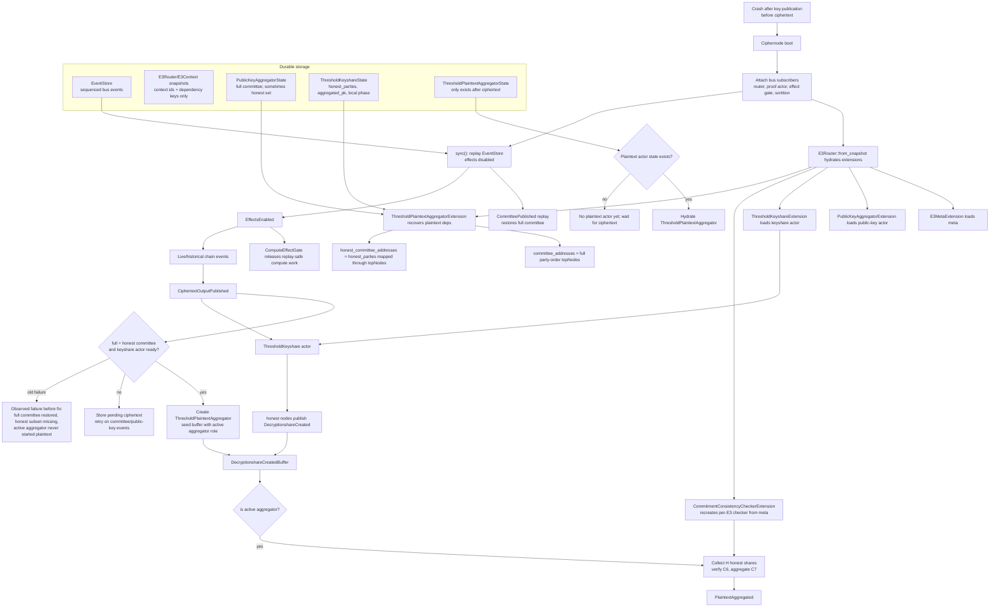

# Part 6: Deactivation, Deregistration & Completion

## Overview

An operator can voluntarily leave the network by deactivating (withdrawing collateral) and
deregistering (removing from the Merkle tree). The exit is time-locked, and pending exits remain
slashable until claimed.

---

## Voluntary Deactivation

### Via Ticket Withdrawal

```
User runs: interfold ciphernode deactivate --tickets 50
│
├─ ChainContext::new() → loads config, decrypts wallet
│
└─ BondingRegistryContract.removeTicketBalance(50).send().await
    │
    │  ┌─── ON-CHAIN (BondingRegistry.sol) ─────────────────────┐
    │  │                                                         │
    │  │  removeTicketBalance(50):                               │
    │  │    1. require(amount != 0, registered, sufficient tFOLD)  │
    │  │    2. ticketToken.burnTickets(operator, amount)         │
    │  │       → tFOLD destroyed, underlying becomes claimable      │
    │  │    3. _exits.queueTicketsForExit(                       │
    │  │         operator, exitDelay, amount                      │
    │  │       )                                                  │
    │  │       → Locked in ExitQueue until now + exitDelay        │
    │  │    4. _updateOperatorStatus(operator)                   │
    │  │       → Active iff registered &&                         │
    │  │         licenseBond >= _minLicenseBond() &&              │
    │  │         (ticketBalance / ticketPrice) >= minTicketBalance│
    │  │         active = false, numActiveOperators--             │
    │  │         Emit OperatorActivationChanged(op, false)        │
    │  │    5. Emit TicketBalanceUpdated(op, -amount, newBal,     │
    │  │       "WITHDRAW")                                         │
    │  │  }                                                      │
    │  └─────────────────────────────────────────────────────────┘
```

### Via License Withdrawal

```
User runs: interfold ciphernode deactivate --license 20000
│
└─ BondingRegistryContract.unbondLicense(20000).send().await
    │
    │  ┌─── ON-CHAIN ───────────────────────────────────────────┐
    │  │                                                         │
    │  │  unbondLicense(20000):                                  │
    │  │    1. require(amount != 0, sufficient bonded FOLD)      │
    │  │    2. operators[op].licenseBond -= 20000                │
    │  │    3. _exits.queueLicensesForExit(op, exitDelay, 20000)│
    │  │       → Pending FOLD remains in totalBonded(op) for     │
    │  │         token-level locked-floor accounting             │
    │  │    4. _updateOperatorStatus(operator)                   │
    │  │       → If licenseBond <                                │
    │  │         (licenseRequiredBond * licenseActiveBps / 10000)│
    │  │         (default: 80% of required bond):                │
    │  │         active = false, numActiveOperators--             │
    │  │    5. Emit LicenseBondUpdated(op, -amount, newBond,      │
    │  │       "UNBOND")                                          │
    │  │  }                                                      │
    │  └─────────────────────────────────────────────────────────┘
```

### Combined Deactivation

```
User runs: interfold ciphernode deactivate --tickets 50 --license 20000
│
├─ Calls removeTicketBalance(50) first
└─ Then calls unbondLicense(20000)
  → Tickets are queued in ExitQueueLib
  → FOLD is queued in ExitQueueLib pending license exits and remains counted in totalBonded()
```

---

## Full Deregistration

```
User runs: interfold ciphernode deregister
│
├─ ChainContext::new()
│
└─ BondingRegistryContract.deregisterOperator().send().await
    │
    │  ┌─── ON-CHAIN (BondingRegistry.sol) ─────────────────────┐
    │  │                                                         │
    │  │  deregisterOperator() {                                  │
    │  │    1. require(operators[msg.sender].registered)         │
    │  │    2. require(!exitInProgress(msg.sender))              │
    │  │       → Cannot deregister if an exit is already pending │
    │  │                                                         │
    │  │    3. operators[msg.sender].registered = false          │
    │  │    4. operators[msg.sender].exitRequested = true        │
    │  │    5. operators[msg.sender].exitUnlocksAt =             │
    │  │         block.timestamp + exitDelay                      │
    │  │                                                         │
    │  │    6. Burn ALL tickets:                                 │
    │  │       fullTicketBalance = ticketToken.balanceOf(op)     │
    │  │       ticketToken.burnTickets(op, fullTicketBalance)    │
    │  │                                                         │
    │  │    7. Queue ALL collateral for exit:                    │
    │  │       licenseBondAmount = operators[op].licenseBond     │
    │  │       operators[op].licenseBond = 0                     │
    │  │       _exits.queueAssetsForExit(                        │
    │  │         op, exitDelay,                                   │
    │  │         fullTicketBalance,  // tickets                   │
    │  │         0                   // license handled below     │
    │  │       )                                                  │
    │  │       _queueLicenseExitFromSources(op, licenseBondAmount)│
    │  │                                                         │
    │  │    8. Remove from Merkle tree:                          │
    │  │       registry.removeCiphernode(msg.sender)             │
    │  │       │                                                  │
    │  │       │  ┌─ CiphernodeRegistryOwnable ──────────────┐  │
    │  │       │  │  removeCiphernode(node):                  │  │
    │  │       │  │    index = ciphernodeTreeIndex[node]      │  │
    │  │       │  │    ciphernodes._update(0, index)          │  │
    │  │       │  │    → Leaf zeroed in Lazy IMT              │  │
    │  │       │  │    numCiphernodes--                       │  │
    │  │       │  │    Emit CiphernodeRemoved(node)           │  │
    │  │       │  └──────────────────────────────────────────┘  │
    │  │                                                         │
    │  │    9. _updateOperatorStatus(msg.sender)                 │
    │  │       → active = false (registered is now false)        │
    │  │       → numActiveOperators--                            │
    │  │       → Emit OperatorActivationChanged(op, false)       │
    │  │                                                         │
    │  │   10. Emit CiphernodeDeregistrationRequested(op)        │
    │  │  }                                                      │
    │  └─────────────────────────────────────────────────────────┘
│
└─ After exitDelay seconds, operator can claim unlocked exits:
    interfold ciphernode license claim
    # optional caps:
    interfold ciphernode license claim --max-ticket X --max-license Y
```

## E3 Completion (Happy Path)

When an E3 completes successfully:

```
publishPlaintextOutput() succeeds
│
├─ ON-CHAIN:
│   ├─ stage = Complete
│   ├─ _distributeRewards(e3Id)
│   │   ├─ (activeNodes, _) = ciphernodeRegistry.getActiveCommitteeNodes(e3Id)
│   │   ├─ protocolAmount = payment * snapshotted protocolShareBps / 10_000
│   │   ├─ cnAmount = payment - protocolAmount
│   │   ├─ perNode = cnAmount / activeNodes.length
│   │   ├─ dust → last member
│   │   ├─ if activeNodes.length == 0: refund payment to requester
│   │   ├─ if payment == 0: only slashed-funds distribution runs
│   │   ├─ if protocolAmount > 0:
│   │   │   _pendingTreasury[snapshottedTreasury][token] += protocolAmount
│   │   ├─ _creditRewards(e3Id, nodes, amounts, token)
│   │   │   → Credits pull-payment rewards to each registered operator
│   │   ├─ e3RefundManager.distributeSlashedFundsOnSuccess(e3Id, paymentToken)
│   │   │   → If any escrowed slashed funds exist for this E3:
│   │   │     read the currently active committee from the request-time registry
│   │   │     split by successSlashedNodeBps (default 50%)
│   │   │     nodes portion distributed evenly to activeNodes
│   │   │     remainder sent to protocol treasury
│   │   │   → If no escrowed funds: no-op
│   │   └─ Emit RewardsDistributed(e3Id)
│   └─ Emit PlaintextOutputPublished(e3Id, plaintext, proof), E3StageChanged(Complete)
│
└─ RUST-SIDE (cleanup via E3RequestComplete):
    │
    ├─ E3Router detects PlaintextAggregated (or E3StageChanged(Complete)):
    │   └─ Publishes E3RequestComplete { e3_id }
    │       → Single cleanup signal for all per-E3 actors
    │
    ├─ Sortition: decrements activeJobs for each committee member
    │   → Node becomes available for future E3s
    │   → Removes e3_id from node_state.e3_committees map
    │   → Removes the durable finalized-committee and pending-expulsion records
    │
    ├─ CiphernodeSelector: removes e3_id from e3_cache, committee, expelled set,
    │  and persisted aggregator designation for the E3
    │
    ├─ Per-E3 actors receive Die / shutdown on completion:
    │   ├─ ThresholdKeyshare: state = Completed, actor stops
    │   ├─ PublicKeyAggregator: actor stops
    │   ├─ ThresholdPlaintextAggregator: actor stops
    │   ├─ KeyshareCreatedFilterBuffer: no new E3 events after context teardown
    │   └─ DecryptionshareCreatedBuffer: no new E3 events after context teardown
    │
    └─ E3Router: removes E3Context for this e3_id
        → All per-E3 state fully cleaned up
```

---

## Rust-Side: Node Shutdown

The libp2p event loop is a required supervised task. Startup races protocol readiness against its
exit, and the running CLI races the shutdown signal against the same one-shot exit status; an
unexpected interface exit records a live network error, drains the node, and returns non-zero.
Normal shutdown first sends `NetCommand::Shutdown` and awaits the interface loop before actor,
event-log, snapshot, and backing-store barriers, preventing new network ingress during the drain.

```
interfold start → running node
│
├─ Ctrl+C / SIGINT / SIGTERM
│
└─ graceful_shutdown():
    ├─ Persists Shutdown and waits for every subscribed shutdown handler to complete
    ├─ Flushes the sequencer and event-store pipeline
    │  → Event-log flush includes `sync_all` for every segment/index and the log directory
    ├─ Drains open snapshot batches, flushes the backing store, and closes it
    ├─ Enforces a 30-second deadline and exits unsuccessfully on failure
    └─ Flushes the optional operational JSON log collector

On restart:
├─ Sled reads preserve the distinction between a missing key and a database/read failure
│  → read errors abort hydration; `load_or_default` never overwrites recovery state after an error
├─ Event-log open:
│   → validates physical frames against the commitlog index
│   → truncates only a CRC/length-invalid suffix after the final indexed record
│   → restores complete CRC-valid, decodable frames whose tail index write was lost
│   → rejects indexed corruption, decode failure, gaps, and offset mismatches
├─ Sync module replays:
│   1. Load snapshot metadata and hydrate persisted per-E3 state
│      → Extensions must preserve hydrated recipients; replayed committee events
│        must not replace a restored per-E3 actor with a fresh instance
│      → ShareVerificationActor loads canonical party slots from the durable
│        finalized-committees repository before replay. A snapshotted
│        CommitteeFinalized event is not guaranteed to appear in the replay window.
│      → ProofVerificationActor loads the same slots, plus BFV preset/threshold
│        metadata from durable CiphernodeSelector state. Snapshotted
│        CiphernodeSelected events are likewise not guaranteed to replay.
│      → Terminal lifecycle state prunes stale finalized-committee and
│        pending-expulsion records before actors start.
│   2. CiphernodeSelector emits persisted AggregatorChanged state before replay
│      → ThresholdPlaintextAggregatorExtension records this role in the E3 context
│        so a plaintext buffer created later by CiphertextOutputPublished starts
│        with the correct active-aggregator flag
│   3. Replay EventStore events since last snapshot (effects still disabled)
│      → Read each aggregate in 1,024-event pages, sort bounded temporary runs,
│        and perform a bounded-fan-in global merge by HLC timestamp
│      → Each EventBus fanout receives bounded mailbox admission before the next event;
│        a closed or full listener fails recovery instead of being bypassed
│      → Structured progress is emitted every 10,000 EventBus-handled events
│   4. Fetch historical EVM events from last known block
│      → completion waits on exact membership for its referenced final event;
│        probabilistic Bloom membership cannot open the effects barrier
│   5. Historical libp2p sync retries failed aggregate fetches after reconnects
│      and also on bounded retry intervals even without a new connection event
│      → outbound artifacts await bounded network-channel capacity and enter exact FIFO dedup
│        only after acceptance; restart re-broadcast uses the same backpressure boundary
│   6. Sort & publish merged events by HLC timestamp
│      → A logical event returned by a peer with its source changed from Local to Net is
│        idempotent when timestamp, stable event ID, and payload match the stored record;
│        a different payload at the same timestamp still fails closed as a collision
│      → Event IDs are domain-separated SHA-256 over fixed-width, little-endian bincode payloads;
│        they do not collapse identity through Rust's 64-bit `DefaultHasher`
│      → ComputeEffectGate has already subscribed and buffers ComputeRequest
│        effects, deduplicating semantic retries while replay is in progress
│   7. Enable effects (writers may submit only after this point)
│      → Gate cancels work for terminal E3s and releases only the newest
│        pending request for each in-flight semantic compute operation
│   8. SyncEnded → live operations begin
└─ Node resumes from where it left off
```

The shutdown barrier proves that the persisted `Shutdown` event reached its current subscribers, the
event pipeline flushed, open snapshot batches drained, and the backing store flushed within the
deadline. Detached work that is not owned by those barriers can still be cancelled by process exit;
operators must continue to follow the production shutdown precautions.

The three long-lived libp2p `NetEvent` broadcast consumers (`NetEventTranslator`,
`DocumentPublisher`, and `NetSyncManager`) treat Tokio's `Lagged(n)` receive result as a recoverable
overload signal: they emit a bounded structured warning containing only the static consumer name and
skipped-event count, then continue from the oldest retained event. Only channel closure ends a
receive task. A lag can still drop the reported `n` events, but a single burst no longer permanently
disables gossip translation, document notifications, or historical-sync/readiness handling.
`NetEventBuffer` applies the same continue policy only after `SyncEnded`; lag during its startup
buffering window remains a fail-closed readiness error because those skipped events cannot yet be
reconciled safely.

Correctness-sensitive publishers use the acknowledged publication path. Its success boundary is:
the sequencer has assigned the event, the target EventStore has appended and synchronously flushed
it, and every current EventBus subscriber's bounded mailbox has admitted it. EventBus does not wait
for an ordinary handler's full computation—recursive proof handlers can legitimately take minutes—
but mailbox FIFO preserves event order per subscriber. `Shutdown` is the explicit stronger case and
waits for every shutdown handler to complete. EventBus inserts the event ID into its exact bounded
deduplication set only after admission succeeds, so a failed delivery remains retriable. Remote
libp2p ingress does not mark its own exact deduplication set until the same durable/admission
acknowledgement returns. Live EVM ingress uses that path as well. At `SyncEnded`, the EVM
gateway first releases the EventBus callback to avoid a circular wait, remains in a bounded
`Draining` state, and reports Live only after all buffered batches (including events arriving during
the drain) have crossed the acknowledged path. Fire-and-forget `EventPublisher` methods expose only
bounded mailbox admission and are not a durability acknowledgement.

`ComputeEffectGate` likewise records a semantic compute key only after its target recipient accepts
the request. A full or closed target mailbox therefore leaves the key retriable, both during normal
operation and while draining replay-buffered effects.

EventStore replay uses a disk-backed external merge: per-aggregate pages are sorted into secure
temporary runs, then compacted and merged with bounded file-descriptor fan-in. Replay waits for
bounded EventBus listener admission for each event. A listener that is unavailable or whose mailbox
is full fails recovery instead of being silently skipped. Snapshot routing and handler execution
remain asynchronous, so this does not claim that every downstream actor is synchronously durable at
each replay step.

`interfold node validate` detects a recoverable uncommitted event-log tail without changing it. With
the node stopped, `interfold node validate --repair` applies the same boundary-checked tail recovery
as startup and refuses to remove indexed records. Runtime EventStore query failures are returned to
the correlated caller rather than panicking the actor; committed corruption remains a
startup/integrity failure.

For DAppNode installations, package v0.2.3 is the mandatory bridge from the shipped v0.1.8 state. It
atomically moves the legacy `.enclave` custom-config root to `.interfold`, preserves the encrypted
operator/libp2p identity, and lets the v0.2.3 binary stamp schema version 1 before later binaries
enforce the marker. An ambiguous volume containing both roots fails closed.

### Restart + Persist State Diagram



Post-completion EVM receipts (`RewardsDistributed`, `RewardCredited`, `RewardClaimed`, and related
settlement observations) remain in EventStore for auditing and operator projections. The router does
not deliver them to a completed per-E3 context because they report settlement; they do not resume
protocol execution.

`CiphernodeSelector` also emits every persisted `AggregatorChanged` entry before EventStore replay.
If a prior snapshot failed to persist the selector's completion cleanup, the request router may log
that emission as unexpected for an already-completed E3. The router converts it to an
`InterfoldError`; it does not abort EventBus replay. Treat the warning as evidence of stale snapshot
state rather than suppressing it unconditionally.

For crashes after key publication but before ciphertext publication, the recovered active aggregator
may not have a `ThresholdPlaintextAggregator` actor yet when the persisted `AggregatorChanged` event
is re-emitted. The plaintext extension records that role in the live E3 context, then seeds the
later `DecryptionshareCreatedBuffer` from it. Committee and honest-committee addresses are recovered
from completed public-key aggregation state, in-flight public-key aggregation state, or the
persisted `ThresholdKeyshareState.honest_parties` set during async context hydration. Replayed
`CommitteePublished` can also restore the full committee address dependency, but cannot infer the
H-sized honest subset when `N > H`; that subset must come from `PublicKeyAggregated`,
`PublicKeyAggregatorState::GeneratingC5Proof`, or threshold-keyshare state. The synchronous
`on_event` path must not read actor-backed repositories directly, because blocking the router while
waiting for the store can freeze live gossip and make peers time out. If `CiphertextOutputPublished`
is replayed before those committee dependencies are ready, the extension records the ciphertext in
the E3 context and retries plaintext actor creation when `PublicKeyAggregated` or
`CommitteePublished` supplies the missing facts; the router's existing recipient buffer then drains
any ciphertext/decryption-share events into the newly-created plaintext path.

Plaintext share collection records its absolute Unix-millisecond deadline and the originating
`CiphertextOutputPublished` event context in the persisted `Collecting` state. A hydrated actor
schedules only the remaining duration (or fires immediately when the deadline has passed), so a
restart cannot renew the collection budget. The timeout publishes `E3Failed(DecryptionTimeout)`
through acknowledged EventBus delivery before stopping, and its causal parent does not depend on a
later decryption share having arrived.

`ShareVerificationActor` gates C1/C6 proof verification behind `CommitmentConsistencyCheckRequested`
/ `CommitmentConsistencyCheckComplete`. The per-E3 `CommitmentConsistencyChecker` is therefore
restart-critical even though it has no durable state of its own: after context hydration,
`CommitmentConsistencyCheckerExtension` recreates it from the recovered `E3Meta` so restarted active
aggregators can complete C6 verification. Without this recipient, the restarted node can collect
honest decryption shares and then wait forever for a consistency-check response that no actor is
subscribed to publish.

The global `ShareVerificationActor` also requires the finalized committee's ordered party-slot map
for signer ownership checks. It is seeded from `Repositories::finalized_committees` during builder
startup, before EventStore replay. Relying only on a `CommitteeFinalized` subscription is incorrect:
once that event is included in a snapshot, replay starts after it and a restarted aggregator would
reject every honest C6 signer as having no canonical slot.

The global `ProofVerificationActor` has the same party-slot requirement for C0 and additionally
needs the request's BFV preset and threshold-derived committee size to choose circuit artifacts and
recompute the advertised public-key commitment. Builder startup seeds those caches from the durable
finalized-committee repository and `CiphernodeSelectorState.e3_cache` before replay. Live
`CommitteeFinalized` / `CiphernodeSelected` events remain authoritative refreshes, while
`E3RequestComplete` removes both caches.

---

## Rust-Side: E3 Lifecycle Coordinator (durable stage tracking)

The node is choreographed — each subsystem reacts to bus events independently — so there is no
single component that _drives_ the protocol. The `E3LifecycleCoordinator` (in `e3-request`) is an
**additive persisted-stage observer** that gives the live node one projection of "what stage is each
E3 at?". It never emits protocol events and never drives subsystems; it records stage and supports
restart-resume and shutdown awareness subject to the asynchronous persistence caveats above.

```
E3LifecycleCoordinator::attach(bus, store)   (wired in ciphernode_builder.build())
│
├─ Loads persisted stage map from Repository(StoreKeys::e3_lifecycle())
│   → on restart, every successfully persisted in-flight stage is rehydrated
│
├─ Subscribes to lifecycle-bearing events:
│     E3Requested              → Requested
│     CommitteePublished       → CommitteeFinalized
│     CommitteeFinalized       → CommitteeFinalized
│     PublicKeyAggregated      → KeyPublished
│     CiphertextOutputPublished→ CiphertextReady
│     PlaintextAggregated      → Complete
│     PlaintextOutputPublished → Complete
│     E3RequestComplete        → Complete
│     E3Failed                 → Failed (terminal)
│     E3StageChanged           → new_stage (authoritative)
│
├─ Pure E3LifecycleService.observe(event) → LifecycleDecision:
│     • Advance is MONOTONIC (forward-only by stage rank)
│     • Out-of-order earlier-stage events are logged (Regressed) and ignored
│     • Once Complete/Failed, the stage is frozen (Terminal)
│   On Advanced/Terminal, updates memory and enqueues a snapshot write
│
└─ On Shutdown event:
      logs the set of still-active (non-terminal) E3s and their stages,
      enqueues a final snapshot write, then stops without awaiting durability.
```

The coordinator is safe by construction during EventStore replay: observing a replayed lifecycle
event simply re-derives the same monotonic stage, so the restored map is identical whether built
live or from replay.

The node-operator dashboard uses the same replay property. It pages every configured EventStore
aggregate and incrementally derives E3 stages, committees, tickets, failures, and rewards. The
projection is disposable and is rebuilt on restart; EventStore remains the only durable protocol
history.

---

## Exit Queue Timing

```
Time ──────────────────────────────────────────────────────►

│ deregister()     │                    │ claimExits()     │
│ or deactivate()  │   EXIT DELAY       │                  │
│                  │  (configured)       │                  │
│ Assets queued    │                    │ Assets claimable │
│ tFOLD burned       │  Cannot cancel     │ USDC returned    │
│ FOLD locked      │  Can be slashed!   │ FOLD returned to │
│                  │                    │ withdrawal addr  │
│                  │                    │                  │

IMPORTANT: Even during the exit delay, slashing can still
reach into the exit queue and take locked assets. There is
no safe harbor for misbehaving operators.
```

### Exit Queue Internals (audit hardening)

- **Per-asset head indices.** `ExitQueueState` tracks `queueHeadIndexTicket` and
  `queueHeadIndexLicense` separately so claiming/slashing one asset class cannot strand the other.
  Previously a single shared head meant `claimAssets({TICKET})` could advance past tranches whose
  license leg was still locked and silently forfeit them (audit C-03).
- **`continue`, not `break`, on locked tranches.** Both `previewClaimableAmounts` and
  `_takeAssetsFromQueue` skip locked tranches instead of stopping, so a later-but-sooner-unlocking
  tranche (created after governance lowered `exitDelay`) is still reachable (audit M-08).
- **Tranche cap.** `queueAssetsForExit` reverts with `TooManyTranches` if more than
  `MAX_ACTIVE_TRANCHES (= 64)` live (post-head) tranches would exist for the operator. This bounds
  the unbounded loop in `previewClaimableAmounts` / `_takeAssetsFromQueue` so an attacker cannot
  grief the operator with an ever-growing queue (audit H-21a).
- **License transfer shortfall.** `claimExits` and `withdrawSlashedFunds` measure the recipient's
  balance delta around `licenseToken.safeTransfer` and emit
  `LicenseTransferShortfall(recipient, expectedAmount, actualAmount)` if the recipient received less
  than expected (e.g. a fee-on-transfer license token). The transfer itself is not reverted —
  booking is already updated — but indexers can detect the discrepancy (audit M-13).

---

## Ban & Unban

```
SLASHING → operator banned:
  banned[operator] = true
    → Cannot call registerOperator() (reverts with CiphernodeBanned)
  → Permanent until governance intervenes

GOVERNANCE lifts ban:
    SlashingManager.updateBanStatus(operator, false, keccak256("reason"))
  → banned[operator] = false
  → Operator can re-register
```

---

## Cluster 6 Audit Addendum (deregistration & bans)

- **Collateral exit is blocked while a slash is open** (H-05, AUD H-03). `BondingRegistry` checks
  `hasOpenSlashProposal(operator)` on every authorized current or retained historical manager and
  reverts `OperatorUnderSlash()` from ticket withdrawal, license unbonding, deregistration, and exit
  claims. Execution, an upheld appeal, or permissionless appeal expiry unwinds the counter. After
  manager rotation, governance must retain the old manager until every E3 and proposal that depends
  on it is terminal, then explicitly revoke it.

- **Two-step ban** (M-14, M-15): bans now require `proposeBan` → `confirmBan` from a **distinct**
  signer holding `GOVERNANCE_ROLE`. `cancelBan` rescinds an unconfirmed proposal. Legacy direct-set
  via `updateBanStatus(_, true, _)` reverts `BanRequiresConfirmation()`. Unban is single-step
  (`unbanNode`).

- **DEFAULT_ADMIN handover** (M-17): operator-onboarding ops that depend on `DEFAULT_ADMIN_ROLE`
  rotation must use the `AccessControlDefaultAdminRules` two-step flow (`beginDefaultAdminTransfer`
  → wait `defaultAdminDelay() = 2 days` → `acceptDefaultAdminTransfer`).
