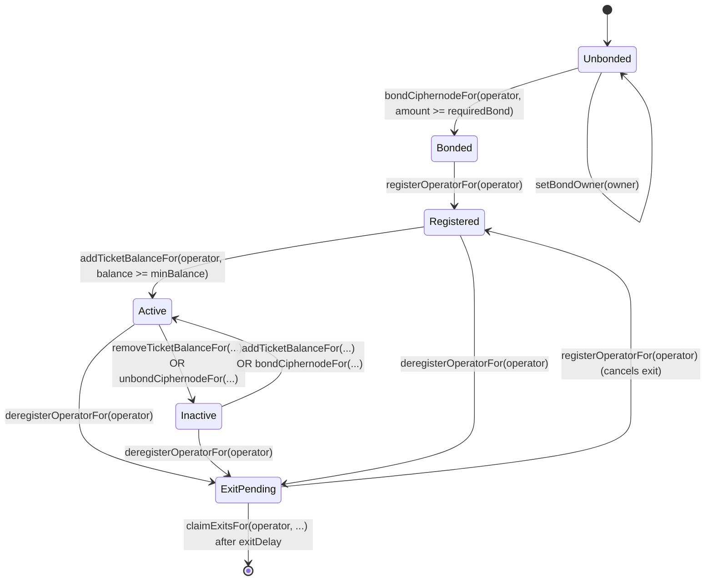
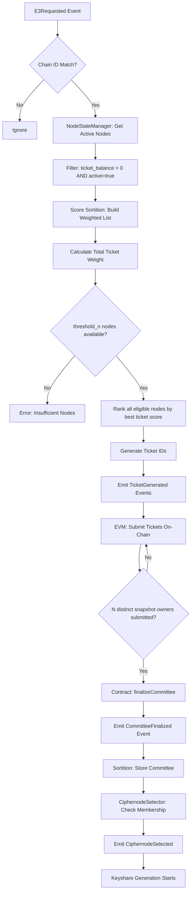
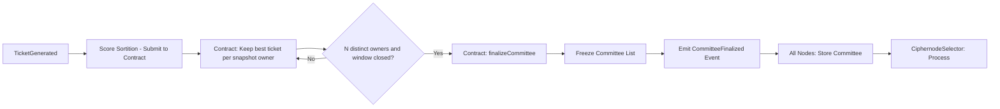

# Sortition and E3 Complete Flow

This document describes the complete flow of the Interfold system, from operator registration
through E3 computation request, sortition, committee selection, keyshare generation, public key
aggregation, encryption, and decryption.

## Overview

The Interfold system uses a score-based sortition mechanism to select a committee of ciphernodes to
perform threshold homomorphic encryption operations. The flow involves:

1. **Operator Setup** - Bonding ciphernode bond tokens and ticket balance
2. **Registration** - Registering as a ciphernode operator
3. **E3 Request** - A computation request triggers sortition
4. **Score Sortition** - Nodes are selected based on ticket balances
5. **Committee Finalization** - Selected nodes form a committee
6. **DKG Roster Selection** - Committee nodes prove contributions and select an H-dealer roster
7. **Public Key Aggregation** - The accepted roster's keyshares are aggregated into a public key
8. **Encryption & Decryption** - Data is encrypted and threshold-decrypted

## Complete System Flow

```mermaid
sequenceDiagram
    participant Operator
    participant BondingRegistry
    participant CiphernodeRegistry
    participant RandomnessProvider
    participant RandomnessReader
    participant Interfold
    participant EventBus
    participant E3Router
    participant NodeStateManager
    participant Sortition
    participant CiphernodeSelector
    participant Keyshare
    participant PublicKeyAggregator
    participant PlaintextAggregator

    Note over Operator,BondingRegistry: Phase 1: Operator Setup & Registration

    Operator->>BondingRegistry: setBondOwner(owner)
    Operator->>BondingRegistry: bondCiphernodeFor(operator, amount)
    BondingRegistry->>BondingRegistry: Transfer FOLD tokens
    BondingRegistry->>EventBus: CiphernodeBondUpdated

    Operator->>BondingRegistry: registerOperatorFor(operator)
    BondingRegistry->>BondingRegistry: Check ciphernodeBond >= requiredCiphernodeBond
    BondingRegistry->>CiphernodeRegistry: addCiphernode(operator)
    CiphernodeRegistry->>EventBus: CiphernodeAdded(operator, index, numNodes, chainId)
    EventBus->>NodeStateManager: CiphernodeAdded
    NodeStateManager->>NodeStateManager: Register operator in nodes HashMap

    Operator->>BondingRegistry: addTicketBalanceFor(operator, amount)
    BondingRegistry->>BondingRegistry: Mint ticket tokens
    BondingRegistry->>EventBus: TicketBalanceUpdated(operator, delta, newBalance, chainId)
    EventBus->>NodeStateManager: TicketBalanceUpdated
    NodeStateManager->>NodeStateManager: Update operator ticket balance

    BondingRegistry->>BondingRegistry: Check if balance >= minTicketBalance
    BondingRegistry->>EventBus: OperatorActivationChanged(operator, active=true, chainId)
    EventBus->>NodeStateManager: OperatorActivationChanged
    NodeStateManager->>NodeStateManager: Set operator active status

    Note over Operator,PlaintextAggregator: Phase 2: E3 Request & Sortition

    Operator->>EventBus: E3Requested(e3Id, thresholdM, thresholdN, computationSeed, params, chainId)
    CiphernodeRegistry->>RandomnessProvider: requestRandomness(e3Id)
    RandomnessProvider-->>CiphernodeRegistry: requestId
    RandomnessProvider->>RandomnessReader: RandomnessFulfilled(requestId, e3Id)
    RandomnessReader->>CiphernodeRegistry: sortitionSeed(e3Id), getSortitionRequest(e3Id)
    CiphernodeRegistry-->>RandomnessReader: Accepted seed and request context
    RandomnessReader->>EventBus: CommitteeRequested(e3Id, seed, requestBlock, deadline, chainId)
    EventBus->>Sortition: E3Requested
    EventBus->>Sortition: Durable CommitteeRequested
    Sortition->>Sortition: Wait until both request events are available
    Sortition->>NodeStateManager: GetNodeState(chainId)
    NodeStateManager-->>Sortition: NodeStateStore { nodes, ticketPrice }
    Sortition->>Sortition: Build sortition list from active nodes
    Sortition->>Sortition: Run score sortition algorithm
    Sortition->>Sortition: Reserve capacity for this E3
    Sortition->>Sortition: Generate tickets for selected nodes

    loop For each selected node
        Sortition->>EventBus: TicketGenerated(e3Id, node, ticketId, chainId)
    end

    Note over CiphernodeRegistry,EventBus: Phase 3: On-Chain Ticket Submission

    EventBus->>CiphernodeRegistry: TicketGenerated (if ticketId != 0)
    CiphernodeRegistry->>CiphernodeRegistry: Submit ticket to contract
    CiphernodeRegistry->>CiphernodeRegistry: Wait for threshold tickets
    CiphernodeRegistry->>CiphernodeRegistry: Call finalizeCommittee()
    CiphernodeRegistry->>EventBus: CommitteeFinalized(e3Id, committee[], chainId)

    Note over EventBus,Sortition: Phase 4: Committee Storage

    EventBus->>Sortition: CommitteeFinalized
    Sortition->>Sortition: Reconcile the reservation with the final committee
    Sortition->>Sortition: Store committee in finalized_committees HashMap
    Sortition->>Sortition: Persist to disk

    Note over EventBus,CiphernodeSelector: Phase 5: Node Selection

    EventBus->>CiphernodeSelector: CommitteeFinalized
    CiphernodeSelector->>CiphernodeSelector: Sort committee by ascending address
    CiphernodeSelector->>CiphernodeSelector: Check if node address in committee
    alt Node is in committee
        CiphernodeSelector->>EventBus: CiphernodeSelected(e3Id, node, chainId)
    end
    CiphernodeSelector->>EventBus: AggregatorChanged(e3Id, isAggregator)

    Note over EventBus,Keyshare: Phase 6: Keyshare Generation

    EventBus->>Keyshare: CiphernodeSelected
    Keyshare->>Keyshare: Generate and prove C0-C3 DKG material
    Keyshare->>EventBus: Signed DKG readiness report
    EventBus->>CiphernodeSelector: AggregationInputsReady(DkgRoster)
    CiphernodeSelector->>CiphernodeSelector: Start readiness-gated failover budget
    CiphernodeSelector->>Keyshare: Active aggregator party ID
    Keyshare->>EventBus: Active aggregator proposes canonical H-dealer roster
    Keyshare->>Keyshare: Selected roster members compute and prove C4
    Keyshare->>EventBus: KeyshareCreated(e3Id, node, pubkey, chainId)

    Note over EventBus,PublicKeyAggregator: Phase 7: Public Key Aggregation

    EventBus->>PublicKeyAggregator: KeyshareCreated (buffer on every committee node)
    EventBus->>PublicKeyAggregator: AggregatorChanged
    PublicKeyAggregator->>Sortition: GetNodesForE3(e3Id, chainId)
    Sortition-->>PublicKeyAggregator: committee[]
    PublicKeyAggregator->>PublicKeyAggregator: Verify node in committee
    PublicKeyAggregator->>PublicKeyAggregator: Active aggregator verifies and orders keyshares by partyId

    alt All H accepted-roster keyshares are durable
        PublicKeyAggregator->>PublicKeyAggregator: fhe.get_aggregate_public_key(keyshares)
        PublicKeyAggregator->>PublicKeyAggregator: Aggregate public key shares
        PublicKeyAggregator->>EventBus: PublicKeyAggregated (durable publication intent)
        EventBus->>CiphernodeRegistry: PublicKeyAggregated
        CiphernodeRegistry->>CiphernodeRegistry: publishCommittee(e3Id, commitment, proof)
    end

    Note over Operator,PlaintextAggregator: Phase 8: Encryption & Computation

    Operator->>Operator: Encrypt input data with aggregated pubkey
    Operator->>EventBus: CiphertextOutputPublished(e3Id, ciphertext, chainId)

    Note over EventBus,PlaintextAggregator: Phase 9: Threshold Decryption

    EventBus->>Keyshare: CiphertextOutputPublished
    Keyshare->>Keyshare: Load secret key from storage
    Keyshare->>Keyshare: fhe.decrypt_ciphertext(secret, ciphertext)
    Keyshare->>Keyshare: Generate decryption share
    Keyshare->>EventBus: DecryptionshareCreated(e3Id, node, decryptionShare, chainId)

    EventBus->>PlaintextAggregator: DecryptionshareCreated (buffer on every committee node)
    EventBus->>PlaintextAggregator: AggregatorChanged
    PlaintextAggregator->>Sortition: GetNodesForE3(e3Id, chainId)
    Sortition-->>PlaintextAggregator: committee[]
    PlaintextAggregator->>PlaintextAggregator: Verify node in committee
    PlaintextAggregator->>PlaintextAggregator: Active aggregator orders shares by partyId

    alt Honest threshold reached on active aggregator
        PlaintextAggregator->>PlaintextAggregator: fhe.get_aggregate_plaintext(shares, ciphertext)
        PlaintextAggregator->>PlaintextAggregator: Aggregate decryption shares
        PlaintextAggregator->>PlaintextAggregator: Decode plaintext
        PlaintextAggregator->>EventBus: PlaintextAggregated (local publication intent)
        EventBus->>Interfold: publishPlaintextOutput(e3Id, plaintext, proof)
        Interfold->>EventBus: PlaintextOutputPublished
        Interfold->>EventBus: E3StageChanged(Complete)
        EventBus->>E3Router: E3StageChanged(Complete)
        E3Router->>EventBus: E3RequestComplete
        EventBus->>PlaintextAggregator: E3RequestComplete
    end
```

## State Diagram: Node Lifecycle

## Sortition Data Flow

## Committee Finalization Flow

## Key Concepts

### 1. Score Sortition

- **Purpose**: Select committee based on ticket balance (stake-weighted)
- **Algorithm**:
  - Build list of eligible nodes (active + ticket_balance > 0)
  - Calculate weight for each node based on ticket balance
  - Rank all eligible nodes by their best ticket score
  - Shortlist N-plus-buffer distinct snapshot owners and retain their operators as backups
  - Submit the local node's best ticket if its owner is shortlisted and it has capacity
  - Permit all eligible submissions when chain-time owner history is incomplete
- **On-Chain Integration**: Tickets submitted to contract for verification
- **Committee Finalization**: After the window closes, the contract selects N distinct request-time
  bond owners. Each owner has at most one candidate. Existing requests from before the cap upgrade
  retain uncapped selection. Multiple owner wallets can still share a controller.

### 3. NodeStateManager

- **Purpose**: Track state of all registered ciphernodes
- **State Per Node**:
  - `ticket_balance`: Current ticket balance
  - `active`: Whether node is active (has min ticket balance)
  - `active_jobs`: Local reserved or active workload count
- **Persistence**: State survives node restarts
- **Events**:
  - `CiphernodeAdded` / `CiphernodeRemoved`
  - `TicketBalanceUpdated`
  - `OperatorActivationChanged`
  - `ConfigurationUpdated` (for ticketPrice)

The active-job adjustment applies only when the current node decides whether to submit. The node
persists a provisional reservation before ticket dispatch. `CommitteeFinalized` confirms the
reservation or releases it when the node is not in the final committee. Terminal events release all
remaining reservations. Remote operators keep their full on-chain-valid ticket ranges. This local
policy does not reserve collateral or reduce the range that Solidity accepts.

### 4. Sortition Actor

- **Purpose**: Manage sortition algorithm and committee state
- **Persistent State**:
  - `list`: Current sortition list (backend-specific)
  - `finalized_committees`: HashMap of E3id → committee members
- **Messages**:
  - `GetNodesForE3`: Query committee members for an E3
  - `GetCommittee`: Query full sortition list
  - `GetNodeState`: Get current node state
- **Event Handlers**:
  - `E3Requested`: Trigger sortition
  - `CommitteeFinalized`: Reconcile capacity and store the committee
  - `TicketBalanceUpdated`, `OperatorActivationChanged`, etc.

### 5. Committee Query Pattern

- Query the `Sortition` actor through `GetNodesForE3`.
- The stored committee comes from the canonical on-chain finalization event.
- `PublicKeyAggregator` and `PlaintextAggregator` use it to validate senders and party IDs.

### 6. Event Deduplication

- **Purpose**: Prevent processing same event multiple times
- **Mechanism**: EventBus with deduplication enabled
- **Hash-based**: Events with same content have same EventId
- **Important**: Allows safe event replay on restart

### 7. Historical Event Synchronization

- **Purpose**: Nodes can restart and catch up
- **Mechanism**: Fetch historical events from contracts on startup
- **Events**:
  - `CiphernodeAdded` / `CiphernodeRemoved`
  - `TicketBalanceUpdated`
  - `OperatorActivationChanged`
  - `ConfigurationUpdated`
  - `RandomnessFulfilled`
  - `CommitteeFinalized`
- **Deduplication**: EventBus ignores already-seen events

### 8. Threshold Cryptography

- **Scheme**: BFV Threshold Homomorphic Encryption
- **Parameters**:
  - `threshold_m`: Polynomial threshold `T`; decryption needs `T + 1` shares
  - `threshold_n`: Total committee size
- **DKG roster**: The committee enum fixes `H`; the active aggregator proposes one mutually ready
  H-dealer roster before C4
- **Common Random Polynomial (CRP)**: Shared randomness from E3 seed
- **Keyshare Generation**:
  - Secret key: Random polynomial
  - Public key share: Secret key + CRP
- **Aggregation**: Combine the H selected public-key contributions; combine `T + 1` through H valid
  decryption shares for plaintext

### 9. Party IDs

- **Purpose**: Identify position in threshold scheme
- **Assignment**: Index in the committee after ascending-address normalization
- **Range**: `0..threshold_n` (inclusive of `0`, exclusive of `threshold_n`)
- **Critical**: Order must be consistent across all nodes
- **Used In**: Keyshare creation, decryption share verification

### 10. Canonical Aggregation Order

- Keyshares and decryption shares are deduplicated by party.
- DKG readiness reports select one accepted H-dealer roster in ascending `party_id` order.
- Public-key proof inputs follow that saved roster, not network arrival order.
- Decryption proof inputs use canonical ascending `party_id` order.
- This keeps every promoted aggregator aligned with the finalized committee and proof inputs.

## Event Reference

### Bonding Registry Events

| Event                       | Parameters                                   | Purpose                             |
| --------------------------- | -------------------------------------------- | ----------------------------------- |
| `CiphernodeBondUpdated`     | operator, delta, newBond, reason, chainId    | Track ciphernode bond token bonding |
| `TicketBalanceUpdated`      | operator, delta, newBalance, reason, chainId | Track ticket balance changes        |
| `OperatorActivationChanged` | operator, active, chainId                    | Node activation status              |
| `ConfigurationUpdated`      | parameter, oldValue, newValue                | System parameter changes            |

### Sortition Input Events

| Event                          | Parameters                                                                   | Purpose                            |
| ------------------------------ | ---------------------------------------------------------------------------- | ---------------------------------- |
| `CiphernodeAdded`              | address, index, numNodes, chainId                                            | Node registration                  |
| `CiphernodeRemoved`            | address, index, numNodes, chainId                                            | Node removal                       |
| `CommitteeRandomnessRequested` | e3Id, requestId, provider, randomnessDeadline                                | Frozen on-chain randomness request |
| `RandomnessFulfilled`          | requestId, e3Id, randomWord, fulfilledAt                                     | Verified provider response         |
| `CommitteeRequested`           | e3Id, seed, threshold, requestBlock, committeeDeadline, ticketPrice, chainId | Durable runtime sortition context  |

### Interfold Events

| Event                       | Parameters                                                     | Purpose                             |
| --------------------------- | -------------------------------------------------------------- | ----------------------------------- |
| `E3Requested`               | e3Id, thresholdM, thresholdN, computationSeed, params, chainId | Computation request                 |
| `TicketGenerated`           | e3Id, node, ticketId, chainId                                  | Sortition ticket                    |
| `CommitteeFinalized`        | e3Id, committee[], chainId                                     | Committee selected                  |
| `CiphernodeSelected`        | e3Id, node, chainId                                            | Node is in committee                |
| `KeyshareCreated`           | e3Id, node, pubkey, chainId                                    | Keyshare generated                  |
| `PublicKeyAggregated`       | e3Id, pubkey, committee, proof                                 | Local public-key publication intent |
| `CiphertextOutputPublished` | e3Id, ciphertext, chainId                                      | Encrypted computation               |
| `DecryptionshareCreated`    | e3Id, node, partyId, decryptionShare, chainId                  | Decryption share                    |
| `PlaintextAggregated`       | e3Id, outputs, proofs                                          | Local plaintext publication intent  |
| `PlaintextOutputPublished`  | e3Id, plaintextOutput, proof                                   | Canonical on-chain result           |
| `E3RequestComplete`         | e3Id                                                           | Request teardown after chain result |

## Testing Flow

The integration tests follow this pattern:

1. **Setup**: Create ciphernodes with shared event bus
2. **Register**: Use `setup_score_sortition_environment` to:
   - Set ticket price via `ConfigurationUpdated`
   - Add nodes via `CiphernodeAdded`
   - Give nodes tickets via `TicketBalanceUpdated`
   - Activate nodes via `OperatorActivationChanged`
3. **Request**: Send `E3Requested` event
4. **Finalize**: Send `CommitteeFinalized` event (manual in tests)
5. **Aggregate**: Wait for `PublicKeyAggregated` event
6. **Verify**: Check aggregated pubkey matches expected value

## Persistence

### What Gets Persisted?

- **NodeStateManager**: `nodes` HashMap (ticket balances, activation status)
- **Sortition**: `list` (backend-specific), `finalized_committees` HashMap
- **Keyshare**: Secret keys per E3

### Where?

- Default: In-memory (for tests)
- Production: Sled-backed repositories and append-only commit logs
- Path: Configured via `RepositoriesFactory`

### Restart Behavior

1. Actor starts
2. Loads persisted state from repository
3. Subscribes to events
4. Processes new events
5. Event deduplication prevents re-processing old events

## Chain ID Handling

- **Purpose**: Support multiple chains simultaneously
- **Isolation**: Each chain has independent:
  - Node state
  - Committees
  - E3 processes
- **Validation**: All operations validate chain ID matches
- **Critical**: Prevents cross-chain confusion
