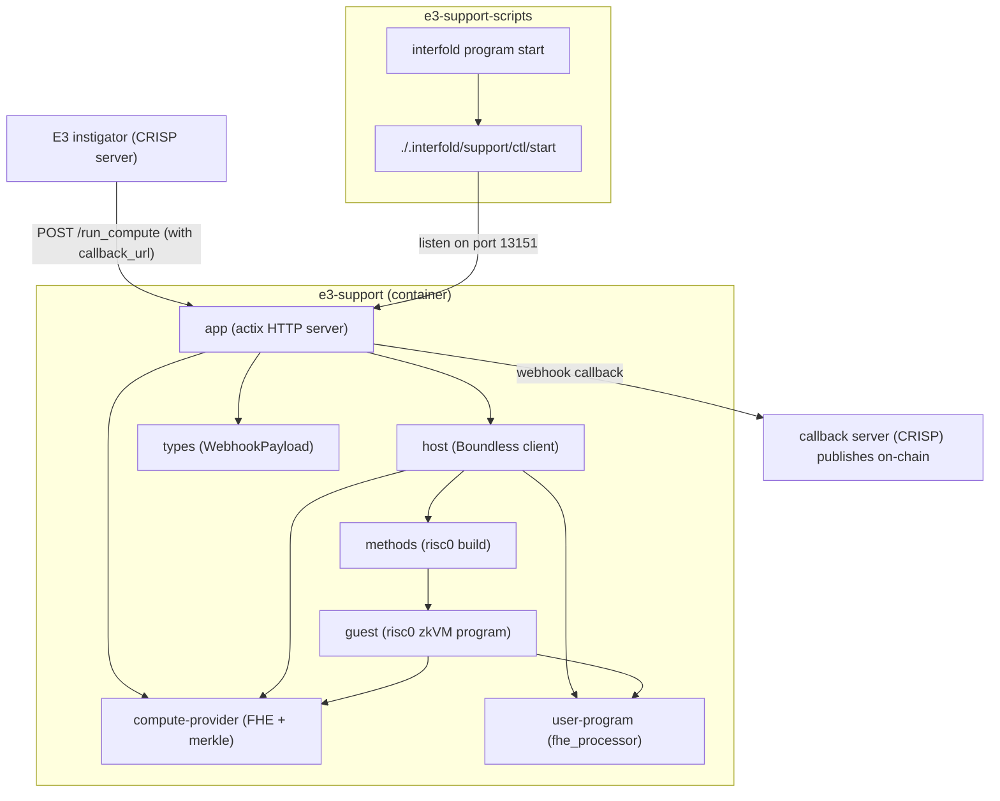

# E3 Support — RISC Zero + Boundless Compute Provider

Docker-based compute provider that runs FHE homomorphic computations and proves them via
[Boundless](https://boundless.network) (a decentralized ZK proving market). The container exposes an
HTTP API on port 13151 that receives encrypted ciphertexts, runs the FHE computation, submits a
proof request to Boundless, and sends the result back via webhook callback.



## Architecture

- **`app/`** — Actix HTTP server (`e3-support-app` binary). Exposes `/run_compute` (POST) and
  `/health` (GET/HEAD).
- **`host/`** — Boundless SDK integration. Builds the client, submits proof requests, waits for
  fulfillment.
- **`types/`** — Shared request, webhook, proof-domain, guest-input, and journal types.
- **`methods/`** — RISC Zero build crate. Compiles the guest program.
- **`methods/guest/`** — The RISC Zero zkVM guest program. Runs `fhe_processor` (homomorphic
  ciphertext summation) and commits the domain-bound `ComputeJournal`.
- **`program/`** — The FHE processor (`fhe_processor`): sums BFV ciphertexts homomorphically.

## Webhook Payload Format

The callback server receives a tagged-enum JSON payload:

**Success:**

```json
{
  "status": "completed",
  "e3_id": "123",
  "ciphertext": "0x...",
  "ciphertext_commitment": "0x...",
  "proof": "0x..."
}
```

**Failure:**

```json
{ "status": "failed", "e3_id": "123", "error": "Computation failed: ..." }
```

This matches the format expected by CRISP and `E3ProgramServer` in `crates/program-server`.

---

## Full E3 Flow — Step by Step

### Prerequisites

1. **RISC Zero toolchain** — `rzup install`
2. **Docker** — for the support container
3. **Pinata account** — for IPFS program uploads (get a JWT at https://pinata.cloud)
4. **Boundless wallet** — an Ethereum private key with ETH (for gas) and ZKC (for collateral) on the
   Boundless-supported chain
5. **Interfold CLI** — `cargo install --locked --path ./crates/cli --bin interfold -f`
6. **An Interfold project** — `interfold init <path>`, then work from that directory. The steps
   below run against a project, not against a checkout of this repository. Without one,
   `interfold program compile` exits with `Configuration file not found`, because `interfold init`
   is what writes `.interfold/support/ctl`, the scripts every `program` subcommand shells out to.

### Step 1: Configure `interfold.config.yaml`

```yaml
program:
  dev: false
  risc0:
    risc0_dev_mode: 0 # 0 = production (Boundless), 1 = dev (fake proofs)
    boundless:
      rpc_url: 'https://sepolia.base.org' # or your RPC URL
      private_key: '${PRIVATE_KEY}' # use env var for secrets!
      pinata_jwt: '${PINATA_JWT}'
      program_url: 'https://gateway.pinata.cloud/ipfs/Qm...' # after upload (Step 3)
      onchain: true
      # Built-in auction defaults, shown for reference. Leave these fields unset.
      # If you set one, `interfold program start` fails. See #1812.
      # min_price_eth: 0.00005
      # max_price_eth: 0.002
      # timeout_secs: 600
      # lock_timeout_secs: 300
      # ramp_up_secs: 60
      # lock_collateral_zkc: 2.0
```

### Step 2: Compile the RISC Zero Guest Program

```bash
interfold program compile
```

This builds the guest ELF binary inside the Docker container. Output goes to
`./target/riscv-guest/methods/guests/riscv32im-risc0-zkvm-elf/release/program.bin`.

The guest runs the `fhe_processor` and `policy` from `crates/support/program`, which
`methods/guest/Cargo.toml` names as `e3-user-program`. Another E3 program needs a guest built
against its own crate of that name: the policy decides the input-tree leaf, and a leaf that differs
from the one the program's contract built produces a root the round cannot publish.

### Changing the guest, and the pin that decides which code it runs

The guest does **not** compile `crates/compute-provider` from this tree. `crates/support` is a
separate Cargo workspace, excluded from the root one on purpose so a client can build it
independently, and it reads `e3-compute-provider` and `e3-fhe-params` through a git pin to a
published revision (`crates/support/Cargo.toml`, `crates/support/methods/guest/Cargo.toml`).

A change to `crates/compute-provider` therefore has no effect on the guest until that pin moves, and
the pin can only move to a pushed commit. Moving it changes the image ID, and
`Risc0BfvCiphertextVerifier.imageId` is immutable — so a guest change is a redeployment, not a
patch.

The order matters:

1. Merge the change to `crates/compute-provider`, then push.
2. Bump every Interfold pin to the merge commit. There are three, and they must all name the same
   revision — the guest and host workspaces have to compile the same sources:
   - `e3-fhe-params` in `crates/support/Cargo.toml`
   - `e3-compute-provider` in `crates/support/Cargo.toml`
   - `e3-compute-provider` in `crates/support/methods/guest/Cargo.toml`

   Then refresh both lockfiles (`crates/support/Cargo.lock` and
   `crates/support/methods/guest/Cargo.lock`). The Docker guest build passes `--locked`, so a
   lockfile one line behind its manifest stops the reproducible build before it starts.

3. Update the `crates/support` call sites that track the crate's API — the compiler will point at
   them, since they built against the old revision until now.
4. Rebuild the guest against the pinned code with the RISC Zero Docker builder, and commit the
   regenerated `crates/support/contracts/ImageID.sol`.
5. Redeploy `Risc0BfvCiphertextVerifier`, and every E3 program that stores its own image ID.

Skipping step 4 leaves a deployed verifier that accepts a guest no longer matching this tree, and
nothing in the repository detects it: there is no longer an automated check that the committed image
ID is the one the current sources produce, so this order is a convention rather than something CI
enforces. The reviewer-facing procedure is `docs/pages/verifying-the-compute-provider.mdx`.

### Step 3: Upload Program to IPFS (Pinata)

```bash
interfold program upload
```

This uploads the compiled guest ELF to Pinata IPFS and caches the resulting URL at
`./target/.program_url`. Copy this URL into your `interfold.config.yaml` as
`program.risc0.boundless.program_url` to avoid re-uploading the program at runtime.

### Step 4: Deploy Interfold Contracts + Start Ciphernodes

```bash
# Deploy contracts to local Hardhat / testnet
pnpm evm:deploy

# Start the ciphernode network
interfold start
```

This boots the ciphernodes, which listen for E3 requests, perform DKG, and await ciphertext outputs.

### Step 5: Start the Program Server (Boundless-backed)

```bash
interfold program start
```

This starts the Docker container that runs `e3-support-app` on port 13151. The `risc0_dev_mode`
value selects the proving backend, as shown in Step 1. `0` submits proofs to the Boundless market.
`1` returns fake proofs. The default is `1` when the field is unset. A Boundless request with
missing credentials fails instead of using dev mode.

### Step 6: Submit an E3 Request

The E3 request is submitted on-chain by the instigator (e.g., CRISP coordination server):

```solidity
// On-chain: Interfold.request(params)
interfold.request(IInterfold.E3RequestParams({
    committeeSize: IInterfold.CommitteeSize.Minimum,
    inputWindow: [start, end],
    e3Program: IE3Program(crispProgramAddress),
    paramSet: paramSetIndex, // registered via setParamSet
    computeProviderParams: "",
    customParams: encodedRoundConfig, // CRISPProgram decodes seven values from this
    expectedFeeToken: IERC20(feeTokenAddress),
    expectedCryptoConfigId: cryptoConfigId,
    maxFee: maxFee
}));
```

This triggers:

1. Payment of the quoted fee in the active fee token
2. Committee selection via sortition
3. DKG (C0-C5 proofs) → committee public key published on-chain
4. Stage → `KeyPublished`

### Step 7: Encrypt Inputs & Submit to Compute Provider

The instigator encrypts data under the committee's aggregate public key, then POSTs to the program
server:

```bash
curl -X POST http://localhost:13151/run_compute \
  -H "Content-Type: application/json" \
  -d '{
    "e3_id": "1",
    "chain_id": 31337,
    "interfold_address": "0x1111111111111111111111111111111111111111",
    "encryption_scheme_id": "0x...",
    "committee_public_key_hash": "0x...",
    "params": "0x...",
    "ciphertext_inputs": [["0x...", 0], ["0x...", 1]],
    "callback_url": "http://host.local:4000/state/add-result"
  }'
```

The program server:

1. Returns `{"status":"processing","e3_id":"1"}` immediately
2. Runs FHE computation (homomorphic sum) locally → ciphertext output
3. Submits proof request to Boundless market
4. Waits for a prover to fulfill the request
5. Sends webhook callback with
   `{"status":"completed","e3_id":"1","ciphertext":"0x...","ciphertext_commitment":"0x...","proof":"0x..."}`

Steps 3 and 4 belong to the Boundless path that Step 1 configures. With `risc0_dev_mode: 1` the
server runs the same computation and returns a fake proof instead.

### Step 8: Webhook Handler Publishes On-Chain

The callback server (e.g., CRISP) receives the webhook and calls:

```solidity
interfold.publishCiphertextOutput(e3Id, ciphertextOutput, ciphertextCommitment, proof);
```

The proof binds nine values. Five identify the context: the chain, the Interfold contract, the E3,
the encryption scheme, and the committee key hash. Four come from the computation: the output hash,
the SAFE commitment, the parameter hash, and the input root. The protocol verifier checks these
fields before the E3 program verifier. Both checks must pass before the E3 can remain in
`CiphertextReady`.

### Step 9: Decryption & Completion

The ciphernodes detect `CiphertextReady`, produce decryption shares (C6 proofs), the active
aggregator combines them (C7 proof), and publishes the plaintext on-chain. Stage → `Complete`,
rewards distributed.

---

## Boundless Offer Parameters

`build_offer()` reads these environment variables. Defaults:

| Parameter    | Env Var                         | Default   | Description                  |
| ------------ | ------------------------------- | --------- | ---------------------------- |
| Min price    | `BOUNDLESS_MIN_PRICE_ETH`       | `0.00005` | Starting price in ETH        |
| Max price    | `BOUNDLESS_MAX_PRICE_ETH`       | `0.002`   | Maximum price in ETH         |
| Timeout      | `BOUNDLESS_TIMEOUT_SECS`        | `600`     | Total request lifetime (sec) |
| Lock timeout | `BOUNDLESS_LOCK_TIMEOUT_SECS`   | `300`     | Prover lock duration (sec)   |
| Ramp-up      | `BOUNDLESS_RAMP_UP_SECS`        | `60`      | Price ramp-up period (sec)   |
| Collateral   | `BOUNDLESS_LOCK_COLLATERAL_ZKC` | `2.0`     | ZKC locked per request       |

`interfold program start` always uses these defaults. Neither route to change them works today: the
`program.risc0.boundless` fields make the launcher exit, and the environment variables never reach
the container. See #1812.

To use other values, open a shell in the container, export the variables there, and start
`e3-support-app` yourself. `./scripts/dev.sh` opens such a shell.

---

## Building the Container

```bash
# Local build
./scripts/build.sh

# With push to registry
./scripts/build.sh --push
```

CI builds the container in the `build_e3_support_risc0` job of `.github/workflows/ci.yml`. The
`build-e3-support-release` job in `.github/workflows/releases.yml` builds release images.

## Development

To develop inside the container (with RISC Zero toolchain available):

```bash
./scripts/dev.sh
```

Inside the container:

```bash
cargo build --locked
cargo run --bin e3-support-app
```

## Testing

```bash
# Test the HTTP endpoint with a fixture payload
./curl_test.sh
```

`fixtures/payload.json` is out of date and the request fails to deserialize. Use the Step 7 body
until the fixture is refreshed.

NOTE: This is outside of the main workspace because it needs to be run within its own context in
order to isolate risc0.

NOTE: We are attempting to isolate risc0 - it is anticipated that we will have to use feature flags
to tidy this up so that we can compile more of the code and enable rust-analyzer to work outside of
the risc0 environment for this project.

**NOTE: currently this is an open relay which is a known issue**
