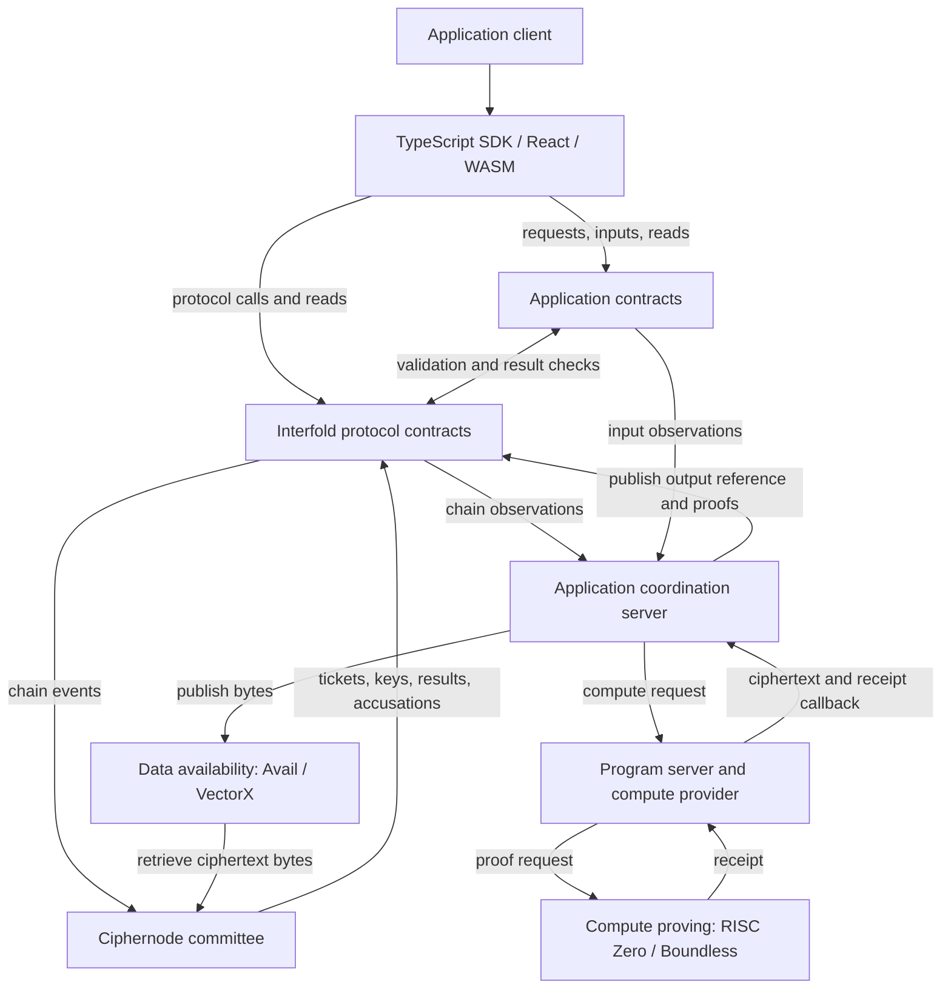

# Interfold monorepo: a high-level study map

Source snapshot: `abdc220d92dc578606b5f82790e01dfc7d71664f` on `main`.

This overview explains the system, its main components, and the boundaries between them. It uses
workspace manifests, implementation entry points, build scripts, and the existing architecture
references. It describes the checked-in architecture. It does not establish which versions run on
deployed infrastructure.

## 1. The central idea

**Interfold coordinates computations over encrypted inputs and publishes a verified, decrypted
result.**

An **E3** (Encrypted Execution Environment) is one computation instance, identified by an E3 ID. For
example, CRISP uses an E3 to calculate a voting result without publishing each individual vote.

The system combines three mechanisms:

- **Fully homomorphic encryption (FHE):** the application computes over ciphertexts without first
  decrypting them. The implementation uses the BFV encryption scheme.
- **Threshold cryptography:** a committee holds separate secret shares. Enough members must
  cooperate to decrypt a result.
- **Zero-knowledge proofs (ZK proofs):** verifiers check statements about key generation,
  encryption, computation, and decryption.

Smart contracts coordinate this work and enforce its economic rules. They record requests, select
committees, verify published results, and handle payments and failures.

Privacy depends on the threshold assumptions and the application's input and output rules. A proof
establishes a particular statement. It does not, by itself, establish availability, correct
incentives, or application privacy.

### The participants

| Participant             | Responsibility                                                                                                                  |
| ----------------------- | ------------------------------------------------------------------------------------------------------------------------------- |
| Requester               | Starts an E3 and pays its fee.                                                                                                  |
| Input provider          | Encrypts and submits application data. A voter is one example.                                                                  |
| Ciphernode operator     | Runs a node that can join committees, generate keys, and produce decryption shares.                                             |
| Bond owner              | Supplies collateral for an operator. The owner and operator can use different keys.                                             |
| Committee               | The ciphernodes selected for one E3.                                                                                            |
| Active aggregator       | A committee member responsible for combining shares and proofs and publishing results. This is a role inside the node software. |
| Application coordinator | Collects application state, requests computation, and publishes its encrypted output.                                           |
| Compute provider        | Executes the application program over ciphertexts and supplies evidence of that computation.                                    |
| Governance              | Configures protocol services, economic parameters, and release policies through the contracts.                                  |

## 2. The runtime picture

The monorepo contains several runtime systems and many libraries. A package or crate does not
necessarily represent a separate service.



This diagram groups the main interactions. It omits setup, input-availability details, and failure
branches.

### What runs where

| Runtime unit           | Main code                                                                | What it contains                                                                                                                           |
| ---------------------- | ------------------------------------------------------------------------ | ------------------------------------------------------------------------------------------------------------------------------------------ |
| EVM contracts          | `packages/interfold-contracts/`                                          | Protocol state, registries, economics, and verification contracts. Application contracts deploy alongside them.                            |
| Ciphernode process     | `crates/cli/`, `crates/entrypoint/`, `crates/ciphernode-builder/`        | Actix actors for protocol work, networking, chain access, storage, and recovery.                                                           |
| Bootstrap node         | The same node builder with a bootstrap role                              | Peer discovery, gossip, documents, and history support. It omits the keyshare, prover, and aggregation components.                         |
| Coordination server    | `examples/CRISP/server/`, `templates/default/server/`                    | Application-specific orchestration between the chain, compute service, and data-availability service.                                      |
| Program/compute server | `crates/program-server/`, `crates/support/`                              | HTTP compute interface, application program, and the RISC Zero/Boundless integration. Development execution has a separate support runner. |
| Browser application    | `examples/CRISP/client/`, `templates/default/client/`                    | Application interaction, wallet interaction, encryption, and input proofs.                                                                 |
| Operator interfaces    | `crates/dashboard/`, `packages/interfold-node/`, `crates/daemon-server/` | Local telemetry, an embedded dashboard, and local command handling.                                                                        |
| Public dashboard       | `packages/interfold-dashboard/`                                          | A separate frontend for public Interfold and CRISP observations.                                                                           |

The `interfold` binary provides several commands. Starting a ciphernode and starting an application
program are different runtime operations.

### The on-chain components

All core contract paths below are relative to `packages/interfold-contracts/contracts/`.

| Component                    | Source                                          | Responsibility                                                                                                                        |
| ---------------------------- | ----------------------------------------------- | ------------------------------------------------------------------------------------------------------------------------------------- |
| Interfold controller         | `Interfold.sol`                                 | Requests, lifecycle stages, deadlines, result publication, and fee accounting. Shared lifecycle and pricing logic lives under `lib/`. |
| Ciphernode registry          | `registry/CiphernodeRegistryOwnable.sol`        | Registered node set, committee selection, finalization, and public-key publication.                                                   |
| Bonding registry             | `registry/BondingRegistry.sol`                  | Operator collateral, eligibility, exits, and execution of collateral penalties.                                                       |
| Slashing manager             | `slashing/SlashingManager.sol`                  | Fault evidence, penalties, bans, and committee expulsions.                                                                            |
| Refund manager               | `E3RefundManager.sol`                           | Failure settlement, claimable rewards, and distribution of slashed funds.                                                             |
| Release registry             | `registry/NodeReleaseRegistry.sol`              | Admission policy for node releases.                                                                                                   |
| Randomness provider          | `randomness/ChainlinkVrfRandomnessProvider.sol` | Chainlink VRF integration for committee randomness.                                                                                   |
| Verifiers                    | `verifiers/`                                    | DKG, decryption, compute receipt, attestation, and data-availability checks.                                                          |
| Tokens and sale              | `token/`                                        | FOLD, collateral-backed tFOLD tickets, and separate token sale deployment/validation logic.                                           |
| Application program contract | CRISP or template contract directories          | Application request validation, accepted inputs, and application-specific output verification.                                        |

## 3. The repository map

The root [Cargo manifest](../Cargo.toml) lists **47 Rust workspace members**. The
[pnpm manifest](../pnpm-workspace.yaml) also includes the docs, applications, template, and WASM
package. The two workspaces overlap but have different membership.

| Area                                        | Main responsibility                                                                                                  | Useful entry point                                                           |
| ------------------------------------------- | -------------------------------------------------------------------------------------------------------------------- | ---------------------------------------------------------------------------- |
| `packages/interfold-contracts/`             | On-chain protocol, deployment tools, contract tests, generated verifiers, and token sale contracts.                  | [Contract interfaces](../packages/interfold-contracts/contracts/interfaces/) |
| `crates/`                                   | Ciphernode implementation, cryptographic libraries, Rust client APIs, compute tooling, and operator tools.           | [Node composition](../crates/ciphernode-builder/src/ciphernode_builder.rs)   |
| `circuits/`                                 | Noir constraints for cryptographic operations and recursive proof aggregation.                                       | [Circuit map](../circuits/README.md)                                         |
| `packages/interfold-sdk/`                   | TypeScript contract access, events, key assembly, encryption, and proof APIs.                                        | [Public exports](../packages/interfold-sdk/src/index.ts)                     |
| `packages/interfold-react/`                 | React integration for the TypeScript SDK.                                                                            | [Package](../packages/interfold-react/)                                      |
| `crates/wasm/`                              | Browser-compatible Rust encryption and witness functionality, published as `@interfold/wasm`.                        | [Package](../crates/wasm/)                                                   |
| `examples/CRISP/`                           | A voting application with its own contracts, circuits, SDK, client, server, and encrypted program.                   | [Program and input policy](../examples/CRISP/program/src/lib.rs)             |
| `templates/default/`                        | An application scaffold with a client, contracts, server, and program.                                               | [Template](../templates/default/)                                            |
| `crates/support/`                           | A separate Rust workspace for the RISC Zero host, guest, HTTP app, and shared compute formats.                       | [Support architecture](../crates/support/README.md)                          |
| `scripts/`                                  | Circuit builds, generated artifacts, consistency checks, versioning, and release orchestration.                      | [Root commands](../package.json)                                             |
| `tests/integration/`, `crates/tests/`       | Cross-component scenarios and workspace-level validation.                                                            | [Integration runner](../tests/integration/test.sh)                           |
| `deploy/`, `dappnode/`, `crates/Dockerfile` | Deployment definitions, node packaging, startup, and health checks.                                                  | [Deployment directory](../deploy/)                                           |
| `deployments/`                              | Generated deployment information consumed outside the deployment scripts.                                            | [Manifest](../deployments/manifest.json)                                     |
| `docs/`                                     | Public documentation site and this study map.                                                                        | [Architecture page](pages/learn/architecture.mdx)                            |
| `agent/`, `.agents/`, tool configuration    | Engineering rules, invariants, flow traces, and agent procedures.                                                    | [Invariant index](../agent/invariants/00_INDEX.md)                           |
| `packages/interfold-config/`                | Shared JavaScript/TypeScript development configuration. This differs from runtime configuration in `crates/config/`. | [Package](../packages/interfold-config/)                                     |
| `packages/interfold-mcp/`                   | Documentation access through an MCP server.                                                                          | [Package](../packages/interfold-mcp/)                                        |
| `.github/`, `.husky/`                       | CI, release workflows, and local Git hooks.                                                                          | [CI workflow](../.github/workflows/ci.yml)                                   |

CRISP has a separate Cargo workspace and release process, but it imports core Rust crates through
relative paths. Its JavaScript packages participate in the root pnpm workspace. Thus, separate
versioning already exists alongside direct source dependencies.

## 4. Follow one E3

The contract defines these lifecycle stages:

```text
Requested → CommitteeFinalized → KeyPublished → CiphertextReady → Complete
                     failure conditions can lead to Failed
```

Source: [`IInterfold.E3Stage`](../packages/interfold-contracts/contracts/interfaces/IInterfold.sol).

### Before the request: establish the operator set

An operator authorizes a bond owner. The owner supplies FOLD collateral, registers the operator, and
supplies ticket collateral. The protocol represents ticket collateral through non-transferable tFOLD
balances. Eligibility also depends on the node release policy.

This separates operational keys, collateral ownership, and committee participation.

### 1. Request and select

The requester calls `Interfold.request` with the program and computation parameters. The protocol
records the request, charges fees, and requests a committee using the registry and randomness
provider.

Eligible nodes calculate sortition scores and submit tickets. Committee finalization fixes the
selected membership. The current selection rules distinguish operators from their bond owners.

### 2. Generate a shared key

Selected nodes run **distributed key generation (DKG)**. They exchange encrypted shares and proofs,
verify received material, and establish the accepted dealer roster.

The aggregator combines the accepted public-key contributions and proof material. The registry
verifies the publication, and clients obtain serialized key material that they check against the
proven commitment.

### 3. Accept encrypted inputs

Clients encrypt application data using the committee public key. The application defines input
eligibility, input proofs, commitments, and input-window rules. CRISP adds voting-specific rules
through its own contracts, circuits, and program policy.

### 4. Compute over ciphertexts

The application coordinator obtains inputs and requests execution from the program server. The
secure process applies the application function to encrypted data. For CRISP, that function adds the
selected encrypted ballots.

The RISC Zero path proves the computation. Its receipt binds the computation to protocol and input
information. The coordinator publishes output bytes through data availability, then submits the
output reference and proofs to the contracts.

**Application computation and committee decryption are separate responsibilities.** The ciphernodes
do not each run the application's RISC Zero computation as part of their committee role.

### 5. Decrypt the result

Committee members obtain the encrypted output and produce partial decryption shares with proofs. The
aggregator combines enough valid shares, proves the reconstruction, and publishes the plaintext
result. The contracts verify the result and account for rewards.

### 6. Handle failures

Deadlines provide a failure path when a stage cannot finish. Invalid proof evidence can trigger
accusations, committee votes, and on-chain slashing. Refund handling depends on the failure reason
and who bears responsibility.

These are separate mechanisms: a computation timeout and an attributed malicious action do not imply
the same settlement. Restart recovery also belongs to this lifecycle because a node can stop during
any stage.

Detailed reference: [protocol flow traces](../agent/flow-trace/00_INDEX.md).

## 5. Inside a ciphernode

The node uses an **actor model**. Each actor receives messages and maintains part of the runtime
state. An actor is an in-process component, not a separately deployed service.

[`CiphernodeBuilder`](../crates/ciphernode-builder/src/ciphernode_builder.rs) is the main
composition point. It connects storage, chain adapters, networking, protocol actors, proof workers,
and startup recovery.

```text
Chain events / peer messages
           ↓
Ingestion, validation, event ordering, and durable history
           ↓
Request routing and per-E3 state
           ↓
Sortition / DKG / aggregation / proof verification / accusations
           ↓
Network publication / proof jobs / contract transactions / saved state
```

### Rust responsibility groups

These groups cover all 47 root workspace members. They are navigation groups, not proposed project
boundaries. Names below are directory names under `crates/`.

| Group                               | Crates                                                                                                                | Main responsibility                                                                                                              |
| ----------------------------------- | --------------------------------------------------------------------------------------------------------------------- | -------------------------------------------------------------------------------------------------------------------------------- |
| Composition and operation           | `cli`, `entrypoint`, `ciphernode-builder`, `config`, `console`, `logger`, `dashboard`, `daemon-server`, `interfoldup` | Start and configure the node, connect components, expose operator controls, and install releases.                                |
| Protocol workflows                  | `request`, `sortition`, `keyshare`, `aggregator`, `slashing`                                                          | Route E3 work, select committees, run DKG and decryption, aggregate results, and evaluate accusations.                           |
| Events and recovery                 | `events`, `data`, `sync`                                                                                              | Define messages, distribute events, persist logs and snapshots, and restore operation.                                           |
| External communication              | `net`, `evm`, `data-availability`                                                                                     | Peer communication, chain reads and writes, and retrieval/publication of external ciphertext bytes.                              |
| Cryptography and proof execution    | `bfv-client`, `trbfv`, `fhe`, `fhe-params`, `zk-prover`, `zk-helpers`, `multithread`                                  | BFV operations, threshold operations, parameter definitions, witnesses, proof jobs, verification, and job scheduling.            |
| Mathematical and shared foundations | `crypto`, `committee-hash`, `polynomial`, `parity-matrix`, `safe`, `hamt`, `utils`, `utils-derive`                    | Supporting cryptography, commitments, arithmetic, data structures, and shared utilities. `safe` is the SAFE sponge construction. |
| Client and application support      | `sdk`, `wasm`, `indexer`, `evm-helpers`, `compute-provider`, `program-server`                                         | Rust/browser client APIs, application chain observations, computation interfaces, and the HTTP compute boundary.                 |
| Project scaffolding                 | `init`, `fs`, `support-scripts`                                                                                       | Create application projects and manage their support tooling.                                                                    |
| Validation support                  | `test-helpers`, `tests`, `layout-lock`                                                                                | Test infrastructure and checks for serialized-layout changes.                                                                    |

### Why recovery is architectural

The node stores both event history and snapshots. It also reconstructs state from chain and peer
history. Startup checks storage compatibility and reconciles restored requests with finalized chain
state before resuming work.

The `events` crate defines shared protocol payloads as well as event infrastructure. Its
dependencies include cryptographic types. It is therefore a substantial shared dependency, not just
a generic message bus.

Several workflow crates directly depend on Actix, storage, and EVM types. For example, the
[aggregator manifest](../crates/aggregator/Cargo.toml) includes `e3-data`, `e3-evm`, `e3-keyshare`,
and `e3-zk-prover`. The existing crate boundaries do not fully isolate domain logic from
infrastructure.

Detailed reference: [Rust dependency and runtime map](../agent/CRATES_ARCHITECTURE.md).

## 6. The cryptographic stack has distinct responsibilities

| Part                        | Question it answers                                                                         | Main implementation                                                        |
| --------------------------- | ------------------------------------------------------------------------------------------- | -------------------------------------------------------------------------- |
| BFV and threshold BFV       | How do we encrypt, compute over ciphertexts, and decrypt through shares?                    | `bfv-client`, `trbfv`, `fhe-params`, and the external `fhe.rs` dependency. |
| Noir protocol circuits      | Were the key-generation and decryption operations performed according to their constraints? | `circuits/lib/`, `circuits/bin/dkg/`, `circuits/bin/threshold/`.           |
| Recursive proof aggregation | How can many protocol proofs feed a bounded on-chain verification interface?                | `circuits/bin/recursive_aggregation/`, `zk-prover`, `aggregator`.          |
| Encryption/input circuits   | Does an encrypted input satisfy the encryption and application constraints?                 | Core encryption circuits, SDK proof APIs, and CRISP-specific circuits.     |
| RISC Zero secure process    | Did the selected application program perform the claimed encrypted computation?             | `crates/support/`, `compute-provider`, and each application's `program/`.  |
| Solidity verifier adapters  | Does the proof match this request, configuration, and previously accepted commitments?      | `packages/interfold-contracts/contracts/verifiers/`.                       |

The C0–C7 labels describe stages of the protocol proof pipeline:

- **C0–C4:** individual keys, threshold contributions, share computation, encrypted share exchange,
  and reconstruction of decryption-key material.
- **C5:** public-key aggregation.
- **C6:** partial decryption.
- **C7:** aggregation and decoding of decryption shares.

Some stages have multiple proof variants. The [circuit index](../circuits/README.md) gives their
exact mapping.

Individual protocol proofs travel between nodes for verification. Aggregated DKG and decryption
proofs reach generated Honk verifiers through Solidity adapters. Application compute receipts use
the separate RISC Zero verification path. Slashing also uses signed committee attestations, so its
verification model differs from result-proof verification.

The Rust implementation produces values and witnesses. The Noir implementation constrains them.
Solidity checks the proof and its connection to on-chain state. These implementations must agree on
encodings, ordering, parameters, and commitments.

## 7. The main dependency boundaries

There are three kinds of dependency to track: source imports, runtime messages, and generated
artifacts. The manifests expose the first kind. They do not expose the complete system contract.

| Boundary                          | What crosses it                                                                               | Why changes can propagate                                                        |
| --------------------------------- | --------------------------------------------------------------------------------------------- | -------------------------------------------------------------------------------- |
| Contracts ↔ nodes and clients    | ABIs, events, stage meanings, addresses, and transaction arguments.                           | A contract edit can change event ingestion, SDK decoding, and replay behavior.   |
| Rust crypto ↔ Noir ↔ Solidity   | Witness shapes, public inputs, commitment rules, proof formats, and verification keys.        | Local correctness does not establish agreement across the three implementations. |
| Node ↔ peer                      | Gossip payloads, signed messages, documents, and history requests.                            | Running versions must agree on both format and protocol meaning.                 |
| Node ↔ its saved state           | Positional serialization, event logs, snapshots, repository keys, and cursors.                | A source-compatible change can still change the interpretation of stored bytes.  |
| Application ↔ compute service    | Inputs, metadata, selection policy, callback formats, program identity, and compute journal.  | The contract and secure process must describe the same input set and output.     |
| Protocol ↔ data availability     | Content hashes, publication coordinates, availability receipts, and retrieved bytes.          | A valid reference still requires retrieval and byte verification.                |
| Client ↔ cryptographic artifacts | WASM code, Noir artifacts, BFV parameters, and key serialization.                             | Encryption and proof generation must match the configuration accepted on-chain.  |
| Release tooling ↔ all layers     | Versions, circuit presets, committee configuration, deployment metadata, and packaged assets. | A release can contain individually valid components that do not work together.   |

### Concrete build dependencies

- The TypeScript SDK prebuild compiles contracts, builds Rust WASM, and compiles encryption
  circuits.
- `scripts/build-circuits.ts` connects Noir builds to Rust-generated bounds and matrices, committee
  configuration, and protocol constants.
- Verifier generation converts proof-system artifacts into Solidity contracts.
- The Rust EVM helper build invokes contract-fixture generation.
- The local dashboard frontend builds into `crates/dashboard/assets/`. The Rust dashboard embeds
  those files.
- CRISP imports core Rust libraries by path, even though it has its own Cargo workspace.

Sources: [SDK scripts](../packages/interfold-sdk/package.json),
[circuit builder](../scripts/build-circuits.ts),
[verifier generator](../scripts/generate-verifiers.ts),
[EVM helper build](../crates/evm-helpers/build.rs),
[dashboard build](../packages/interfold-node/vite.config.ts), and
[CRISP dependencies](../examples/CRISP/Cargo.toml).

**A directory boundary can exist without an independent build, deployment, or compatibility
boundary.**

## 8. The main design choices visible in the code

This table explains the role and consequence of each choice. It does not infer the team's original
decision history.

| Choice                                    | What it enables                                                                       | What it requires                                                                      |
| ----------------------------------------- | ------------------------------------------------------------------------------------- | ------------------------------------------------------------------------------------- |
| EVM coordination with off-chain execution | Shared settlement and verification without executing all cryptographic work on-chain. | Reliable chain ingestion and precise binding between proofs and requests.             |
| Per-E3 committees with threshold keys     | Distributed key custody for each computation.                                         | Agreement on membership, party ordering, thresholds, and accepted shares.             |
| A committee member acts as aggregator     | One publication path without a separate privileged aggregator service.                | Failover, durable aggregation state, and proof checks independent of the sender.      |
| Actix actors and an event-driven runtime  | Concurrent processing of network, chain, and expensive proof work.                    | Explicit ordering, bounded queues, recovery rules, and control of repeated effects.   |
| Event history plus snapshots              | Restart and historical reconstruction.                                                | Schema discipline and agreement between replayed history and external state.          |
| Rust, Noir, Solidity, and TypeScript      | Specialized implementations for runtime work, constraints, settlement, and clients.   | Cross-language checks for shared protocol facts.                                      |
| Separate application programs             | Applications define their own encrypted functions and input policies.                 | Program contracts, clients, and secure processes must agree on application semantics. |
| External proving and data availability    | Compute proving through Boundless and byte publication through Avail/VectorX.         | Correct receipts, bridge interfaces, retrieval, deadlines, and failure handling.      |
| Coordinated core releases                 | Core crates and packages can advance together.                                        | Artifact provenance and explicit compatibility policies across layers.                |

External dependencies include EVM RPC services, Chainlink VRF, libp2p peers, Avail/VectorX, the
Noir/Barretenberg toolchain, and RISC Zero/Boundless. The root Rust workspace also pins a Git-based
`fhe.rs` dependency. These integrations form part of the architecture even though their
implementations live outside this repository.

## 9. Existing invariants and automation

The repository already has four major invariant groups:

| Group                                                                  | Scope                                                                              |
| ---------------------------------------------------------------------- | ---------------------------------------------------------------------------------- |
| [On-chain protocol](../agent/invariants/01_PROTOCOL_ONCHAIN.md)        | Lifecycle, committees, collateral, payments, slashing, and governance.             |
| [Cryptography and circuits](../agent/invariants/02_CRYPTO_CIRCUITS.md) | Constraints, commitments, proof binding, parameters, and cross-language agreement. |
| [Actor runtime](../agent/invariants/03_ACTOR_RUNTIME.md)               | Event order, durability, networking, replay, startup, and shutdown.                |
| [Build configuration](../agent/invariants/04_BUILD_CONFIG.md)          | Generated artifacts, configuration agreement, packaging, and release tooling.      |

These groups cross directory boundaries. For example, a verifier belongs to both the on-chain and
cryptographic domains. The invariant index explicitly distinguishes requirements from mechanically
established properties and records known gaps.

Existing automation includes:

- Layer tests for contracts, Rust, SDKs, and Noir, plus integration and proof suites.
- Committee/configuration consistency checks and generated-verifier checks.
- Serialization layout locks for listed durable and wire-format roots.
- Contract storage-layout and size checks.
- Selected mechanical invariant checks and documentation-drift checks.
- Release versioning, artifact manifests, deployment metadata, and node release admission.

The root [package scripts](../package.json), [pre-push hook](../.husky/pre-push), and
[CI workflow](../.github/workflows/ci.yml) define different check sets. The presence of an invariant
document does not mean a test enforces every statement.

Compatibility also has several dimensions: package versions, protocol version, node generation,
storage schema, network formats, and cryptographic configuration. For example,
[`protocol-release.toml`](../crates/config/protocol-release.toml) distinguishes protocol
incompatibility from a mandatory node-only release. These dimensions explain why an update can
require coordination beyond a package version bump.

## 10. A reading order for understanding the system

1. **Follow one E3.** Read section 4 here, then the
   [public architecture page](pages/learn/architecture.mdx).
2. **Study the on-chain state machine.** Start with
   [`IInterfold`](../packages/interfold-contracts/contracts/interfaces/IInterfold.sol) and
   [`Interfold`](../packages/interfold-contracts/contracts/Interfold.sol).
3. **Locate node responsibilities.** Use the
   [Rust architecture map](../agent/CRATES_ARCHITECTURE.md), then inspect `CiphernodeBuilder` and
   `request`.
4. **Separate encryption from proof verification.** Read the
   [cryptography overview](pages/learn/cryptography.mdx) and [circuit index](../circuits/README.md).
5. **Trace one real application.** Follow CRISP from its client through its contracts, coordinator,
   program, and result publication.
6. **Study restart and failure behavior.** Read the matching flow traces before treating the
   successful path as the complete protocol.
7. **Trace one build artifact.** Follow a circuit through compilation, verification-key generation,
   Solidity verification, and node distribution.

For each component, the useful study questions are:

- What state does it own, and which other component treats that state as authoritative?
- What does it accept, and what does it promise to produce?
- Which assumptions come from another component?
- What happens after failure, restart, or a version mismatch?
- Which checks establish those promises today?

The source establishes technical responsibility and coupling. Human ownership and the rationale
behind past decisions need the team's input. This map supplies the shared vocabulary for that
discussion.
