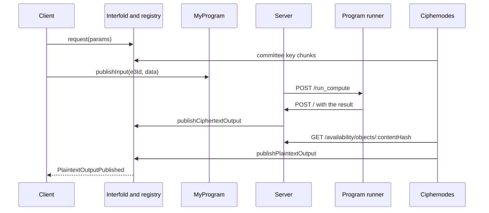

import { Callout, FileTree } from 'nextra/components'
import { LinkCards, LinkCard } from '@/components/ui'

# Client and Server

This page explains the off-chain parts of the default template (`templates/default`). It is for
developers who change the template or build their own client and server. It covers the files, the
configuration, the events that each part listens to, the coordination work of the server, and the
error handling. At the end of the page, you know which file to change for each part of the flow.

## Overview

The template has three off-chain processes and a local chain. `pnpm dev:all` starts all of them
through `scripts/dev_all_concurrently.sh`.

| Process             | Started by          | Local address            | Role                                                                        |
| ------------------- | ------------------- | ------------------------ | --------------------------------------------------------------------------- |
| Client              | `pnpm dev:frontend` | `http://localhost:3000`  | A React wizard. It requests an E3, encrypts two numbers, and shows the sum. |
| Coordination server | `pnpm dev:server`   | `http://localhost:8080`  | Sends inputs to the program runner and publishes the ciphertext output.     |
| Program runner      | `pnpm dev:program`  | `http://localhost:13151` | Runs the FHE program (`interfold program start`) and calls the server back. |
| Local chain         | `anvil`             | `http://localhost:8545`  | Chain ID 31337 with a 1-second block time.                                  |

`pnpm dev:all` also starts five local ciphernodes, and it starts the server with `TEST_MODE=1`.

The client and the server both talk to the chain. The server never receives inputs from the client.
It reads them from chain events.



## Files

<FileTree>
  <FileTree.Folder name='templates/default' defaultOpen>
    <FileTree.Folder name='client/src' defaultOpen>
      <FileTree.File name='main.tsx' />
      <FileTree.File name='App.tsx' />
      <FileTree.Folder name='context' defaultOpen>
        <FileTree.File name='WizardContext.tsx' />
      </FileTree.Folder>
      <FileTree.Folder name='pages' defaultOpen>
        <FileTree.File name='WizardRoutes.tsx' />
        <FileTree.Folder name='steps' defaultOpen>
          <FileTree.File name='ConnectWallet.tsx' />
          <FileTree.File name='RequestComputation.tsx' />
          <FileTree.File name='EnterInputs.tsx' />
          <FileTree.File name='EncryptSubmit.tsx' />
          <FileTree.File name='Results.tsx' />
        </FileTree.Folder>
      </FileTree.Folder>
      <FileTree.Folder name='utils' defaultOpen>
        <FileTree.File name='env-config.ts' />
        <FileTree.File name='sdk-config.ts' />
        <FileTree.File name='input.ts' />
        <FileTree.File name='persistence.ts' />
        <FileTree.File name='error-formatting.ts' />
      </FileTree.Folder>
    </FileTree.Folder>
    <FileTree.Folder name='server' defaultOpen>
      <FileTree.File name='index.ts' />
      <FileTree.File name='runner.ts' />
      <FileTree.File name='utils.ts' />
      <FileTree.File name='input.ts' />
      <FileTree.File name='testHandler.ts' />
      <FileTree.File name='payload.json' />
    </FileTree.Folder>
    <FileTree.File name='interfold.config.yaml' />
  </FileTree.Folder>
</FileTree>

| File                                   | Content                                                                                             |
| -------------------------------------- | --------------------------------------------------------------------------------------------------- |
| `client/src/main.tsx`                  | The wagmi, React Query, and ConnectKit providers. In development, the chains are Sepolia and Anvil. |
| `client/src/context/WizardContext.tsx` | Calls `useInterfoldSDK`, holds the wizard state, and saves it.                                      |
| `client/src/pages/steps/*.tsx`         | One component for each wizard step.                                                                 |
| `client/src/utils/env-config.ts`       | Reads and checks the `VITE_` environment variables.                                                 |
| `client/src/utils/sdk-config.ts`       | Builds the `useInterfoldSDK` configuration.                                                         |
| `client/src/utils/input.ts`            | `publishInput`: encodes an input and calls the E3 program.                                          |
| `client/src/utils/persistence.ts`      | Saves the wizard state in `localStorage` under `interfold-wizard-state`.                            |
| `server/index.ts`                      | The Express server: event listener, scheduler, webhook, and object store.                           |
| `server/runner.ts`                     | `callFheRunner`: posts a job to the program runner.                                                 |
| `server/utils.ts`                      | Reads and checks the server environment variables.                                                  |
| `server/testHandler.ts`                | Sends `server/payload.json` to the runner when `TEST_MODE` is set.                                  |

## Configuration

The contract addresses come from `interfold.config.yaml`. The dev scripts run `interfold print-env`
to turn the `localhost` chain entry into environment variables:

- `scripts/dev_frontend.sh` runs `interfold print-env --vite --chain localhost` before it starts the
  client.
- `scripts/dev_server.sh` runs `interfold print-env --chain localhost`. It also sets `PRIVATE_KEY`
  to the first Anvil account key, `CHAIN_ID=31337`, and `RPC_URL=http://localhost:8545`.

### Client variables

`client/src/utils/env-config.ts` reads these variables. When one is missing, the client shows the
`EnvironmentError` screen instead of the wizard.

| Variable                                | Default                  |
| --------------------------------------- | ------------------------ |
| `VITE_INTERFOLD_ADDRESS`                | None                     |
| `VITE_REGISTRY_ADDRESS`                 | None                     |
| `VITE_BONDING_REGISTRY_ADDRESS`         | None                     |
| `VITE_E3_PROGRAM_ADDRESS`               | None                     |
| `VITE_FEE_TOKEN_ADDRESS`                | None                     |
| `VITE_RPC_URL`                          | `http://localhost:8545`  |
| `VITE_THRESHOLD_BFV_PARAMS_PRESET_NAME` | `INSECURE_THRESHOLD_512` |

`client/src/main.tsx` also reads `VITE_WALLETCONNECT_PROJECT_ID` for ConnectKit.

### Server variables

`server/utils.ts` requires the first group. `server/index.ts` reads the others.

| Variable                      | Required | Default                        | Use                                            |
| ----------------------------- | -------- | ------------------------------ | ---------------------------------------------- |
| `RPC_URL`                     | Yes      | None                           | The RPC URL for the SDK.                       |
| `INTERFOLD_ADDRESS`           | Yes      | None                           | The Interfold contract.                        |
| `REGISTRY_ADDRESS`            | Yes      | None                           | The `CiphernodeRegistry`.                      |
| `E3_PROGRAM_ADDRESS`          | Yes      | None                           | `MyProgram`, for the input events.             |
| `FEE_TOKEN_ADDRESS`           | Yes      | None                           | The fee token.                                 |
| `PRIVATE_KEY`                 | Yes      | None                           | The key that signs `publishCiphertextOutput`.  |
| `CHAIN_ID`                    | Yes      | None                           | The chain ID.                                  |
| `PROGRAM_RUNNER_URL`          | No       | `http://127.0.0.1:13151`       | The program runner.                            |
| `CALLBACK_URL`                | No       | `http://127.0.0.1:8080`        | The URL that the runner calls with the result. |
| `PORT`                        | No       | `8080`                         | The server port.                               |
| `DATA_AVAILABILITY_DIRECTORY` | No       | `.interfold/data-availability` | Where the server stores ciphertext objects.    |
| `TEST_MODE`                   | No       | Not set                        | Enables `GET /test`.                           |

### Data availability

The local chain entry in `interfold.config.yaml` sets `data_availability` to `mode: mock_http` with
`rpc_url: http://127.0.0.1:8080/availability`. The ciphernodes read ciphertext objects from the
server at that URL. A production chain uses `mode: avail` instead.

## How the client works

The client is a five-step wizard. `WizardContext.tsx` creates the SDK with `useInterfoldSDK` and a
memoized configuration from `sdk-config.ts`. The wizard advances by itself when the wallet connects
and when the SDK is ready.

| Step | Component                | What it does                                                                                      |
| ---- | ------------------------ | ------------------------------------------------------------------------------------------------- |
| 1    | `ConnectWallet.tsx`      | Asks for a wallet connection. The ConnectKit button is in the navigation bar.                     |
| 2    | `RequestComputation.tsx` | Quotes the fee, approves it, and calls `requestE3`. Then it waits for the committee public key.   |
| 3    | `EnterInputs.tsx`        | Encrypts two numbers, computes their commitments, and sends each one to `MyProgram.publishInput`. |
| 4    | `EncryptSubmit.tsx`      | Shows progress and waits for the plaintext output.                                                |
| 5    | `Results.tsx`            | Shows the sum, the E3 ID, the transaction hash, and the raw output.                               |

### Events that the client listens to

| Event type                                               | File                     | Action                                                                                                                      |
| -------------------------------------------------------- | ------------------------ | --------------------------------------------------------------------------------------------------------------------------- |
| `InterfoldEventType.E3_REQUESTED`                        | `RequestComputation.tsx` | Saves `e3Id` and `inputWindow[1]`.                                                                                          |
| `RegistryEventType.COMMITTEE_PUBLIC_KEY_CHUNK_PUBLISHED` | `RequestComputation.tsx` | Adds the chunk to a `CommitteePublicKeyAssembler`. It keeps the key only when `validatePublicKeyCommitment` returns `true`. |
| `InterfoldEventType.CIPHERTEXT_OUTPUT_PUBLISHED`         | `EncryptSubmit.tsx`      | Marks the computation step as done.                                                                                         |
| `InterfoldEventType.PLAINTEXT_OUTPUT_PUBLISHED`          | `EncryptSubmit.tsx`      | Decodes the result with `decodePlaintextOutput` and goes to the results step.                                               |

<Callout type='info'>
  The current Interfold contract emits `CiphertextOutputReferencePublished` for a new ciphertext
  output. It does not emit `CiphertextOutputPublished`, so the computation step in the template
  progress list stays open until the plaintext arrives. The SDK key for the emitted event is
  `InterfoldEventType.CIPHERTEXT_OUTPUT_REFERENCE_PUBLISHED`.
</Callout>

### Input submission

`client/src/utils/input.ts` encodes the ciphertext and its commitment as `(bytes, bytes32)` and
calls `publishInput` on the E3 program:

```ts
const data = encodeAbiParameters(parseAbiParameters('bytes, bytes32'), [
  input,
  ciphertextCommitment,
])

return walletClient.writeContract({
  address: programAddress,
  abi: myProgramAbi,
  functionName: 'publishInput',
  args: [e3Id, data],
  chain: walletClient.chain,
  account: sender,
})
```

`EnterInputs.tsx` blocks submission after `inputWindow[1]`, because `MyProgram.publishInput` then
reverts with `InputDeadlineReached`. For the full flow, see
[Encrypt and submit](/build/tutorials/encrypt-and-submit).

## How the server works

The server in `server/index.ts` coordinates the compute step. It keeps only two in-memory sets for
idempotency: `scheduled` and `inFlight`. It reads the parameters and the inputs from the chain when
it runs a job.

### Server steps

1. **Create the SDK.** `createPrivateSDK` calls `InterfoldSDK.create` with `RPC_URL`, `PRIVATE_KEY`,
   the `hardhat` chain, and the `INSECURE_THRESHOLD_512` preset. It creates the SDK one time.
2. **Listen for the key.** `setupEventListeners` watches
   `RegistryEventType.COMMITTEE_PUBLIC_KEY_CHUNK_PUBLISHED`. When a key is complete and matches its
   commitment, the server calls `scheduleE3(e3Id)`.
3. **Wait for the input window.** `scheduleE3` reads `inputWindow[1]` from `getE3`. It polls the
   latest block time every 500 ms until the window closes. If the window is already closed, it runs
   at once.
4. **Collect the inputs.** `runProgram` reads the encoded parameters from
   `Interfold.paramSetRegistry(e3.paramSet)`. It reads every `InputPublished` event of `MyProgram`
   for the E3, from block 0. It skips the E3 when there is one input or none.
5. **Start the compute.** `callFheRunner` in `server/runner.ts` posts to
   `PROGRAM_RUNNER_URL/run_compute`. The body has the E3 ID, the chain and contract domain, the
   parameters, the ciphertext inputs, and `callback_url`. The domain is the chain ID, the Interfold
   address, the encryption scheme ID, and the committee public key hash.
6. **Publish the output.** The runner calls `POST /` with `e3_id`, `ciphertext`,
   `ciphertext_commitment`, and `proof`. The server stores the ciphertext under its Keccak-256 hash.
   Then it calls `sdk.publishCiphertextOutput`.

The webhook publishes the output with this reference:

```ts
const ciphertextBytes = Buffer.from(ciphertext.slice(2), 'hex')
const contentHash = keccak256(ciphertext)
await storeAvailabilityObject(contentHash, ciphertextBytes)

await sdk.publishCiphertextOutput(BigInt(e3_id), {
  contentHash,
  ciphertextCommitment: ciphertext_commitment,
  computeProof: proof,
  // The local program verifies raw bytes as a deterministic mock receipt.
  availabilityProof: ciphertext,
})
```

### Server endpoints

| Endpoint                                 | Content                                                                           |
| ---------------------------------------- | --------------------------------------------------------------------------------- |
| `POST /`                                 | The program runner callback. It publishes the ciphertext output.                  |
| `GET /availability/objects/:contentHash` | Returns a stored object as `application/octet-stream`. The ciphernodes read here. |
| `GET /test`                              | Only with `TEST_MODE`. Sends `server/payload.json` to the program runner.         |

## Error handling

The template handles errors in these places:

- **Webhook input.** `POST /` returns HTTP 400 when a field is missing or a value is not a hex
  string. It returns HTTP 500 when the publication fails.
- **Runner failure.** `runProgram` removes the E3 from `inFlight` when `callFheRunner` throws. A
  later call can then try again. `callFheRunner` throws when the runner returns a status that is not
  OK.
- **Key chunks.** The server and the client log a chunk that they cannot use, then continue. They
  reject a key whose commitment does not match.
- **Client state.** `WizardRoutes.tsx` shows `EnvironmentError` for missing variables and
  `SDKErrorDisplay` when the SDK hook reports an error. `error-formatting.ts` maps common wallet and
  revert messages to short text.
- **Input window.** `EnterInputs.tsx` compares the local time with `inputWindow[1]` and blocks a
  late submission. `EncryptSubmit.tsx` shows a warning when the window closed before the inputs were
  sent.

For SDK error codes, see [SDK](/build/sdk#errors).

## Before you leave local development

The template server is for a local chain. Change these points before you use it on another network:

- `server/index.ts` sets the `hardhat` chain and the `INSECURE_THRESHOLD_512` preset. Set the target
  chain and the preset that matches your `paramSet`.
- `MyProgram.verifyDataAvailability` accepts the raw bytes as the receipt. Replace it with a real
  data availability verifier, and publish the ciphertext to that layer.
- `runProgram` reads input events from block 0. Start from the program deployment block.
- The `scheduled` and `inFlight` sets are in memory. A restart loses them. Store the job state if
  the server must recover after a restart.
- The server must publish the output before the compute deadline. A missed deadline fails the E3
  with `ComputeTimeout`, and the requester pays for completed work.

## Next steps

<LinkCards min={230}>
  <LinkCard
    title='Encrypt and submit'
    href='/build/tutorials/encrypt-and-submit'
    icon='lock'
    tag='Tutorial'
  >
    Encrypt an input and send it to the E3 program step by step.
  </LinkCard>
  <LinkCard title='SDK' href='/build/sdk' icon='terminal' tag='Build'>
    Every SDK export, event type, and error code.
  </LinkCard>
  <LinkCard
    title='Compute provider'
    href='/build/e3-program/compute-provider'
    icon='chip'
    tag='Build'
  >
    How the program runner and the compute proof work.
  </LinkCard>
  <LinkCard
    title='Deploy to Sepolia'
    href='/build/tutorials/deploy-to-testnet'
    icon='rocket'
    tag='Tutorial'
  >
    Move the template from the local chain to a testnet.
  </LinkCard>
</LinkCards>
