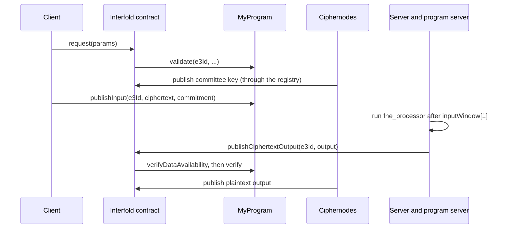

import { Callout, FileTree, Steps } from 'nextra/components'
import { Layers, LinkCard, LinkCards } from '@/components/ui'

# Build a Complete E3 Program

This tutorial builds an E3 program from the default template. You go through each part that you own:
the Secure Process in Rust, the program contract in Solidity, the coordination server, and the
client in TypeScript. You make a change to the contract, check that the parts still agree, and run a
complete E3 on a local chain. At the end, you know which file does what, and which values must stay
the same across the parts.

**Prerequisites:** the Interfold CLI, Rust, Node.js, pnpm, and Foundry (`pnpm dev:all` starts
`anvil`). See [Installation](/build/installation). Read [E3 Program Anatomy](/build/e3-program) for
the concepts.

## The parts of the program

<Layers
  layers={[
    {
      name: 'Client',
      note: 'Browser',
      items: ['Requests the E3', 'Encrypts inputs', 'Shows the result'],
    },
    {
      name: 'Coordination server',
      note: 'Off-chain',
      items: ['Waits for the input window', 'Calls the program server', 'Publishes the output'],
    },
    {
      name: 'Secure Process',
      note: 'Compute provider',
      items: ['fhe_processor', 'policy'],
    },
    {
      name: 'Program contract',
      note: 'On-chain',
      items: ['validate', 'publishInput', 'verify', 'verifyDataAvailability'],
    },
  ]}
/>

| Part                | File                           | Role                                                                                |
| ------------------- | ------------------------------ | ----------------------------------------------------------------------------------- |
| Secure Process      | `program/src/lib.rs`           | The FHE computation over the encrypted inputs, and the input policy.                |
| Program contract    | `contracts/MyProgram.sol`      | Accepts inputs, keeps the input tree, and verifies the compute proof.               |
| Deploy script       | `deploy/default.ts`            | Deploys the program and registers it with the Interfold contract.                   |
| Coordination server | `server/index.ts`              | Starts the computation after the input window and publishes the ciphertext output.  |
| Client              | `client/src/pages/steps/*.tsx` | The five-step web flow: connect, request, enter inputs, submit, and results.        |
| Configuration       | `interfold.config.yaml`        | Chain, contract addresses, local ciphernodes, and the program mode (`program.dev`). |

<Steps>

### Create the project

Create a project from the default template:

```bash
interfold init my-e3
cd my-e3
```

`interfold init` downloads `templates/default` at the tag of your CLI version (for example
`v0.18.0`). It pins the `@interfold/*` packages and the Rust crates to that release, runs
`pnpm install`, and makes the first Git commit.

<FileTree>
  <FileTree.Folder name='my-e3' defaultOpen>
    <FileTree.Folder name='program' defaultOpen>
      <FileTree.Folder name='src' defaultOpen>
        <FileTree.File name='lib.rs' />
      </FileTree.Folder>
    </FileTree.Folder>
    <FileTree.Folder name='contracts' defaultOpen>
      <FileTree.File name='MyProgram.sol' />
      <FileTree.Folder name='Mocks' />
    </FileTree.Folder>
    <FileTree.Folder name='deploy'>
      <FileTree.File name='default.ts' />
    </FileTree.Folder>
    <FileTree.Folder name='server'>
      <FileTree.File name='index.ts' />
      <FileTree.File name='input.ts' />
      <FileTree.File name='runner.ts' />
    </FileTree.Folder>
    <FileTree.Folder name='client' />
    <FileTree.Folder name='scripts' />
    <FileTree.File name='hardhat.config.ts' />
    <FileTree.File name='interfold.config.yaml' />
  </FileTree.Folder>
</FileTree>

### Run the template one time

Start the complete local stack:

```bash
pnpm dev:all
```

The command starts `anvil`, deploys the Interfold contracts and `MyProgram`, starts five local
ciphernodes, the program server, the coordination server, and the client. Open
`http://localhost:3000`, connect a wallet, and run one E3 with two numbers. The result is their sum.
The [Quick Start](/build/quick-start) has the wallet setup.

Stop the stack with `Ctrl+C` before you change the code.

### Read the Secure Process

`program/src/lib.rs` exports two functions. The program server calls both.

```rust filename="program/src/lib.rs"
pub fn policy() -> InputPolicy {
    InputPolicy::default()
}

pub fn fhe_processor(fhe_inputs: &FHEProcessorInput<'_>) -> Vec<u8> {
    let mut sum = Ciphertext::zero(fhe_inputs.params);
    for ciphertext_bytes in fhe_inputs.ciphertexts {
        let ciphertext = Ciphertext::from_bytes(&ciphertext_bytes.0, fhe_inputs.params).unwrap();
        sum += &ciphertext;
    }

    sum.to_bytes()
}
```

- `fhe_processor` adds the ciphertexts homomorphically and returns the encrypted sum. It never sees
  a plaintext.
- `policy` returns `InputPolicy::default()`. The input tree leaf is the SAFE commitment of each
  ciphertext, and the processor uses every input. This matches `MyProgram.publishInput`, which
  inserts the commitment.

Run the unit test. It encrypts 3 and 2 with a test key, runs `fhe_processor`, decrypts, and expects
5:

```bash
cargo test -p e3-user-program
```

When you change the computation, keep these rules:

- Return one BFV ciphertext with two parts. The decryption circuit (C6) takes `ct0` and `ct1` only.
  The processor receives no relinearization key, so do not multiply two ciphertexts.
- Select inputs only through `policy`. The compute proof commits to the root of the inputs that the
  processor used, and `MyProgram.verify` compares it with the on-chain tree.

[The Secure Process](/build/e3-program/secure-process) explains the input policy in detail.

### Harden publishInput

`contracts/MyProgram.sol` implements `IE3Program` and `IE3ProgramDataAvailability`:

| Function                 | Called by                                 | What the template does                                                                                         |
| ------------------------ | ----------------------------------------- | -------------------------------------------------------------------------------------------------------------- |
| `supportsInterface`      | Interfold contract, at registration       | Reports `IE3Program`, `IE3ProgramDataAvailability`, and `IERC165`. Registration fails without them.            |
| `validate`               | Interfold contract, at request            | Stores `keccak256(e3ProgramParams)`, starts an input tree of depth 20, returns `keccak256("fhe.rs:BFV")`.      |
| `publishInput`           | The data provider, directly               | Decodes `(bytes ciphertext, bytes32 commitment)`, inserts the commitment, emits `InputPublished`.              |
| `verify`                 | Interfold contract, at output publication | Checks the parameter hash and the input root in the proof, rebuilds the journal, calls the RISC Zero verifier. |
| `verifyDataAvailability` | Interfold contract, at output publication | Local only. It accepts the output bytes as their own receipt.                                                  |

The template `publishInput` checks only the end of the input window. Add the stage check and the
start-of-window check that `CRISPProgram` makes. Add two errors next to the other errors:

```solidity filename="contracts/MyProgram.sol"
error KeyNotPublished(uint256 e3Id);
error InputWindowNotOpen(uint256 e3Id);
```

Then replace the first check in `publishInput`:

```solidity filename="contracts/MyProgram.sol"
function publishInput(uint256 e3Id, bytes memory data) external override {
  E3 memory e3 = interfold.getE3(e3Id);

  if (interfold.getE3Stage(e3Id) != IInterfold.E3Stage.KeyPublished) revert KeyNotPublished(e3Id);
  if (block.timestamp < e3.inputWindow[0]) revert InputWindowNotOpen(e3Id);
  if (block.timestamp > e3.inputWindow[1]) revert InputDeadlineReached();

  (bytes memory ciphertext, bytes32 ciphertextCommitment) = abi.decode(data, (bytes, bytes32));
  if (ciphertext.length == 0) revert EmptyInputData();

  uint256 index = inputs[e3Id].numberOfLeaves;
  inputs[e3Id]._insert(uint256(ciphertextCommitment));

  emit InputPublished(e3Id, ciphertext, index);
}
```

Compile the contracts. The command also regenerates the TypeChain types in `types/`, which the
server and the deploy script import:

```bash
pnpm compile
```

<Callout type='warning'>
  The template does not check that the ciphertext bytes match the commitment, as the comment in
  `publishInput` says. An input with a wrong commitment can stop the E3 from completing. A
  production program must check that binding, for example with a proof. See [Custom Noir
  Circuits](/build/tutorials/custom-zk-circuits).
</Callout>

Keep the `verify` function as it is. It compares `computeProof.inputRoot` with
`inputs[e3Id]._root()`. The protocol ciphertext verifier does not check the input root, so this
comparison is the only check that the output covers your inputs.

### Read the deploy script

`deploy/default.ts` exports `deployTemplate`. `scripts/deploy-local.ts` calls it after
`deployInterfold(true, false)`, which deploys the protocol with mocks. `deployTemplate` does these
steps:

1. It deploys `MockRISC0Verifier`, which accepts every proof, and the `ImageID` library.
2. It deploys `Risc0BfvCiphertextVerifier` for the image ID and calls `setCiphertextVerifier` on the
   Interfold contract.
3. It deploys `MyProgram` with the Interfold address, the verifier, and the image ID. It links
   `PoseidonT3` for the input tree.
4. It calls `registerE3Program` and checks `e3Programs(program)`.
5. It records the addresses in `deployed_contracts.json` and `interfold.config.yaml`.

`setCiphertextVerifier` and `registerE3Program` are `onlyOwner` functions. They work locally because
the deployer owns the local Interfold contract. If you add a constructor argument to `MyProgram`,
add it to the `e3ProgramFactory.deploy(...)` call.

### Read the coordination server

`server/index.ts` runs the computation when the input window closes. It needs a private key to
publish the output, so it runs on a server and not in the browser.

1. It listens for `CommitteePublicKeyChunkPublished`. When a key is complete, it checks the key
   against its commitment with `validatePublicKeyCommitment`.
2. It waits until the chain time passes `inputWindow[1]`.
3. It reads the parameter bytes from `paramSetRegistry` and every `InputPublished` event of the E3.
   It skips an E3 with one input or fewer.
4. It sends the job to the program server at `PROGRAM_RUNNER_URL` (`POST /run_compute`).
5. The program server calls back at `CALLBACK_URL`. The server stores the output bytes and calls
   `publishCiphertextOutput`.

| Variable                                                                           | Source                                                |
| ---------------------------------------------------------------------------------- | ----------------------------------------------------- |
| `INTERFOLD_ADDRESS`, `REGISTRY_ADDRESS`, `E3_PROGRAM_ADDRESS`, `FEE_TOKEN_ADDRESS` | `interfold print-env --chain localhost`               |
| `RPC_URL`, `PRIVATE_KEY`, `CHAIN_ID`                                               | `scripts/dev_server.sh` sets them for the local chain |
| `PROGRAM_RUNNER_URL`                                                               | Default `http://127.0.0.1:13151`                      |
| `CALLBACK_URL`                                                                     | Default `http://127.0.0.1:8080`                       |
| `PORT`                                                                             | Default `8080`                                        |

The server reads the `data` field of `InputPublished` as the ciphertext. If you change the event,
change `runProgram` in `server/index.ts` too.

<Callout type='warning'>
  The program server that `pnpm dev:all` starts is a development service. It accepts any callback
  URL and does not authenticate callers. Keep it isolated from production and untrusted networks.
</Callout>

### Read the client

The client uses `useInterfoldSDK` from `@interfold/react`. The SDK configuration is in
`client/src/utils/sdk-config.ts`, and the addresses come from the `VITE_*` variables that
`interfold print-env --vite` prints.

The request step (`RequestComputation.tsx`) gets a quote, approves the fee token, and requests the
E3:

```ts filename="client/src/pages/steps/RequestComputation.tsx"
const inputWindow = await calculateInputWindow(publicClient, 100) // 100 Seconds
const computeProviderParams = encodeComputeProviderParams(DEFAULT_COMPUTE_PROVIDER_PARAMS)

const requestParams = {
  committeeSize: DEFAULT_E3_CONFIG.committeeSize,
  inputWindow,
  e3Program: contracts.e3Program,
  paramSet: 0, // ParamSet.Insecure512
  computeProviderParams,
}

const fee = await sdk.sdk.getE3Quote(requestParams)
const approveTx = await sdk.sdk.approveFeeToken(fee)
await publicClient.waitForTransactionReceipt({ hash: approveTx })

const hash = await requestE3(requestParams)
```

The same step assembles the committee public key from `COMMITTEE_PUBLIC_KEY_CHUNK_PUBLISHED` events
with `CommitteePublicKeyAssembler`. It accepts the key only if `validatePublicKeyCommitment` returns
`true`.

The input step (`EnterInputs.tsx`) encrypts each number to that key, computes its commitment, and
calls `publishInput` on the program contract:

```ts filename="client/src/pages/steps/EnterInputs.tsx"
const encryptedInput1 = await sdk.sdk?.encryptNumber(num1, publicKeyBytes)
const commitment1 = await sdk.sdk.computeCiphertextCommitment(encryptedInput1)
await publishInput(
  walletClient,
  e3State.id,
  toHex(encryptedInput1),
  toHex(commitment1),
  address,
  contracts.e3Program,
)
```

`publishInput` in `client/src/utils/input.ts` encodes `(bytes, bytes32)`, the format that
`MyProgram.publishInput` decodes. The submit step (`EncryptSubmit.tsx`) waits for
`PLAINTEXT_OUTPUT_PUBLISHED`, decodes the value with `decodePlaintextOutput`, and opens the results
step.

To follow the output publication, listen for
`InterfoldEventType.CIPHERTEXT_OUTPUT_REFERENCE_PUBLISHED`. The Interfold contract emits
`CiphertextOutputReferencePublished` when it accepts the ciphertext output. It does not emit
`CiphertextOutputPublished`.

### Run the changed program

Start the stack again:

```bash
pnpm dev:all
```

The deploy step compiles and deploys the changed `MyProgram`. Run one E3 in the client. The result
is the sum of the two inputs, as before. The new checks reject an input that arrives before the
committee key is published or before `inputWindow[0]`.

</Steps>

## What must stay the same across the parts

A change in one part often needs a change in another part. Check this table after each change.

| Value             | Where it is set                                        | Where it must match                                                              |
| ----------------- | ------------------------------------------------------ | -------------------------------------------------------------------------------- |
| Input encoding    | `abi.decode(data, (bytes, bytes32))` in `publishInput` | `encodeAbiParameters` in `client/src/utils/input.ts` and `server/input.ts`       |
| Input tree leaf   | `inputs[e3Id]._insert(uint256(ciphertextCommitment))`  | `policy()` in `program/src/lib.rs`                                               |
| Input event       | `InputPublished(e3Id, data, index)`                    | `getContractEvents` in `server/index.ts`                                         |
| BFV parameter set | `paramSet: 0` in the request                           | `thresholdBfvParamsPresetName: 'INSECURE_THRESHOLD_512'` in the SDK config       |
| Guest image ID    | `.interfold/generated/contracts/ImageID.sol`           | The `imageId` in the `MyProgram` constructor and in `Risc0BfvCiphertextVerifier` |

## The E3 flow



The client calls `publishInput` on the program contract. The Interfold contract does not forward
inputs. See [E3 Lifecycle](/learn/e3-lifecycle) for the stages and deadlines.

## Next steps

<LinkCards min={230}>
  <LinkCard
    title='Custom Noir circuits'
    href='/build/tutorials/custom-zk-circuits'
    icon='circuit'
    tag='Tutorial'
  >
    Add a proof that each input is valid, and check it in `publishInput`.
  </LinkCard>
  <LinkCard
    title='Encrypt and submit'
    href='/build/tutorials/encrypt-and-submit'
    icon='lock'
    tag='Tutorial'
  >
    Encrypt inputs and submit them with the SDK.
  </LinkCard>
  <LinkCard
    title='Deploy to Sepolia'
    href='/build/tutorials/deploy-to-testnet'
    icon='rocket'
    tag='Tutorial'
  >
    Deploy the program to the testnet and request an E3 there.
  </LinkCard>
  <LinkCard
    title='E3 program contract'
    href='/build/e3-program/program-contract'
    icon='contract'
    tag='Build'
  >
    The full `IE3Program` interface and what each function must check.
  </LinkCard>
</LinkCards>
