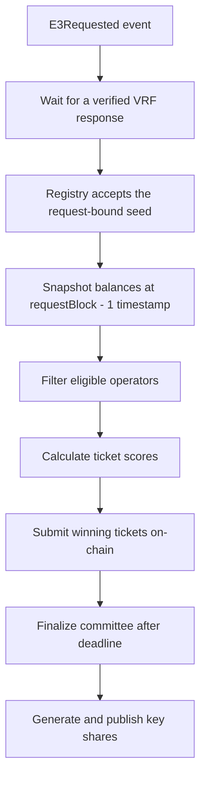

# Tickets & Sortition

Tickets influence your probability of selection for E3 committees. New requests admit at most one
operator per bond owner. Multiple machines under one owner compete for that owner's single seat.

## Ticket Overview

| Token     | Purpose                                            | Transferable |
| --------- | -------------------------------------------------- | ------------ |
| **FOLD**  | Ciphernode bond - required to register             | Yes          |
| **tFOLD** | Ticket token - determines committee selection odds | No           |
| **sUSDS** | Mainnet ticket collateral token                    | Yes          |
| **USDS**  | Mainnet fee token for E3 requests                  | Yes          |

Tickets are priced in the configured ticket collateral token and minted into non-transferable tFOLD
balances:

```
availableTickets = floor(ticketTokenBalance / ticketPrice)
```

## Managing Tickets

### Buy Tickets

The bond owner approves the ticket wrapper and funds the operator:

```bash
interfold --config /path/to/owner.yaml ciphernode tickets \
  --operator 0xOPERATOR buy --amount 100
```

This:

1. Pulls ticket collateral from the bond owner
2. Mints equivalent tFOLD to the operator address
3. Re-evaluates the operator's active status

To buy tickets from a wallet instead of the CLI, use step 5 of the
[interactive operator guide](https://dashboard.theinterfold.com/#operator). It prices the purchase
from the live `ticketPrice` and handles the approval.

### Burn Tickets

The bond owner queues ticket collateral for withdrawal:

```bash
interfold --config /path/to/owner.yaml ciphernode tickets \
  --operator 0xOPERATOR burn --amount 25
```

> Burning tickets takes effect immediately. Dropping below the minimum ticket balance makes you
> inactive until the owner tops it up again. Underlying ticket collateral is paid to the bond owner
> only after the exit delay and `claimExitsFor`.

### Check Balance

```bash
interfold ciphernode status
```

Look for the "Ticket balance" and "available" fields in the output.

## Ticket Economics

- **More eligible tickets improve your owner's best-score distribution**, with at most one seat per
  owner. Doubling tickets does not generally double the probability of a committee seat.
- **Balances are snapshotted** at `requestBlock - 1` - adding tickets after a request won't help
  that round
- **Idle tickets have opportunity cost** - rewards only accrue when you're selected and complete
  duties

### Rebalancing Tips

- Add tickets **one or two requests ahead** of anticipated demand to avoid gas spikes
- Keep a **small buffer** so slashing or removals don't instantly deactivate you
- Monitor `ticketPrice()` and `minTicketBalance()` before automating deposits on multiple networks

## Sortition Algorithm

The sortition process selects committees deterministically from a committee seed that becomes
available only after the paid E3 request is committed:



### 1. Eligibility Check

After the registry accepts the VRF response, the runtime creates a durable `CommitteeRequested`
event. Nodes then check whether they are eligible:

- Registered and not banned
- `isActive` (bond + ticket minimums satisfied)
- No exit in progress
- At least one unreserved local workload slot

The runtime treats each available ticket as one local concurrent-work slot. A node with one ticket
does not volunteer for a second E3 while its first slot is reserved or active. This is a local
liveness rule; the contract still recognizes the full request-time ticket balance.

### 2. Score Calculation

For each ticket you hold, a score is calculated:

```
score = keccak256(node, ticketNumber, e3Id, seed)
```

Each eligible node submits its best (lowest-scoring) ticket. The contract keeps the best submission
per bond owner, then selects the best `N` owners. Equal scores use the lower operator address. The
E3 computation seed is separate and does not affect ticket ranking.

The owner comes from `bondOwnerAt(operator, requestBlock - 1)`. A transfer after that snapshot does
not create another seat for the old owner in that E3. Requests created before the cap upgrade keep
their previous selection rule.

This is an address-based cap, not proof of an independent person. One controller can use several
owners before the snapshot, buy control later, or collude with other owners.

### 3. Ticket Submission

Operators submit their winning tickets during the configured submission window:

```bash
# The CLI handles this automatically when running
submitTicket(e3Id, ticketNumber)
```

Each submission emits `TicketSubmitted(e3Id, node, ticketId, score)`. The first submission also
stores the seed that the registry derived from the verified VRF result. The submission deadline is
the fulfillment time plus `sortitionSubmissionWindow`. A separate seed transaction is not needed.

Before a winning ticket leaves the sortition actor, the node persists a provisional capacity
reservation for that E3. This prevents two concurrent requests from using the same local slot. If
the ticket transaction fails, the E3 becomes terminal, or the node is not in the finalized
committee, the runtime releases the reservation.

The runtime shortlists `N + buffer` distinct owners by their best ticket scores. Each operator in
those groups can submit if it has local capacity, so an owner's best node being offline does not
exclude its backups. The contract keeps at most one seat per owner. A submission does not guarantee
a seat or reward. If owner history is incomplete, nodes submit without this shortlist and log a
warning; the contract still enforces the cap.

### 4. Committee Finalization

After the window closes:

1. Anyone can call `finalizeCommittee(e3Id)`
2. If at least `N` distinct request-time owners submitted eligible tickets, the registry emits
   `SortitionCommitteeFinalized(e3Id, committee, scores)`
3. If the threshold isn't met, `CommitteeFormationFailed` is emitted and the E3 fails
4. Each node reconciles its provisional reservation: selected nodes keep it, and unselected nodes
   release it
5. Selected nodes generate and publish key shares
6. Aggregated public key is published via `publishCommittee`

The reservation stays active until the E3 reaches a terminal stage. It is also reconstructed from
durable state after a restart, so restarting a node does not make an in-flight slot appear free.

Small needs 19 distinct eligible owners to form its committee, even though its DKG roster has 14
members. `committee:new` checks distinct eligible owners before fee approval and payment. Direct
contract callers must do this check themselves. The request-time active-node guard does not measure
distinct owners; an underfilled round fails at finalization. The preflight cannot establish that
owners are independent or that their machines will remain online.

## Parameters

| Parameter                               | Mainnet Launch Value | Description                                   |
| --------------------------------------- | -------------------- | --------------------------------------------- |
| `ticketPrice`                           | 1,000 sUSDS shares   | Ticket collateral needed per ticket           |
| `minTicketBalance`                      | 1 ticket             | Minimum to be active                          |
| `randomnessRequestTimeout`              | 3,600 seconds        | Maximum wait for a usable VRF response        |
| `sortitionSubmissionWindow`             | 600 seconds          | Time to submit after an accepted VRF response |
| Minimum committee `[H,N]`               | `[2,3]`              | DKG roster and finalized committee sizes      |
| Micro committee `[H,N]`                 | `[5,9]`              | DKG roster and finalized committee sizes      |
| Small committee `[H,N]`                 | `[14,19]`            | DKG roster and finalized committee sizes      |
| Runtime threshold `T` by committee enum | `1 / 4 / 9`          | Decryption requires `T+1` valid shares        |

## Monitoring

### Events to Watch

| Event                             | Meaning                                      |
| --------------------------------- | -------------------------------------------- |
| `CommitteeRandomnessRequested`    | A request-bound VRF request was created      |
| `RandomnessFulfilled`             | The provider stored a verified VRF response  |
| `RandomnessCircuitBreakerTripped` | A request's VRF window expired               |
| `TicketSubmitted`                 | A ticket was submitted for selection         |
| `CommitteeBondOwnerCapEnabled`    | The request uses one seat per snapshot owner |
| `SortitionCommitteeFinalized`     | Committee members were confirmed             |
| `CommitteeFormationFailed`        | Not enough operators submitted tickets       |
| `CommitteePublished`              | The aggregated public key is ready           |

This release supports Ethereum mainnet and Sepolia. Do not configure the ciphernode Registry reader
for Arbitrum until a later protocol release adds that deployment path.

### Log Messages

Watch your node logs for:

- `"This node was SELECTED for sortition"` - Your node can submit a candidate ticket
- `"This node was NOT selected for sortition"` - Your node lacks eligibility or local capacity, or
  its owner is outside the shortlist
- `"Ticket generated for score sortition"` - Winning ticket emitted to the event bus
- `"Ciphernode was not selected"` - Node wasn't in the selection set
- `"Ranking bond owners and their fallback operators for ticket submission"` - Candidate ranking
  started
- `"Node is in finalized committee"` - Committee confirmed, CiphernodeSelected emitted

## Troubleshooting

| Symptom                                    | Possible Cause                           | Solution                                      |
| ------------------------------------------ | ---------------------------------------- | --------------------------------------------- |
| Never being selected                       | Low ticket count relative to peers       | Add more tickets                              |
| `isActive` is false                        | Below minimum tickets or ciphernode bond | Top up tickets or bond more FOLD              |
| `SubmissionWindowClosed` errors            | RPC latency or slow submission           | Use faster RPC and check the network          |
| Committee missing your operator            | Submission did not succeed               | Check logs and retry on the next round        |
| `RandomnessCircuitBreakerTripped` observed | The VRF request expired without a result | Wait for governance to configure the provider |

## Best Practices

1. **Stagger ticket top-ups** - Avoid last-minute gas competition
2. **Alert on missed submissions** - Human intervention before committee deadlines
3. **Batch networks separately** - Run separate CLI instances per chain
4. **Track governance changes** - `randomnessProvider`, `randomnessRequestTimeout`,
   `sortitionSubmissionWindow`, `ticketPrice`, and `requiredCiphernodeBond` may change

## Next Steps

- **[Exits, Rewards & Slashing](./exits-and-slashing)** - Understand rewards and how to exit safely
