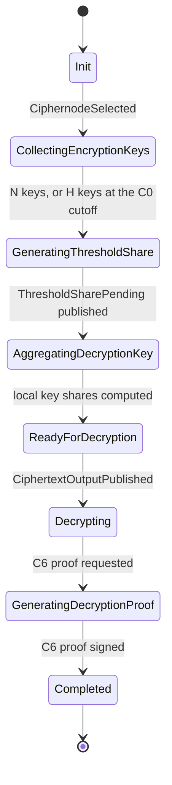

import { Callout } from 'nextra/components'
import { LinkCard, LinkCards, ThresholdRing } from '@/components/ui'

# PVDKG and ZK Proof Pipeline

This page describes the publicly verifiable distributed key generation (PVDKG) and the
zero-knowledge proof pipeline of the Interfold. It is for auditors and core contributors. It covers
the circuits, the DKG state machine, the phases P1 to P4, proof aggregation, on-chain anchoring, and
the behavior when committee members crash. At the end, you can follow every proof from the
ciphernode that makes it to the contract that checks it.

<ThresholdRing
  n={19}
  t={9}
  label='A small committee: 19 ciphernodes, an accepted roster of 14 dealers, and decryption with any 10 valid roster shares.'
  phases={[
    {
      core: 'DKG',
      senders: 'all',
      caption:
        'Key generation. Up to 19 members publish proven contributions. The key uses an accepted roster of 14.',
    },
    {
      core: 'Sealed',
      senders: 'none',
      caption: 'No single key. Each roster member holds only a Shamir share of the secret key.',
    },
    {
      core: 'Decrypt',
      senders: 'quorum',
      caption: 'Threshold decryption. Any 10 valid roster shares decrypt the output.',
    },
  ]}
/>

The scheme is threshold BFV. After [sortition](/internals/sortition) finalizes a committee of N
ciphernodes, the committee selects an accepted roster of H dealers. The threshold public key is the
sum of the H roster contributions. Each roster member holds a Shamir share of the matching secret
key, and any T + 1 roster members can decrypt together. The circuits are written in Noir and proved
with Barretenberg (`bb`) as UltraHonk proofs. For the cryptographic specification, read the
[PVDKG article](https://blog.theinterfold.com/verifiability-in-the-coordination-trilemma/).

## Terminology

| Term                        | Definition                                                                                             |
| --------------------------- | ------------------------------------------------------------------------------------------------------ |
| Individual key pair         | A BFV key pair that one ciphernode makes for one DKG. It encrypts the Shamir shares sent to that node. |
| Secret key contribution     | One ciphernode's part of the threshold secret key.                                                     |
| Public key share            | The threshold BFV public key that matches one secret key contribution.                                 |
| Smudging noise contribution | One ciphernode's part of the smudging noise that protects partial decryptions.                         |
| Secret key share            | The Shamir share of the summed secret key that one roster member holds after C4.                       |
| Smudging noise share        | The Shamir share of the summed smudging noise that one roster member holds after C4.                   |
| Threshold public key        | The sum of the roster public key shares. Data providers encrypt to this key.                           |
| Partial decryption          | One roster member's decryption share of a ciphertext, before reconstruction.                           |
| Committee size N            | The number of ciphernodes that `finalizeCommittee` selects.                                            |
| Threshold T                 | The polynomial degree of the Shamir sharing. Decryption needs T + 1 valid shares.                      |
| Roster size H               | The exact number of dealers whose contributions form the threshold key.                                |
| Accepted roster S           | The ascending list of H party IDs that the active aggregator proposes and every node accepts.          |
| Party ID                    | The index of a member in the address-sorted committee. The lowest address is party 0.                  |
| Active aggregator           | The member with the lowest eligible party ID. It coordinates the roster and the aggregate proofs.      |

## Committee shapes and fault budget

`crates/zk-helpers/src/ciphernodes_committee.rs` defines three committee shapes. The on-chain
registry stores `threshold` as `[H, N]`. The runtime field `threshold_m` carries T and `threshold_n`
carries N.

| Committee | N   | T   | H   | Members that can drop before the roster ($N - H$) | Roster members that can drop before decryption ($H - (T + 1)$) |
| --------- | --- | --- | --- | ------------------------------------------------- | -------------------------------------------------------------- |
| `minimum` | 3   | 1   | 2   | 1                                                 | 0                                                              |
| `micro`   | 9   | 4   | 5   | 4                                                 | 0                                                              |
| `small`   | 19  | 9   | 14  | 5                                                 | 4                                                              |

These numbers describe the circuit shape and the liveness budget. An omitted member is not proven
dishonest.

## Circuit map

The `ProofType` enum in `crates/events/src/interfold_event/signed_proof.rs` names each node-made
proof. Its numeric value is the `proofType` that slashing evidence uses. The `CircuitName` enum in
`crates/events/src/interfold_event/proof.rs` maps each proof to a package under `circuits/bin/`.

| ID  | `ProofType` (value)                 | `CircuitName`                | Package                                  | Phase | Proves                                                                         |
| --- | ----------------------------------- | ---------------------------- | ---------------------------------------- | ----- | ------------------------------------------------------------------------------ |
| C0  | `C0PkBfv` (0)                       | `PkBfv`                      | `dkg/pk`                                 | P1    | Commits to the individual public key used for share encryption.                |
| C1  | `C1PkGeneration` (1)                | `PkGeneration`               | `threshold/pk_generation`                | P1    | The public key share comes from the committed secret key contribution.         |
| C2a | `C2aSkShareComputation` (2)         | `SkShareComputation`         | `dkg/sk_share_computation`               | P1    | The secret key Shamir shares match the C1 commitment and are a valid sharing.  |
| C2b | `C2bESmShareComputation` (3)        | `ESmShareComputation`        | `dkg/e_sm_share_computation`             | P1    | The same for the smudging noise shares.                                        |
| C3a | `C3aSkShareEncryption` (4)          | `ShareEncryption`            | `dkg/share_encryption`                   | P1    | A secret key share is BFV-encrypted under the recipient's C0 key.              |
| C3b | `C3bESmShareEncryption` (5)         | `ShareEncryption`            | `dkg/share_encryption`                   | P1    | The same for a smudging noise share.                                           |
| C4a | `C4aSkShareDecryption` (6)          | `DkgShareDecryption`         | `dkg/share_decryption`                   | P1    | The decrypted roster shares match their C2a commitments. Commits to their sum. |
| C4b | `C4bESmShareDecryption` (7)         | `DkgShareDecryption`         | `dkg/share_decryption`                   | P1    | The same for the smudging noise shares.                                        |
| C5  | `C5PkAggregation` (8)               | `PkAggregation`              | `threshold/pk_aggregation`               | P2    | The threshold public key is the sum of the H roster shares committed in C1.    |
| C6  | `C6ThresholdShareDecryption` (9)    | `ThresholdShareDecryption`   | `threshold/share_decryption`             | P4    | A partial decryption uses the C4 secret key and smudging noise shares.         |
| C7  | `C7DecryptedSharesAggregation` (10) | `DecryptedSharesAggregation` | `threshold/decrypted_shares_aggregation` | P4    | Lagrange interpolation, CRT reconstruction, and decoding give the plaintext.   |

P3 uses the user-data encryption packages `threshold/user_data_encryption_ct0`,
`threshold/user_data_encryption_ct1`, and the wrapper `threshold/user_data_encryption`. They have no
`ProofType` because data providers, not ciphernodes, make these proofs.

### Recursive aggregation circuits

The packages under `circuits/bin/recursive_aggregation/` fold the inner proofs into two on-chain
proofs.

| Package                           | `CircuitName`                  | Role                                                                                   |
| --------------------------------- | ------------------------------ | -------------------------------------------------------------------------------------- |
| `c2ab_fold`                       | `C2abFold`                     | Folds C2a and C2b.                                                                     |
| `c3_fold`, `c3_fold_kernel`       | `C3Fold`, `C3FoldKernel`       | Folds the C3 proofs of one branch in sequence. The kernel makes the first accumulator. |
| `c3ab_fold`                       | `C3abFold`                     | Folds the final secret key and smudging noise C3 folds.                                |
| `c4ab_fold`                       | `C4abFold`                     | Folds C4a and C4b.                                                                     |
| `node_fold`                       | `NodeFold`                     | Folds C0, C1, `c2ab_fold`, `c3ab_fold`, and `c4ab_fold` for one node.                  |
| `nodes_fold`, `nodes_fold_kernel` | `NodesFold`, `NodesFoldKernel` | Folds the H `node_fold` proofs in sequence.                                            |
| `dkg_aggregator`                  | `DkgAggregator`                | Verifies `nodes_fold` and C5. Its EVM proof goes to `publishCommittee`.                |
| `c6_fold`, `c6_fold_kernel`       | `C6Fold`, `C6FoldKernel`       | Folds the T + 1 C6 proofs of one ciphertext.                                           |
| `decryption_aggregator`           | `DecryptionAggregator`         | Verifies `c6_fold` and C7. Its EVM proof goes to `publishPlaintextOutput`.             |

### Proof count per E3

L is the number of threshold CRT moduli: 2 for `insecure-512` and 3 for `secure-8192`. The current
TrBFV code makes one smudging noise share set, so the smudging multiplicity Z is 1.

| Circuit | Count for one node                               | Count for the committee               |
| ------- | ------------------------------------------------ | ------------------------------------- |
| C0      | 1                                                | Up to N                               |
| C1      | 1                                                | Up to N                               |
| C2a     | 1                                                | Up to N                               |
| C2b     | 1                                                | Up to N                               |
| C3a     | $(N - 1) \cdot L$                                | Up to $N (N - 1) L$                   |
| C3b     | $(N - 1) \cdot L \cdot Z$                        | Up to $N (N - 1) L Z$                 |
| C4a     | 1                                                | H used in the key                     |
| C4b     | $Z$                                              | H used in the key                     |
| C5      | 1 (active aggregator)                            | 1                                     |
| C6      | 1 for each ciphertext output                     | T + 1 used for each ciphertext output |
| C7      | 1 for each ciphertext output (active aggregator) | 1 for each ciphertext output          |

C3 is the most expensive circuit. Its witness is N wide, also when some C0 keys are missing. A
dealer proves every slot except its own. For a recipient without a C0 key, the dealer encrypts the
share under its own C0 key to fill the slot. The dealer does not deliver that placeholder.

## Two key hierarchies

The protocol uses two different BFV key pairs. They use different parameter sets.

| Key            | Preset (`BfvPreset`)                            | Purpose                                                        | Lifetime |
| -------------- | ----------------------------------------------- | -------------------------------------------------------------- | -------- |
| Individual key | `InsecureDkg512` or `SecureDkg8192`             | Encrypts the Shamir shares sent to one node. C0 commits to it. | One DKG  |
| Threshold key  | `InsecureThreshold512` or `SecureThreshold8192` | Data providers encrypt to it. C1 proves each contribution.     | One E3   |

The threshold key uses a common random polynomial (CRP) $a$. Every node derives the same CRP from
the default seed with `create_deterministic_crp_from_default_seed`. The node encrypts its individual
secret key at rest with its local `Cipher` (AES-256-GCM with an Argon2id key).

## DKG state machine

Each selected ciphernode runs one `ThresholdKeyshare` actor for the E3. The actor moves through the
`KeyshareState` enum in `crates/keyshare/src/threshold_keyshare/state.rs`.



| State                       | Work in this state                                                                                         |
| --------------------------- | ---------------------------------------------------------------------------------------------------------- |
| `CollectingEncryptionKeys`  | Make the individual key pair, request C0, and collect peer C0 keys.                                        |
| `GeneratingThresholdShare`  | Make the TrBFV contribution and the Shamir shares, then request C1, C2, and C3.                            |
| `AggregatingDecryptionKey`  | Collect and verify peer shares, publish signed readiness, accept one roster, and compute local key shares. |
| `ReadyForDecryption`        | Prove C4, exchange `DecryptionKeyShared`, verify peer C4 proofs, and publish `KeyshareCreated`.            |
| `Decrypting`                | Compute the partial decryption of each ciphertext output.                                                  |
| `GeneratingDecryptionProof` | Wait for the signed C6 proofs.                                                                             |
| `Completed`                 | The node published its decryption share.                                                                   |

Every state except `Completed` can move to `Failed { failed_at_stage, reason }`. A persisted failure
can only be written again with the same payload, so a restart cannot resume an earlier phase.

## P1: Distributed key generation

### Frozen DKG timing

When `CiphernodeSelected` arrives, the node reads `getDeadlines(e3Id)` and
`getE3TimeoutConfig(e3Id)` from the Interfold contract. It persists the frozen DKG deadline and
window before it makes keys. The DKG deadline is the ticket deadline plus `dkgWindow`. Each
collector cutoff is a fraction of that window, measured from the ticket deadline:

$$
t_{\text{cut}} = \min\!\left(t_{\text{dkg}} - W_{\text{dkg}} + \left\lfloor \frac{W_{\text{dkg}} \cdot \text{bps}}{10\,000} \right\rfloor,\ t_{\text{dkg}}\right)
$$

| Collector                      | Cutoff (bps) | Kind                                                | Override variable                                  |
| ------------------------------ | ------------ | --------------------------------------------------- | -------------------------------------------------- |
| `EncryptionKeyCollector`       | 1000 (10%)   | Hard cutoff for C0 keys                             | `E3_ENCRYPTION_KEY_COLLECTION_TIMEOUT_SECS`        |
| `ThresholdShareCollector`      | 7500 (75%)   | Soft checkpoint. The hard stop is the DKG deadline. | `E3_THRESHOLD_SHARE_COLLECTION_TIMEOUT_SECS`       |
| `DecryptionKeySharedCollector` | 10000 (100%) | Hard cutoff at the DKG deadline                     | `E3_DECRYPTION_KEY_SHARED_COLLECTION_TIMEOUT_SECS` |

An override variable can only make a cutoff earlier. After a restart, a collector uses the time that
remains, not a new window. The mainnet configuration sets `dkgWindow` to 21600 seconds. The C0
cutoff is then 36 minutes after the ticket deadline, and the soft checkpoint is at 4.5 hours.

### C0: individual key commitment

The node makes its individual BFV key pair and publishes `EncryptionKeyPending`. `ProofRequestActor`
requests `ZkRequest::PkBfv`. C0 takes the individual public key polynomials $pk_0$ and $pk_1$ over
the DKG moduli and outputs `pk_commitment`. C0 does not prove correct key generation. It binds the
key so that C3 can prove which key encrypted each share.

The node publishes `EncryptionKeyCreated` with the signed C0 proof. Receivers verify it in
`ProofVerificationActor` before they store the key. The `EncryptionKeyCollector` finishes when all N
keys arrive. At the C0 cutoff, it continues if it has at least H keys that include the node's own
key. With fewer keys, the node records `DKGTimeout` and stops.

### C1: threshold share generation

The node requests `GenPkShareAndSkSss` and then `GenEsiSss` from TrBFV. It gets its secret key
contribution $sk$, its public key share, its smudging noise contribution $e_{sm}$, and N Shamir
shares of each secret. C1 proves the BFV key generation relation for each CRT modulus $q_\ell$:

$$
pk_0 = -a \cdot sk + e + r_2 \cdot (X^{d} + 1) + r_1 \cdot q_\ell, \qquad pk_1 = a
$$

Here $d$ is the ring degree, and $r_1$ and $r_2$ are quotient witnesses. The circuit checks the
relation at one Fiat-Shamir challenge point (the Schwartz-Zippel method). C1 outputs three
commitments in this order: `sk_commitment` for C2a, `pk_commitment` for C5, and `e_sm_commitment`
for C2b.

### C2: share computation

C2a proves the secret key sharing and C2b proves the smudging noise sharing. For each coefficient
$i$ and modulus $j$, the share vector is $y_{i,j} = (f(0), f(1), \dots, f(N))$ with $f(0)$ equal to
the secret coefficient. Each circuit checks four properties:

1. The secret hashes to `expected_secret_commitment` from C1.
2. The first entry of each share vector equals the secret coefficient.
3. Every share is in $[0, q_j)$.
4. The shares lie on a polynomial of degree at most T. The Reed-Solomon parity check is
   $H_j \cdot y_{i,j}^{\top} \equiv 0 \pmod{q_j}$, with a parity matrix of size
   $(N - T) \times (N + 1)$.

C2 outputs one commitment for each (party, modulus) pair, an $N \times L$ grid. C3 and C4 consume
this grid.

### C3: share encryption

C3a encrypts one secret key share row and C3b one smudging noise share row. Each proof takes two
public inputs: `expected_pk_commitment` from the recipient's C0 and `expected_message_commitment`
from the sender's C2. It proves the BFV encryption relation at a Fiat-Shamir challenge point and
outputs `ct_commitment`. The proof therefore shows that the correct share is encrypted under the
correct recipient key.

### Share publication

`ProofRequestActor` makes all C1, C2, and C3 proofs in parallel. It publishes nothing until the
complete proof plan is ready. It then signs each proof and publishes one recipient-scoped
`ThresholdShareCreated` for each recipient with a C0 key. That event carries:

- The public key share and the recipient's encrypted shares.
- The signed C2a and C2b proofs.
- The signed C3a and C3b proofs for that recipient.

The signed C1 proof does not travel in `ThresholdShareCreated`. It travels later in
`KeyshareCreated`.

### Share verification

`ThresholdShareCollector` keeps shares addressed to this node. When all $N - 1$ external shares
arrive, it closes. At the 75% checkpoint, it starts verification if it has at least $H - 1$ external
shares, and it keeps collecting. Later shares extend the verified dealer set until all $N - 1$
arrive or the DKG deadline passes. Only the DKG deadline can emit `ThresholdShareCollectionFailed`.

`ShareVerificationActor` verifies each batch in three phases:

1. **Signatures.** It recovers the signer of each proof, requires one signer for each party, and
   checks the circuit names.
2. **Commitment consistency.** It sends `CommitmentConsistencyCheckRequested` to the per-E3 checker.
   Parties with inconsistent commitments skip the ZK step. See
   [commitment consistency](/internals/commitment-consistency).
3. **ZK verification.** It runs `bb verify` for the remaining parties and publishes
   `ShareVerificationComplete` with the dishonest parties.

The keyshare actor then drops failed dealers and C3 proofs that target a different recipient key. It
saves each verified dealer as a `DkgDealer { party_id, contribution_hash }`, where:

$$
\text{contribution\_hash} = \operatorname{keccak256}\big(\operatorname{abi.encode}(\operatorname{keccak256}(pk\_share),\ \sigma_{C2a},\ \sigma_{C2b})\big)
$$

The value $\sigma$ is `ProofPayload.statement_digest()`. It covers the E3, the proof type, the
circuit, and the public signals, but not the randomized proof bytes. A replay of the same statement
therefore cannot make a second dealer identity.

### Readiness and roster selection

When at least H dealers, including the node itself, pass verification, the node publishes a signed
`DkgCoordination` message of kind `Ready`. The message lists the verified dealers in ascending party
ID order. The signature covers this digest:

```text
keccak256(abi.encode(
  keccak256("InterfoldDkgCoordination(uint256 chainId,address interfold,uint256 e3Id,uint256 partyId,uint256 kind,bytes32 dealersHash)"),
  chainId, interfold, e3Id, partyId, kind, dealersHash))
```

The active aggregator runs `select_ready_roster`. It returns the first H-party set, in ascending
party ID order, that is mutually ready:

$$
S \subseteq \text{Ready}, \quad |S| = H, \quad \forall\, i, j \in S:\ \text{dealer}_j \in \text{Ready}_i
$$

Each member's own dealer entry must be in its own list, with the same contribution hash that the
other members hold. The aggregator publishes `DkgCoordination` of kind `Roster`. A receiver accepts
a roster only when all of these conditions are true:

- The signer is the committee member at the proposer's party ID.
- The proposer's party ID is at most the active party ID from `AggregatorChanged`.
- The roster has exactly H dealers, and neither the proposer nor a dealer is expelled.
- The proposer's Ready list and the receiver's own Ready list contain the roster.
- Every Ready list that the receiver holds for a roster dealer contains the roster.

Before C4 starts, a roster from a lower party ID replaces a roster from a higher party ID. After C4
starts, the roster is fixed. A node starts C4 only if its own Ready list contains every roster
contribution. On acceptance, the node emits `CommitmentRosterSelected` for the commitment checker.

The network actor sends the latest local Ready and Roster messages again every 30 seconds. Each
repeat uses a fresh transport delivery ID, so the libp2p duplicate cache does not drop it.

This coordination is not Byzantine agreement. A malicious active aggregator can delay progress until
failover. It cannot publish two accepted keys, because the H-row proof enforces one roster and
`publishCommittee` accepts one result.

### C4: share decryption and aggregation

Each roster member decrypts the shares that the H roster dealers sent to it, with its individual
secret key. The decryption itself is outside the circuit. The node requests `CalculateDecryptionKey`
and gets its secret key share and smudging noise share. C4a and C4b then prove, for the H roster
rows:

1. Each decrypted share hashes to the commitment that its dealer published in C2.
2. The aggregate is the coefficient-wise sum:
   $\text{agg}[\ell][i] = \sum_{s \in S} \text{share}[s][\ell][i] \bmod q_\ell$.
3. The aggregate is reduced, reversed, and centered to match the representation of C6.
4. The output is `commit(agg_sk)` for C4a and `commit(agg_e_sm)` for C4b.

The node publishes `DecryptionKeyShared` with its signed C4 proofs. It collects and verifies the C4
proofs of the other $H - 1$ roster members. It then publishes `KeyshareCreated` with its public key
share and its signed C1 proof. A node outside the roster makes C4 only if it holds all H roster
shares. Its C4 does not add a row to the key.

## P2: Public key aggregation (C5)

Every committee member buffers `KeyshareCreated` from verified members. After all H roster members
submit a keyshare, each member persists `VerifyingC1` and publishes
`AggregationInputsReady(PublicKey)`. Only the active aggregator then verifies the H C1 proofs. A
failed C1 proof ends the DKG with `DKGInvalidShares`.

The active aggregator sums the H roster shares in roster order:

$$
pk_{0,\text{agg}} = \sum_{s \in S} pk_{0,s} \bmod q_\ell, \qquad pk_{1,\text{agg}} = a
$$

C5 checks each share against its C1 `pk_commitment` and proves the sum. It does not take $pk_1$ as a
witness. It uses the circuit-constant CRP $a$ directly. C5 outputs `commit(pk0_agg, crp)`. This
value is the `pkCommitment` that the registry stores.

## P3: User encryption

Data providers encrypt inputs to the threshold public key with the user-data encryption circuits,
which follow the [Greco](https://blog.theinterfold.com/enclave-cryptography-greco-fhe-zk/) design.
The `ct0` and `ct1` proofs share a `u_commitment`. The wrapper `user_data_encryption` outputs
`(pk_commitment, ct_commitment, k1_commitment)`. An E3 program binds the input proof to the key. For
example, CRISP passes the on-chain `committeePublicKey` commitment as a public input.

The compute provider runs the E3 program over the ciphertexts. `publishCiphertextOutput` then stores
the output hash and its SAFE ciphertext commitment on-chain.

## P4: Threshold decryption (C6, C7)

### C6: partial decryption

After `CiphertextOutputPublished`, each roster member computes one partial decryption for each
ciphertext output. For each modulus $q_\ell$, C6 proves:

$$
d_\ell = ct_{0,\ell} + ct_{1,\ell} \cdot sk_\ell + e_{sm,\ell} + r_{2,\ell} \cdot (X^{d} + 1) + r_{1,\ell} \cdot q_\ell
$$

The smudging noise $e_{sm}$ hides the secret key share. C6 first checks that $sk$ and $e_{sm}$ match
the C4 commitments. It binds the witness ciphertext to `ct_commitment` and checks the relation at a
Fiat-Shamir challenge point. Its public inputs are `expected_sk_commitment`,
`expected_e_sm_commitment`, `ct_commitment`, `domain_hi`, and `domain_lo`. Its output is
`d_commitment`, a commitment to the first 100 coefficients of $d$ for each modulus.

The decryption domain binds each C6 proof to one E3:

$$
\text{domain} = \operatorname{keccak256}\big(\operatorname{abi.encode}(\text{chainId},\ \text{Interfold},\ e3Id,\ \text{committeeHash},\ \text{ciphertextOutputHash},\ \text{committeePublicKey})\big)
$$

The node publishes `DecryptionshareCreated` with one signed C6 proof for each ciphertext output.

### Plaintext aggregation

Every committee member stores valid shares. A valid share comes from an accepted roster member. Its
signature, E3, proof type, raw share commitment, and ciphertext position must also be correct. When
T + 1 distinct roster shares are durable, the member publishes `AggregationInputsReady(Plaintext)`.
For `small`, that is 10 shares, not all 14. Shares that arrive during C6 verification go to a
durable backup queue. If a proof or a raw share check fails, the active aggregator uses backups
while T + 1 valid roster shares are still possible.

### C7: reconstruction

C7 takes the T + 1 shares with 1-indexed party IDs $x_i$ in strictly increasing order. It proves
three steps:

1. Lagrange interpolation at zero for each modulus, with coefficients computed in the circuit:
   $u_\ell = \sum_i d_{i,\ell} \cdot \lambda_i(0) \bmod q_\ell$, where
   $\lambda_i(0) = \prod_{j \ne i} \frac{-x_j}{x_i - x_j}$.
2. CRT reconstruction: $u_\ell + r_\ell \cdot q_\ell = u_{\text{global}}$ for every modulus.
3. Decoding with the precomputed $-Q^{-1} \bmod t$, where $Q = \prod_\ell q_\ell$ and $t$ is the
   plaintext modulus.

C7 compares every decoded coefficient with the claimed message, including coefficients claimed as
zero.

## Crash tolerance and liveness

The DKG is crash tolerant: it can finish when some members are offline. The protocol omits missing
members at defined points. It does not accuse or slash them, because a local timeout does not prove
that a peer failed to publish.

| Member stops                                          | Protocol behavior                                                                                       | Result                                                 |
| ----------------------------------------------------- | ------------------------------------------------------------------------------------------------------- | ------------------------------------------------------ |
| Before its C0 key arrives                             | Other members continue at the C0 cutoff with at least H keys. They fill its C3 slots with placeholders. | It cannot be a dealer or a roster member.              |
| Before its threshold shares arrive                    | Other members start roster work with at least $H - 1$ external shares and accept later shares.          | It is not in the roster.                               |
| A member has fewer than H verified dealers            | It stays outside C4. It does not fail the E3.                                                           | The E3 continues if a roster forms.                    |
| Active aggregator, during roster selection            | After 10 minutes, the next eligible party becomes active and uses the saved Ready reports.              | The roster forms if H members are mutually ready.      |
| A roster member, after roster acceptance              | No replacement exists. The fixed H-row proof needs every roster member.                                 | The E3 fails with `DKGTimeout` after the DKG deadline. |
| A roster member is expelled after acceptance          | The public key aggregator stops the DKG. On-chain, an expulsion below H fails the E3 at once.           | The E3 fails.                                          |
| Active aggregator, during C5 or publication           | After 10 minutes, the next eligible party resumes from its persisted phase.                             | Publication continues.                                 |
| Up to $H - (T + 1)$ roster members, before decryption | The aggregator starts at T + 1 valid roster shares.                                                     | Decryption continues.                                  |
| Active aggregator, during plaintext aggregation       | After 10 minutes, the next eligible party resumes.                                                      | Decryption continues.                                  |

<Callout type='warning'>
  After the roster is accepted, each of its H members is necessary for the DKG. A roster member that
  stops permanently can fail the E3, even if other committee members stay online.
</Callout>

### Restart recovery

A member that restarts recovers its work from the durable event log:

- It restores collectors with the remaining time to each cutoff.
- It holds replayed `GenPkShareAndSkSss` and `GenEsiSss` responses until their prerequisites return.
  It does not make new random shares that conflict with its published C1 to C3 proofs.
- `NodeProofAggregator` restores saved inner proofs and fold metadata, then issues the fold again or
  publishes the saved result.
- A persisted `Failed` state publishes the same `E3Failed` payload again after `EffectsEnabled`.
- A local prover, verifier, or worker failure retries the same request. It never counts as proof
  that a peer sent invalid data.

When a fatal collector timeout occurs, the node records a local `E3Failed` event. On-chain, the E3
stays at `CommitteeFinalized` until the DKG deadline. After that, `markE3Failed` records
`DKGTimeout`.

## Proof aggregation and on-chain anchoring

The contracts accept only aggregated proofs. The active aggregator submits one recursive proof for
the DKG and one for the decryption. Production nodes always aggregate. The EVM writer publishes a
single ciphertext output only. It refuses to publish an E3 result that has more than one decrypted
output.

| `ZkRequest`             | Made by            | Output                                                                 |
| ----------------------- | ------------------ | ---------------------------------------------------------------------- |
| `NodeDkgFold`           | Each roster member | A `NodeFold` proof. The node then signs a fold attestation.            |
| `DkgAggregation`        | Active aggregator  | `NodesFold`, C5, and the `DkgAggregator` EVM proof                     |
| `DecryptionAggregation` | Active aggregator  | `C6Fold`, C7, and the `DecryptionAggregator` EVM proof for each output |

### Committee hash

Both final proofs bind the ordered committee. The hash covers the raw 20-byte addresses of
`topNodes` in ascending order, without padding:

$$
h = \operatorname{keccak256}(a_0 \,\|\, a_1 \,\|\, \cdots \,\|\, a_{N-1}), \qquad h_{\text{hi}} = h \gg 128, \quad h_{\text{lo}} = h \bmod 2^{128}
$$

Solidity computes it in `CommitteeHashLib.hash`. Rust computes it in
`e3_committee_hash::hash_committee_addresses` (`crates/committee-hash`). Noir computes it in
`committee_hash_limbs`. A shared test vector checks that the three implementations agree.

### What the DKG proof enforces

`node_fold` verifies the five inner proofs of one node and asserts these same-party links:

- C1 `sk_commitment` equals the C2a `expected_secret_commitment`, and C1 `e_sm_commitment` equals
  the C2b one.
- The C3a and C3b recipient key commitments are equal for every slot.
- For every slot except the node's own, the C3 message commitment equals the C2 share commitment.

`dkg_aggregator` verifies `nodes_fold` and C5, then asserts these cross-party links:

- The committee hash limbs match the N committee addresses.
- The H party IDs are strictly increasing and less than N.
- Each folded row carries the matching party ID.
- For each roster sender $s$ and recipient $r$, the C3 key slot of $s$ for $r$ equals the C0
  commitment of $r$.
- For the same pairs, the C4 rows of $r$ for $s$ equal the C2 commitments of $s$ for $r$. This
  applies to both branches.
- Row $i$ of C5 equals the C1 `pk_commitment` of roster member $i$.

### DKG proof public inputs

The `DkgAggregator` EVM proof has $3H + 6$ public inputs:

| Index                | Value                                   |
| -------------------- | --------------------------------------- |
| 0                    | `nodes_fold_key_hash`                   |
| 1                    | `c5_key_hash`                           |
| 2 to $1 + H$         | `party_ids` (0-indexed committee slots) |
| $2 + H$              | `committee_hash_hi`                     |
| $3 + H$              | `committee_hash_lo`                     |
| $4 + H$              | Aggregate verification key hash         |
| $5 + H$ to $4 + 2H$  | `sk_agg_commits`                        |
| $5 + 2H$ to $4 + 3H$ | `esm_agg_commits`                       |
| $5 + 3H$             | Aggregated public key commitment        |

### Fold attestations

After its `NodeFold` proof, each roster member signs an EIP-712 attestation and gossips it in
`DKGRecursiveAggregationComplete`. The domain and struct come from `DkgFoldAttestationLib`:

```solidity
// EIP712Domain(string name,string version,uint256 chainId,address verifyingContract)
// name = "InterfoldDkgFoldAttestation", version = "1",
// verifyingContract = the DkgFoldAttestationVerifier frozen for this E3
DkgFoldAttestation(address registry,uint256 e3Id,uint256 partyId,bytes32 skAggCommit,bytes32 esmAggCommit)
```

The aggregator collects exactly H attestations and builds the bundle
`(Attestation[], PartySlotBinding[])`. Each binding maps a `partyId` to an operator address.

### `publishCommittee` verification

Any caller can call `publishCommittee(e3Id, pkCommitment, proof, dkgAttestationBundle)`. The
registry checks, in this order:

1. The committee is `Finalized`, `activeCount` is at least H, no key is published yet, and
   `pkCommitment` is not zero.
2. It computes the committee hash from `topNodes` and stores `pkCommitment`.
3. The E3 `pkVerifier` (`BfvPkVerifier`) checks the public input count and the committee hash limbs.
   It compares the two VK hashes with its immutable `expectedNodesFoldKeyHash` and
   `expectedC5KeyHash`, and the last input with `pkCommitment`. Then the Honk verifier checks the
   proof.
4. The E3's frozen `DkgFoldAttestationVerifier` derives $H = (\text{len} - 6) / 3$ and requires
   strictly increasing proof party IDs and H bindings. For each binding, it requires:
   - `canonicalCommitteeNodeAt(e3Id, partyId)` equals the bound node.
   - The node is an active committee member.
   - The EIP-712 signer is the bound node.
   - The signed `skAggCommit` and `esmAggCommit` equal the proof values at that party's slot.
5. The registry stores `dkgPartyIds`, `dkgSkAggCommits`, and `dkgEsmAggCommits` for the E3.
6. `Interfold.onCommitteePublished` moves the E3 to `KeyPublished`. It reverts after the DKG
   deadline, and after the input window end with `InputWindowClosedBeforeKeyPublication`.
7. The registry emits `CommitteeProofPublished(e3Id, nodes, pkCommitment, proof)`.

<Callout type='info'>
  `BfvPkVerifier.verify` accepts `e3Id`, `committeeRoot`, and `sortedNodes` but does not use them.
  The current DKG circuit has no public input for them. The proof binds to the committee through the
  committee hash. The fold attestations bind the registry, the E3, the chain, and the verifier.
</Callout>

The slot binding stops an aggregator from moving a signed attestation to a different party ID. The
anchors let later steps map each DKG output to `topNodes[partyId]`.

### Public key transport

`publishCommittee` stores only the commitment. Committee members then send the serialized key with
`publishCommitteePublicKey` in 90 KiB chunks, with a maximum of 512 KiB, while the E3 is at
`KeyPublished`. The registry emits `CommitteePublicKeyChunkPublished`. A consumer assembles a
complete chunk set, checks `keccak256(publicKey) == candidateHash`, and recomputes the commitment
before it uses the key.

### Decryption proof

`publishPlaintextOutput` computes the decryption domain on-chain and calls the E3 decryption
verifier (`BfvDecryptionVerifier`). The `DecryptionAggregator` EVM proof has $8 + 3(T + 1) + 100$
public inputs:

| Index           | Value                                                |
| --------------- | ---------------------------------------------------- |
| 0, 1            | `c6_fold` and C7 VK hashes                           |
| 2, 3            | `committee_hash_hi`, `committee_hash_lo`             |
| 4, 5            | `domain_hi`, `domain_lo`                             |
| 6               | `ciphertext_commitment`                              |
| 7               | Aggregate verification key hash                      |
| next $3(T + 1)$ | `party_ids`, then `expected_sk`, then `expected_esm` |
| last 100        | Plaintext coefficients                               |

`decryption_aggregator` requires one domain and one ciphertext commitment across all C6 leaves. It
requires each C6 `d_commitment` to equal the matching C7 input. Its party IDs must be 1-indexed,
strictly increasing, and at most N. The wrapper then checks:

- Every public input is a canonical BN254 field element, and each plaintext coefficient fits in 64
  bits.
- The VK hashes, the committee hash limbs, the domain limbs, and the stored ciphertext commitment.
- `keccak256` of the 100 coefficients, each as 8 little-endian bytes, equals the plaintext hash.
- For each party, `party_id - 1` is in the DKG anchors, and the proof commitments equal the stored
  `dkgSkAggCommits` and `dkgEsmAggCommits`.

### Verifier sync

The Honk verifiers `DkgAggregatorVerifier.sol` and `DecryptionAggregatorVerifier.sol` are generated
from the recursive VKs of `dkg_aggregator` and `decryption_aggregator` with
`bb write_solidity_verifier`. The files in
`packages/interfold-contracts/contracts/verifiers/bfv/honk/` are the `insecure-512` and `minimum`
pair. The other pairs are in `honk/<preset>/<committee>/`. A deployment must use the pair that
matches its preset and committee.

`pnpm generate:verifiers` has two modes. `--check` regenerates in memory and fails on any
difference. `tests/integration/lib/prebuild.sh` uses it. `--write` overwrites the committed files.
Both modes refuse to run unless `dist/circuits/<preset>/<committee>/.build-stamp.json` exists and
`circuits/bin/.active-preset.json` names the same pair. The toolchain versions are pinned in
`crates/zk-prover/versions.json`.

### Verifier rotation

Each E3 freezes its registry and its `DkgFoldAttestationVerifier` at request time and announces both
in `DkgFoldAttestationContextEstablished`. A node restores this context after a restart. A verifier
change uses `proposeDkgFoldAttestationVerifier`, then `commitDkgFoldAttestationVerifier` after
`DKG_FOLD_VERIFIER_TIMELOCK` (2 days). The owner can cancel a proposal with
`cancelDkgFoldAttestationVerifierProposal`. The one-time `setInitialDkgFoldAttestationVerifier`
works only when no verifier is set. A new verifier applies only to later E3 requests.

### Test-only aggregation bypass

A binary built with the Cargo feature `test-only-skip-proof-aggregation` accepts the node setting
`skip_proof_aggregation`. The node then reuses the C5 and C7 proofs as placeholders for mock
verifiers. A production binary rejects this setting at startup. The contracts still call their
verifiers.

## Proof lifecycle

### Generation

A `*Pending` event reaches `ProofRequestActor`, which dispatches `ComputeRequest::zk` with a
`ZkRequest`. `ZkActor` writes the witness and runs `bb prove`, then returns
`Proof { data, public_signals }`. A failed attempt retries the same request. Attempts after the
first use the Barretenberg low-memory mode.

### Signing

The node signs every proof with its operator key before it sends the proof. The digest is:

```text
keccak256(abi.encode(
  keccak256("ProofPayload(uint256 chainId,uint256 e3Id,uint256 proofType,bytes zkProof,bytes publicSignals)"),
  chainId, e3Id, proofType, keccak256(proof.data), keccak256(proof.public_signals)))
```

`SignedProofPayload::sign` signs this digest as an EIP-191 personal message and stores the 65-byte
signature. The signature binds the proof to one chain, one E3, and one proof type, and it identifies
the prover.

### Transport

| Event                    | Proofs                                 | Path                                |
| ------------------------ | -------------------------------------- | ----------------------------------- |
| `EncryptionKeyCreated`   | C0                                     | DHT document, announced over gossip |
| `ThresholdShareCreated`  | C2a, C2b, and the recipient's C3a, C3b | DHT document, announced over gossip |
| `DecryptionKeyShared`    | C4a, C4b                               | DHT document, announced over gossip |
| `KeyshareCreated`        | C1                                     | Gossip                              |
| `DecryptionshareCreated` | C6 for each ciphertext output          | Gossip                              |

C5 and C7 do not travel as separate proofs. They enter the recursive proofs of the active
aggregator.

### Verification

`ProofVerificationActor` verifies C0. `ShareVerificationActor` verifies the other node proofs with
four kinds of batches: `ShareProofs` (C2, C3), `DecryptionProofs` (C4), `PkGenerationProofs` (C1),
and `ThresholdDecryptionProofs` (C6). A passed proof emits `ProofVerificationPassed`, which the
commitment checker and `AccusationManager` cache. An invalid proof emits `SignedProofFailed`, which
starts the accusation pipeline. A local verifier process error retries and does not accuse the
sender.

## Commitment chain

Each circuit commits to its outputs with SAFE, a sponge API over Poseidon2 that
`circuits/lib/src/math/safe.nr` implements. A later circuit takes the expected commitment as a
public input, recomputes it from private inputs, and requires equality. Only compact commitments go
on-chain.

```text
C0  ──→ C3   (recipient pk_commitment)
C1  ──→ C2a  (sk_commitment)
C1  ──→ C2b  (e_sm_commitment)
C1  ──→ C5   (pk_commitment)
C2a ──→ C3a  (share commitment)
C2b ──→ C3b  (share commitment)
C2a ──→ C4a  (expected_commitments for all L moduli)
C2b ──→ C4b  (expected_commitments for all L moduli)
C4a ──→ C6   (expected_sk_commitment)
C4b ──→ C6   (expected_e_sm_commitment)
C6  ──→ C7   (d_commitment)
```

The recursive circuits enforce these links for the published result. The off-chain
[commitment consistency checker](/internals/commitment-consistency) checks the same links to find
the party at fault.

## BFV parameter presets

`crates/fhe-params/src/constants.rs` defines the presets. The E3 `paramSet` selects the threshold
preset: 0 is `insecure-512` and 1 is `secure-8192`.

| Parameter                                | `insecure-512`                   | `secure-8192` |
| ---------------------------------------- | -------------------------------- | ------------- |
| Ring degree $d$                          | 512                              | 8192          |
| Threshold CRT moduli L                   | 2                                | 3             |
| DKG CRT moduli                           | 1                                | 2             |
| Threshold plaintext modulus $t$          | 100                              | 1000000       |
| Statistical security parameter $\lambda$ | 2                                | 50            |
| Use                                      | Local development and tests only | Production    |

Circuit artifacts are compiled separately for each preset and committee. The prover and the verifier
must use the same pair.

## Next steps

<LinkCards min={230}>
  <LinkCard
    title='Commitment consistency'
    href='/internals/commitment-consistency'
    icon='shield'
    tag='Internals'
  >
    How nodes cross-check commitments between proofs and turn a mismatch into an accusation.
  </LinkCard>
  <LinkCard title='Sortition' href='/internals/sortition' icon='ticket' tag='Internals'>
    How the committee and its party IDs are selected before the DKG starts.
  </LinkCard>
  <LinkCard title='Cryptography' href='/learn/cryptography' icon='lock' tag='Concepts'>
    The threshold BFV model and the phases P1 to P4 at a higher level.
  </LinkCard>
  <LinkCard title='Noir circuits' href='/build/noir-circuits' icon='circuit' tag='Build'>
    Install the toolchain and compile the circuit artifacts.
  </LinkCard>
</LinkCards>
