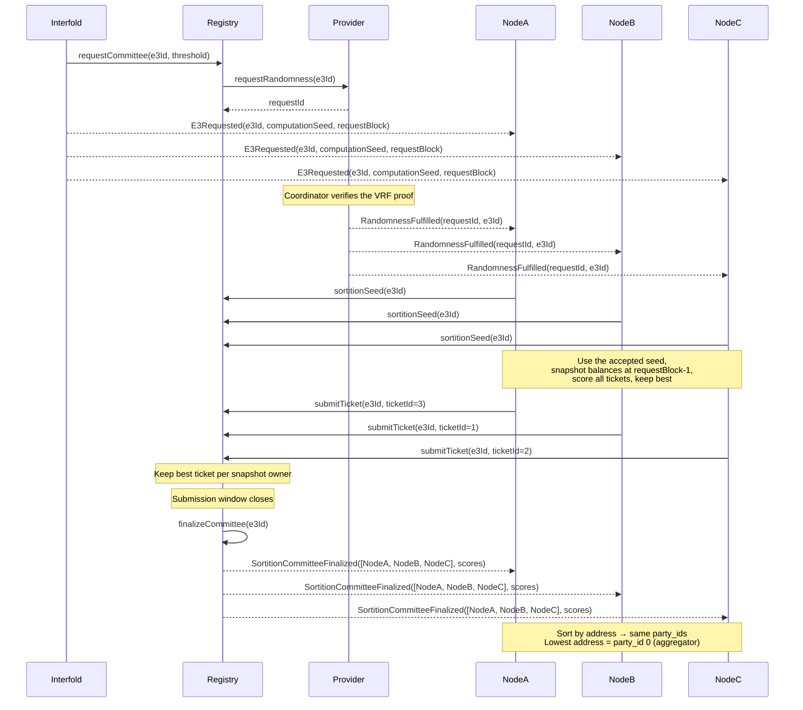

# Sortition

Sortition is the mechanism that selects a subset of registered ciphernodes to form a committee for
each E3 request. The design goals are:

- **Unpredictability** — the requester cannot know the outcome before its request is committed
- **Ticket weighting** — more eligible tickets improve an owner's best-score distribution
- **Determinism** — the same accepted submissions produce the same committee
- **Owner cap** — at most one selected operator per request-time bond owner
- **On-chain enforcement** — node software cannot bypass the cap

The cap does not establish independent ownership. Splitting resources across different bond owners
can still increase seat count. This temporary rule is not a permissionless Sybil defense.

---

## Sortition Seed

Each paid E3 request creates one asynchronous randomness request. The request stores the provider,
provider request ID, and timeout deadline before the E3 request transaction completes. Chainlink
later verifies the VRF proof, and the provider stores one random word.

The registry accepts only the response bound to that E3 and derives the sortition seed:

```solidity
seed = uint256(
  keccak256(abi.encode(randomWord, block.chainid, address(registry), e3Id, requestId))
);
```

The domain includes the chain, registry, E3, and provider request. A response cannot be reused for
another request or deployment. The runtime watches provider fulfillment events and asks the registry
for the accepted seed. The first valid ticket stores that seed and its response-time submission
deadline on-chain.

The E3 computation seed in `E3Requested` remains separate. It is still used by the cryptographic
workflow, but it does not rank tickets. An Ethereum block builder cannot calculate alternate VRF
outputs by changing block contents. This release supports Ethereum mainnet and Sepolia; it does not
enable Arbitrum deployments. A provider can delay or withhold a response, but it cannot replace the
frozen request with a second draw. A timeout fails the E3 instead of selecting a fallback randomness
source.

---

## Ticket Balances and Eligibility

Each operator's weight in the lottery is determined by their available ticket count at the snapshot
timepoint:

```
availableTickets = floor(ticketTokenBalance / ticketPrice)
```

Balances are snapshotted at **`requestBlock - 1`**. The field name is retained for ABI and storage
compatibility, but it stores an EIP-6372 timestamp. Ticket changes at the request timestamp or later
do not affect that E3.

An operator is eligible if and only if:

1. They are registered in `CiphernodeRegistry` and not banned
2. `isActive == true` (bond ≥ `requiredCiphernodeBond` AND tickets ≥ `minTicketBalance`)
3. No exit is pending

---

## Scoring Function

For each ticket an operator holds, a score is computed as a deterministic pseudo-random number:

```
score = keccak256(abi.encodePacked(node_address, ticket_number, e3Id, seed))
```

The result is interpreted as an unsigned 256-bit integer. **Lower scores win.**

Key properties:

- The hash is computed identically on-chain (Solidity) and off-chain (Rust using `alloy`'s
  `abi_encode_packed`), so both sides always agree
- Given the same inputs, the score is always the same — there is no per-invocation randomness
- `ticket_number` runs from 1 through `availableTickets`. The contract rejects ticket 0.

### One Best Ticket Per Node

Each operator computes scores for **all** of their tickets but submits only the single best
(lowest-scoring) one. The node software chooses the best ticket. The contract checks its range and
rejects duplicate submissions from the same address; it does not check that the ticket is best.

For new requests, the registry retains the best ticket across all operators with the same snapshot
owner. A better submission replaces that owner's current candidate, not another owner's seat.
Different owners compete for the best `N` scores. Score ties use ascending operator address.

Under the independent-hash model, distributing the same total valid tickets across operators of one
owner preserves that owner's best-score distribution. This statement requires the same submitted
ticket population and eligible operating capacity. It does not apply across different owner wallets,
and it does not imply that a committee seat count is linear in stake.

---

## Committee Size and Submission Candidates

The runtime ranks all eligible operators. It no longer truncates submissions to `N + buffer`; one
owner could occupy that whole candidate set. Each eligible operator with local capacity submits
once, and the contract selects distinct owners. This increases transaction costs.

The runtime's legacy field `threshold_m` is polynomial threshold `T`; decryption needs `T + 1`
shares. `threshold_n` is committee size `N`. No circuit parameter changes with this cap. After
finalization, ascending operator address determines party IDs and aggregator failover. Submission
rank is only a finalization-attempt priority, not a DKG party ID.

---

## On-chain Submission Window

The submission window starts when the registry accepts a timely VRF response. New deployments use 60
seconds by default. The Ethereum launch configuration uses 600 seconds:

```solidity
submitTicket(e3Id, ticketNumber)
```

The contract maintains up to `N` candidates from distinct snapshot owners. A linear scan finds the
worst candidate when the set is full. Finalization, not insertion, sorts the selected addresses.
Each submission emits:

```solidity
event TicketSubmitted(uint256 e3Id, address node, uint256 ticketId, uint256 score);
```

The contract enforces:

- Only one submission per address per E3
- The ticket number must be within the operator's balance at `requestBlock - 1`
- The contract computes the score; callers submit only a ticket number
- At most one candidate per `bondOwnerAt(operator, requestBlock - 1)`

Both ownership-assignment paths checkpoint the owner. Operators registered before the upgrade use
their unchanged owner until the first checkpoint seeds that prior owner. These checkpoints support
new requests after the upgrade; they do not reconstruct older ownership transfers.

The cap policy is frozen per request. New requests emit `CommitteeBondOwnerCapEnabled(e3Id)`.
Requests stored before this upgrade have an unset policy field and keep uncapped selection.

---

## Committee Finalization

After the submission window closes, anyone can call `finalizeCommittee(e3Id)`:

- If at least `N` distinct owners have accepted candidates,
  `SortitionCommitteeFinalized(e3Id, committee, scores)` is emitted
- If fewer → `CommitteeFormationFailed` is emitted and the E3 fails with a refund

Before emitting `SortitionCommitteeFinalized`, the registry **normalizes** the selected committee by
**sorting it by ascending address**. The Rust runtime repeats that normalization at its trust
boundary:

```
party_id = index in address-sorted committee (lowest address = 0)
```

The runtime normalization is done in `CommitteeFinalized::sort_by_address()` and ensures every node
independently derives the same `party_id` for each member, including replayed or test-produced
events that did not pass through the EVM decoder.

---

## Aggregator Assignment

The **initial active aggregator** is the node with `party_id = 0` — the selected committee member
with the lowest address. The active role can later move through the same canonical order. The active
aggregator is responsible for:

- Collecting signed DKG readiness reports and proposing one valid H-member dealer roster
- Aggregating the accepted roster's public-key shares and publishing the committee proof
- Aggregating valid decryption shares
- Publishing the plaintext output and proof on-chain

DKG roster selection, public-key aggregation, and plaintext aggregation use separate 10-minute
failover phases. A phase starts only after its required inputs are durable. If the active party does
not produce that phase's result, or if it is excluded, the next eligible node by `party_id` takes
over. The deadline and phase-local unresponsive set survive restart. Canonical phase progress clears
that phase's set, and the final eligible party remains active after all standby budgets expire.

---

## Off-chain Submission

Each node computes its best ticket and its rank among eligible operators. It submits if it has local
capacity. The contract enforces the owner cap; the aggregator does not approve tickets.

```rust
// Pseudocode for SortitionBackend::get_submission_index
let eligible = nodes.filter(|n| n.is_active && n.available_tickets > 0);
let candidates = ScoreSortition::new(nodes.len()).get_committee(eligible, e3id, seed);
if candidates.contains(my_address) && has_local_capacity(e3id) {
    submit_winning_ticket(e3id, my_ticket_number);
}
```

The score is deterministic for a given ticket, E3, and seed. Before the local node dispatches a
winning ticket, it durably reserves one local workload slot. A concurrent request sees that reduced
capacity. `CommitteeFinalized` confirms the reservation when the node is selected or releases it
when the node is not selected. A terminal E3 event releases any remaining reservation.

This reservation is local capacity control, not an on-chain ticket lock. Solidity still validates
the full snapshotted ticket range, and one node's `active_jobs` count cannot reduce another
operator's candidate range.

---

## Full Flow Summary



---

## Security Properties

| Property                    | Mechanism                                                                      |
| --------------------------- | ------------------------------------------------------------------------------ |
| **Unpredictable seed**      | A verified VRF word is bound to the chain, registry, E3, and request ID        |
| **No reroll fallback**      | A missing or late response fails the E3 instead of requesting replacement data |
| **Ticket weighting**        | More eligible tickets improve the owner's best-score distribution              |
| **Owner concentration cap** | One seat per snapshot owner; different owner wallets remain a bypass           |
| **Determinism**             | Hash function is identical on-chain (Solidity) and off-chain (Rust)            |
| **Snapshot stability**      | Balances and owners use the timestamp checkpoint at `requestBlock - 1`         |
| **Formation candidates**    | All eligible operators may submit; finalization still needs N distinct owners  |

---

## Related

- [Tickets & Sortition](../ciphernode-operators/tickets-and-sortition) — operator-facing guide on
  managing tickets and participating in committees
- [Cryptography](../cryptography) — how the selected committee runs DKG and threshold decryption
- [E3 Computation Flow](../computation-flow) — end-to-end view of the E3 lifecycle
