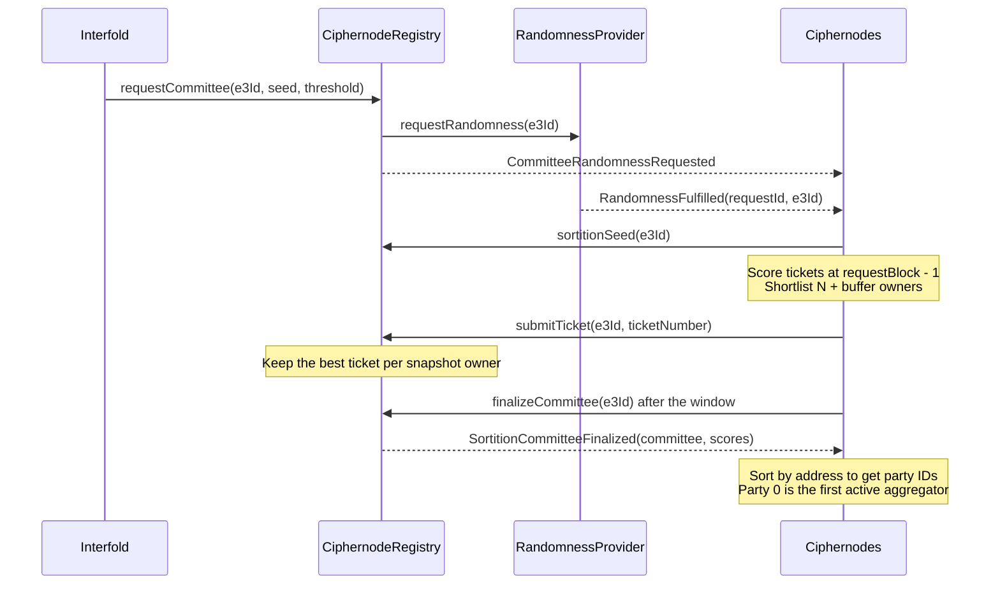

import { Callout } from 'nextra/components'
import { Flow, LinkCard, LinkCards } from '@/components/ui'

# Sortition

This page describes how the Interfold selects the committee of ciphernodes for one E3. It is for
auditors and core contributors who need the exact rules. Each rule names the contract or crate that
enforces it. At the end, you can trace a committee from the request to its party IDs and its active
aggregator.

<Flow
  label='Committee selection'
  steps={[
    {
      label: 'Request',
      icon: 'contract',
      sub: 'The registry freezes a snapshot and requests one VRF word.',
    },
    {
      label: 'Seed',
      icon: 'sparkle',
      sub: 'The VRF response gives a seed bound to this E3.',
    },
    {
      label: 'Tickets',
      icon: 'ticket',
      sub: 'Each ciphernode submits its best ticket.',
    },
    {
      label: 'Finalize',
      icon: 'network',
      sub: 'The N best bond owners form the committee.',
    },
    {
      label: 'Roles',
      icon: 'key',
      sub: 'Address order sets party IDs and the aggregator.',
    },
  ]}
/>

## Design goals

Sortition must give the same committee to every honest observer. A requester must not be able to
predict or change the result after it pays. The table lists each goal and the mechanism that
enforces it.

| Goal               | Mechanism                                                                           |
| ------------------ | ----------------------------------------------------------------------------------- |
| Unpredictability   | The seed comes from a VRF word that exists only after the paid request is stored.   |
| Ticket weighting   | More tickets give an owner more draws for its best score.                           |
| Determinism        | Solidity and Rust compute the same score from the same inputs.                      |
| Owner cap          | New requests admit at most one selected operator for each request-time bond owner.  |
| On-chain authority | The registry enforces the ticket range, the cap, and the final order.               |
| Snapshot stability | Balances, eligibility, owners, and the ticket price come from one frozen timepoint. |

<Callout type='warning'>
  The owner cap counts bond-owner addresses. It does not prove that two addresses have different
  controllers. An operator group that uses more than one bond-owner address can still get more than
  one seat. The cap is not a permissionless Sybil defense.
</Callout>

## Source map

| Component                        | Source                                                                                                    |
| -------------------------------- | --------------------------------------------------------------------------------------------------------- |
| Committee state and entry points | `packages/interfold-contracts/contracts/registry/CiphernodeRegistryOwnable.sol`                           |
| Seed, ticket checks, owner cap   | `packages/interfold-contracts/contracts/lib/RegistrySortitionLib.sol`                                     |
| Randomness provider              | `contracts/interfaces/IRandomnessProvider.sol`, `contracts/randomness/ChainlinkVrfRandomnessProvider.sol` |
| Owner history and capacity       | `contracts/lib/BondingOwnershipLib.sol`, `contracts/lib/BondOwnerCapacityLib.sol`                         |
| Score and owner shortlist (Rust) | `crates/sortition/src/sortition/ticket.rs`, `ticket_selection.rs`, `selection_backend.rs`                 |
| Sortition actor                  | `crates/sortition/src/sortition/actor.rs`, `handlers/request.rs`                                          |
| Party IDs and failover           | `crates/sortition/src/ciphernode_selection/`, `crates/sortition/src/failover.rs`                          |
| Finalization timers              | `crates/aggregator/src/committee_finalization/actor.rs`                                                   |
| Randomness reader                | `crates/evm/src/randomness_provider/actor.rs`                                                             |

## Sortition seed

Each E3 request creates exactly one asynchronous randomness request. `Interfold.request` calls
`CiphernodeRegistryOwnable.requestCommittee`. That function calls
`RegistrySortitionLib.requestRandomness`, which calls `IRandomnessProvider.requestRandomness(e3Id)`.
The registry then emits
`CommitteeRandomnessRequested(e3Id, requestId, provider, randomnessDeadline)`.

The request freezes these values for the E3:

- The provider address and the provider request ID.
- The request block number and the request timestamp.
- The response deadline: request timestamp plus the registry `randomnessRequestTimeout`.
- The submission window: the current `sortitionSubmissionWindow`.
- The owner-cap policy flag `bondOwnerCap`, which is `true` for every new request.

### Production provider

`ChainlinkVrfRandomnessProvider` adapts one Chainlink VRF v2.5 subscription to one registry. It
requests one random word (`numWords: 1`) for each E3 and rejects a second request for the same E3
with `RandomnessAlreadyRequested`. The constructor accepts only chain IDs 1, 11155111, 31337,
and 1337.

The provider reserves subscription balance for every draw that has no response. A request reverts
with `InsufficientSubscriptionBalance` unless the selected balance meets this bound:

$$
\text{balance} \ge \text{minimumSubscriptionBalance} \times (\text{pendingRequestCount} + 1)
$$

The VRF callback `fulfillRandomWords` never reverts. It records a valid response and emits
`RandomnessFulfilled(requestId, e3Id, randomWord, fulfilledAt)`. It emits
`RandomnessResponseIgnored` for an unknown, duplicate, released, or malformed response. The owner
can call `releaseAbandonedRequest(requestId)` to release the reservation of a draw that never gets a
response. A released request can no longer become usable.

### Response validity

The registry accepts a provider response only when all of these conditions are true:

- The provider reports the request as fulfilled, and `fulfilledAt` is not zero.
- `fulfilledAt` is at or after the request timestamp and at or before the current block timestamp.
- The fulfillment block is later than the request block and not later than the current block.
- `fulfilledAt` is at or before the frozen response deadline.

A response in the request block, a future-dated response, or a late response is not usable.

### Seed derivation

For an accepted random word $w$, the registry derives the sortition seed in `_deriveSeed`:

$$
\text{seed} = \operatorname{keccak256}\big(\operatorname{abi.encode}(w,\ \text{chainId},\ \text{registry},\ e3Id,\ requestId)\big)
$$

```solidity
// RegistrySortitionLib._deriveSeed
uint256(keccak256(abi.encode(randomWord, block.chainid, address(this), e3Id, requestId)));
```

The domain includes the chain, the registry, the E3, and the provider request. A response therefore
cannot give a seed for a different request or deployment. `sortitionSeed(e3Id)` returns
`(ready, seed)`. The first accepted ticket stores the seed and its ticket deadline in the committee
record. After that, the stored values remain readable, also after terminal cleanup. A fresh node can
therefore replay a historical committee request.

### Timeouts and the degraded flag

New registries use `DEFAULT_RANDOMNESS_REQUEST_TIMEOUT`, which is 1 hour. Governance can set a value
from 60 seconds to 1 day with `setRandomnessRequestTimeout`. The mainnet protocol configuration uses
3600 seconds. Governance can change the provider or the timeout only while requests are paused and
every committee is released.

If no usable response arrives, no party can request a second word. After the response deadline,
`finalizeCommittee` fails the E3 with `CommitteeFormationTimeout`. The same expiry also sets the
advisory `randomnessDegraded()` flag and emits
`RandomnessCircuitBreakerTripped(e3Id, requestId, provider)`. New requests continue to use the same
provider. Governance clears the flag when it points the registry to a provider with
`setRandomnessProvider`.

`CommitteeFormationTimeout` is a ciphernode-attributed failure in `FailurePayerLib`. The requester
can claim the full service fee escrow. The flat randomness fee is not part of that escrow.

### Runtime seed intake

The Rust `RandomnessProviderSolReader` decodes `RandomnessFulfilled`. It then reads
`sortitionSeed(e3Id)` and `getSortitionRequest(e3Id)` from the registry at the fulfillment block.
The registry read has a 15-second bound. If the reader cannot verify the result, it rejects the log
so that replay can try again. After verification, it publishes the durable runtime event
`CommitteeRequested` with the seed, the thresholds, the request timepoint, the ticket deadline, and
the ticket price.

<Callout type='info'>
  The E3 computation seed is a different value. `Interfold.request` computes it as
  `keccak256(abi.encode(block.prevrandao, e3Id))` and passes it to the E3 program. Ticket ranking
  never uses it.
</Callout>

## Request-time snapshot

The committee field `requestBlock` stores `block.timestamp`, not a block number. The name stays for
storage and ABI compatibility. The ticket token uses the EIP-6372 timestamp clock. All sortition
state uses the timepoint before the request:

$$
\tau = \text{requestBlock} - 1
$$

`requestCommittee` makes these checks before it requests randomness. A failed check reverts the
complete request, including fee collection.

| Check                | Rule                                                                                    | Error                           |
| -------------------- | --------------------------------------------------------------------------------------- | ------------------------------- |
| Eligible operators   | `eligibilityAt(address(0), τ)` count is at least N                                      | `InsufficientCiphernodes`       |
| Eligible bond owners | `committeeOwnerCapacity(τ)` is at least N                                               | `InsufficientBondOwners`        |
| Ticket price         | The current `ticketPrice()` is not zero. It is frozen in `sortitionTicketPrices[e3Id]`. | `InvalidTicketNumber`           |
| Fold verifier        | A DKG fold-attestation verifier is set. It is frozen for this E3.                       | `FoldAttestationVerifierNotSet` |

The request also stores the operator tree root in `roots[e3Id]` and emits
`DkgFoldAttestationContextEstablished(e3Id, registry, verifier)` and
`CommitteeBondOwnerCapEnabled(e3Id)`.

`committeeOwnerCapacity` is conservative. It returns zero when the timepoint uses an older
eligibility policy or when the status refresh of the captured registrations is not complete. The
count can underestimate the number of owners, but it must not overestimate it. It does not prove
that the owners are online.

### Available tickets

For operator $i$ with request-time ticket balance $B_i(\tau)$ and frozen ticket price $p$, the
number of valid tickets is:

$$
K_i = \left\lfloor \frac{B_i(\tau)}{p} \right\rfloor, \qquad B_i(\tau) = \texttt{getPastVotes}(i, \tau)
$$

Valid ticket numbers are $1, 2, \dots, K_i$. The contract rejects ticket 0.

## Scoring function

Each ticket gets a deterministic 256-bit score. Lower scores are better.

$$
s(i, k) = \operatorname{uint256}\big(\operatorname{keccak256}(\operatorname{abi.encodePacked}(i,\ k,\ e3Id,\ \text{seed}))\big)
$$

The packed message is the 20-byte operator address, then three 32-byte words: the ticket number, the
E3 ID, and the seed. Solidity computes it in `RegistrySortitionLib.ticketScore`. Rust computes it in
`hash_to_score` with `alloy` `abi_encode_packed`. Both sides therefore produce the same score.

Each operator scores all of its tickets and submits only its best ticket:

$$
k_i^{*} = \arg\min_{1 \le k \le K_i} s(i, k)
$$

Rust breaks an equal score in favor of the smaller ticket number. The contract checks that the
ticket number is in range and computes the score itself. The contract does not check that the
submitted ticket is the best ticket of that operator.

## Bond-owner cap

The registry ranks the submissions of a new request by bond owner. Requests stored before the
bond-owner cap upgrade keep the uncapped rule. The cap groups operators by their bond owner at the
snapshot timepoint:

$$
o(i) = \texttt{bondOwnerAt}(i, \tau)
$$

Each owner competes with its best submitted operator. For the set $I_o$ of operators with owner $o$
that submitted a ticket, the owner score is:

$$
S_o = \min_{i \in I_o} s(i, k_i^{*})
$$

The committee is the N owners with the lowest $S_o$, with one operator for each owner. An equal
score goes to the lower operator address.

### Contract algorithm

`submitTicket` calls `RegistrySortitionLib.insertCandidate` after the ticket checks. For a capped
request, the function works as follows:

1. It reads $o(i)$ with `bondOwnerAt(node, requestBlock - 1)`. A zero owner reverts with
   `NodeNotEligible`.
2. If the owner already has a candidate, the new operator replaces that candidate only if it ranks
   first. It does not take the seat of a different owner.
3. If the owner has no candidate and fewer than N candidates exist, the operator joins the set.
4. If the set is full, a linear scan finds the worst candidate. The new operator replaces it only if
   it ranks first. The displaced owner loses its entry.
5. The registry records a collateral obligation for the new candidate and releases the obligation of
   a displaced candidate.

"Ranks first" means a lower score, or an equal score and a lower address. In a full set, the worst
candidate is the highest score, and on an equal score, the higher address. Insertion does not sort
the set. Finalization sorts it.

### Policy and history rules

- The policy is frozen per request in the appended `bondOwnerCap` field. Requests stored before the
  upgrade have `false` and keep the uncapped rule. The uncapped rule replaces the worst candidate
  only on a strictly lower score.
- Both ownership write paths checkpoint the owner in `BondingOwnershipLib`. If an operator has no
  owner checkpoint, `bondOwnerAt` returns the current owner. This lazy baseline is valid for capped
  requests. It does not rebuild ownership transfers before the upgrade.
- An owner transfer after the snapshot does not change the groups of that request.
- `releaseCommittee` clears the `ownerCandidates` entries of the request, with owners read at the
  snapshot timepoint. It does not clear the randomness context or the seed.

### Effect on selection probability

Model each score as an independent uniform draw from $[0, 2^{256})$. Let $K_o$ be the sum of $K_i$
over the operators of owner $o$ that submit a ticket. Then:

$$
\Pr[S_o \le x] = 1 - \left(1 - \frac{x}{2^{256}}\right)^{K_o}
$$

This distribution depends only on $K_o$. If one owner moves the same valid tickets between its own
operators, its chance of a seat does not change. The statement does not hold across different owner
addresses. Seat count is also not linear in stake, because each owner can hold at most one seat.

## Off-chain candidate selection

The `Sortition` actor decides whether the local ciphernode submits a ticket. It waits until it has
both `E3Requested` and the durable `CommitteeRequested` seed. It then checks that the snapshot
request timepoint matches and that the frozen ticket price is not zero.

### Eligible set

The actor builds the eligible set from its local node-state projection at $\tau$:

- The operator is active at $\tau$ and admitted by the admission policy at $\tau$.
- The operator has $K_i \ge 1$ at the frozen price.
- The local count of active jobs does not change $K_i$ for any operator.

### Owner shortlist

The actor ranks every eligible operator by its best score, then by address. This order matches the
capped contract. The first appearance of each owner in that order gives the owner rank. The actor
keeps every operator of the first $L$ owners, where:

$$
L = N + b(T, N), \qquad b(T, N) = (N - T) + m, \qquad
m = \begin{cases} 3 & T/N \ge 0.8 \\ 2 & 0.6 \le T/N < 0.8 \\ 1 & T/N < 0.6 \end{cases}
$$

The function is `calculate_buffer_size(threshold_m, threshold_n)`. The runtime field `threshold_m`
is the polynomial threshold T, and `threshold_n` is the committee size N.

| Committee | N   | T   | Buffer $b$ | Candidate owners $L$ |
| --------- | --- | --- | ---------- | -------------------- |
| `minimum` | 3   | 1   | 3          | 6                    |
| `micro`   | 9   | 4   | 6          | 15                   |
| `small`   | 19  | 9   | 11         | 30                   |

`ScoreSortition::get_owner_candidates` orders the kept operators by member rank, then by owner rank.
The list therefore visits the best operator of each shortlisted owner first, then their second
operators, and continues. The position of the local operator in this list is its finalization rank
(`party_index` in `TicketGenerated`). The finalization rank is not a DKG party ID.

Every kept operator submits during the normal window. The backups keep a seat possible when the best
operator of an owner is offline. Neither the buffer nor the backups guarantee N online owners.

### Missing owner history

The Rust owner history (`BondOwnerState`, schema version 2) stores `BondOwnerSetAt` records with the
source block timestamp. Records that have only the local ingestion time are not used. If any
eligible operator has no owner at $\tau$, the actor does not shortlist. It lets every eligible
operator submit and logs the structured warning `sortition_owner_history_fallback`. The contract
still enforces the cap on each submitted ticket. The fallback can increase the number of
transactions.

### Local capacity reservation

The local node submits only if it has capacity. It has capacity when it already holds a reservation
for this E3, or when its count of active jobs is less than its own $K_i$. Before the ticket leaves
the actor, the node persists one provisional reservation. `CommitteeFinalized` keeps the reservation
for a selected node and releases it for other nodes. Terminal E3 events release any remaining
reservation.

This reservation is local load control. It is not an on-chain ticket lock. After a restart, a node
keeps its generated ticket and its finalization rank. It does not rank the same request again.

## Submission window

The ticket window starts when the VRF response is recorded, not when the request is made. The first
accepted ticket stores this deadline:

$$
t_{\text{close}} = \texttt{fulfilledAt} + W, \qquad \texttt{fulfilledAt} \le t_{\text{request}} + T_{\text{rand}}
$$

The window $W$ is `sortitionSubmissionWindow`. The registry accepts values from
`MIN_SORTITION_SUBMISSION_WINDOW` (60 seconds) to `MAX_SORTITION_SUBMISSION_WINDOW` (1 day). The
local deployment script `scripts/deployInterfold.ts` uses 60 seconds. The mainnet protocol
configuration uses 600 seconds. The bonding `exitDelay` must be greater than $T_{\text{rand}} + W$,
or `setRandomnessRequestTimeout` reverts with `ExitDelayMustExceedSortitionWindow`.

A ciphernode calls `submitTicket(e3Id, ticketNumber)`. `submitTicket` and
`RegistrySortitionLib.validateTicket` check these rules in order:

| Rule                                                                               | Error                                                |
| ---------------------------------------------------------------------------------- | ---------------------------------------------------- |
| The committee is requested and not finalized.                                      | `CommitteeNotRequested`, `CommitteeAlreadyFinalized` |
| A usable seed exists.                                                              | `SortitionSeedUnavailable`                           |
| `block.timestamp` is at or before the ticket deadline.                             | `CommitteeDeadlineReached`                           |
| The operator has not submitted for this E3.                                        | `NodeAlreadySubmitted`                               |
| The operator is enabled in the registry, currently active, and eligible at $\tau$. | `NodeNotEligible`                                    |
| The ticket number is at least 1 and the frozen price is not zero.                  | `InvalidTicketNumber`                                |
| $K_i \ge 1$ and the ticket number is at most $K_i$.                                | `NodeNotEligible`, `InvalidTicketNumber`             |

The caller submits only a ticket number. The contract computes the score and emits
`TicketSubmitted(e3Id, node, ticketId, score)`. An operator can submit once, even if its ticket does
not enter the candidate set.

## Committee finalization

Any caller can call `finalizeCommittee(e3Id)` after the deadline. The call requires
`block.timestamp` to be greater than the deadline, or it reverts with `SubmissionWindowNotClosed`.
Before the seed is ready, the deadline is the response deadline.

| Condition at finalization | Result                                            |
| ------------------------- | ------------------------------------------------- |
| No usable seed            | The E3 fails with `CommitteeFormationTimeout`.    |
| Fewer than N candidates   | The E3 fails with `InsufficientCommitteeMembers`. |
| N candidates              | The committee is finalized.                       |

A failure emits `CommitteeFormationFailed(e3Id, nodesSubmitted, thresholdRequired)`, calls
`onE3Failed`, and releases the committee. On success, the registry does these steps:

1. It sorts `topNodes` by ascending address (`RegistrySortitionLib.sortTopNodes`).
2. It sets each member to `Active` and sets `activeCount` to N.
3. It calls `Interfold.onCommitteeFinalized`. The E3 moves to `CommitteeFinalized`, and the DKG
   deadline becomes the ticket deadline plus `dkgWindow`. The call reverts with `DKGDeadlinePassed`
   if that deadline is already over.
4. It emits `SortitionCommitteeFinalized(e3Id, committee, scores)` and
   `CommitteeActivationChanged(e3Id, true)`.

Finalization also freezes the reward recipient of each member for this E3. Because a late
finalization shortens the DKG time, the paid lifecycle does not become longer. If no caller
finalizes a full committee before the DKG deadline, `markE3Failed` records
`CommitteeFormationTimeout`.

### Finalization timers

The Rust `CommitteeFinalizer` schedules one finalization attempt for each local ticket:

$$
t_{\text{wait}} = \max(t_{\text{close}} - t_{\text{now}}, 0) + 1\,\text{s} + 30\,\text{s} \times \texttt{party\_index}
$$

Before it sends, the writer runs a preflight call. If another member already finalized, the writer
skips the transaction. If a sent transaction fails, the writer reads the state again. A terminal
state is not an error. Other failures retry after 30 seconds.

### Party IDs

After finalization, the party ID of a member is its index in the address-sorted committee. The
lowest address is party 0. The runtime repeats the sort in `CommitteeFinalized::sort_by_address`,
which compares lowercase address strings. Every node therefore derives the same party IDs, also for
replayed events. The committee hash, the DKG proof inputs, and aggregator failover use this order.

## Aggregator assignment

The active aggregator is the committee member with the lowest eligible party ID. A member becomes
ineligible after an on-chain expulsion, a confirmed local exclusion, or a phase-local progress
timeout. `CiphernodeSelector` publishes `AggregatorChanged` with the active party ID.

| Phase (`AggregationPhase`) | Work of the active aggregator                                                   |
| -------------------------- | ------------------------------------------------------------------------------- |
| `DkgRoster`                | Collect signed readiness reports and propose one H-dealer roster.               |
| `PublicKey`                | Aggregate the roster key shares, prove C5, and call `publishCommittee`.         |
| `Plaintext`                | Aggregate T + 1 decryption shares, prove C7, and call `publishPlaintextOutput`. |

Each phase has a 10-minute budget (`AGGREGATOR_PROGRESS_TIMEOUT`). The budget starts only when the
phase inputs are durable, which `AggregationInputsReady` reports. If the active party does not make
progress in time, every node promotes the next eligible party in address order. The deadline and the
phase-local skip set survive a restart. Protocol progress clears the skip set. When the last
eligible party times out, it stays active so that late recovery is still possible.

`publishCommittee` and `publishPlaintextOutput` are permissionless on-chain. The runtime sends them
only from the active aggregator. The contract checks the proofs and accepts one result.

## End-to-end sequence



## Security properties

| Property                    | Mechanism                                                                            |
| --------------------------- | ------------------------------------------------------------------------------------ |
| Unpredictable seed          | A verified VRF word is bound to the chain, the registry, the E3, and the request ID. |
| No second draw              | A missing or late response fails the E3. No party can request replacement data.      |
| Deterministic scores        | The same packed Keccak hash runs in Solidity and in Rust.                            |
| Snapshot stability          | Balances, eligibility, owners, and the price come from $\tau$ and the request.       |
| Owner concentration cap     | One seat for each snapshot owner. Different owner addresses remain a bypass.         |
| Canonical order             | Finalization and the runtime both sort by address before party IDs exist.            |
| Collateral during selection | A current candidate holds a collateral obligation until it is displaced or released. |

The provider can delay or withhold a response. In that case, the E3 fails after the response
deadline. A stale local projection can give a node a wrong shortlist. The chain still protects the
cap, but it does not protect committee availability.

## Next steps

<LinkCards min={230}>
  <LinkCard title='PVDKG and ZK proofs' href='/internals/dkg' icon='key' tag='Internals'>
    What the finalized committee does next: key generation, proofs, and on-chain anchoring.
  </LinkCard>
  <LinkCard
    title='Tickets and sortition'
    href='/operate/tickets-and-sortition'
    icon='ticket'
    tag='Operators'
  >
    How an operator gets tickets and takes part in committees.
  </LinkCard>
  <LinkCard title='E3 lifecycle' href='/learn/e3-lifecycle' icon='flow' tag='Concepts'>
    The stages, deadlines, and failure reasons of one E3.
  </LinkCard>
  <LinkCard title='Contracts reference' href='/reference/contracts' icon='contract' tag='Reference'>
    Deployed registry and provider addresses for each network.
  </LinkCard>
</LinkCards>
