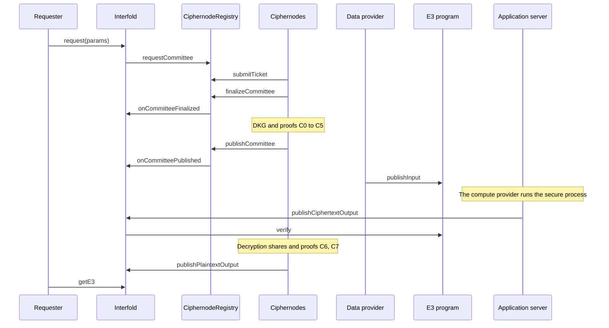

import { Callout } from 'nextra/components'
import { Layers, LinkCards, LinkCard } from '@/components/ui'

# Architecture

This page describes the parts of the Interfold and how they work together. It is for developers who
build an E3 program and for operators who run a ciphernode. At the end, you know which contract or
service does each job, and the order of the calls in one E3.

## The stack

The Interfold has four layers. All E3 programs share the protocol contracts and the ciphernode
network. Each application brings its own program contract, servers, and client.

<Layers
  layers={[
    {
      name: 'Application',
      note: 'One set for each E3 program',
      items: ['Client', 'Coordination server', 'Program server', 'E3 program contract'],
    },
    {
      name: 'Compute',
      note: 'Off-chain',
      items: ['Compute provider (RISC Zero zkVM)', 'Data-availability layer'],
    },
    {
      name: 'Ciphernode network',
      note: 'Off-chain, libp2p',
      items: ['Sortition', 'DKG and decryption shares', 'Aggregator role', 'Proofs', 'Accusations'],
    },
    {
      name: 'Protocol contracts',
      note: 'On-chain',
      items: [
        'Interfold',
        'CiphernodeRegistry',
        'BondingRegistry',
        'SlashingManager',
        'E3RefundManager',
        'Verifiers',
        'Randomness provider',
      ],
    },
  ]}
/>

## On-chain contracts

All paths are relative to `packages/interfold-contracts/contracts/`. The deployed addresses are on
the [Contracts](/reference/contracts) reference page.

| Contract                       | Source                                                  | Responsibility                                                                                                                     |
| ------------------------------ | ------------------------------------------------------- | ---------------------------------------------------------------------------------------------------------------------------------- |
| Interfold                      | `Interfold.sol`                                         | Accepts requests and fees, holds the service fee in escrow, records stages and deadlines, verifies outputs, and credits rewards.   |
| CiphernodeRegistry             | `registry/CiphernodeRegistryOwnable.sol`                | Keeps the ciphernode set in an incremental Merkle tree (IMT). Runs committee requests, tickets, finalization, and key publication. |
| BondingRegistry                | `registry/BondingRegistry.sol`                          | Holds FOLD bonds and tFOLD ticket balances, registers operators, runs the exit queue, and executes slashes.                        |
| SlashingManager                | `slashing/SlashingManager.sol`                          | Accepts slash proposals, applies penalties, bans operators, and expels committee members.                                          |
| E3RefundManager                | `E3RefundManager.sol`                                   | Splits the escrow of a failed E3, holds success rewards for claims, and routes slashed funds.                                      |
| E3 program                     | For example `templates/default/contracts/MyProgram.sol` | Validates requests, accepts inputs, and verifies the compute proof and the data-availability receipt.                              |
| ChainlinkVrfRandomnessProvider | `randomness/ChainlinkVrfRandomnessProvider.sol`         | Connects one Chainlink VRF v2.5 subscription to the registry. Supplies one random word for each E3.                                |
| NodeReleaseRegistry            | `registry/NodeReleaseRegistry.sol`                      | Sets which ciphernode release versions can take part in new E3s.                                                                   |
| InterfoldToken (FOLD)          | `token/InterfoldToken.sol`                              | The token for ciphernode bonds.                                                                                                    |
| InterfoldTicketToken (tFOLD)   | `token/InterfoldTicketToken.sol`                        | The non-transferable ticket balance, backed by deposited collateral.                                                               |

The Interfold contract links two libraries, `InterfoldLifecycle` and `InterfoldPricing`. They hold
the lifecycle checks and the fee math and run in the context of the Interfold contract.

Each E3 records the registry, bonding registry, slashing manager, and refund manager at request
time. Governance can replace these contracts only after it pauses requests and all active E3s end.

### Verifiers

| Verifier                               | Checks                                                                                     | Called from               |
| -------------------------------------- | ------------------------------------------------------------------------------------------ | ------------------------- |
| `BfvPkVerifier`                        | The recursive DKG proof. It calls the generated Honk verifier `DkgAggregatorVerifier`.     | `publishCommittee`        |
| `DkgFoldAttestationVerifier`           | One signed fold attestation from each accepted DKG party                                   | `publishCommittee`        |
| `BfvDecryptionVerifier`                | The recursive decryption proof. It calls the Honk verifier `DecryptionAggregatorVerifier`. | `publishPlaintextOutput`  |
| `Risc0BfvCiphertextVerifier`           | The protocol fields in the RISC Zero compute receipt                                       | `publishCiphertextOutput` |
| `AvailVectorXDataAvailabilityVerifier` | Avail blob inclusion through the VectorX bridge, for E3 programs that use Avail            | The E3 program            |

`BfvPkVerifierRouter` and `BfvDecryptionVerifierRouter` can sit in front of the BFV verifiers. A
router sends each proof to the verifier for its parameter set and committee size.

## Off-chain components

### Ciphernode

A ciphernode is the `interfold` binary that runs with `interfold start`. It reads contract events,
talks to other ciphernodes over libp2p, and sends transactions. Its main parts are actors:

| Part                           | Crate               | Job                                                                  |
| ------------------------------ | ------------------- | -------------------------------------------------------------------- |
| EVM readers and writers        | `crates/evm`        | Read contract events and send transactions                           |
| `Sortition`                    | `crates/sortition`  | Score tickets, submit tickets, and track committee membership        |
| `CommitteeFinalizer`           | `crates/aggregator` | Call `finalizeCommittee` after the ticket window closes              |
| `ThresholdKeyshare`            | `crates/keyshare`   | Run DKG and compute decryption shares for one E3                     |
| `PublicKeyAggregator`          | `crates/aggregator` | Aggregate the public key and the DKG proofs                          |
| `ThresholdPlaintextAggregator` | `crates/aggregator` | Combine decryption shares and fold the decryption proofs             |
| Proof actors                   | `crates/zk-prover`  | Generate and verify ZK proofs with Barretenberg (`bb`)               |
| `AccusationManager`            | `crates/slashing`   | Start an accusation after a failed proof and collect committee votes |
| Network                        | `crates/net`        | libp2p gossip between ciphernodes                                    |
| Storage                        | `crates/data`       | sled storage and event replay after a restart                        |

Ciphernodes exchange their proofs over gossip and verify each other's proofs. Individual proofs do
not go on-chain. Only the aggregated proofs do.

### Aggregator role

Each committee has one active aggregator. The runtime sorts the finalized committee by address. The
active aggregator is the eligible member with the lowest party ID. It sends two permissionless
transactions: `publishCommittee` with the DKG proof and `publishPlaintextOutput` with the decryption
proof.

The on-chain proof check protects both transactions, so the caller does not need special rights. If
the expected result does not appear on-chain within 10 minutes, the next eligible member takes the
role.

### Compute provider

The compute provider runs the secure process over the ciphertexts. In the current code, it is the
RISC Zero zkVM. The zkVM receipt binds the E3, the committee public key, the input Merkle root, and
the output hash. See [Compute Provider](/build/e3-program/compute-provider).

### Program server

`interfold program start` starts the program server (`crates/program-server`). It accepts a compute
request over HTTP, runs the FHE computation, and posts the result to a callback URL. It runs one job
at a time by default.

<Callout type='warning'>
  The program server is development tooling. It does not authenticate callers or limit callback
  destinations. Any client that can reach it can start a computation.
</Callout>

### Coordination server

The template and CRISP each include a coordination server. The template server is in
`templates/default/server`, and the CRISP server is in `examples/CRISP/server`. The template server
does these tasks:

1. It rebuilds the committee public key from its chunks and checks the key commitment.
2. It waits until the input window closes on-chain.
3. It sends the compute request to the program server.
4. It stores the ciphertext output on the data-availability layer.
5. It calls `publishCiphertextOutput` with the output reference and the compute proof.

### Client

The client uses `@interfold/sdk` or `@interfold/react`. It reads the committee public key, encrypts
inputs, and can generate an input proof. It submits inputs to the E3 program and reads the output.
See [SDK](/build/sdk) and [Client and Server](/build/client-and-server).

## Interaction flow

The diagram shows the main calls in one successful E3.

1. The requester calls `request`. The Interfold contract asks the registry for a committee.
2. Ciphernodes submit tickets after the VRF result arrives, then a ciphernode finalizes the
   committee.
3. The committee runs DKG. The active aggregator publishes the key commitment and the DKG proof.
4. Data providers submit encrypted inputs to the E3 program during the input window.
5. After the input window closes, the compute output goes to `publishCiphertextOutput`.
6. The committee computes decryption shares. The active aggregator publishes the plaintext and the
   decryption proof.
7. The requester reads the result with `getE3`.

The [E3 lifecycle](/learn/e3-lifecycle) page gives the events and deadlines for each step.

## Next steps

<LinkCards min={230}>
  <LinkCard title='E3 lifecycle' href='/learn/e3-lifecycle' icon='flow' tag='Learn'>
    Each stage, the call that enters it, its events, and its deadline.
  </LinkCard>
  <LinkCard title='Cryptography' href='/learn/cryptography' icon='lock' tag='Learn'>
    Threshold BFV, the DKG, and the circuits behind each proof.
  </LinkCard>
  <LinkCard title='Contracts' href='/reference/contracts' icon='contract' tag='Reference'>
    Deployed addresses and contract interfaces.
  </LinkCard>
</LinkCards>
