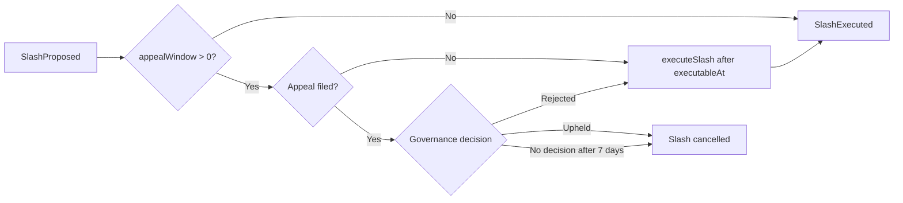

import { Callout, Steps } from 'nextra/components'
import { LinkCard, LinkCards, Lifecycle, Stage } from '@/components/ui'

# Exits, Rewards, and Slashing

This page covers the end of the work cycle of a ciphernode: rewards, slashing, and the exit queue.
It is for operators and bond owners. At the end, you can claim rewards, read and appeal a slash
proposal, and leave the network with the collateral returned to the bond owner.

## Rewards

A committee earns its reward when its E3 completes. When the committee publishes the plaintext
output, the Interfold contract settles the fee of the E3:

1. A protocol share (`protocolShareBps`, fixed at the request) goes to the protocol treasury.
2. The rest is divided equally between the active committee members. The remainder of the division
   goes to one member.
3. The contract emits `RewardsDistributed(e3Id, nodes, amounts)` and one
   `RewardCredited(e3Id, account, token, amount)` for each member.

The reward is paid in the fee token of the E3. The recipient is the bond owner of the operator at
committee finalization, or the operator when it had no bond owner. A later change of bond owner does
not move a reward that is already credited.

Rewards are pull payments. The recipient must claim them:

| Action                   | Contract           | Call                                    | Caller                   |
| ------------------------ | ------------------ | --------------------------------------- | ------------------------ |
| Check the pending reward | Interfold contract | `pendingReward(e3Id, account)`          | Any account              |
| Claim one E3             | Interfold contract | `claimReward(e3Id)`                     | The reward recipient     |
| Claim several E3s        | Interfold contract | `claimRewards(e3Ids)`                   | The reward recipient     |
| Claim a failed-E3 reward | `E3RefundManager`  | `claimHonestNodeReward(e3Id, operator)` | The reward recipient     |
| Claim slashed funds      | `E3RefundManager`  | `claimSlashedFunds(e3Id, token)`        | The account with a share |

The CLI has no reward command. Use a wallet or `cast`, for example:

```bash
cast call <Interfold> "pendingReward(uint256,address)(uint256)" <e3Id> 0xBOND_OWNER \
  --rpc-url <RPC_URL>
cast send <Interfold> "claimReward(uint256)" <e3Id> --rpc-url <RPC_URL> --account <bond-owner>
```

When a ciphernode fault makes an E3 fail, honest committee members can receive compensation from the
slashed ticket collateral. An open slash proposal that can expel an operator holds the reward share
of that operator for the E3. An executed expulsion forfeits the share.

<Callout type='info'>
  Keep ETH in the bond owner wallet for claims and exits. Keep ETH in the operator wallet for the
  transactions that the node sends, for example ticket submissions and release acknowledgments.
</Callout>

## Slashing

The `SlashingManager` contract proposes, appeals, and executes slashes. Each slash reason has a
policy that governance sets. A slash can burn tickets, take FOLD from the ciphernode bond, ban the
operator, and expel the operator from the committee of the E3.

### How a slash starts

| Lane   | Function                                                                                | Who can call        | Evidence                                                                                                                          |
| ------ | --------------------------------------------------------------------------------------- | ------------------- | --------------------------------------------------------------------------------------------------------------------------------- |
| Lane A | `proposeSlash(e3Id, operator, proof)` or `proposeSlashByDkgParty(e3Id, partyId, proof)` | Any account         | Signed votes from committee members that agree the operator sent a bad proof. At least H members (the DKG roster size) must vote. |
| Lane B | `proposeSlashEvidence(e3Id, operator, reason, evidence)`                                | `SLASHER_ROLE` only | Evidence for a reason that governance configured. The policy must have an appeal window.                                          |

Ciphernodes start Lane A automatically. When a node finds that a committee member sent a proof that
does not verify, it broadcasts an accusation, and the committee votes. When enough members agree,
the voters submit the slash. The voter with the lowest address submits at once. The next two voters
wait 30 s and 60 s as fallbacks.

For Lane A, the slash reason is `keccak256(abi.encodePacked(uint256(proofType)))`. The proof types
are the DKG and decryption proofs C0 to C7. If governance disabled the policy for a proof type, the
nodes exclude the member from that E3 only, and no penalty applies. When the agreeing voters saw
different data from the accused operator, the result is equivocation. The nodes do not submit a
slash for equivocation, because the current evidence format cannot prove it.

<Callout type='info'>
  On mainnet at block 26,057,073 (25 September 2026), no slash policy is set. The `SlashingManager`
  has emitted no `SlashPolicyUpdated` event, and `getSlashPolicy(reason)` returns a disabled policy
  for each proof type. An accused member is therefore excluded from the E3, and no penalty applies.
  The node logs `Slash policy is disabled; excluding the faulted member from local E3 work`. Read
  `getSlashPolicy(reason)` for the current value before you rely on a policy.
</Callout>

### The slash policy

| Field                   | Meaning                                                                                                       |
| ----------------------- | ------------------------------------------------------------------------------------------------------------- |
| `ticketPenalty`         | Ticket collateral to slash, in token base units                                                               |
| `ciphernodeBondPenalty` | FOLD to slash from the ciphernode bond                                                                        |
| `requiresProof`         | `true` for Lane A, `false` for Lane B                                                                         |
| `banNode`               | Ban the operator. A banned operator cannot register again until governance lifts the ban.                     |
| `appealWindow`          | Seconds to appeal. 0 is allowed only for Lane A, and then the slash executes at once. The maximum is 30 days. |
| `enabled`               | The policy is active                                                                                          |
| `affectsCommittee`      | Expel the operator from the committee of the E3                                                               |

Read a policy with `getSlashPolicy(reason)`, a proposal with `getSlashProposal(proposalId)`, and a
ban with `isBanned(operator)`. The proposal copies the policy values when it opens, so a later
policy change does not change it.

### How a slash executes

A ticket penalty burns tFOLD from the active balance first. The rest comes from the exit queue,
including queue entries that are still locked. A bond penalty takes FOLD from the active bond first
and then from the queued bond. A penalty is limited to the balance that exists.

An expulsion removes the operator from the committee of that E3. If the number of active members
falls below H (the DKG roster size), the E3 fails with `InsufficientCommitteeMembers`. The slashed
ticket collateral goes to escrow for the E3, and the settlement of the E3 decides who receives it.

While a proposal against the operator is open, these actions revert with `OperatorUnderSlash`:
ticket removal, unbonding, deregistration, and exit claims.

### Respond to a slash proposal



<Steps>

### Watch for proposals

Watch `SlashProposed` events where `operator` is your operator address.

The event includes `proposalId`, `reason`, both penalty amounts, `executableAt`, and `lane`.

### Read the proposal

Call `getSlashProposal(proposalId)` on `SlashingManager`.

If the proposal already shows `executed`, the policy had no appeal window and you cannot appeal.

### File an appeal before `executableAt`

Send `fileAppeal(proposalId, evidence)` from the operator key or the bond owner:

```bash
cast send <SlashingManager> "fileAppeal(uint256,string)" <proposalId> "<evidence URI>" \
  --rpc-url <RPC_URL> --account <operator-or-bond-owner>
```

You can appeal each proposal one time. The contract emits `AppealFiled`.

### Wait for the decision

Governance resolves the appeal with `resolveAppeal`. The contract emits `AppealResolved`.

If governance does not decide within 7 days after `executableAt`, any account can call
`expireAppeal(proposalId)`. The appeal is then upheld and the slash is cancelled.

</Steps>

After `executableAt`, any account can call `executeSlash(proposalId)` for a proposal without an
appeal, or with a rejected appeal. The contract emits `SlashExecuted`. A ban also emits
`NodeBanUpdated`. Keep your node logs and the dashboard event history as evidence for an appeal.

## The exit queue

Collateral never leaves the registry at once. Each withdrawal goes to an exit queue for the
`exitDelay` that is in effect at that time. Governance can set `exitDelay` from 1 day to 90 days. It
must be longer than `sortitionSubmissionWindow` plus `randomnessRequestTimeout`. At deployment,
`exitDelay` was 30 days on mainnet and 7 days on Sepolia.

| Action                  | What happens at once                                                           | What the queue receives |
| ----------------------- | ------------------------------------------------------------------------------ | ----------------------- |
| Burn tickets            | tFOLD is burned. The ticket count drops.                                       | The ticket collateral   |
| Unbond FOLD             | The ciphernode bond drops.                                                     | The FOLD                |
| Deregister the operator | All tFOLD is burned, the bond goes to 0, and the operator leaves the registry. | Both assets             |

Each withdrawal makes a queue entry with its own unlock time. An operator can have at most 64 open
entries, and one more withdrawal reverts with `TooManyTranches`. Queued assets stay slashable until
the claim. The claim always pays the bond owner.

A claim reverts in these conditions:

| Error                       | Condition                                                             |
| --------------------------- | --------------------------------------------------------------------- |
| `ExitNotReady`              | No queued amount is unlocked yet.                                     |
| `OperatorUnderSlash`        | A slash proposal against the operator is open.                        |
| `OperatorInActiveCommittee` | The operator is on a committee that the registry did not release yet. |

A deregistered operator stays a member of each committee that was already final. The collateral
stays in the queue until each of these E3s completes or fails and its committee is released. After
the E3 is terminal and its accusation window ends, any account can call `releaseCommittee(e3Id)` on
`CiphernodeRegistry`. The `CommitteeObligationUpdated` events of `BondingRegistry` show the E3s of
the operator.

## Leave the network

<Lifecycle label='Full exit'>
  <Stage title='Deregister' actor='Bond owner or operator' event='CiphernodeDeregistrationRequested'>

The registry burns the tickets, queues the ticket collateral and the bond, and removes the operator
from the registry.

  </Stage>
  <Stage title='Finish committees' actor='Ciphernode' event='CommitteeObligationUpdated'>

The node keeps running until every E3 of its final committees completes or fails.

  </Stage>
  <Stage title='Wait for the exit delay' actor='Bond owner'>

The queued assets unlock after `exitDelay`. They stay slashable in the queue.

  </Stage>
  <Stage title='Claim' actor='Bond owner' event='AssetsClaimed'>

`claimExitsFor` pays the ticket collateral and the FOLD to the bond owner.

  </Stage>
</Lifecycle>

<Callout type='warning'>
  Deregistration cannot be cancelled. It burns all tickets and queues all collateral at once. To
  take part again, the bond owner must bond FOLD, register, and buy tickets again after the exit
  delay.
</Callout>

<Steps>

### Check for open proposals

Make sure that no slash proposal against the operator is open. An open proposal blocks the
deregistration with `OperatorUnderSlash`.

### Deregister the operator

Send the deregistration from the bond owner configuration:

```bash
interfold --config /path/to/owner.yaml ciphernode deregister --operator 0xOPERATOR
```

The operator key can also send it from the node configuration, as an emergency stop:
`interfold ciphernode deregister`. The output is
`Deregistration requested for 0xOPERATOR (tx: 0x…)`.

### Keep the node running

Keep the ciphernode running until each E3 of its final committees completes or fails.

A stopped node can make these E3s fail, and its queued collateral stays slashable.

### Wait for the exit delay

Run `interfold ciphernode status --operator 0xOPERATOR`.

`Exit pending` is `true` until the exit delay ends. `Pending exits` shows the queued amounts.

### Release finished committees

If a claim reverts with `OperatorInActiveCommittee`, call `releaseCommittee(e3Id)` on
`CiphernodeRegistry` for each terminal E3 of the operator.

### Claim the collateral

Send the claim from the bond owner configuration:

```bash
interfold --config /path/to/owner.yaml ciphernode bond --operator 0xOPERATOR claim
```

The output is `Claimed exits for operator 0xOPERATOR (tx: 0x…)`. The ticket collateral and the FOLD
go to the bond owner.

### Verify the claim

Run `interfold ciphernode status --operator 0xOPERATOR`.

`Pending exits` must show `tickets=0, bond=0`.

</Steps>

### Partial exits

To reduce the position without an exit, use the bond owner configuration:

```bash
# Queue ticket collateral (tFOLD units)
interfold --config /path/to/owner.yaml ciphernode tickets --operator 0xOPERATOR burn --amount 1000
# Queue FOLD from the ciphernode bond
interfold --config /path/to/owner.yaml ciphernode bond --operator 0xOPERATOR unbond --amount 1000
# Both in one command
interfold --config /path/to/owner.yaml ciphernode deactivate --operator 0xOPERATOR \
  --tickets 1000 --bond 1000
```

The operator stays active while the bond is at least 80 % of `requiredCiphernodeBond` (the default
`ciphernodeBondActiveBps`) and the ticket count is at least `minTicketBalance`.

### Register again

After the exit delay of a deregistration, the bond owner can fund and register the operator again:

```bash
interfold --config /path/to/owner.yaml ciphernode bond --operator 0xOPERATOR bond --amount 32000
interfold --config /path/to/owner.yaml ciphernode register --operator 0xOPERATOR
interfold --config /path/to/owner.yaml ciphernode tickets --operator 0xOPERATOR buy --amount 1000
```

A new registration starts a new admission cooldown if governance enabled one. A banned operator
cannot register (`CiphernodeBanned`).

## Actions

| Action                 | CLI                                  | Contract call                                           | Signer                 |
| ---------------------- | ------------------------------------ | ------------------------------------------------------- | ---------------------- |
| Check the position     | `ciphernode status`                  | `pendingExits`, `previewClaimable`, `hasExitInProgress` | Any account            |
| Burn tickets           | `ciphernode tickets burn`            | `removeTicketBalanceFor(operator, amount)`              | Bond owner             |
| Unbond FOLD            | `ciphernode bond unbond`             | `unbondCiphernodeFor(operator, amount)`                 | Bond owner             |
| Deregister             | `ciphernode deregister`              | `deregisterOperatorFor(operator)`                       | Bond owner or operator |
| Claim tickets only     | `ciphernode bond claim --max-bond 0` | `claimExitsFor(operator, maxTicket, 0)`                 | Any account            |
| Claim tickets and FOLD | `ciphernode bond claim`              | `claimExitsFor(operator, maxTicket, maxCiphernodeBond)` | Bond owner             |
| Release a committee    | None                                 | `CiphernodeRegistry.releaseCommittee(e3Id)`             | Any account            |
| Claim a reward         | None                                 | `claimReward(e3Id)` on the Interfold contract           | Reward recipient       |
| Appeal a slash         | None                                 | `SlashingManager.fileAppeal(proposalId, evidence)`      | Operator or bond owner |

## Exit checklist

- [ ] No slash proposal against the operator is open.
- [ ] The deregistration transaction succeeded (`CiphernodeDeregistrationRequested`).
- [ ] The node ran until each E3 of its final committees completed or failed.
- [ ] The exit delay ended (`Exit pending: false`).
- [ ] Each terminal committee of the operator is released.
- [ ] The claim succeeded and `Pending exits` shows `tickets=0, bond=0`.
- [ ] All rewards are claimed (`pendingReward` is 0 for each E3).
- [ ] The node is stopped and its supervisor cannot start it again.
- [ ] RPC credentials, firewall rules, and automation keys for the node are revoked.
- [ ] The local node data is deleted only after all claims are complete.

<Callout type='warning'>
  The commands `interfold purge-all` and `interfold nodes purge` delete `.interfold/data` and
  `.interfold/config` in the current directory. These directories contain the operator key. When the
  operator is its own bond owner, only this key can claim the FOLD and the rewards. When the node
  generated its own key, the local data is the only copy of this key.
</Callout>

## Next steps

<LinkCards min={230}>
  <LinkCard title='Manage tickets' href='/operate/manage-tickets' icon='ticket' tag='Procedure'>
    Burn tickets and claim the ticket collateral step by step.
  </LinkCard>
  <LinkCard title='Troubleshooting' href='/operate/troubleshooting' icon='wrench' tag='Fix'>
    Missed duties, peer problems, and startup errors.
  </LinkCard>
  <LinkCard
    title='Contracts and addresses'
    href='/reference/contracts'
    icon='contract'
    tag='Reference'
  >
    Addresses of BondingRegistry, CiphernodeRegistry, and SlashingManager.
  </LinkCard>
</LinkCards>
