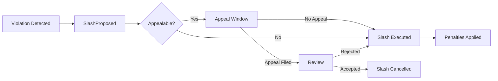

# Exits, Rewards & Slashing

This guide covers the end-of-lifecycle operations: collecting rewards, handling slashing proposals,
and safely exiting the registry.

## Rewards

Rewards are distributed through `BondingRegistry.distributeRewards` after successful E3 completions.

### How Rewards Work

1. E3 completes successfully with plaintext output published
2. Reward distributor calls `distributeRewards` with the reward token
3. Committee members receive payouts based on participation
4. `RewardsDistributed` event is emitted

### Monitoring Rewards

Watch for reward events and ensure your wallet can receive the reward token:

```bash
# Check your status including any pending rewards
interfold ciphernode status
```

> Keep the bond-owner wallet funded with ETH for gas when it claims rewards or exits. Keep the
> operator wallet funded for protocol actions and the emergency deregistration path.

## Slashing

Slashing applies to operators assigned protocol duties who fail those duties or commit other defined
slashable violations. The `SlashingManager` contract handles proposals, appeals, and execution.

### Slashing Lifecycle



### Slash Policy Structure

Each slash reason has an associated policy:

```solidity
struct SlashPolicy {
  uint256 ticketPenalty; // Tickets to burn
  uint256 ciphernodeBondPenalty; // FOLD to confiscate
  bool requiresProof; // Whether on-chain proof verification is needed
  address proofVerifier; // ISlashVerifier contract for proof validation
  bool banNode; // Whether to permanently ban the node
  uint256 appealWindow; // Seconds to file appeal (0 = no appeals, immediate execution)
  bool enabled; // Whether this slash type is active
  bool affectsCommittee; // Whether to expel node from active committee
  uint8 failureReason; // FailureReason enum value for E3 failure (0 = none)
}
```

### Responding to Slashing

1. **Monitor for proposals**: Watch `SlashProposed` events targeting your address
2. **Review the policy**: Check if appeals are allowed and the window duration
3. **File appeal if applicable**:
   ```bash
   # Using cast (or implement in automation)
   cast send $SLASHING "fileAppeal(uint256,string)" $PROPOSAL_ID "evidence_uri" \
     --rpc-url $RPC --private-key $OPERATOR_OR_BOND_OWNER_KEY
   ```
   The accused operator or its bond owner can appeal within the configured window. Proof-verified
   slashes are appealable only when their policy has a nonzero appeal window.

### Slashing Penalties

| Penalty Type            | Effect                                           |
| ----------------------- | ------------------------------------------------ |
| Ticket penalty          | Burns tFOLD from your balance                    |
| Ciphernode bond penalty | Confiscates FOLD from your bond                  |
| Ban                     | Prevents re-registration until governance clears |

> Some policies have an `appealWindow` of 0, meaning execution is immediate with no appeal. Always
> check the policy before assuming you can appeal.

## Exit Process

To safely exit the ciphernode registry:

### Step 1: Deregister

The bond owner or operator emergency key can request deregistration:

```bash
interfold ciphernode deregister --operator 0xOPERATOR
```

### Step 2: Wait for Exit Delay

Assets enter a queue with a delay period (7 days on Sepolia):

| Asset           | Behavior                                           |
| --------------- | -------------------------------------------------- |
| Tickets         | Burned immediately, ticket collateral enters queue |
| Ciphernode bond | FOLD enters exit queue                             |

Check your exit status:

```bash
interfold ciphernode status
```

Look for "Exit pending" and "Pending exits" fields.

### Step 3: Claim Exits

After the delay period, the bond owner claims both assets:

```bash
interfold --config /path/to/owner.yaml ciphernode bond \
  --operator 0xOPERATOR claim
```

The ticket collateral and FOLD are paid to the bond owner, while the exit queue and any slashing
remain keyed to the operator.

### Re-register

After the prior exit has completed, the owner can fund and register the operator again:

```solidity
bondingRegistry.bondCiphernodeFor(operator, foldAmount);
bondingRegistry.registerOperatorFor(operator);
```

## Actions Summary

| Action                                                  | Signer         | Description                                           |
| ------------------------------------------------------- | -------------- | ----------------------------------------------------- |
| `interfold ciphernode status`                           | Operator       | Check registration and exit status                    |
| `deregisterOperatorFor(operator)`                       | Owner/operator | Start the full exit process                           |
| `removeTicketBalanceFor(operator, amount)`              | Bond owner     | Queue ticket collateral for exit                      |
| `unbondCiphernodeFor(operator, amount)`                 | Bond owner     | Queue FOLD for exit                                   |
| `claimExitsFor(operator, maxTicket, 0)`                 | Anyone         | Settle unlocked tickets to the bond owner             |
| `claimExitsFor(operator, maxTicket, maxCiphernodeBond)` | Bond owner     | Claim unlocked tickets and ciphernode bond collateral |

## Monitoring Checklist

| Check                 | Command / Event                                 |
| --------------------- | ----------------------------------------------- |
| Exit queue status     | `interfold ciphernode status`                   |
| Pending exits amounts | `pendingExits(address)` on BondingRegistry      |
| Exit in progress      | `hasExitInProgress(address)` on BondingRegistry |
| Claimable amounts     | `previewClaimable(address)` on BondingRegistry  |
| Slash proposals       | Watch `SlashProposed` events                    |
| Rewards distribution  | Watch `RewardsDistributed` events               |

## Troubleshooting

| Issue                       | Cause                                | Solution                             |
| --------------------------- | ------------------------------------ | ------------------------------------ |
| `ExitNotReady` on claim     | Exit delay hasn't passed             | Wait until `exitUnlocksAt` timestamp |
| Appeal rejected immediately | Policy doesn't allow appeals         | Check `SlashPolicy.appealable`       |
| `isActive` suddenly false   | Slashing reduced stake below minimum | Add more tickets or ciphernode bond  |
| Missed reward payouts       | Deregistered or banned during E3     | Re-register before next request      |

## Post-Exit Cleanup

After successfully claiming exits:

1. **Wipe local secrets**:

   ```bash
   interfold purge-all
   ```

2. **Revoke access**:
   - RPC credentials
   - Firewall rules
   - Any automation keys

3. **Document for compliance**:
   - Exit timestamp
   - Final balances
   - Reason for exit

## Slashing Prevention

To minimize slashing risk:

1. **Stay online during active E3s** - Check for ongoing jobs before maintenance
2. **Monitor events** - Alert on `SlashProposed` targeting your address
3. **Archive logs** - You'll need evidence for appeals
4. **Verify `isActive` after changes** - Any stake modification could deactivate you

## Summary

| Phase          | Key Actions                                 |
| -------------- | ------------------------------------------- |
| **Active**     | Monitor rewards, watch for slash proposals  |
| **Slashing**   | Review policy, file appeal if allowed, wait |
| **Exit Start** | Bond owner deregisters the operator         |
| **Exit Wait**  | Wait 7 days (check `exitUnlocksAt`)         |
| **Exit Claim** | Claim tickets and ciphernode bond           |
| **Post-Exit**  | Purge secrets, revoke access, document      |
