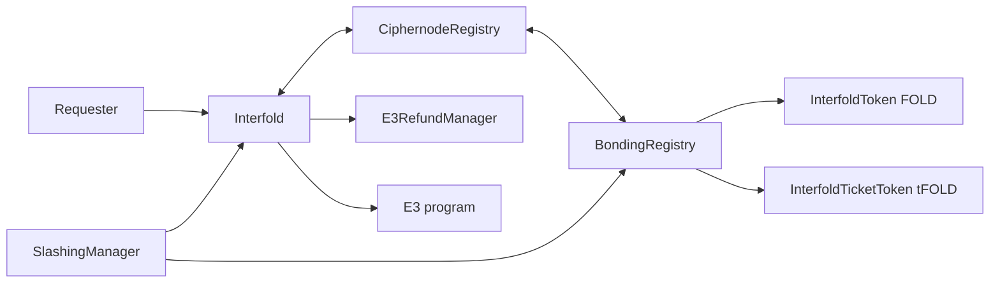

import { Callout } from 'nextra/components'
import { Badge, LinkCard, LinkCards } from '@/components/ui'

# Contracts & Addresses

This page lists the deployed Interfold contracts on Ethereum mainnet and Sepolia, with the address
and deploy block of each one. It is for operators who configure a ciphernode and for developers who
call the contracts. It also describes the role of each contract and the enums and events that
clients read. Copy addresses from this page or from the manifest, not from other sources.

## Deployment manifest

The source of every address on this page is `deployments/manifest.json` in the repository. The
release process attaches the same file to each GitHub release as `manifest.json`. The script
`packages/interfold-contracts/scripts/genManifest.ts` generates it from
`packages/interfold-contracts/deployed_contracts.json`.

The manifest has two sections for each network:

| Section     | Content                                                                                                                            |
| ----------- | ---------------------------------------------------------------------------------------------------------------------------------- |
| `contracts` | Contracts that a node configuration uses. The keys are the same as the keys under `contracts` in `interfold.config.yaml`.          |
| `reference` | Other deployed contracts that operators, the dashboard, and the docs need. The node configuration has no keys for these contracts. |

Each network entry also has a `chain_id` and a `mocks` flag. The flag is `true` when the network has
a mock E3 program or a mock verifier. Both networks set `mocks: true` in this release. Mainnet sets
it because its first E3 program is `MockE3Program`. See
[Also used on mainnet](#also-used-on-mainnet).

To compare your node configuration with the published manifest, run this command:

```bash
interfold config check
```

For an up-to-date Sepolia chain, the output has this form:

```text
Deployment manifest: release v0.18.0
sepolia: up to date
  note  sepolia is a mock deployment - proofs are accepted without being verified
```

The command reads the `manifest.json` asset of the latest GitHub release. It exits with an error
when an address or a chain ID does not match. For the flags and the finding labels, see
[`interfold config check`](/reference/cli#interfold-config-check).

<Callout type='warning'>
  Contract addresses change when the protocol is deployed again. A node that points at an old
  address syncs nothing and reports no error. Run `interfold config check` before you start a node
  and after each release.
</Callout>

## Mainnet

<Badge tone='mainnet'>Mainnet</Badge> Ethereum mainnet, chain ID `1`.

### Mainnet contracts

| Contract           | Address                                      | Deploy block | Manifest key          | Explorer                                                                             |
| ------------------ | -------------------------------------------- | ------------ | --------------------- | ------------------------------------------------------------------------------------ |
| Interfold          | `0x28cF63B459e6218C69EA97ea7D90541cf648c715` | 25786382     | `interfold`           | [Etherscan](https://etherscan.io/address/0x28cF63B459e6218C69EA97ea7D90541cf648c715) |
| CiphernodeRegistry | `0xC927A5B2d8F68697bC28C0670df05178c93df2d7` | 25786378     | `ciphernode_registry` | [Etherscan](https://etherscan.io/address/0xC927A5B2d8F68697bC28C0670df05178c93df2d7) |
| BondingRegistry    | `0x0ec90465095C21830BEcED07e032809A2Bd2915F` | 25473398     | `bonding_registry`    | [Etherscan](https://etherscan.io/address/0x0ec90465095C21830BEcED07e032809A2Bd2915F) |
| SlashingManager    | `0x974E865B1BB24AF2a9ef8204AdEA9251Cc7C5FD9` | 25786375     | `slashing_manager`    | [Etherscan](https://etherscan.io/address/0x974E865B1BB24AF2a9ef8204AdEA9251Cc7C5FD9) |
| USDS (fee token)   | `0xdC035D45d973E3EC169d2276DDab16f1e407384F` | 20663730     | `fee_token`           | [Etherscan](https://etherscan.io/address/0xdC035D45d973E3EC169d2276DDab16f1e407384F) |

### Mainnet reference contracts

| Contract                     | Address                                      | Deploy block | Manifest key           | Explorer                                                                             |
| ---------------------------- | -------------------------------------------- | ------------ | ---------------------- | ------------------------------------------------------------------------------------ |
| InterfoldTicketToken (tFOLD) | `0xC0B5b49a3949eC4B520eF21BaCFE16e3695F3B5D` | 25786372     | `InterfoldTicketToken` | [Etherscan](https://etherscan.io/address/0xC0B5b49a3949eC4B520eF21BaCFE16e3695F3B5D) |
| E3RefundManager              | `0x1940eF168f4E0B3dA24BEca539856684793B0F6e` | 25786384     | `E3RefundManager`      | [Etherscan](https://etherscan.io/address/0x1940eF168f4E0B3dA24BEca539856684793B0F6e) |
| MockE3Program                | `0x4976E5E47852eFCe6851d35B95A1A2E19456F3D7` | 25786371     | `MockE3Program`        | [Etherscan](https://etherscan.io/address/0x4976E5E47852eFCe6851d35B95A1A2E19456F3D7) |

### Also used on mainnet

The manifest does not publish these three mainnet contracts, so `interfold config check` does not
compare them. The addresses come from the mainnet deployment records in
`packages/interfold-contracts/deploy/protocol/`. Each deploy block is the first block that has
contract code at the address.

| Contract                         | Address                                      | Deploy block | Source                                                     | Explorer                                                                             |
| -------------------------------- | -------------------------------------------- | ------------ | ---------------------------------------------------------- | ------------------------------------------------------------------------------------ |
| InterfoldToken (FOLD)            | `0xE172e9B6cfBeeB5593bDcE3f077356FDb33af904` | 25473449     | `fold` in `mainnet-protocol.config.json`                   | [Etherscan](https://etherscan.io/address/0xE172e9B6cfBeeB5593bDcE3f077356FDb33af904) |
| sUSDS (ticket collateral)        | `0xa3931d71877C0E7a3148CB7Eb4463524FEc27fbD` | 20677434     | `ticketUnderlyingToken` in `mainnet-protocol.config.json`  | [Etherscan](https://etherscan.io/address/0xa3931d71877C0E7a3148CB7Eb4463524FEc27fbD) |
| DeployableMockCiphertextVerifier | `0xB568e5aD762F7a75F1EC65A985ec4038F6409297` | 25786403     | `ciphertextVerifier` in `mainnet-protocol.deployment.json` | [Etherscan](https://etherscan.io/address/0xB568e5aD762F7a75F1EC65A985ec4038F6409297) |

sUSDS is a third-party token. The Interfold does not deploy it. To confirm the token addresses
on-chain, call `getCiphernodeBondToken()` on the `BondingRegistry` for FOLD. For the ticket
collateral, call `underlying()` on the `InterfoldTicketToken`.

<Callout type='info'>
  The mainnet ciphertext verifier is `DeployableMockCiphertextVerifier`. Its `verify` function
  returns `true` for every input, so mainnet accepts ciphertext proofs without verification. The
  mainnet configuration deploys it because `deployMockCiphertextVerifier` is `true`. The contract
  source says to replace it before production CRISP workloads. The first E3 program on mainnet is
  `MockE3Program`.
</Callout>

## Sepolia

<Badge tone='testnet'>Testnet</Badge> Ethereum Sepolia, chain ID `11155111`. The fee token and the
faucet are test contracts.

### Sepolia contracts

| Contract             | Address                                      | Deploy block | Manifest key          | Explorer                                                                                     |
| -------------------- | -------------------------------------------- | ------------ | --------------------- | -------------------------------------------------------------------------------------------- |
| Interfold            | `0x3E856E24c7a95d0e04d387f847DA6FA9f6F6c20C` | 11534993     | `interfold`           | [Etherscan](https://sepolia.etherscan.io/address/0x3E856E24c7a95d0e04d387f847DA6FA9f6F6c20C) |
| CiphernodeRegistry   | `0x374F4542eC634d5437Dd65020781A9D9Df9c2AB8` | 11534965     | `ciphernode_registry` | [Etherscan](https://sepolia.etherscan.io/address/0x374F4542eC634d5437Dd65020781A9D9Df9c2AB8) |
| BondingRegistry      | `0x90250Dc48CBe109fFaA02AeAFbFBdbF12D7BD4d4` | 11534966     | `bonding_registry`    | [Etherscan](https://sepolia.etherscan.io/address/0x90250Dc48CBe109fFaA02AeAFbFBdbF12D7BD4d4) |
| SlashingManager      | `0x489FB674B143E48eaCAaC999B3DF9EA6E95eA79f` | 11534963     | `slashing_manager`    | [Etherscan](https://sepolia.etherscan.io/address/0x489FB674B143E48eaCAaC999B3DF9EA6E95eA79f) |
| MockUSDC (fee token) | `0xC35B783cA97710be47Fc81D10dADc895EfcD865c` | 11534960     | `fee_token`           | [Etherscan](https://sepolia.etherscan.io/address/0xC35B783cA97710be47Fc81D10dADc895EfcD865c) |
| Faucet               | `0x6e281411C055BEEbD74bDFcB9aB095aa98907F85` | 11534982     | `faucet`              | [Etherscan](https://sepolia.etherscan.io/address/0x6e281411C055BEEbD74bDFcB9aB095aa98907F85) |

### Sepolia reference contracts

| Contract                     | Address                                      | Deploy block | Manifest key             | Explorer                                                                                     |
| ---------------------------- | -------------------------------------------- | ------------ | ------------------------ | -------------------------------------------------------------------------------------------- |
| InterfoldToken (FOLD)        | `0x9752444A6a955D420402EaFf5f818afCddb9c340` | 11534976     | `InterfoldToken`         | [Etherscan](https://sepolia.etherscan.io/address/0x9752444A6a955D420402EaFf5f818afCddb9c340) |
| InterfoldTicketToken (tFOLD) | `0xfFFFc3BB04aEe950c0ed5DEe3214408f09fff488` | 11534961     | `InterfoldTicketToken`   | [Etherscan](https://sepolia.etherscan.io/address/0xfFFFc3BB04aEe950c0ed5DEe3214408f09fff488) |
| E3RefundManager              | `0x79f9EA83Db0fbe3a2cEB765b18285915331A9dc2` | 11534995     | `E3RefundManager`        | [Etherscan](https://sepolia.etherscan.io/address/0x79f9EA83Db0fbe3a2cEB765b18285915331A9dc2) |
| MockE3Program                | `0x5874CD49929ffcf380C82cDE1e74188dEaff9791` | 11534990     | `MockE3Program`          | [Etherscan](https://sepolia.etherscan.io/address/0x5874CD49929ffcf380C82cDE1e74188dEaff9791) |
| MockComputeProvider          | `0x3c3434840a1EAA214E0c8abb34A0386e4E22B3A5` | 11534986     | `MockComputeProvider`    | [Etherscan](https://sepolia.etherscan.io/address/0x3c3434840a1EAA214E0c8abb34A0386e4E22B3A5) |
| MockDecryptionVerifier       | `0x12845e690fD56216C89428d91D5E931142b9779F` | 11534987     | `MockDecryptionVerifier` | [Etherscan](https://sepolia.etherscan.io/address/0x12845e690fD56216C89428d91D5E931142b9779F) |
| MockCiphertextVerifier       | `0xc2905bDcD4449F143d46593AeAf5383A590D2e32` | 11534988     | `MockCiphertextVerifier` | [Etherscan](https://sepolia.etherscan.io/address/0xc2905bDcD4449F143d46593AeAf5383A590D2e32) |
| MockPkVerifier               | `0x22b5Fda887D1c84Df3d4D916452388F99a6A7b61` | 11534989     | `MockPkVerifier`         | [Etherscan](https://sepolia.etherscan.io/address/0x22b5Fda887D1c84Df3d4D916452388F99a6A7b61) |

To get test FOLD and test fee tokens on Sepolia, run
[`interfold faucet`](/reference/cli#interfold-faucet).

## Contract roles

The Interfold contract coordinates each E3. The two registries hold the ciphernodes and their
collateral. The slashing and refund contracts handle faults and failures.



| Contract                         | Source                                                | Role                                                                                                                                                                                                                                                   |
| -------------------------------- | ----------------------------------------------------- | ------------------------------------------------------------------------------------------------------------------------------------------------------------------------------------------------------------------------------------------------------ |
| Interfold                        | `contracts/Interfold.sol`                             | Accepts E3 requests and holds the service fee in escrow. Records the stage of each E3. Accepts the ciphertext output reference and the verified plaintext output. Marks an E3 as failed after a missed deadline. Credits the rewards of the committee. |
| CiphernodeRegistry               | `contracts/registry/CiphernodeRegistryOwnable.sol`    | Keeps the registered ciphernodes in an incremental Merkle tree. Collects sortition tickets, finalizes each committee, and publishes the committee public key. Expels slashed committee members.                                                        |
| BondingRegistry                  | `contracts/registry/BondingRegistry.sol`              | Holds the FOLD bond and the ticket balance of each operator. Records the bond owner, registration, and activation. Runs the exit queue for withdrawn collateral.                                                                                       |
| SlashingManager                  | `contracts/slashing/SlashingManager.sol`              | Accepts slash proposals, executes slashes and bans, and handles appeals. Routes slashed funds.                                                                                                                                                         |
| E3RefundManager                  | `contracts/E3RefundManager.sol`                       | Calculates the refund of a failed E3. The requester and the honest committee members claim their shares here. It also holds slashed funds for an E3.                                                                                                   |
| InterfoldToken (FOLD)            | `contracts/token/InterfoldToken.sol`                  | The governance and utility token. Operators bond FOLD for each ciphernode.                                                                                                                                                                             |
| InterfoldTicketToken (tFOLD)     | `contracts/token/InterfoldTicketToken.sol`            | A non-transferable token that wraps the ticket collateral. The ticket balance of an operator sets its sortition tickets.                                                                                                                               |
| Fee token                        | Third-party token (mainnet), `MockUSDC` (Sepolia)     | The ERC-20 token that requesters use to pay for an E3. Mainnet uses USDS.                                                                                                                                                                              |
| Faucet                           | `contracts/test/Faucet.sol`                           | Sepolia only. Sends 200 FOLD and 200 fee tokens to a caller that holds less than 200 of each.                                                                                                                                                          |
| Mock contracts                   | `contracts/test/`                                     | `MockE3Program`, `MockComputeProvider`, and the mock verifiers accept test data without real proof verification.                                                                                                                                       |
| DeployableMockCiphertextVerifier | `contracts/test/DeployableMockCiphertextVerifier.sol` | The ciphertext verifier on mainnet. It accepts every ciphertext proof.                                                                                                                                                                                 |

The main entry points are these functions:

| Contract           | Functions                                                                                                                                                                                                           |
| ------------------ | ------------------------------------------------------------------------------------------------------------------------------------------------------------------------------------------------------------------- |
| Interfold          | `request`, `publishCiphertextOutput`, `publishPlaintextOutput`, `markE3Failed`, `cancelE3`, `processE3Failure`, `claimReward`, `getE3Stage`, `getFailureReason`                                                     |
| CiphernodeRegistry | `submitTicket`, `finalizeCommittee`, `publishCommittee`, `expelCommitteeMember`, `getCommitteeNodes`, `getCommitteeViability`                                                                                       |
| BondingRegistry    | `setBondOwner`, `proposeBondOwner`, `acceptBondOwner`, `bondCiphernodeFor`, `unbondCiphernodeFor`, `addTicketBalanceFor`, `removeTicketBalanceFor`, `registerOperatorFor`, `deregisterOperatorFor`, `claimExitsFor` |
| SlashingManager    | `proposeSlash`, `proposeSlashEvidence`, `executeSlash`, `fileAppeal`, `resolveAppeal`                                                                                                                               |
| E3RefundManager    | `calculateRefund`, `claimRequesterRefund`, `claimHonestNodeReward`                                                                                                                                                  |

For how to call `request`, see [Requesting an E3](/build/requesting-an-e3). For the operator calls,
see [Registration](/operate/registration).

## Enums

The enums are in `contracts/interfaces/IInterfold.sol`.

### `E3Stage`

| Value | Name                 | Meaning                                                              | Entered by                                                   |
| ----- | -------------------- | -------------------------------------------------------------------- | ------------------------------------------------------------ |
| 0     | `None`               | The E3 does not exist.                                               | None                                                         |
| 1     | `Requested`          | The request is accepted. Sortition runs.                             | `request`                                                    |
| 2     | `CommitteeFinalized` | The committee is fixed. The DKG runs.                                | `finalizeCommittee` on the `CiphernodeRegistry`              |
| 3     | `KeyPublished`       | The committee public key is on-chain. Inputs can be encrypted to it. | `publishCommittee` on the `CiphernodeRegistry`               |
| 4     | `CiphertextReady`    | The encrypted output is available. The committee decrypts it.        | `publishCiphertextOutput`                                    |
| 5     | `Complete`           | The plaintext output is on-chain and verified.                       | `publishPlaintextOutput`                                     |
| 6     | `Failed`             | The E3 stopped. `getFailureReason` returns the reason.               | `markE3Failed`, `cancelE3`, or a registry or slashing report |

For the full sequence, see [E3 lifecycle](/learn/e3-lifecycle).

### `FailureReason`

The payer column shows who carries the cost of the failure, from
`contracts/lib/FailurePayerLib.sol`. When the ciphernodes pay, the requester gets back the full
service fee escrow. When the requester pays, the honest nodes get the value of the completed work,
the protocol gets its share, and the requester gets the rest.

| Value | Name                           | Set when                                                                                                               | Payer       |
| ----- | ------------------------------ | ---------------------------------------------------------------------------------------------------------------------- | ----------- |
| 0     | `None`                         | The E3 did not fail.                                                                                                   | None        |
| 1     | `CommitteeFormationTimeout`    | The committee deadline passes in `Requested`, or the randomness is not ready at finalization. `cancelE3` also uses it. | Ciphernodes |
| 2     | `InsufficientCommitteeMembers` | Finalization finds fewer tickets than the committee size N, or an expulsion leaves fewer than H active members.        | Ciphernodes |
| 3     | `DKGTimeout`                   | The DKG deadline passes in `CommitteeFinalized`.                                                                       | Ciphernodes |
| 4     | `DKGInvalidShares`             | Reported through `onE3Failed`.                                                                                         | Ciphernodes |
| 5     | `NoInputsReceived`             | Reported through `onE3Failed`.                                                                                         | Requester   |
| 6     | `ComputeTimeout`               | The compute deadline passes in `KeyPublished`.                                                                         | Requester   |
| 7     | `ComputeProviderExpired`       | Reported through `onE3Failed`.                                                                                         | Requester   |
| 8     | `ComputeProviderFailed`        | Reported through `onE3Failed`.                                                                                         | Requester   |
| 9     | `RequesterCancelled`           | Reserved for ABI compatibility. The current contracts do not set it.                                                   | Requester   |
| 10    | `DecryptionTimeout`            | The decryption deadline passes in `CiphertextReady`.                                                                   | Ciphernodes |
| 11    | `DecryptionInvalidShares`      | Reported through `onE3Failed`.                                                                                         | Ciphernodes |
| 12    | `VerificationFailed`           | Reported through `onE3Failed`.                                                                                         | Ciphernodes |

Only the `CiphernodeRegistry` or the `SlashingManager` of the E3 can call `onE3Failed`. Anyone can
call `markE3Failed` after a deadline. During a grace period after the deadline, only the requester,
the owner, and active committee members can call it.

### `CommitteeSize`

| Value | Name      | Committee size N | Threshold T | Honest parties H |
| ----- | --------- | ---------------- | ----------- | ---------------- |
| 0     | `Minimum` | 3                | 1           | 2                |
| 1     | `Micro`   | 9                | 4           | 5                |
| 2     | `Small`   | 19               | 9           | 14               |

Decryption needs T + 1 shares. The contracts store H and N for each size as the committee threshold.
The values come from `crates/zk-helpers/src/ciphernodes_committee.rs`.

## Key events

Clients and ciphernodes follow these events. Each event is declared in the interface of its
contract.

| Event                                       | Contract           | Emitted when                                                                  |
| ------------------------------------------- | ------------------ | ----------------------------------------------------------------------------- |
| `E3Requested`                               | Interfold          | `request` accepts an E3.                                                      |
| `E3StageChanged`                            | Interfold          | An E3 moves to a new stage. The event has the previous and the new stage.     |
| `CommitteeFinalized`                        | Interfold          | The E3 enters `CommitteeFinalized`.                                           |
| `CommitteeFormed`                           | Interfold          | The E3 enters `KeyPublished`.                                                 |
| `CiphertextOutputReferencePublished`        | Interfold          | The ciphertext output reference is accepted. The E3 enters `CiphertextReady`. |
| `PlaintextOutputPublished`                  | Interfold          | The verified plaintext output is accepted. The E3 enters `Complete`.          |
| `E3Failed`                                  | Interfold          | The E3 enters `Failed`. The event has the stage and the `FailureReason`.      |
| `E3FailureProcessed`                        | Interfold          | `processE3Failure` moves the payment to the refund manager.                   |
| `RewardCredited`, `RewardClaimed`           | Interfold          | A committee member gets a reward credit, and later claims it.                 |
| `CiphernodeAdded`, `CiphernodeRemoved`      | CiphernodeRegistry | A ciphernode enters or leaves the registration tree.                          |
| `TicketSubmitted`                           | CiphernodeRegistry | A ciphernode submits a sortition ticket.                                      |
| `SortitionCommitteeFinalized`               | CiphernodeRegistry | `finalizeCommittee` fixes the committee.                                      |
| `CommitteeFormationFailed`                  | CiphernodeRegistry | `finalizeCommittee` finds too few members or no randomness.                   |
| `CommitteeProofPublished`                   | CiphernodeRegistry | `publishCommittee` accepts the DKG proof and the public key commitment.       |
| `CommitteePublicKeyChunkPublished`          | CiphernodeRegistry | A part of the serialized committee public key is published.                   |
| `CommitteeMemberExpelled`                   | CiphernodeRegistry | A slash expels a committee member.                                            |
| `BondOwnerSet`, `BondOwnerTransferProposed` | BondingRegistry    | The bond owner of an operator is set, or a transfer is proposed.              |
| `CiphernodeBondUpdated`                     | BondingRegistry    | The FOLD bond of an operator changes.                                         |
| `TicketBalanceUpdated`                      | BondingRegistry    | The ticket balance of an operator changes.                                    |
| `OperatorActivationChanged`                 | BondingRegistry    | An operator becomes active or inactive.                                       |
| `CiphernodeDeregistrationRequested`         | BondingRegistry    | An operator requests deregistration.                                          |
| `AssetsClaimed`                             | BondingRegistry    | An exit claim pays out released collateral.                                   |
| `SlashProposed`, `SlashExecuted`            | SlashingManager    | A slash is proposed, and later executed.                                      |
| `AppealFiled`, `AppealResolved`             | SlashingManager    | An operator appeals a slash, and the appeal ends.                             |
| `RefundDistributionCalculated`              | E3RefundManager    | The refund split of a failed E3 is calculated.                                |
| `RefundClaimed`                             | E3RefundManager    | A requester or an honest node claims a refund share.                          |

`IInterfold.sol` also declares `InputPublished` and `CiphertextOutputPublished`, and
`ICiphernodeRegistry.sol` declares `CommitteeRequested` and `CommitteePublished`. The current
contracts do not emit these four events.

## Next steps

<LinkCards min={230}>
  <LinkCard
    title='Node Configuration'
    href='/reference/configuration'
    icon='wrench'
    tag='Reference'
  >
    Put these addresses and deploy blocks in the `contracts` section of your node file.
  </LinkCard>
  <LinkCard title='Registration' href='/operate/registration' icon='contract' tag='Operators'>
    Bond FOLD, register the operator, and buy tickets on the `BondingRegistry`.
  </LinkCard>
  <LinkCard
    title='Interfold contract'
    href='/build/interfold-contract'
    icon='build'
    tag='Developers'
  >
    Call the Interfold contract from an application.
  </LinkCard>
  <LinkCard title='E3 lifecycle' href='/learn/e3-lifecycle' icon='flow' tag='Concepts'>
    How an E3 moves through the stages and emits the events on this page.
  </LinkCard>
</LinkCards>
