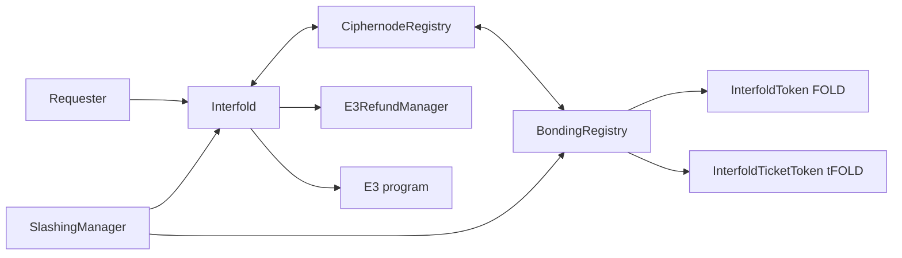

import { Callout } from 'nextra/components'
import { Badge, LinkCard, LinkCards } from '@/components/ui'

# Contracts & Addresses

This page lists the deployed Interfold contracts on Ethereum mainnet and Sepolia, with the address
and deploy block of each one. It is for operators who configure a ciphernode and for developers who
call the contracts. It also describes the role of each contract and the enums and events that
clients read. Copy addresses from this page or from the manifest, not from other sources.

## Deployment manifest

The source of every address on this page is `deployments/manifest.json` in the repository. The
release process attaches the same file to each GitHub release as `manifest.json`. The script
`packages/interfold-contracts/scripts/genManifest.ts` generates it from
`packages/interfold-contracts/deployed_contracts.json`.

The manifest has two sections for each network:

| Section     | Content                                                                                                                            |
| ----------- | ---------------------------------------------------------------------------------------------------------------------------------- |
| `contracts` | Contracts that a node configuration uses. The keys are the same as the keys under `contracts` in `interfold.config.yaml`.          |
| `reference` | Other deployed contracts that operators, the dashboard, and the docs need. The node configuration has no keys for these contracts. |

Each network entry also has a `chain_id` and a `mocks` flag. The flag is `true` when the network
uses a mock E3 program or a mock verifier, which accepts proofs without verification. The manifest
in the repository sets `mocks: false` for Sepolia and for mainnet. The Sepolia flag does not cover
the mock RISC Zero verifier that the Sepolia ciphertext verifier wraps. See
[Verifiers in use on mainnet](#verifiers-in-use-on-mainnet) and
[Verifiers in use on Sepolia](#verifiers-in-use-on-sepolia).

To compare your node configuration with the published manifest, run this command:

```bash
interfold config check
```

For an up-to-date Sepolia chain, the output has this form:

```text
Deployment manifest: release <tag>
sepolia: up to date
```

The command reads the `manifest.json` asset of the latest GitHub release. It exits with an error
when an address or a chain ID does not match. For the flags and the finding labels, see
[`interfold config check`](/reference/cli#interfold-config-check).

<Callout type='warning'>
  Contract addresses change when the protocol is deployed again. A node that points at an old
  address syncs nothing and reports no error. Run `interfold config check` before you start a node
  and after each release.
</Callout>

## Mainnet

<Badge tone='mainnet'>Mainnet</Badge> Ethereum mainnet, chain ID `1`.

### Mainnet contracts

| Contract           | Address                                      | Deploy block | Manifest key          | Explorer                                                                             |
| ------------------ | -------------------------------------------- | ------------ | --------------------- | ------------------------------------------------------------------------------------ |
| Interfold          | `0x28cF63B459e6218C69EA97ea7D90541cf648c715` | 25786382     | `interfold`           | [Etherscan](https://etherscan.io/address/0x28cF63B459e6218C69EA97ea7D90541cf648c715) |
| CiphernodeRegistry | `0xC927A5B2d8F68697bC28C0670df05178c93df2d7` | 25786378     | `ciphernode_registry` | [Etherscan](https://etherscan.io/address/0xC927A5B2d8F68697bC28C0670df05178c93df2d7) |
| BondingRegistry    | `0x0ec90465095C21830BEcED07e032809A2Bd2915F` | 25473398     | `bonding_registry`    | [Etherscan](https://etherscan.io/address/0x0ec90465095C21830BEcED07e032809A2Bd2915F) |
| SlashingManager    | `0x753109Ee36Dc65cC178875AddA30C6433e5bEEe4` | 25998899     | `slashing_manager`    | [Etherscan](https://etherscan.io/address/0x753109Ee36Dc65cC178875AddA30C6433e5bEEe4) |
| USDS (fee token)   | `0xdC035D45d973E3EC169d2276DDab16f1e407384F` | 20663730     | `fee_token`           | [Etherscan](https://etherscan.io/address/0xdC035D45d973E3EC169d2276DDab16f1e407384F) |

### Mainnet reference contracts

| Contract                     | Address                                      | Deploy block | Manifest key                  | Explorer                                                                             |
| ---------------------------- | -------------------------------------------- | ------------ | ----------------------------- | ------------------------------------------------------------------------------------ |
| InterfoldTicketToken (tFOLD) | `0xC0B5b49a3949eC4B520eF21BaCFE16e3695F3B5D` | 25786372     | `InterfoldTicketToken`        | [Etherscan](https://etherscan.io/address/0xC0B5b49a3949eC4B520eF21BaCFE16e3695F3B5D) |
| E3RefundManager              | `0x1940eF168f4E0B3dA24BEca539856684793B0F6e` | 25786384     | `E3RefundManager`             | [Etherscan](https://etherscan.io/address/0x1940eF168f4E0B3dA24BEca539856684793B0F6e) |
| BfvDecryptionVerifierRouter  | `0xA66CAb7AE230698b2a9ee1E0E967BaD4651FeEa7` | 25998927     | `BfvDecryptionVerifierRouter` | [Etherscan](https://etherscan.io/address/0xA66CAb7AE230698b2a9ee1E0E967BaD4651FeEa7) |
| BfvPkVerifierRouter          | `0x7CD10057c25674bd5666A9deEE3193f1b29563d1` | 25998926     | `BfvPkVerifierRouter`         | [Etherscan](https://etherscan.io/address/0x7CD10057c25674bd5666A9deEE3193f1b29563d1) |
| Risc0BfvCiphertextVerifier   | `0x80D217d3b2e16fF2ecc178cC75655C773895c549` | 25998859     | `Risc0BfvCiphertextVerifier`  | [Etherscan](https://etherscan.io/address/0x80D217d3b2e16fF2ecc178cC75655C773895c549) |

### Also used on mainnet

The manifest does not publish these two mainnet contracts, so `interfold config check` does not
compare them. The addresses come from the mainnet deployment records in
`packages/interfold-contracts/deploy/protocol/`. Each deploy block is the first block that has
contract code at the address.

| Contract                  | Address                                      | Deploy block | Source                                                    | Explorer                                                                             |
| ------------------------- | -------------------------------------------- | ------------ | --------------------------------------------------------- | ------------------------------------------------------------------------------------ |
| InterfoldToken (FOLD)     | `0xE172e9B6cfBeeB5593bDcE3f077356FDb33af904` | 25473449     | `fold` in `mainnet-protocol.config.json`                  | [Etherscan](https://etherscan.io/address/0xE172e9B6cfBeeB5593bDcE3f077356FDb33af904) |
| sUSDS (ticket collateral) | `0xa3931d71877C0E7a3148CB7Eb4463524FEc27fbD` | 20677434     | `ticketUnderlyingToken` in `mainnet-protocol.config.json` | [Etherscan](https://etherscan.io/address/0xa3931d71877C0E7a3148CB7Eb4463524FEc27fbD) |

sUSDS is a third-party token. The Interfold does not deploy it. To confirm the token addresses
on-chain, call `getCiphernodeBondToken()` on the `BondingRegistry` for FOLD. For the ticket
collateral, call `underlying()` on the `InterfoldTicketToken`.

### Verifiers in use on mainnet

The `Interfold` contract stores one verifier of each kind for each encryption scheme. The table
shows the values for the BFV scheme (`keccak256("fhe.rs:BFV")`) at block 26,057,073 (25 September
2026). Each E3 keeps the verifiers that were set when it was requested.

| Verifier   | Contract                      | Address                                      | Set at block | Read with                         |
| ---------- | ----------------------------- | -------------------------------------------- | ------------ | --------------------------------- |
| Ciphertext | `Risc0BfvCiphertextVerifier`  | `0x80D217d3b2e16fF2ecc178cC75655C773895c549` | 26004622     | `getCiphertextVerifier(schemeId)` |
| Decryption | `BfvDecryptionVerifierRouter` | `0xA66CAb7AE230698b2a9ee1E0E967BaD4651FeEa7` | 26004622     | `getDecryptionVerifier(schemeId)` |
| Public key | `BfvPkVerifierRouter`         | `0x7CD10057c25674bd5666A9deEE3193f1b29563d1` | 26004622     | `getPkVerifier(schemeId)`         |

- The ciphertext verifier checks a RISC Zero Groth16 proof for the guest image ID
  `0x9d3e21fd7cc08e629cb467e5ca6bfc8e1a645b483bfd91b6b1648ced259110fc`. Read it with `imageId()`.
- Each router has three routes (`routeCount()`, `routeAt(index)`). All routes point to
  `BfvDecryptionVerifier` or `BfvPkVerifier` contracts.
- `mainnet-protocol.deployment.json` records these verifiers. Its `bfvVerifierRoutes` field lists
  the three routes, with the `BfvDecryptionVerifier` and the `BfvPkVerifier` of each route.

<Callout type='info'>
  The first mainnet deployment set `DeployableMockCiphertextVerifier` as the ciphertext verifier at
  block 25,788,974 (19 August 2026). That contract accepts every proof. The contract owner replaced
  it with a `Risc0BfvCiphertextVerifier` at block 25,813,839 (22 August 2026), and again at block
  26,004,622 (18 September 2026). The first mainnet E3 was requested at block 26,012,772, so no
  mainnet E3 used the mock verifier. At block 26,004,622, the contract owner also unregistered the
  first E3 program, `MockE3Program`, and registered `CRISPProgram`.
</Callout>

The `manifest.json` asset of release v0.18.0 still marks mainnet with `mocks: true`. With that
asset, `interfold config check` prints the mock-deployment note for mainnet, although the verifiers
in use are not mocks.

## Sepolia

<Badge tone='testnet'>Testnet</Badge> Ethereum Sepolia, chain ID `11155111`. The public key,
decryption, and DKG verifiers are real. The ciphertext verifier and CRISP use a mock RISC Zero
verifier that accepts every seal, and CRISP uses real Avail data availability. `MockUSDC` is the fee
token. Anyone can mint it.

<Callout type='warning'>
  E3 requests on Sepolia are paused. `requestsPaused()` on the `Interfold` contract returns `true`,
  and `request` reverts with `RequestsPaused`. The owner of the Interfold contract unpauses requests
  after operators that run the 0.19.0-test.1 release (`protocol_version` 7, `node_generation` 2)
  register.
</Callout>

### Sepolia contracts

| Contract             | Address                                      | Deploy block | Manifest key          | Explorer                                                                                     |
| -------------------- | -------------------------------------------- | ------------ | --------------------- | -------------------------------------------------------------------------------------------- |
| Interfold            | `0xc5DD9418A0aBF15678F974D2348B4be4D3832B54` | 11855915     | `interfold`           | [Etherscan](https://sepolia.etherscan.io/address/0xc5DD9418A0aBF15678F974D2348B4be4D3832B54) |
| CiphernodeRegistry   | `0xfa0fCE6afd9b59E2Ac69DC53A128ee5835346B5e` | 11855915     | `ciphernode_registry` | [Etherscan](https://sepolia.etherscan.io/address/0xfa0fCE6afd9b59E2Ac69DC53A128ee5835346B5e) |
| BondingRegistry      | `0x55Cf62396e1CAE6Fcc380CfE0b4C48103C4a3711` | 11855915     | `bonding_registry`    | [Etherscan](https://sepolia.etherscan.io/address/0x55Cf62396e1CAE6Fcc380CfE0b4C48103C4a3711) |
| SlashingManager      | `0xd467290E57fa84FAE42A737a83B42a6786175d79` | 11855915     | `slashing_manager`    | [Etherscan](https://sepolia.etherscan.io/address/0xd467290E57fa84FAE42A737a83B42a6786175d79) |
| MockUSDC (fee token) | `0xE2e534F7Cb95777eD870CDCaCb80B1E9E2aD555B` | 11856062     | `fee_token`           | [Etherscan](https://sepolia.etherscan.io/address/0xE2e534F7Cb95777eD870CDCaCb80B1E9E2aD555B) |
| Faucet               | `0xA7f0A637Af62fA4E0b46E397D1b85E9b4807f019` | 11856142     | `faucet`              | [Etherscan](https://sepolia.etherscan.io/address/0xA7f0A637Af62fA4E0b46E397D1b85E9b4807f019) |

### Sepolia reference contracts

| Contract                     | Address                                      | Deploy block | Manifest key                  | Explorer                                                                                     |
| ---------------------------- | -------------------------------------------- | ------------ | ----------------------------- | -------------------------------------------------------------------------------------------- |
| InterfoldToken (FOLD)        | `0x278d7c3bC100505bfC38163e23Fe2524E3993e83` | 11855821     | `InterfoldToken`              | [Etherscan](https://sepolia.etherscan.io/address/0x278d7c3bC100505bfC38163e23Fe2524E3993e83) |
| InterfoldTicketToken (tFOLD) | `0x277514D155D61eb51839F33Bd43ad32F4e3F5770` | 11856063     | `InterfoldTicketToken`        | [Etherscan](https://sepolia.etherscan.io/address/0x277514D155D61eb51839F33Bd43ad32F4e3F5770) |
| E3RefundManager              | `0x083F6Ca7e5be9Efd8fE8ACE503abF2F2ff647Cb9` | 11855915     | `E3RefundManager`             | [Etherscan](https://sepolia.etherscan.io/address/0x083F6Ca7e5be9Efd8fE8ACE503abF2F2ff647Cb9) |
| NodeReleaseRegistry          | `0x772caB77BFc39690e13dA2995E926Fb090aD034B` | 11855915     | `NodeReleaseRegistry`         | [Etherscan](https://sepolia.etherscan.io/address/0x772caB77BFc39690e13dA2995E926Fb090aD034B) |
| BfvDecryptionVerifierRouter  | `0xe52e7d820f3A1c56f952B8D7Ba2FA4100c6999D2` | 11855913     | `BfvDecryptionVerifierRouter` | [Etherscan](https://sepolia.etherscan.io/address/0xe52e7d820f3A1c56f952B8D7Ba2FA4100c6999D2) |
| BfvPkVerifierRouter          | `0x3Cd2472722cad8D17AEd31869b4353eCd10a0425` | 11855912     | `BfvPkVerifierRouter`         | [Etherscan](https://sepolia.etherscan.io/address/0x3Cd2472722cad8D17AEd31869b4353eCd10a0425) |
| Risc0BfvCiphertextVerifier   | `0x46efa79e2F2cdB3C5734D989169256de21653F11` | 11856595     | `Risc0BfvCiphertextVerifier`  | [Etherscan](https://sepolia.etherscan.io/address/0x46efa79e2F2cdB3C5734D989169256de21653F11) |

### Also used on Sepolia

The manifest does not publish these Sepolia contracts, so `interfold config check` does not compare
them. The addresses and deploy blocks come from two deployment records. The Interfold record is
`packages/interfold-contracts/deployed_contracts.json`. The CRISP record is
`examples/CRISP/packages/crisp-contracts/deployed_contracts.json`.

| Contract                             | Address                                      | Deploy block | Record    | Explorer                                                                                     |
| ------------------------------------ | -------------------------------------------- | ------------ | --------- | -------------------------------------------------------------------------------------------- |
| BondedVotes                          | `0x85E5176A8d387BE3B53506DDCbBC8aa9c2156E9F` | 11855958     | Interfold | [Etherscan](https://sepolia.etherscan.io/address/0x85E5176A8d387BE3B53506DDCbBC8aa9c2156E9F) |
| BondedCheckpoints                    | `0x3D95CfA8018DB4b5474bfe536702b5DC05eE1444` | 11855915     | Interfold | [Etherscan](https://sepolia.etherscan.io/address/0x3D95CfA8018DB4b5474bfe536702b5DC05eE1444) |
| ChainlinkVrfRandomnessProvider       | `0x46CD950499b312E53cb73a1D1E12D3541966f823` | 11855915     | Interfold | [Etherscan](https://sepolia.etherscan.io/address/0x46CD950499b312E53cb73a1D1E12D3541966f823) |
| MockRISC0Verifier                    | `0x254Cef2769D589E36208e9bD2da031A568fa49cD` | 11856523     | CRISP     | [Etherscan](https://sepolia.etherscan.io/address/0x254Cef2769D589E36208e9bD2da031A568fa49cD) |
| AvailVectorXDataAvailabilityVerifier | `0x1512D8C6e1987999772ca0AfCC9cdC044Ee465eD` | 11856604     | CRISP     | [Etherscan](https://sepolia.etherscan.io/address/0x1512D8C6e1987999772ca0AfCC9cdC044Ee465eD) |
| HonkVerifier                         | `0x7956B729a4b0Cea5D949b3a0d32AfC45b2f96048` | 11856600     | CRISP     | [Etherscan](https://sepolia.etherscan.io/address/0x7956B729a4b0Cea5D949b3a0d32AfC45b2f96048) |
| OnchainHonkVerifier                  | `0xE3cadC6719373BB9Bea2a4Cc1e99E6550FFCb990` | 11856603     | CRISP     | [Etherscan](https://sepolia.etherscan.io/address/0xE3cadC6719373BB9Bea2a4Cc1e99E6550FFCb990) |
| CRISPProgram                         | `0x1ED67a0D7F0B041559EeDC1350c575D119bEF89c` | 11856606     | CRISP     | [Etherscan](https://sepolia.etherscan.io/address/0x1ED67a0D7F0B041559EeDC1350c575D119bEF89c) |
| MockVotingToken                      | `0xF68Af5A211B7fD2b169ADdc30751120e469E8794` | 11856610     | CRISP     | [Etherscan](https://sepolia.etherscan.io/address/0xF68Af5A211B7fD2b169ADdc30751120e469E8794) |
| SelfRegistry (CRISP)                 | `0x40d544Fd954E98a25c221E24Af24F915BD820210` | 11856611     | CRISP     | [Etherscan](https://sepolia.etherscan.io/address/0x40d544Fd954E98a25c221E24Af24F915BD820210) |

The fee token is `MockUSDC`, a test USDC with 6 decimals. Anyone can call its `mint` function. It is
also the ticket collateral. To confirm it on-chain, call `feeToken()` on the `Interfold` contract.
For the ticket collateral, call `underlying()` on the `InterfoldTicketToken`.

To get Sepolia USDC and FOLD, run `interfold faucet --chain sepolia`. You can also call `faucet()`
on the `Faucet` contract, or call `mint` on `MockUSDC`. The `Faucet` sends 1000 FOLD and 1000 USDC
to a wallet that holds less than 1000 of that token. The operator bond on Sepolia is 100 FOLD. FOLD
transfers are restricted before the token generation event, and the Interfold team mints FOLD to
operators.

### Verifiers in use on Sepolia

Sepolia verifies the public key, decryption, and DKG proofs with real verifiers. It does not verify
the RISC Zero seal of a ciphertext proof. The `Interfold` contract stores one verifier of each kind
for each encryption scheme. The table shows the values for the BFV scheme
(`keccak256("fhe.rs:BFV")`).

| Verifier   | Contract                      | Address                                      | Read with                         |
| ---------- | ----------------------------- | -------------------------------------------- | --------------------------------- |
| Ciphertext | `Risc0BfvCiphertextVerifier`  | `0x46efa79e2F2cdB3C5734D989169256de21653F11` | `getCiphertextVerifier(schemeId)` |
| Decryption | `BfvDecryptionVerifierRouter` | `0xe52e7d820f3A1c56f952B8D7Ba2FA4100c6999D2` | `getDecryptionVerifier(schemeId)` |
| Public key | `BfvPkVerifierRouter`         | `0x3Cd2472722cad8D17AEd31869b4353eCd10a0425` | `getPkVerifier(schemeId)`         |

- The ciphertext verifier wraps `MockRISC0Verifier` at `0x254Cef2769D589E36208e9bD2da031A568fa49cD`.
  The mock verifier accepts every seal. The owner set this verifier for BFV, so every BFV program on
  Sepolia can publish output with a dev-mode RISC Zero proof. The verifier still records an image
  ID, but nothing checks the seal against it. Read the wrapped verifier with `risc0Verifier()` and
  the image ID with `imageId()`.
- Each router has six routes (`routeCount()`, `routeAt(index)`). The routes cover the `insecure-512`
  preset (parameter set 0) and the `secure-8192` preset (parameter set 2), each with the three
  committee sizes. Every route points to a `BfvDecryptionVerifier` or a `BfvPkVerifier` contract.
- `sepolia-protocol.deployment.json` records these verifiers. Its `bfvVerifierRoutes` field lists
  the six routes, with the `BfvDecryptionVerifier` and the `BfvPkVerifier` of each route.

## Contract roles

The Interfold contract coordinates each E3. The two registries hold the ciphernodes and their
collateral. The slashing and refund contracts handle faults and failures.


```mermaid
flowchart LR
  R[Requester] --> I[Interfold]
  I <--> CR[CiphernodeRegistry]
  CR <--> BR[BondingRegistry]
  BR --> F[InterfoldToken FOLD]
  BR --> T[InterfoldTicketToken tFOLD]
  SM[SlashingManager] --> BR
  SM --> I
  I --> RM[E3RefundManager]
  I --> P[E3 program]
```

| Contract                         | Source                                                | Role                                                                                                                                                                                                                                                   |
| -------------------------------- | ----------------------------------------------------- | ------------------------------------------------------------------------------------------------------------------------------------------------------------------------------------------------------------------------------------------------------ |
| Interfold                        | `contracts/Interfold.sol`                             | Accepts E3 requests and holds the service fee in escrow. Records the stage of each E3. Accepts the ciphertext output reference and the verified plaintext output. Marks an E3 as failed after a missed deadline. Credits the rewards of the committee. |
| CiphernodeRegistry               | `contracts/registry/CiphernodeRegistryOwnable.sol`    | Keeps the registered ciphernodes in an incremental Merkle tree. Collects sortition tickets, finalizes each committee, and publishes the committee public key. Expels slashed committee members.                                                        |
| BondingRegistry                  | `contracts/registry/BondingRegistry.sol`              | Holds the FOLD bond and the ticket balance of each operator. Records the bond owner, registration, and activation. Runs the exit queue for withdrawn collateral.                                                                                       |
| SlashingManager                  | `contracts/slashing/SlashingManager.sol`              | Accepts slash proposals, executes slashes and bans, and handles appeals. Routes slashed funds.                                                                                                                                                         |
| E3RefundManager                  | `contracts/E3RefundManager.sol`                       | Calculates the refund of a failed E3. The requester and the honest committee members claim their shares here. It also holds slashed funds for an E3.                                                                                                   |
| InterfoldToken (FOLD)            | `contracts/token/InterfoldToken.sol`                  | The governance and utility token. Operators bond FOLD for each ciphernode.                                                                                                                                                                             |
| InterfoldTicketToken (tFOLD)     | `contracts/token/InterfoldTicketToken.sol`            | A non-transferable token that wraps the ticket collateral. The ticket balance of an operator sets its sortition tickets.                                                                                                                               |
| Fee token                        | Third-party token on mainnet, `MockUSDC` on Sepolia   | The ERC-20 token that requesters use to pay for an E3. Mainnet uses USDS. Sepolia uses `MockUSDC`, a test token that anyone can mint.                                                                                                                  |
| Mock contracts                   | `contracts/test/`                                     | `MockE3Program`, `MockComputeProvider`, and the mock verifiers accept test data without real proof verification. Local chains use them. Sepolia uses `MockUSDC`, the `Faucet`, and `MockRISC0Verifier`.                                                |
| DeployableMockCiphertextVerifier | `contracts/test/DeployableMockCiphertextVerifier.sol` | A test verifier that accepts every ciphertext proof. It was the mainnet ciphertext verifier from 19 to 22 August 2026.                                                                                                                                 |

The main entry points are these functions:

| Contract           | Functions                                                                                                                                                                                                           |
| ------------------ | ------------------------------------------------------------------------------------------------------------------------------------------------------------------------------------------------------------------- |
| Interfold          | `request`, `publishCiphertextOutput`, `publishPlaintextOutput`, `markE3Failed`, `cancelE3`, `processE3Failure`, `claimReward`, `getE3Stage`, `getFailureReason`                                                     |
| CiphernodeRegistry | `submitTicket`, `finalizeCommittee`, `publishCommittee`, `expelCommitteeMember`, `getCommitteeNodes`, `getCommitteeViability`                                                                                       |
| BondingRegistry    | `setBondOwner`, `proposeBondOwner`, `acceptBondOwner`, `bondCiphernodeFor`, `unbondCiphernodeFor`, `addTicketBalanceFor`, `removeTicketBalanceFor`, `registerOperatorFor`, `deregisterOperatorFor`, `claimExitsFor` |
| SlashingManager    | `proposeSlash`, `proposeSlashEvidence`, `executeSlash`, `fileAppeal`, `resolveAppeal`                                                                                                                               |
| E3RefundManager    | `calculateRefund`, `claimRequesterRefund`, `claimHonestNodeReward`                                                                                                                                                  |

For how to call `request`, see [Requesting an E3](/build/requesting-an-e3). For the operator calls,
see [Registration](/operate/registration).

## Enums

The enums are in `contracts/interfaces/IInterfold.sol`.

### `E3Stage`

| Value | Name                 | Meaning                                                              | Entered by                                                   |
| ----- | -------------------- | -------------------------------------------------------------------- | ------------------------------------------------------------ |
| 0     | `None`               | The E3 does not exist.                                               | None                                                         |
| 1     | `Requested`          | The request is accepted. Sortition runs.                             | `request`                                                    |
| 2     | `CommitteeFinalized` | The committee is fixed. The DKG runs.                                | `finalizeCommittee` on the `CiphernodeRegistry`              |
| 3     | `KeyPublished`       | The committee public key is on-chain. Inputs can be encrypted to it. | `publishCommittee` on the `CiphernodeRegistry`               |
| 4     | `CiphertextReady`    | The encrypted output is available. The committee decrypts it.        | `publishCiphertextOutput`                                    |
| 5     | `Complete`           | The plaintext output is on-chain and verified.                       | `publishPlaintextOutput`                                     |
| 6     | `Failed`             | The E3 stopped. `getFailureReason` returns the reason.               | `markE3Failed`, `cancelE3`, or a registry or slashing report |

For the full sequence, see [E3 lifecycle](/learn/e3-lifecycle).

### `FailureReason`

The payer column shows who carries the cost of the failure, from
`contracts/lib/FailurePayerLib.sol`. When the ciphernodes pay, the requester gets back the full
service fee escrow. When the requester pays, the honest nodes get the value of the completed work,
the protocol gets its share, and the requester gets the rest.

| Value | Name                           | Set when                                                                                                               | Payer       |
| ----- | ------------------------------ | ---------------------------------------------------------------------------------------------------------------------- | ----------- |
| 0     | `None`                         | The E3 did not fail.                                                                                                   | None        |
| 1     | `CommitteeFormationTimeout`    | The committee deadline passes in `Requested`, or the randomness is not ready at finalization. `cancelE3` also uses it. | Ciphernodes |
| 2     | `InsufficientCommitteeMembers` | Finalization finds fewer tickets than the committee size N, or an expulsion leaves fewer than H active members.        | Ciphernodes |
| 3     | `DKGTimeout`                   | The DKG deadline passes in `CommitteeFinalized`.                                                                       | Ciphernodes |
| 4     | `DKGInvalidShares`             | Reported through `onE3Failed`.                                                                                         | Ciphernodes |
| 5     | `NoInputsReceived`             | Reported through `onE3Failed`.                                                                                         | Requester   |
| 6     | `ComputeTimeout`               | The compute deadline passes in `KeyPublished`.                                                                         | Requester   |
| 7     | `ComputeProviderExpired`       | Reported through `onE3Failed`.                                                                                         | Requester   |
| 8     | `ComputeProviderFailed`        | Reported through `onE3Failed`.                                                                                         | Requester   |
| 9     | `RequesterCancelled`           | Reserved for ABI compatibility. The current contracts do not set it.                                                   | Requester   |
| 10    | `DecryptionTimeout`            | The decryption deadline passes in `CiphertextReady`.                                                                   | Ciphernodes |
| 11    | `DecryptionInvalidShares`      | Reported through `onE3Failed`.                                                                                         | Ciphernodes |
| 12    | `VerificationFailed`           | Reported through `onE3Failed`.                                                                                         | Ciphernodes |

Only the `CiphernodeRegistry` or the `SlashingManager` of the E3 can call `onE3Failed`. Anyone can
call `markE3Failed` after a deadline. During a grace period after the deadline, only the requester,
the owner, and active committee members can call it.

### `CommitteeSize`

| Value | Name      | Committee size N | Threshold T | Honest parties H |
| ----- | --------- | ---------------- | ----------- | ---------------- |
| 0     | `Minimum` | 3                | 1           | 2                |
| 1     | `Micro`   | 9                | 4           | 5                |
| 2     | `Small`   | 19               | 9           | 14               |

Decryption needs T + 1 shares. The contracts store H and N for each size as the committee threshold.
The values come from `crates/zk-helpers/src/ciphernodes_committee.rs`.

## Key events

Clients and ciphernodes follow these events. Each event is declared in the interface of its
contract.

| Event                                       | Contract           | Emitted when                                                                  |
| ------------------------------------------- | ------------------ | ----------------------------------------------------------------------------- |
| `E3Requested`                               | Interfold          | `request` accepts an E3.                                                      |
| `E3StageChanged`                            | Interfold          | An E3 moves to a new stage. The event has the previous and the new stage.     |
| `CommitteeFinalized`                        | Interfold          | The E3 enters `CommitteeFinalized`.                                           |
| `CommitteeFormed`                           | Interfold          | The E3 enters `KeyPublished`.                                                 |
| `CiphertextOutputReferencePublished`        | Interfold          | The ciphertext output reference is accepted. The E3 enters `CiphertextReady`. |
| `PlaintextOutputPublished`                  | Interfold          | The verified plaintext output is accepted. The E3 enters `Complete`.          |
| `E3Failed`                                  | Interfold          | The E3 enters `Failed`. The event has the stage and the `FailureReason`.      |
| `E3FailureProcessed`                        | Interfold          | `processE3Failure` moves the payment to the refund manager.                   |
| `RewardCredited`, `RewardClaimed`           | Interfold          | A committee member gets a reward credit, and later claims it.                 |
| `CiphernodeAdded`, `CiphernodeRemoved`      | CiphernodeRegistry | A ciphernode enters or leaves the registration tree.                          |
| `TicketSubmitted`                           | CiphernodeRegistry | A ciphernode submits a sortition ticket.                                      |
| `SortitionCommitteeFinalized`               | CiphernodeRegistry | `finalizeCommittee` fixes the committee.                                      |
| `CommitteeFormationFailed`                  | CiphernodeRegistry | `finalizeCommittee` finds too few members or no randomness.                   |
| `CommitteeProofPublished`                   | CiphernodeRegistry | `publishCommittee` accepts the DKG proof and the public key commitment.       |
| `CommitteePublicKeyChunkPublished`          | CiphernodeRegistry | A part of the serialized committee public key is published.                   |
| `CommitteeMemberExpelled`                   | CiphernodeRegistry | A slash expels a committee member.                                            |
| `BondOwnerSet`, `BondOwnerTransferProposed` | BondingRegistry    | The bond owner of an operator is set, or a transfer is proposed.              |
| `CiphernodeBondUpdated`                     | BondingRegistry    | The FOLD bond of an operator changes.                                         |
| `TicketBalanceUpdated`                      | BondingRegistry    | The ticket balance of an operator changes.                                    |
| `OperatorActivationChanged`                 | BondingRegistry    | An operator becomes active or inactive.                                       |
| `CiphernodeDeregistrationRequested`         | BondingRegistry    | An operator requests deregistration.                                          |
| `AssetsClaimed`                             | BondingRegistry    | An exit claim pays out released collateral.                                   |
| `SlashProposed`, `SlashExecuted`            | SlashingManager    | A slash is proposed, and later executed.                                      |
| `AppealFiled`, `AppealResolved`             | SlashingManager    | An operator appeals a slash, and the appeal ends.                             |
| `RefundDistributionCalculated`              | E3RefundManager    | The refund split of a failed E3 is calculated.                                |
| `RefundClaimed`                             | E3RefundManager    | A requester or an honest node claims a refund share.                          |

`IInterfold.sol` also declares `InputPublished` and `CiphertextOutputPublished`, and
`ICiphernodeRegistry.sol` declares `CommitteeRequested` and `CommitteePublished`. The current
contracts do not emit these four events.

## Next steps

<LinkCards min={230}>
  <LinkCard
    title='Node Configuration'
    href='/reference/configuration'
    icon='wrench'
    tag='Reference'
  >
    Put these addresses and deploy blocks in the `contracts` section of your node file.
  </LinkCard>
  <LinkCard title='Registration' href='/operate/registration' icon='contract' tag='Operators'>
    Bond FOLD, register the operator, and buy tickets on the `BondingRegistry`.
  </LinkCard>
  <LinkCard
    title='Interfold contract'
    href='/build/interfold-contract'
    icon='build'
    tag='Developers'
  >
    Call the Interfold contract from an application.
  </LinkCard>
  <LinkCard title='E3 lifecycle' href='/learn/e3-lifecycle' icon='flow' tag='Concepts'>
    How an E3 moves through the stages and emits the events on this page.
  </LinkCard>
</LinkCards>
